# EGH Consumer Body Email Case Updates

## Flow Diagram

```mermaid
%% If you read this, your Markdown visualizer does not handle MermaidJS syntax.
%% - If you are in VS Code, install extension `Markdown Preview Mermaid Support` at https://marketplace.visualstudio.com/items?itemName=bierner.markdown-mermaid
%% - If you are using sfdx-hardis, try to define env variable `MERMAID_MODES=cli,docker` ,then run again the command to regenerate markdown with SVG images.
%% - If you are within mkdocs-material, define mermaid plugin in `mkdocs.yml` as described in https://squidfunk.github.io/mkdocs-material/extensions/mermaid/
%% - As a last resort, you can copy-paste this MermaidJS code into https://mermaid.live/ to see the flow diagram

flowchart TB
START(["START<br/><b>AutoLaunched Flow</b></br>Type: <b> Record Before Save</b>"]):::startClass
click START "#general-information" "3043913924"

Is_Case_EmailID_found_in_Consumer_Body_Email_List{"🔀 <em></em><br/>Is Case Email found in Consumer Body Email List?"}:::decisions
click Is_Case_EmailID_found_in_Consumer_Body_Email_List "#is_case_emailid_found_in_consumer_body_email_list" "2598714336"

Get_Complaint_Record_Type[("🔍 <em></em><br/>Get Complaint Record Type")]:::recordLookups
click Get_Complaint_Record_Type "#get_complaint_record_type" "1373532639"

Get_General_Enquiry_Record_Type[("🔍 <em></em><br/>Get General Enquiry Record Type")]:::recordLookups
click Get_General_Enquiry_Record_Type "#get_general_enquiry_record_type" "259711337"

Search_Case_Email_id_in_Consumer_Body_Metadata[("🔍 <em></em><br/>Search Case Email id in Consumer Body Metadata")]:::recordLookups
click Search_Case_Email_id_in_Consumer_Body_Metadata "#search_case_email_id_in_consumer_body_metadata" "2784347900"

Update_Case[("🛠️ <em></em><br/>Update Case")]:::recordUpdates
click Update_Case "#update_case" "3861450851"

Update_Case_v2[("🛠️ <em></em><br/>Update Case")]:::recordUpdates
click Update_Case_v2 "#update_case_v2" "679475710"

Is_Case_EmailID_found_in_Consumer_Body_Email_List --> |"Consumer Body Email to Case"| Get_Complaint_Record_Type
Is_Case_EmailID_found_in_Consumer_Body_Email_List --> |"Other Type Email To Case"| Get_General_Enquiry_Record_Type
Get_Complaint_Record_Type --> Update_Case
Get_General_Enquiry_Record_Type --> Update_Case_v2
Search_Case_Email_id_in_Consumer_Body_Metadata --> Is_Case_EmailID_found_in_Consumer_Body_Email_List
Update_Case --> END_Update_Case
Update_Case_v2 --> END_Update_Case_v2
START -->  Search_Case_Email_id_in_Consumer_Body_Metadata
END_Update_Case(( END )):::endClass
END_Update_Case_v2(( END )):::endClass


classDef actionCalls fill:#D4E4FC,color:black,text-decoration:none,max-height:100px
classDef assignments fill:#FBEED7,color:black,text-decoration:none,max-height:100px
classDef collectionProcessors fill:#F0E3FA,color:black,text-decoration:none,max-height:100px
classDef customErrors fill:#FFE9E9,color:black,text-decoration:none,max-height:100px
classDef decisions fill:#FDEAF6,color:black,text-decoration:none,max-height:100px
classDef loops fill:#FDEAF6,color:black,text-decoration:none,max-height:100px
classDef recordCreates fill:#FFF8C9,color:black,text-decoration:none,max-height:100px
classDef recordDeletes fill:#FFF8C9,color:black,text-decoration:none,max-height:100px
classDef recordLookups fill:#EDEAFF,color:black,text-decoration:none,max-height:100px
classDef recordUpdates fill:#FFF8C9,color:black,text-decoration:none,max-height:100px
classDef screens fill:#DFF6FF,color:black,text-decoration:none,max-height:100px
classDef subflows fill:#D4E4FC,color:black,text-decoration:none,max-height:100px
classDef startClass fill:#D9F2E6,color:black,text-decoration:none,max-height:100px
classDef endClass fill:#F9BABA,color:black,text-decoration:none,max-height:100px
classDef transforms fill:#FDEAF6,color:black,text-decoration:none,max-height:100px


```

<!-- Flow description -->

## General Information

|<!-- -->|<!-- -->|
|:---|:---|
|Object|Case|
|Process Type| Auto Launched Flow|
|Trigger Type| Record Before Save|
|Record Trigger Type| Create|
|Label|EGH Consumer Body Email Case Updates|
|Status|Active|
|Environments|Default|
|Interview Label|EGH Consumer Body Email Case Updates {!$Flow.CurrentDateTime}|
| Builder Type (PM)|LightningFlowBuilder|
| Canvas Mode (PM)|AUTO_LAYOUT_CANVAS|
| Origin Builder Type (PM)|LightningFlowBuilder|
|Connector|[Search_Case_Email_id_in_Consumer_Body_Metadata](#search_case_email_id_in_consumer_body_metadata)|
|Next Node|[Search_Case_Email_id_in_Consumer_Body_Metadata](#search_case_email_id_in_consumer_body_metadata)|

#### Filters (logic: **1 AND (2 OR 3) AND 4**)

|Filter Id|Field|Operator|Value|
|:-- |:-- |:--:|:--: |
|1|Origin| Equal To|Email|
|2|EGH_Case_SLACategory__c| Equal To|Main Case|
|3|EGH_Case_SLACategory__c| Is Null|<!-- -->|
|4|SuppliedEmail| Is Null|<!-- -->|

## Flow Nodes Details

### Is_Case_EmailID_found_in_Consumer_Body_Email_List

|<!-- -->|<!-- -->|
|:---|:---|
|Type|Decision|
|Label|Is Case Email found in Consumer Body Email List?|
|Default Connector|[Get_General_Enquiry_Record_Type](#get_general_enquiry_record_type)|
|Default Connector Label|Other Type Email To Case|

#### Rule Consumer_Body_Email_to_Case (Consumer Body Email to Case)

|<!-- -->|<!-- -->|
|:---|:---|
|Connector|[Get_Complaint_Record_Type](#get_complaint_record_type)|
|Condition Logic|and|

|Condition Id|Left Value Reference|Operator|Right Value|
|:-- |:-- |:--:|:--: |
|1|[Search_Case_Email_id_in_Consumer_Body_Metadata](#search_case_email_id_in_consumer_body_metadata)| Is Null|⬜|

### Get_Complaint_Record_Type

|<!-- -->|<!-- -->|
|:---|:---|
|Type|Record Lookup|
|Object|RecordType|
|Label|Get Complaint Record Type|
|Assign Null Values If No Records Found|⬜|
|Get First Record Only|✅|
|Store Output Automatically|✅|
|Connector|[Update_Case](#update_case)|

#### Filters (logic: **and**)

|Filter Id|Field|Operator|Value|
|:-- |:-- |:--:|:--: |
|1|DeveloperName| Equal To|EGH_Complaint|

### Get_General_Enquiry_Record_Type

|<!-- -->|<!-- -->|
|:---|:---|
|Type|Record Lookup|
|Object|RecordType|
|Label|Get General Enquiry Record Type|
|Assign Null Values If No Records Found|⬜|
|Get First Record Only|✅|
|Store Output Automatically|✅|
|Connector|[Update_Case_v2](#update_case_v2)|

#### Filters (logic: **and**)

|Filter Id|Field|Operator|Value|
|:-- |:-- |:--:|:--: |
|1|DeveloperName| Equal To|EGH_General_Enquiry|

### Search_Case_Email_id_in_Consumer_Body_Metadata

|<!-- -->|<!-- -->|
|:---|:---|
|Type|Record Lookup|
|Object|EGH_Consumer_Body_Emails__mdt|
|Label|Search Case Email id in Consumer Body Metadata|
|Assign Null Values If No Records Found|⬜|
|Get First Record Only|✅|
|Store Output Automatically|✅|
|Connector|[Is_Case_EmailID_found_in_Consumer_Body_Email_List](#is_case_emailid_found_in_consumer_body_email_list)|

#### Filters (logic: **and**)

|Filter Id|Field|Operator|Value|
|:-- |:-- |:--:|:--: |
|1|EGH_EmailId__c| Equal To|$Record.SuppliedEmail|

### Update_Case

|<!-- -->|<!-- -->|
|:---|:---|
|Type|Record Update|
|Label|Update Case|
|Input Reference|$Record|

#### Input Assignments

|Field|Value|
|:-- |:--: |
|EGH_Source__c|Consumer Rights|
|RecordTypeId|Get_Complaint_Record_Type.Id|

### Update_Case_v2

|<!-- -->|<!-- -->|
|:---|:---|
|Type|Record Update|
|Label|Update Case|
|Input Reference|$Record|

#### Input Assignments

|Field|Value|
|:-- |:--: |
|EGH_Category__c|Other|
|EGH_Source__c|Customer|
|RecordTypeId|Get_General_Enquiry_Record_Type.Id|

___

_Documentation generated from branch null by [sfdx-hardis](https://sfdx-hardis.cloudity.com), featuring [salesforce-flow-visualiser](https://github.com/toddhalfpenny/salesforce-flow-visualiser)_