# EGH Create Internal Escalation Case

## Flow Diagram

```mermaid
%% If you read this, your Markdown visualizer does not handle MermaidJS syntax.
%% - If you are in VS Code, install extension `Markdown Preview Mermaid Support` at https://marketplace.visualstudio.com/items?itemName=bierner.markdown-mermaid
%% - If you are using sfdx-hardis, try to define env variable `MERMAID_MODES=cli,docker` ,then run again the command to regenerate markdown with SVG images.
%% - If you are within mkdocs-material, define mermaid plugin in `mkdocs.yml` as described in https://squidfunk.github.io/mkdocs-material/extensions/mermaid/
%% - As a last resort, you can copy-paste this MermaidJS code into https://mermaid.live/ to see the flow diagram

flowchart TB
START(["START<br/><b>Screen Flow</b>"]):::startClass
click START "#general-information" "2726510066"

Add_Branch_Id_To_collection[\"🟰 <em></em><br/>Add Branch Id To collection"/]:::assignments
click Add_Branch_Id_To_collection "#add_branch_id_to_collection" "3127901914"

Add_departement_to_collection[\"🟰 <em></em><br/>Add departement to collection"/]:::assignments
click Add_departement_to_collection "#add_departement_to_collection" "1724790050"

Add_reason_to_colection[\"🟰 <em></em><br/>Add reason to colection"/]:::assignments
click Add_reason_to_colection "#add_reason_to_colection" "3270683835"

Assign_Departement_label[\"🟰 <em></em><br/>Assign Departement label"/]:::assignments
click Assign_Departement_label "#assign_departement_label" "49008750"

Assign_Departement_Reason_Variables[\"🟰 <em></em><br/>Assign Departement/Reason Variables"/]:::assignments
click Assign_Departement_Reason_Variables "#assign_departement_reason_variables" "1539374765"

Assign_L0_Code_Name[\"🟰 <em></em><br/>Assign L0 Code Name"/]:::assignments
click Assign_L0_Code_Name "#assign_l0_code_name" "1388680533"

Assign_L0_Name_Code[\"🟰 <em></em><br/>Assign L0 Name Code"/]:::assignments
click Assign_L0_Name_Code "#assign_l0_name_code" "1789519436"

Assign_L0_User_Ids[\"🟰 <em></em><br/>Assign L0 User Ids"/]:::assignments
click Assign_L0_User_Ids "#assign_l0_user_ids" "1442515661"

Assign_Reason_label[\"🟰 <em></em><br/>Assign Reason label"/]:::assignments
click Assign_Reason_label "#assign_reason_label" "2833660238"

Check_Assign_Main_case_to_Internal_Case_Owner{"🔀 <em></em><br/>Check Assign Main case to Internal Case Owner"}:::decisions
click Check_Assign_Main_case_to_Internal_Case_Owner "#check_assign_main_case_to_internal_case_owner" "1139581041"

Check_Category_Selection{"🔀 <em></em><br/>Check Category Selection"}:::decisions
click Check_Category_Selection "#check_category_selection" "2507486821"

check_if_Branch_Id_already_added_to_collection{"🔀 <em></em><br/>Check if Branch Id already added to collection"}:::decisions
click check_if_Branch_Id_already_added_to_collection "#check_if_branch_id_already_added_to_collection" "2404552612"

Check_if_departement_already_added_to_collection{"🔀 <em></em><br/>Check if departement already added to collection"}:::decisions
click Check_if_departement_already_added_to_collection "#check_if_departement_already_added_to_collection" "1147565512"

Check_if_Escalation_mappings_records_exist{"🔀 <em></em><br/>Check if Escalation mappings records exist"}:::decisions
click Check_if_Escalation_mappings_records_exist "#check_if_escalation_mappings_records_exist" "2479725987"

Check_If_L0_Name_Code_already_added_to_collection{"🔀 <em></em><br/>Check If L0 Name Code  already added to collection"}:::decisions
click Check_If_L0_Name_Code_already_added_to_collection "#check_if_l0_name_code_already_added_to_collection" "4123160617"

Check_If_L0_user_Id_already_added_to_collection{"🔀 <em></em><br/>Check If L0 user Id already added to collection"}:::decisions
click Check_If_L0_user_Id_already_added_to_collection "#check_if_l0_user_id_already_added_to_collection" "2110558976"

Check_if_reason_already_added_to_collection{"🔀 <em></em><br/>Check if reason already added to collection"}:::decisions
click Check_if_reason_already_added_to_collection "#check_if_reason_already_added_to_collection" "2623453475"

Check_main_case_category{"🔀 <em></em><br/>Check main case category"}:::decisions
click Check_main_case_category "#check_main_case_category" "2499489857"

Copy_1_of_Check_if_Escalation_mappings_records_exist{"🔀 <em></em><br/>Check if Escalation mappings records exist"}:::decisions
click Copy_1_of_Check_if_Escalation_mappings_records_exist "#copy_1_of_check_if_escalation_mappings_records_exist" "1117737211"

Copy_1_of_Check_main_case_category{"🔀 <em></em><br/>Check main case category"}:::decisions
click Copy_1_of_Check_main_case_category "#copy_1_of_check_main_case_category" "669520306"

Copy_1_of_Loop_through_related_Escalation_mappings{{"🔁 <em></em><br/>Loop through related Escalation mappings"}}:::loops
click Copy_1_of_Loop_through_related_Escalation_mappings "#copy_1_of_loop_through_related_escalation_mappings" "2144337354"

Loop_Through_Departement_collection{{"🔁 <em></em><br/>Loop Through Departement collection"}}:::loops
click Loop_Through_Departement_collection "#loop_through_departement_collection" "1769203655"

Loop_Through_Escalation_mappings{{"🔁 <em></em><br/>Loop Through Escalation mappings"}}:::loops
click Loop_Through_Escalation_mappings "#loop_through_escalation_mappings" "3590193566"

Loop_Through_L0_Code_Name{{"🔁 <em></em><br/>Loop Through L0 Code Name"}}:::loops
click Loop_Through_L0_Code_Name "#loop_through_l0_code_name" "4053871078"

Loop_Through_Reason_collection{{"🔁 <em></em><br/>Loop Through Reason collection"}}:::loops
click Loop_Through_Reason_collection "#loop_through_reason_collection" "1111693333"

Loop_through_related_Escalation_mappings{{"🔁 <em></em><br/>Loop through related Escalation mappings"}}:::loops
click Loop_through_related_Escalation_mappings "#loop_through_related_escalation_mappings" "695383562"

Copy_1_of_Create_Internal_Case[("➕ <em></em><br/>Create Internal Case")]:::recordCreates
click Copy_1_of_Create_Internal_Case "#copy_1_of_create_internal_case" "189849575"

Create_Internal_Case[("➕ <em></em><br/>Create Internal Case")]:::recordCreates
click Create_Internal_Case "#create_internal_case" "1898599695"

Copy_1_of_Get_Escalation_Mapping_Records_based_on_user_selection[("🔍 <em></em><br/>Get Escalation Mapping Records based on user selection")]:::recordLookups
click Copy_1_of_Get_Escalation_Mapping_Records_based_on_user_selection "#copy_1_of_get_escalation_mapping_records_based_on_user_selection" "1206580062"

Copy_1_of_Get_Selected_Escalation_mapping_record[("🔍 <em></em><br/>Get Selected Escalation mapping record")]:::recordLookups
click Copy_1_of_Get_Selected_Escalation_mapping_record "#copy_1_of_get_selected_escalation_mapping_record" "630637426"

Get_Branch_Unit_Records_associated_with_Escalation_mapping[("🔍 <em></em><br/>Get Branch Unit Records associated with Escalation mapping")]:::recordLookups
click Get_Branch_Unit_Records_associated_with_Escalation_mapping "#get_branch_unit_records_associated_with_escalation_mapping" "514729749"

Get_Escalation_Mapping_Records_based_on_user_selection[("🔍 <em></em><br/>Get Escalation Mapping Records based on user selection")]:::recordLookups
click Get_Escalation_Mapping_Records_based_on_user_selection "#get_escalation_mapping_records_based_on_user_selection" "1993963797"

Get_Escalation_Mappings[("🔍 <em></em><br/>Get Escalation Mappings")]:::recordLookups
click Get_Escalation_Mappings "#get_escalation_mappings" "1194757071"

Get_Internal_Users[("🔍 <em></em><br/>Get Internal Users")]:::recordLookups
click Get_Internal_Users "#get_internal_users" "2363163137"

Get_Main_Case_Record[("🔍 <em></em><br/>Get Main Case Record")]:::recordLookups
click Get_Main_Case_Record "#get_main_case_record" "3701024905"

Get_Selected_Escalation_mapping_record[("🔍 <em></em><br/>Get Selected Escalation mapping record")]:::recordLookups
click Get_Selected_Escalation_mapping_record "#get_selected_escalation_mapping_record" "2773531840"

Copy_2_of_Set_Sla_category_to_main[("🛠️ <em></em><br/>Set Sla category to main")]:::recordUpdates
click Copy_2_of_Set_Sla_category_to_main "#copy_2_of_set_sla_category_to_main" "1534542865"

Set_Sla_category_to_main[("🛠️ <em></em><br/>Set Sla category to main")]:::recordUpdates
click Set_Sla_category_to_main "#set_sla_category_to_main" "38310695"

Update_main_case_owner[("🛠️ <em></em><br/>Update main case owner")]:::recordUpdates
click Update_main_case_owner "#update_main_case_owner" "369088006"

Copy_1_of_Success_Screen(["💻 <em></em><br/>Success Screen"]):::screens
click Copy_1_of_Success_Screen "#copy_1_of_success_screen" "1067034033"

Copy_1_of_testEscalation_Configuration_Not_Found(["💻 <em></em><br/>Escalation Configuration Not Found"]):::screens
click Copy_1_of_testEscalation_Configuration_Not_Found "#copy_1_of_testescalation_configuration_not_found" "3396494243"

High_Level_Escalation_Mapping(["💻 <em></em><br/>High  Level Escalation Mapping"]):::screens
click High_Level_Escalation_Mapping "#high_level_escalation_mapping" "3809886318"

Select_User_Name_Code(["💻 <em></em><br/>Select User Name Code"]):::screens
click Select_User_Name_Code "#select_user_name_code" "1292937451"

SelectL0User(["💻 <em></em><br/>Select L0 User"]):::screens
click SelectL0User "#selectl0user" "4195654154"

Success_Screen(["💻 <em></em><br/>Success Screen"]):::screens
click Success_Screen "#success_screen" "2470762837"

testEscalation_Configuration_Not_Found(["💻 <em></em><br/>testEscalation Configuration Not Found"]):::screens
click testEscalation_Configuration_Not_Found "#testescalation_configuration_not_found" "4004296803"

Add_Branch_Id_To_collection --> Assign_Departement_Reason_Variables
Add_departement_to_collection --> Check_if_reason_already_added_to_collection
Add_reason_to_colection --> Loop_Through_Escalation_mappings
Assign_Departement_label --> Loop_Through_Departement_collection
Assign_Departement_Reason_Variables --> Check_if_departement_already_added_to_collection
Assign_L0_Code_Name --> Copy_1_of_Loop_through_related_Escalation_mappings
Assign_L0_Name_Code --> Loop_Through_L0_Code_Name
Assign_L0_User_Ids --> Loop_through_related_Escalation_mappings
Assign_Reason_label --> Loop_Through_Reason_collection
Check_Assign_Main_case_to_Internal_Case_Owner --> |"Yes"| Update_main_case_owner
Check_Assign_Main_case_to_Internal_Case_Owner --> |"Default Outcome"| Copy_1_of_Check_main_case_category
Check_Category_Selection --> |"InternalSF"| Get_Escalation_Mapping_Records_based_on_user_selection
Check_Category_Selection --> |"InternalNSF"| Copy_1_of_Get_Escalation_Mapping_Records_based_on_user_selection
check_if_Branch_Id_already_added_to_collection --> |"Yes"| Assign_Departement_Reason_Variables
check_if_Branch_Id_already_added_to_collection --> |"No"| Add_Branch_Id_To_collection
Check_if_departement_already_added_to_collection --> |"Yes"| Check_if_reason_already_added_to_collection
Check_if_departement_already_added_to_collection --> |"No"| Add_departement_to_collection
Check_if_Escalation_mappings_records_exist --> |"Exists"| Loop_through_related_Escalation_mappings
Check_if_Escalation_mappings_records_exist --> |"Default Outcome"| testEscalation_Configuration_Not_Found
Check_If_L0_Name_Code_already_added_to_collection --> |"Yes"| Copy_1_of_Loop_through_related_Escalation_mappings
Check_If_L0_Name_Code_already_added_to_collection --> |"Default Outcome"| Assign_L0_Code_Name
Check_If_L0_user_Id_already_added_to_collection --> |"Yes"| Loop_through_related_Escalation_mappings
Check_If_L0_user_Id_already_added_to_collection --> |"Default Outcome"| Assign_L0_User_Ids
Check_if_reason_already_added_to_collection --> |"Yes"| Loop_Through_Escalation_mappings
Check_if_reason_already_added_to_collection --> |"No"| Add_reason_to_colection
Check_main_case_category --> |"SLA Category is blanck"| Set_Sla_category_to_main
Check_main_case_category --> |"Default Outcome"| Copy_1_of_Success_Screen
Copy_1_of_Check_if_Escalation_mappings_records_exist --> |"Exists"| Copy_1_of_Loop_through_related_Escalation_mappings
Copy_1_of_Check_if_Escalation_mappings_records_exist --> |"Default Outcome"| Copy_1_of_testEscalation_Configuration_Not_Found
Copy_1_of_Check_main_case_category --> |"SLA Category is blanck"| Copy_2_of_Set_Sla_category_to_main
Copy_1_of_Check_main_case_category --> |"Default Outcome"| Success_Screen
Copy_1_of_Loop_through_related_Escalation_mappings --> |"For Each"|Check_If_L0_Name_Code_already_added_to_collection
Copy_1_of_Loop_through_related_Escalation_mappings ---> |"After Last"|Loop_Through_L0_Code_Name
Loop_Through_Departement_collection --> |"For Each"|Assign_Departement_label
Loop_Through_Departement_collection ---> |"After Last"|Loop_Through_Reason_collection
Loop_Through_Escalation_mappings --> |"For Each"|check_if_Branch_Id_already_added_to_collection
Loop_Through_Escalation_mappings ---> |"After Last"|Get_Branch_Unit_Records_associated_with_Escalation_mapping
Loop_Through_L0_Code_Name --> |"For Each"|Assign_L0_Name_Code
Loop_Through_L0_Code_Name ---> |"After Last"|Select_User_Name_Code
Loop_Through_Reason_collection --> |"For Each"|Assign_Reason_label
Loop_Through_Reason_collection ---> |"After Last"|High_Level_Escalation_Mapping
Loop_through_related_Escalation_mappings --> |"For Each"|Check_If_L0_user_Id_already_added_to_collection
Loop_through_related_Escalation_mappings ---> |"After Last"|Get_Internal_Users
Copy_1_of_Create_Internal_Case --> Check_main_case_category
Create_Internal_Case --> Check_Assign_Main_case_to_Internal_Case_Owner
Copy_1_of_Get_Escalation_Mapping_Records_based_on_user_selection --> Copy_1_of_Check_if_Escalation_mappings_records_exist
Copy_1_of_Get_Selected_Escalation_mapping_record --> Copy_1_of_Create_Internal_Case
Get_Branch_Unit_Records_associated_with_Escalation_mapping --> Loop_Through_Departement_collection
Get_Escalation_Mapping_Records_based_on_user_selection --> Check_if_Escalation_mappings_records_exist
Get_Escalation_Mappings --> Loop_Through_Escalation_mappings
Get_Internal_Users --> SelectL0User
Get_Main_Case_Record --> Get_Escalation_Mappings
Get_Selected_Escalation_mapping_record --> Create_Internal_Case
Copy_2_of_Set_Sla_category_to_main --> Success_Screen
Set_Sla_category_to_main --> Copy_1_of_Success_Screen
Update_main_case_owner --> Copy_1_of_Check_main_case_category
Copy_1_of_Success_Screen --> END_Copy_1_of_Success_Screen
Copy_1_of_testEscalation_Configuration_Not_Found --> END_Copy_1_of_testEscalation_Configuration_Not_Found
High_Level_Escalation_Mapping --> Check_Category_Selection
Select_User_Name_Code --> Copy_1_of_Get_Selected_Escalation_mapping_record
SelectL0User --> Get_Selected_Escalation_mapping_record
Success_Screen --> END_Success_Screen
testEscalation_Configuration_Not_Found --> END_testEscalation_Configuration_Not_Found
START -->  Get_Main_Case_Record
END_Copy_1_of_Success_Screen(( END )):::endClass
END_Copy_1_of_testEscalation_Configuration_Not_Found(( END )):::endClass
END_Success_Screen(( END )):::endClass
END_testEscalation_Configuration_Not_Found(( END )):::endClass


classDef actionCalls fill:#D4E4FC,color:black,text-decoration:none,max-height:100px
classDef assignments fill:#FBEED7,color:black,text-decoration:none,max-height:100px
classDef collectionProcessors fill:#F0E3FA,color:black,text-decoration:none,max-height:100px
classDef customErrors fill:#FFE9E9,color:black,text-decoration:none,max-height:100px
classDef decisions fill:#FDEAF6,color:black,text-decoration:none,max-height:100px
classDef loops fill:#FDEAF6,color:black,text-decoration:none,max-height:100px
classDef recordCreates fill:#FFF8C9,color:black,text-decoration:none,max-height:100px
classDef recordDeletes fill:#FFF8C9,color:black,text-decoration:none,max-height:100px
classDef recordLookups fill:#EDEAFF,color:black,text-decoration:none,max-height:100px
classDef recordUpdates fill:#FFF8C9,color:black,text-decoration:none,max-height:100px
classDef screens fill:#DFF6FF,color:black,text-decoration:none,max-height:100px
classDef subflows fill:#D4E4FC,color:black,text-decoration:none,max-height:100px
classDef startClass fill:#D9F2E6,color:black,text-decoration:none,max-height:100px
classDef endClass fill:#F9BABA,color:black,text-decoration:none,max-height:100px
classDef transforms fill:#FDEAF6,color:black,text-decoration:none,max-height:100px


```

<!-- Flow description -->

## General Information

|<!-- -->|<!-- -->|
|:---|:---|
|Process Type| Flow|
|Label|EGH Create Internal Escalation Case|
|Status|Active|
|Environments|Default|
|Interview Label|Create_Internal_Escalation_Case {!$Flow.CurrentDateTime}|
|Run In Mode| System Mode Without Sharing|
| Builder Type (PM)|LightningFlowBuilder|
| Canvas Mode (PM)|AUTO_LAYOUT_CANVAS|
| Origin Builder Type (PM)|LightningFlowBuilder|
|Connector|[Get_Main_Case_Record](#get_main_case_record)|
|Next Node|[Get_Main_Case_Record](#get_main_case_record)|

## Variables

|Name|Data Type|Is Collection|Is Input|Is Output|Object Type|Description|
|:-- |:--:|:--:|:--:|:--:|:--:|:--  |
|BranchUnitIds|String|✅|⬜|⬜|<!-- -->|<!-- -->|
|caseId|String|⬜|⬜|⬜|<!-- -->|<!-- -->|
|DepartementCollection|String|✅|⬜|⬜|<!-- -->|<!-- -->|
|DepartementValueRecord|SObject|⬜|⬜|⬜|PicklistValueInfo|<!-- -->|
|DepartementValuesCollection|SObject|✅|⬜|⬜|PicklistValueInfo|<!-- -->|
|L0NameCode|SObject|⬜|⬜|⬜|PicklistValueInfo|<!-- -->|
|L0NameCodesCollection|String|✅|⬜|⬜|<!-- -->|<!-- -->|
|L0NameCodesCollectionVar|SObject|✅|⬜|⬜|PicklistValueInfo|<!-- -->|
|L0userIdsCollection|String|✅|⬜|⬜|<!-- -->|<!-- -->|
|ReasonCollection|String|✅|⬜|⬜|<!-- -->|<!-- -->|
|ReasonValueRecord|SObject|⬜|⬜|⬜|PicklistValueInfo|<!-- -->|
|ReasonValuesCollection|SObject|✅|⬜|⬜|PicklistValueInfo|<!-- -->|
|recordId|String|⬜|✅|⬜|<!-- -->|<!-- -->|
|varDepartement|String|⬜|⬜|⬜|<!-- -->|<!-- -->|
|varReason|String|⬜|⬜|⬜|<!-- -->|<!-- -->|

## Flow Nodes Details

### Add_Branch_Id_To_collection

|<!-- -->|<!-- -->|
|:---|:---|
|Type|Assignment|
|Label|Add Branch Id To collection|
|Connector|[Assign_Departement_Reason_Variables](#assign_departement_reason_variables)|

#### Assignments

|Assign To Reference|Operator|Value|
|:-- |:--:|:--: |
|BranchUnitIds| Add|Loop_Through_Escalation_mappings.EGH_Branch__r.Id|

### Add_departement_to_collection

|<!-- -->|<!-- -->|
|:---|:---|
|Type|Assignment|
|Label|Add departement to collection|
|Connector|[Check_if_reason_already_added_to_collection](#check_if_reason_already_added_to_collection)|

#### Assignments

|Assign To Reference|Operator|Value|
|:-- |:--:|:--: |
|DepartementCollection| Add|Loop_Through_Escalation_mappings.EGH_Department__c|

### Add_reason_to_colection

|<!-- -->|<!-- -->|
|:---|:---|
|Type|Assignment|
|Label|Add reason to colection|
|Connector|[Loop_Through_Escalation_mappings](#loop_through_escalation_mappings)|

#### Assignments

|Assign To Reference|Operator|Value|
|:-- |:--:|:--: |
|ReasonCollection| Add|Loop_Through_Escalation_mappings.EGH_Reason__c|

### Assign_Departement_label

|<!-- -->|<!-- -->|
|:---|:---|
|Type|Assignment|
|Label|Assign Departement label|
|Connector|[Loop_Through_Departement_collection](#loop_through_departement_collection)|

#### Assignments

|Assign To Reference|Operator|Value|
|:-- |:--:|:--: |
|DepartementValueRecord.Value| Assign|[Loop_Through_Departement_collection](#loop_through_departement_collection)|
|DepartementValuesCollection| Add|DepartementValueRecord|

### Assign_Departement_Reason_Variables

|<!-- -->|<!-- -->|
|:---|:---|
|Type|Assignment|
|Label|Assign Departement/Reason Variables|
|Connector|[Check_if_departement_already_added_to_collection](#check_if_departement_already_added_to_collection)|

#### Assignments

|Assign To Reference|Operator|Value|
|:-- |:--:|:--: |
|varDepartement| Assign|Loop_Through_Escalation_mappings.EGH_Department__c|
|varReason| Assign|Loop_Through_Escalation_mappings.EGH_Reason__c|

### Assign_L0_Code_Name

|<!-- -->|<!-- -->|
|:---|:---|
|Type|Assignment|
|Label|Assign L0 Code Name|
|Connector|[Copy_1_of_Loop_through_related_Escalation_mappings](#copy_1_of_loop_through_related_escalation_mappings)|

#### Assignments

|Assign To Reference|Operator|Value|
|:-- |:--:|:--: |
|L0NameCodesCollection| Add|Copy_1_of_Loop_through_related_Escalation_mappings.EGH_L0_NameCode__c|

### Assign_L0_Name_Code

|<!-- -->|<!-- -->|
|:---|:---|
|Type|Assignment|
|Label|Assign L0 Name Code|
|Connector|[Loop_Through_L0_Code_Name](#loop_through_l0_code_name)|

#### Assignments

|Assign To Reference|Operator|Value|
|:-- |:--:|:--: |
|L0NameCode.Value| Assign|[Loop_Through_L0_Code_Name](#loop_through_l0_code_name)|
|L0NameCodesCollectionVar| Add|L0NameCode|

### Assign_L0_User_Ids

|<!-- -->|<!-- -->|
|:---|:---|
|Type|Assignment|
|Label|Assign L0 User Ids|
|Connector|[Loop_through_related_Escalation_mappings](#loop_through_related_escalation_mappings)|

#### Assignments

|Assign To Reference|Operator|Value|
|:-- |:--:|:--: |
|L0userIdsCollection| Add|Loop_through_related_Escalation_mappings.EGH_L0_User__r.Id|

### Assign_Reason_label

|<!-- -->|<!-- -->|
|:---|:---|
|Type|Assignment|
|Label|Assign Reason label|
|Connector|[Loop_Through_Reason_collection](#loop_through_reason_collection)|

#### Assignments

|Assign To Reference|Operator|Value|
|:-- |:--:|:--: |
|ReasonValueRecord.Value| Assign|[Loop_Through_Reason_collection](#loop_through_reason_collection)|
|ReasonValuesCollection| Add|ReasonValueRecord|

### Check_Assign_Main_case_to_Internal_Case_Owner

|<!-- -->|<!-- -->|
|:---|:---|
|Type|Decision|
|Label|Check Assign Main case to Internal Case Owner|
|Default Connector|[Copy_1_of_Check_main_case_category](#copy_1_of_check_main_case_category)|
|Default Connector Label|Default Outcome|

#### Rule Yess (Yes)

|<!-- -->|<!-- -->|
|:---|:---|
|Connector|[Update_main_case_owner](#update_main_case_owner)|
|Condition Logic|1 AND 2 AND (3 OR 4)|

|Condition Id|Left Value Reference|Operator|Right Value|
|:-- |:-- |:--:|:--: |
|1|Category| Equal To|InternalSF|
|2|Assign_Main_Case_to_Internal_Owner| Equal To|✅|
|3|Get_Main_Case_Record.RecordType.DeveloperName| Equal To|Follow_Up|
|4|Get_Main_Case_Record.RecordType.DeveloperName| Equal To|EGH_General_Enquiry|

### Check_Category_Selection

|<!-- -->|<!-- -->|
|:---|:---|
|Type|Decision|
|Label|Check Category Selection|
|Default Connector|[Copy_1_of_Get_Escalation_Mapping_Records_based_on_user_selection](#copy_1_of_get_escalation_mapping_records_based_on_user_selection)|
|Default Connector Label|InternalNSF|

#### Rule InternalSalesforce (InternalSF)

|<!-- -->|<!-- -->|
|:---|:---|
|Connector|[Get_Escalation_Mapping_Records_based_on_user_selection](#get_escalation_mapping_records_based_on_user_selection)|
|Condition Logic|and|

|Condition Id|Left Value Reference|Operator|Right Value|
|:-- |:-- |:--:|:--: |
|1|Category| Equal To|InternalSF|

### check_if_Branch_Id_already_added_to_collection

|<!-- -->|<!-- -->|
|:---|:---|
|Type|Decision|
|Label|Check if Branch Id already added to collection|
|Default Connector|[Add_Branch_Id_To_collection](#add_branch_id_to_collection)|
|Default Connector Label|No|

#### Rule Yes (Yes)

|<!-- -->|<!-- -->|
|:---|:---|
|Connector|[Assign_Departement_Reason_Variables](#assign_departement_reason_variables)|
|Condition Logic|and|

|Condition Id|Left Value Reference|Operator|Right Value|
|:-- |:-- |:--:|:--: |
|1|BranchUnitIds| Contains|Loop_Through_Escalation_mappings.EGH_Branch__r.Id|

### Check_if_departement_already_added_to_collection

|<!-- -->|<!-- -->|
|:---|:---|
|Type|Decision|
|Label|Check if departement already added to collection|
|Default Connector|[Add_departement_to_collection](#add_departement_to_collection)|
|Default Connector Label|No|

#### Rule Yes1 (Yes)

|<!-- -->|<!-- -->|
|:---|:---|
|Connector|[Check_if_reason_already_added_to_collection](#check_if_reason_already_added_to_collection)|
|Condition Logic|and|

|Condition Id|Left Value Reference|Operator|Right Value|
|:-- |:-- |:--:|:--: |
|1|DepartementCollection| Contains|varDepartement|

### Check_if_Escalation_mappings_records_exist

|<!-- -->|<!-- -->|
|:---|:---|
|Type|Decision|
|Label|Check if Escalation mappings records exist|
|Default Connector|[testEscalation_Configuration_Not_Found](#testescalation_configuration_not_found)|
|Default Connector Label|Default Outcome|

#### Rule Exists (Exists)

|<!-- -->|<!-- -->|
|:---|:---|
|Connector|[Loop_through_related_Escalation_mappings](#loop_through_related_escalation_mappings)|
|Condition Logic|and|

|Condition Id|Left Value Reference|Operator|Right Value|
|:-- |:-- |:--:|:--: |
|1|[Get_Escalation_Mapping_Records_based_on_user_selection](#get_escalation_mapping_records_based_on_user_selection)| Is Empty|⬜|

### Check_If_L0_Name_Code_already_added_to_collection

|<!-- -->|<!-- -->|
|:---|:---|
|Type|Decision|
|Label|Check If L0 Name Code  already added to collection|
|Default Connector|[Assign_L0_Code_Name](#assign_l0_code_name)|
|Default Connector Label|Default Outcome|

#### Rule Yes5 (Yes)

|<!-- -->|<!-- -->|
|:---|:---|
|Connector|[Copy_1_of_Loop_through_related_Escalation_mappings](#copy_1_of_loop_through_related_escalation_mappings)|
|Condition Logic|and|

|Condition Id|Left Value Reference|Operator|Right Value|
|:-- |:-- |:--:|:--: |
|1|L0NameCodesCollection| Contains|Copy_1_of_Loop_through_related_Escalation_mappings.EGH_L0_NameCode__c|

### Check_If_L0_user_Id_already_added_to_collection

|<!-- -->|<!-- -->|
|:---|:---|
|Type|Decision|
|Label|Check If L0 user Id already added to collection|
|Default Connector|[Assign_L0_User_Ids](#assign_l0_user_ids)|
|Default Connector Label|Default Outcome|

#### Rule Yes4 (Yes)

|<!-- -->|<!-- -->|
|:---|:---|
|Connector|[Loop_through_related_Escalation_mappings](#loop_through_related_escalation_mappings)|
|Condition Logic|and|

|Condition Id|Left Value Reference|Operator|Right Value|
|:-- |:-- |:--:|:--: |
|1|L0userIdsCollection| Contains|Loop_through_related_Escalation_mappings.EGH_L0_User__r.Id|

### Check_if_reason_already_added_to_collection

|<!-- -->|<!-- -->|
|:---|:---|
|Type|Decision|
|Label|Check if reason already added to collection|
|Default Connector|[Add_reason_to_colection](#add_reason_to_colection)|
|Default Connector Label|No|

#### Rule Yes3 (Yes)

|<!-- -->|<!-- -->|
|:---|:---|
|Connector|[Loop_Through_Escalation_mappings](#loop_through_escalation_mappings)|
|Condition Logic|and|

|Condition Id|Left Value Reference|Operator|Right Value|
|:-- |:-- |:--:|:--: |
|1|ReasonCollection| Contains|varReason|

### Check_main_case_category

|<!-- -->|<!-- -->|
|:---|:---|
|Type|Decision|
|Label|Check main case category|
|Default Connector|[Copy_1_of_Success_Screen](#copy_1_of_success_screen)|
|Default Connector Label|Default Outcome|

#### Rule SLA_Category_is_blanck (SLA Category is blanck)

|<!-- -->|<!-- -->|
|:---|:---|
|Connector|[Set_Sla_category_to_main](#set_sla_category_to_main)|
|Condition Logic|and|

|Condition Id|Left Value Reference|Operator|Right Value|
|:-- |:-- |:--:|:--: |
|1|Get_Main_Case_Record.EGH_Case_SLACategory__c| Not Equal To|Main Case|

### Copy_1_of_Check_if_Escalation_mappings_records_exist

|<!-- -->|<!-- -->|
|:---|:---|
|Type|Decision|
|Label|Check if Escalation mappings records exist|
|Default Connector|[Copy_1_of_testEscalation_Configuration_Not_Found](#copy_1_of_testescalation_configuration_not_found)|
|Default Connector Label|Default Outcome|

#### Rule Copy_1_of_Exists (Exists)

|<!-- -->|<!-- -->|
|:---|:---|
|Connector|[Copy_1_of_Loop_through_related_Escalation_mappings](#copy_1_of_loop_through_related_escalation_mappings)|
|Condition Logic|and|

|Condition Id|Left Value Reference|Operator|Right Value|
|:-- |:-- |:--:|:--: |
|1|[Copy_1_of_Get_Escalation_Mapping_Records_based_on_user_selection](#copy_1_of_get_escalation_mapping_records_based_on_user_selection)| Is Empty|⬜|

### Copy_1_of_Check_main_case_category

|<!-- -->|<!-- -->|
|:---|:---|
|Type|Decision|
|Label|Check main case category|
|Default Connector|[Success_Screen](#success_screen)|
|Default Connector Label|Default Outcome|

#### Rule Copy_1_of_SLA_Category_is_blanck (SLA Category is blanck)

|<!-- -->|<!-- -->|
|:---|:---|
|Connector|[Copy_2_of_Set_Sla_category_to_main](#copy_2_of_set_sla_category_to_main)|
|Condition Logic|and|

|Condition Id|Left Value Reference|Operator|Right Value|
|:-- |:-- |:--:|:--: |
|1|Get_Main_Case_Record.EGH_Case_SLACategory__c| Not Equal To|Main Case|

### Copy_1_of_Loop_through_related_Escalation_mappings

|<!-- -->|<!-- -->|
|:---|:---|
|Type|Loop|
|Label|Loop through related Escalation mappings|
|Collection Reference|[Copy_1_of_Get_Escalation_Mapping_Records_based_on_user_selection](#copy_1_of_get_escalation_mapping_records_based_on_user_selection)|
|Iteration Order|Asc|
|Next Value Connector|[Check_If_L0_Name_Code_already_added_to_collection](#check_if_l0_name_code_already_added_to_collection)|
|No More Values Connector|[Loop_Through_L0_Code_Name](#loop_through_l0_code_name)|

### Loop_Through_Departement_collection

|<!-- -->|<!-- -->|
|:---|:---|
|Type|Loop|
|Label|Loop Through Departement collection|
|Collection Reference|DepartementCollection|
|Iteration Order|Asc|
|Next Value Connector|[Assign_Departement_label](#assign_departement_label)|
|No More Values Connector|[Loop_Through_Reason_collection](#loop_through_reason_collection)|

### Loop_Through_Escalation_mappings

|<!-- -->|<!-- -->|
|:---|:---|
|Type|Loop|
|Label|Loop Through Escalation mappings|
|Collection Reference|[Get_Escalation_Mappings](#get_escalation_mappings)|
|Iteration Order|Asc|
|Next Value Connector|[check_if_Branch_Id_already_added_to_collection](#check_if_branch_id_already_added_to_collection)|
|No More Values Connector|[Get_Branch_Unit_Records_associated_with_Escalation_mapping](#get_branch_unit_records_associated_with_escalation_mapping)|

### Loop_Through_L0_Code_Name

|<!-- -->|<!-- -->|
|:---|:---|
|Type|Loop|
|Label|Loop Through L0 Code Name|
|Collection Reference|L0NameCodesCollection|
|Iteration Order|Asc|
|Next Value Connector|[Assign_L0_Name_Code](#assign_l0_name_code)|
|No More Values Connector|[Select_User_Name_Code](#select_user_name_code)|

### Loop_Through_Reason_collection

|<!-- -->|<!-- -->|
|:---|:---|
|Type|Loop|
|Label|Loop Through Reason collection|
|Collection Reference|ReasonCollection|
|Iteration Order|Asc|
|Next Value Connector|[Assign_Reason_label](#assign_reason_label)|
|No More Values Connector|[High_Level_Escalation_Mapping](#high_level_escalation_mapping)|

### Loop_through_related_Escalation_mappings

|<!-- -->|<!-- -->|
|:---|:---|
|Type|Loop|
|Label|Loop through related Escalation mappings|
|Collection Reference|[Get_Escalation_Mapping_Records_based_on_user_selection](#get_escalation_mapping_records_based_on_user_selection)|
|Iteration Order|Asc|
|Next Value Connector|[Check_If_L0_user_Id_already_added_to_collection](#check_if_l0_user_id_already_added_to_collection)|
|No More Values Connector|[Get_Internal_Users](#get_internal_users)|

### Copy_1_of_Create_Internal_Case

|<!-- -->|<!-- -->|
|:---|:---|
|Type|Record Create|
|Object|Case|
|Label|Create Internal Case|
|Assign Record Id To Reference|caseId|
|Connector|[Check_main_case_category](#check_main_case_category)|

#### Input Assignments

|Field|Value|
|:-- |:--: |
|Description|Get_Main_Case_Record.Description|
|EGH_Branch_Unit__c|Copy_1_of_Get_Selected_Escalation_mapping_record.EGH_Branch__r.Id|
|EGH_Case_SLACategory__c|InternalNSF|
|EGH_Category__c|Get_Main_Case_Record.EGH_Category__c|
|EGH_Department__c|Copy_1_of_Get_Selected_Escalation_mapping_record.EGH_Department__c|
|EGH_L0_Name_Code__c|UserNameCodePicklist.selectedChoiceValues|
|EGH_L1_Email__c|Copy_1_of_Get_Selected_Escalation_mapping_record.EGH_L1_Email__c|
|EGH_L2_Email__c|Copy_1_of_Get_Selected_Escalation_mapping_record.EGH_L2_Email__c|
|EGH_L3_Email__c|Copy_1_of_Get_Selected_Escalation_mapping_record.EGH_L3_Email__c|
|Origin|Get_Main_Case_Record.Origin|
|ParentId|Get_Main_Case_Record.Id|
|Reason|Copy_1_of_Get_Selected_Escalation_mapping_record.EGH_Reason__c|
|RecordTypeId|Get_Main_Case_Record.RecordTypeId|
|Subject|Get_Main_Case_Record.Subject|

### Create_Internal_Case

|<!-- -->|<!-- -->|
|:---|:---|
|Type|Record Create|
|Object|Case|
|Label|Create Internal Case|
|Assign Record Id To Reference|caseId|
|Connector|[Check_Assign_Main_case_to_Internal_Case_Owner](#check_assign_main_case_to_internal_case_owner)|

#### Input Assignments

|Field|Value|
|:-- |:--: |
|Description|Get_Main_Case_Record.Description|
|EGH_Branch_Unit__c|Get_Selected_Escalation_mapping_record.EGH_Branch__r.Id|
|EGH_Case_SLACategory__c|InternalSF|
|EGH_Category__c|Get_Main_Case_Record.EGH_Category__c|
|EGH_Department__c|Get_Selected_Escalation_mapping_record.EGH_Department__c|
|EGH_L1_Email__c|Get_Selected_Escalation_mapping_record.EGH_L1_Email__c|
|EGH_L2_Email__c|Get_Selected_Escalation_mapping_record.EGH_L2_Email__c|
|EGH_L3_Email__c|Get_Selected_Escalation_mapping_record.EGH_L3_Email__c|
|Origin|Get_Main_Case_Record.Origin|
|OwnerId|Internal_Users.selectedChoiceValues|
|ParentId|Get_Main_Case_Record.Id|
|Reason|Get_Selected_Escalation_mapping_record.EGH_Reason__c|
|RecordTypeId|Get_Main_Case_Record.RecordTypeId|
|Subject|Get_Main_Case_Record.Subject|

### Copy_1_of_Get_Escalation_Mapping_Records_based_on_user_selection

|<!-- -->|<!-- -->|
|:---|:---|
|Type|Record Lookup|
|Object|EGH_Escalation_Mapping__c|
|Label|Get Escalation Mapping Records based on user selection|
|Assign Null Values If No Records Found|⬜|
|Get First Record Only|⬜|
|Store Output Automatically|✅|
|Connector|[Copy_1_of_Check_if_Escalation_mappings_records_exist](#copy_1_of_check_if_escalation_mappings_records_exist)|

#### Filters (logic: **1 AND 2 AND 3 AND 4 AND 5**)

|Filter Id|Field|Operator|Value|
|:-- |:-- |:--:|:--: |
|1|EGH_Branch__c| Equal To|Branch.selectedChoiceValues|
|2|EGH_Department__c| Equal To|Departement.selectedChoiceValues|
|3|EGH_Reason__c| Equal To|Reason.selectedChoiceValues|
|4|EGH_Category__c| Equal To|Category|
|5|EGH_L0_NameCode__c| Is Null|<!-- -->|

### Copy_1_of_Get_Selected_Escalation_mapping_record

|<!-- -->|<!-- -->|
|:---|:---|
|Type|Record Lookup|
|Object|EGH_Escalation_Mapping__c|
|Label|Get Selected Escalation mapping record|
|Assign Null Values If No Records Found|⬜|
|Get First Record Only|✅|
|Store Output Automatically|✅|
|Connector|[Copy_1_of_Create_Internal_Case](#copy_1_of_create_internal_case)|

#### Filters (logic: **and**)

|Filter Id|Field|Operator|Value|
|:-- |:-- |:--:|:--: |
|1|EGH_L0_NameCode__c| Equal To|UserNameCodePicklist.selectedChoiceValues|
|2|EGH_Branch__c| Equal To|Branch.selectedChoiceValues|
|3|EGH_Department__c| Equal To|Departement.selectedChoiceValues|
|4|EGH_Reason__c| Equal To|Reason.selectedChoiceValues|
|5|EGH_Category__c| Equal To|InternalNSF|

### Get_Branch_Unit_Records_associated_with_Escalation_mapping

|<!-- -->|<!-- -->|
|:---|:---|
|Type|Record Lookup|
|Object|BranchUnit|
|Label|Get Branch Unit Records associated with Escalation mapping|
|Assign Null Values If No Records Found|⬜|
|Get First Record Only|⬜|
|Store Output Automatically|✅|
|Connector|[Loop_Through_Departement_collection](#loop_through_departement_collection)|

#### Filters (logic: **and**)

|Filter Id|Field|Operator|Value|
|:-- |:-- |:--:|:--: |
|1|Id| In|BranchUnitIds|

### Get_Escalation_Mapping_Records_based_on_user_selection

|<!-- -->|<!-- -->|
|:---|:---|
|Type|Record Lookup|
|Object|EGH_Escalation_Mapping__c|
|Label|Get Escalation Mapping Records based on user selection|
|Assign Null Values If No Records Found|⬜|
|Get First Record Only|⬜|
|Store Output Automatically|✅|
|Connector|[Check_if_Escalation_mappings_records_exist](#check_if_escalation_mappings_records_exist)|

#### Filters (logic: **1 AND 2 AND 3 AND 4 AND 5**)

|Filter Id|Field|Operator|Value|
|:-- |:-- |:--:|:--: |
|1|EGH_Branch__c| Equal To|Branch.selectedChoiceValues|
|2|EGH_Department__c| Equal To|Departement.selectedChoiceValues|
|3|EGH_Reason__c| Equal To|Reason.selectedChoiceValues|
|4|EGH_Category__c| Equal To|Category|
|5|EGH_L0_User__c| Is Null|<!-- -->|

### Get_Escalation_Mappings

|<!-- -->|<!-- -->|
|:---|:---|
|Type|Record Lookup|
|Object|EGH_Escalation_Mapping__c|
|Label|Get Escalation Mappings|
|Assign Null Values If No Records Found|⬜|
|Get First Record Only|⬜|
|Store Output Automatically|✅|
|Connector|[Loop_Through_Escalation_mappings](#loop_through_escalation_mappings)|

#### Filters (logic: **and**)

|Filter Id|Field|Operator|Value|
|:-- |:-- |:--:|:--: |
|1|EGH_Branch__c| Is Null|<!-- -->|

### Get_Internal_Users

|<!-- -->|<!-- -->|
|:---|:---|
|Type|Record Lookup|
|Object|User|
|Label|Get Internal Users|
|Assign Null Values If No Records Found|⬜|
|Get First Record Only|⬜|
|Store Output Automatically|✅|
|Connector|[SelectL0User](#selectl0user)|

#### Filters (logic: **and**)

|Filter Id|Field|Operator|Value|
|:-- |:-- |:--:|:--: |
|1|Id| In|L0userIdsCollection|

### Get_Main_Case_Record

|<!-- -->|<!-- -->|
|:---|:---|
|Type|Record Lookup|
|Object|Case|
|Label|Get Main Case Record|
|Assign Null Values If No Records Found|⬜|
|Get First Record Only|✅|
|Store Output Automatically|✅|
|Connector|[Get_Escalation_Mappings](#get_escalation_mappings)|

#### Filters (logic: **and**)

|Filter Id|Field|Operator|Value|
|:-- |:-- |:--:|:--: |
|1|Id| Equal To|recordId|

### Get_Selected_Escalation_mapping_record

|<!-- -->|<!-- -->|
|:---|:---|
|Type|Record Lookup|
|Object|EGH_Escalation_Mapping__c|
|Label|Get Selected Escalation mapping record|
|Assign Null Values If No Records Found|⬜|
|Get First Record Only|✅|
|Store Output Automatically|✅|
|Connector|[Create_Internal_Case](#create_internal_case)|

#### Filters (logic: **and**)

|Filter Id|Field|Operator|Value|
|:-- |:-- |:--:|:--: |
|1|EGH_L0_User__c| Equal To|Internal_Users.selectedChoiceValues|
|2|EGH_Branch__c| Equal To|Branch.selectedChoiceValues|
|3|EGH_Department__c| Equal To|Departement.selectedChoiceValues|
|4|EGH_Reason__c| Equal To|Reason.selectedChoiceValues|
|5|EGH_Category__c| Equal To|InternalSF|

### Copy_2_of_Set_Sla_category_to_main

|<!-- -->|<!-- -->|
|:---|:---|
|Type|Record Update|
|Object|Case|
|Label|Set Sla category to main|
|Connector|[Success_Screen](#success_screen)|

#### Filters (logic: **and**)

|Filter Id|Field|Operator|Value|
|:-- |:-- |:--:|:--: |
|1|Id| Equal To|recordId|

#### Input Assignments

|Field|Value|
|:-- |:--: |
|EGH_Case_SLACategory__c|Main Case|

### Set_Sla_category_to_main

|<!-- -->|<!-- -->|
|:---|:---|
|Type|Record Update|
|Object|Case|
|Label|Set Sla category to main|
|Connector|[Copy_1_of_Success_Screen](#copy_1_of_success_screen)|

#### Filters (logic: **and**)

|Filter Id|Field|Operator|Value|
|:-- |:-- |:--:|:--: |
|1|Id| Equal To|recordId|

#### Input Assignments

|Field|Value|
|:-- |:--: |
|EGH_Case_SLACategory__c|Main Case|

### Update_main_case_owner

|<!-- -->|<!-- -->|
|:---|:---|
|Type|Record Update|
|Object|Case|
|Label|Update main case owner|
|Connector|[Copy_1_of_Check_main_case_category](#copy_1_of_check_main_case_category)|

#### Filters (logic: **and**)

|Filter Id|Field|Operator|Value|
|:-- |:-- |:--:|:--: |
|1|Id| Equal To|recordId|

#### Input Assignments

|Field|Value|
|:-- |:--: |
|OwnerId|Internal_Users.selectedChoiceValues|

### Copy_1_of_Success_Screen

|<!-- -->|<!-- -->|
|:---|:---|
|Type|Screen|
|Label|Success Screen|
|Allow Back|⬜|
|Allow Finish|✅|
|Allow Pause|⬜|
|Show Footer|✅|
|Show Header|✅|

#### Copy_1_of_Title6

|<!-- -->|<!-- -->|
|:---|:---|
|Field Text|
✅ The internal case has been created.

 
|
|Field Type| Display Text|
|Style Properties|verticalAlignment: &nbsp;&nbsp;stringValue: top width: &nbsp;&nbsp;stringValue: 12 |

#### openInternalCaseSubTab

|<!-- -->|<!-- -->|
|:---|:---|
|Extension Name|c:openCaseSubtab|
|Field Type| Component Instance|
|Inputs On Next Nav To Assoc Scrn| Use Stored Values|
|Is Required|✅|
|Store Output Automatically|✅|
|Style Properties|verticalAlignment: &nbsp;&nbsp;stringValue: top width: &nbsp;&nbsp;stringValue: 12 |
|Record Id (input)|caseId|

### Copy_1_of_testEscalation_Configuration_Not_Found

|<!-- -->|<!-- -->|
|:---|:---|
|Type|Screen|
|Label|Escalation Configuration Not Found|
|Allow Back|✅|
|Allow Finish|✅|
|Allow Pause|⬜|
|Show Footer|✅|
|Show Header|✅|

#### Copy_1_of_Title7

|<!-- -->|<!-- -->|
|:---|:---|
|Field Text|
⚠️ <strong style="font-size: 16px;">No escalation configuration is available for the selected criteria.</strong>

 

There is currently no escalation mapping defined for this combination.

Please review your selection&nbsp;
|
|Field Type| Display Text|
|Style Properties|verticalAlignment: &nbsp;&nbsp;stringValue: top width: &nbsp;&nbsp;stringValue: 12 |

### High_Level_Escalation_Mapping

|<!-- -->|<!-- -->|
|:---|:---|
|Type|Screen|
|Label|High  Level Escalation Mapping|
|Allow Back|✅|
|Allow Finish|✅|
|Allow Pause|⬜|
|Next Or Finish Button Label|Next|
|Show Footer|✅|
|Show Header|✅|
|Connector|[Check_Category_Selection](#check_category_selection)|

#### Title1

|<!-- -->|<!-- -->|
|:---|:---|
|Field Text|
Define the high-level scope to identify valid escalation mappings.
|
|Field Type| Display Text|
|Style Properties|verticalAlignment: &nbsp;&nbsp;stringValue: top width: &nbsp;&nbsp;stringValue: 12 |

#### Branch

|<!-- -->|<!-- -->|
|:---|:---|
|Choice References|BranchUnitCollection|
|Extension Name|flowruntime:choiceLookup|
|Field Text|Branch|
|Field Type| Component Choice|
|Inputs On Next Nav To Assoc Scrn| Use Stored Values|
|Is Required|✅|
|Store Output Automatically|✅|
|Style Properties|verticalAlignment: &nbsp;&nbsp;stringValue: top width: &nbsp;&nbsp;stringValue: 6 |
|Parent Field|[High_Level_Escalation_Mapping_Section1_Column1](#high_level_escalation_mapping_section1_column1)|

#### Category

|<!-- -->|<!-- -->|
|:---|:---|
|Data Type|String|
|Choice References|- InternalSF - InternalNSF |
|Field Text|Category|
|Field Type| Radio Buttons|
|Inputs On Next Nav To Assoc Scrn| Use Stored Values|
|Is Required|✅|
|Style Properties|verticalAlignment: &nbsp;&nbsp;stringValue: top width: &nbsp;&nbsp;stringValue: 6 |
|Parent Field|[High_Level_Escalation_Mapping_Section1_Column1](#high_level_escalation_mapping_section1_column1)|

#### Departement

|<!-- -->|<!-- -->|
|:---|:---|
|Choice References|DepartementPicklist|
|Extension Name|flowruntime:choiceLookup|
|Field Text|Departement|
|Field Type| Component Choice|
|Inputs On Next Nav To Assoc Scrn| Use Stored Values|
|Is Required|✅|
|Store Output Automatically|✅|
|Style Properties|verticalAlignment: &nbsp;&nbsp;stringValue: top width: &nbsp;&nbsp;stringValue: 6 |
|Parent Field|[High_Level_Escalation_Mapping_Section1_Column1](#high_level_escalation_mapping_section1_column1)|

#### Reason

|<!-- -->|<!-- -->|
|:---|:---|
|Choice References|ReasonPicklist|
|Extension Name|flowruntime:choiceLookup|
|Field Text|Reason|
|Field Type| Component Choice|
|Inputs On Next Nav To Assoc Scrn| Use Stored Values|
|Is Required|✅|
|Store Output Automatically|✅|
|Style Properties|verticalAlignment: &nbsp;&nbsp;stringValue: top width: &nbsp;&nbsp;stringValue: 6 |
|Parent Field|[High_Level_Escalation_Mapping_Section1_Column1](#high_level_escalation_mapping_section1_column1)|

#### High_Level_Escalation_Mapping_Section1_Column1

|<!-- -->|<!-- -->|
|:---|:---|
|Field Type| Region|
|Is Required|⬜|
|Parent Field|[High_Level_Escalation_Mapping_Section1](#high_level_escalation_mapping_section1)|
|Width (input)|12|

#### High_Level_Escalation_Mapping_Section1

|<!-- -->|<!-- -->|
|:---|:---|
|Field Type| Region Container|
|Is Required|⬜|
|Region Container Type| Section Without Header|
|Style Properties|verticalAlignment: &nbsp;&nbsp;stringValue: top width: &nbsp;&nbsp;stringValue: 12 |

#### Assign_Main_Case_to_Internal_Owner

|<!-- -->|<!-- -->|
|:---|:---|
|Data Type|Boolean|
|Default Value|true|
|Field Text|Assign Main Case to Internal Owner|
|Field Type| Input Field|
|Inputs On Next Nav To Assoc Scrn| Use Stored Values|
|Is Required|✅|
|Style Properties|verticalAlignment: &nbsp;&nbsp;stringValue: top width: &nbsp;&nbsp;stringValue: 12 |
|Visibility Rule|conditionLogic: (1 OR 2 )AND 3 conditions: &nbsp;&nbsp;- leftValueReference: Get_Main_Case_Record.RecordType.DeveloperName &nbsp;&nbsp;&nbsp;&nbsp;operator: EqualTo &nbsp;&nbsp;&nbsp;&nbsp;rightValue: &nbsp;&nbsp;&nbsp;&nbsp;&nbsp;&nbsp;stringValue: EGH_General_Enquiry &nbsp;&nbsp;- leftValueReference: Get_Main_Case_Record.RecordType.DeveloperName &nbsp;&nbsp;&nbsp;&nbsp;operator: EqualTo &nbsp;&nbsp;&nbsp;&nbsp;rightValue: &nbsp;&nbsp;&nbsp;&nbsp;&nbsp;&nbsp;stringValue: Follow_Up &nbsp;&nbsp;- leftValueReference: Category &nbsp;&nbsp;&nbsp;&nbsp;operator: EqualTo &nbsp;&nbsp;&nbsp;&nbsp;rightValue: &nbsp;&nbsp;&nbsp;&nbsp;&nbsp;&nbsp;elementReference: InternalSF |

### Select_User_Name_Code

|<!-- -->|<!-- -->|
|:---|:---|
|Type|Screen|
|Label|Select User Name Code|
|Allow Back|✅|
|Allow Finish|✅|
|Allow Pause|✅|
|Show Footer|✅|
|Show Header|✅|
|Connector|[Copy_1_of_Get_Selected_Escalation_mapping_record](#copy_1_of_get_selected_escalation_mapping_record)|

#### Titlle5

|<!-- -->|<!-- -->|
|:---|:---|
|Field Text|
Select User Id who will own the Case
|
|Field Type| Display Text|
|Style Properties|verticalAlignment: &nbsp;&nbsp;stringValue: top width: &nbsp;&nbsp;stringValue: 12 |
|Parent Field|[Select_User_Name_Code_Section1_Column1](#select_user_name_code_section1_column1)|

#### UserNameCodePicklist

|<!-- -->|<!-- -->|
|:---|:---|
|Choice References|L0userNameCodePicklist|
|Extension Name|flowruntime:choiceLookup|
|Field Text|User Code|
|Field Type| Component Choice|
|Inputs On Next Nav To Assoc Scrn| Use Stored Values|
|Is Required|⬜|
|Store Output Automatically|✅|
|Style Properties|verticalAlignment: &nbsp;&nbsp;stringValue: top width: &nbsp;&nbsp;stringValue: 8 |
|Parent Field|[Select_User_Name_Code_Section1_Column1](#select_user_name_code_section1_column1)|

#### Select_User_Name_Code_Section1_Column1

|<!-- -->|<!-- -->|
|:---|:---|
|Field Type| Region|
|Is Required|⬜|
|Parent Field|[Select_User_Name_Code_Section1](#select_user_name_code_section1)|
|Width (input)|12|

#### Select_User_Name_Code_Section1

|<!-- -->|<!-- -->|
|:---|:---|
|Field Type| Region Container|
|Is Required|⬜|
|Region Container Type| Section Without Header|
|Style Properties|verticalAlignment: &nbsp;&nbsp;stringValue: top width: &nbsp;&nbsp;stringValue: 12 |

### SelectL0User

|<!-- -->|<!-- -->|
|:---|:---|
|Type|Screen|
|Label|Select L0 User|
|Allow Back|✅|
|Allow Finish|✅|
|Allow Pause|✅|
|Show Footer|✅|
|Show Header|✅|
|Connector|[Get_Selected_Escalation_mapping_record](#get_selected_escalation_mapping_record)|

#### Title3

|<!-- -->|<!-- -->|
|:---|:---|
|Field Text|
Choose the Salesforce internal user who will own the internal Case.
|
|Field Type| Display Text|
|Style Properties|verticalAlignment: &nbsp;&nbsp;stringValue: top width: &nbsp;&nbsp;stringValue: 12 |
|Parent Field|[SelectL0User_Section1_Column1](#selectl0user_section1_column1)|

#### Internal_Users

|<!-- -->|<!-- -->|
|:---|:---|
|Choice References|InternalUsersCollection|
|Extension Name|flowruntime:choiceLookup|
|Field Text|Internal Users|
|Field Type| Component Choice|
|Inputs On Next Nav To Assoc Scrn| Use Stored Values|
|Is Required|⬜|
|Store Output Automatically|✅|
|Style Properties|verticalAlignment: &nbsp;&nbsp;stringValue: top width: &nbsp;&nbsp;stringValue: 12 |
|Parent Field|[SelectL0User_Section1_Column1](#selectl0user_section1_column1)|

#### SelectL0User_Section1_Column1

|<!-- -->|<!-- -->|
|:---|:---|
|Field Type| Region|
|Is Required|⬜|
|Parent Field|[SelectL0User_Section1](#selectl0user_section1)|
|Width (input)|12|

#### SelectL0User_Section1

|<!-- -->|<!-- -->|
|:---|:---|
|Field Type| Region Container|
|Is Required|⬜|
|Region Container Type| Section Without Header|
|Style Properties|verticalAlignment: &nbsp;&nbsp;stringValue: top width: &nbsp;&nbsp;stringValue: 12 |
|Visibility Rule|conditionLogic: and conditions: &nbsp;&nbsp;leftValueReference: Category &nbsp;&nbsp;operator: EqualTo &nbsp;&nbsp;rightValue: &nbsp;&nbsp;&nbsp;&nbsp;elementReference: InternalSF |

### Success_Screen

|<!-- -->|<!-- -->|
|:---|:---|
|Type|Screen|
|Label|Success Screen|
|Allow Back|⬜|
|Allow Finish|✅|
|Allow Pause|⬜|
|Show Footer|✅|
|Show Header|✅|

#### text12

|<!-- -->|<!-- -->|
|:---|:---|
|Field Text|
✅ The internal case has been created.
|
|Field Type| Display Text|
|Style Properties|verticalAlignment: &nbsp;&nbsp;stringValue: top width: &nbsp;&nbsp;stringValue: 12 |

#### OpenChildCaseAsSubTab

|<!-- -->|<!-- -->|
|:---|:---|
|Extension Name|c:openCaseSubtab|
|Field Type| Component Instance|
|Inputs On Next Nav To Assoc Scrn| Use Stored Values|
|Is Required|✅|
|Store Output Automatically|✅|
|Style Properties|verticalAlignment: &nbsp;&nbsp;stringValue: top width: &nbsp;&nbsp;stringValue: 12 |
|Record Id (input)|caseId|

### testEscalation_Configuration_Not_Found

|<!-- -->|<!-- -->|
|:---|:---|
|Type|Screen|
|Label|testEscalation Configuration Not Found|
|Allow Back|✅|
|Allow Finish|✅|
|Allow Pause|⬜|
|Show Footer|✅|
|Show Header|✅|

#### Title7

|<!-- -->|<!-- -->|
|:---|:---|
|Field Text|
⚠️ <strong style="font-size: 16px;">No escalation configuration is available for the selected criteria.</strong>

 

There is currently no escalation mapping defined for this combination.

Please review your selection&nbsp;
|
|Field Type| Display Text|
|Style Properties|verticalAlignment: &nbsp;&nbsp;stringValue: top width: &nbsp;&nbsp;stringValue: 12 |

___

_Documentation generated from branch null by [sfdx-hardis](https://sfdx-hardis.cloudity.com), featuring [salesforce-flow-visualiser](https://github.com/toddhalfpenny/salesforce-flow-visualiser)_