# EGH Create Lead Sales Team

## Flow Diagram

```mermaid
%% If you read this, your Markdown visualizer does not handle MermaidJS syntax.
%% - If you are in VS Code, install extension `Markdown Preview Mermaid Support` at https://marketplace.visualstudio.com/items?itemName=bierner.markdown-mermaid
%% - If you are using sfdx-hardis, try to define env variable `MERMAID_MODES=cli,docker` ,then run again the command to regenerate markdown with SVG images.
%% - If you are within mkdocs-material, define mermaid plugin in `mkdocs.yml` as described in https://squidfunk.github.io/mkdocs-material/extensions/mermaid/
%% - As a last resort, you can copy-paste this MermaidJS code into https://mermaid.live/ to see the flow diagram

flowchart TB
START(["START<br/><b>AutoLaunched Flow</b></br>Type: <b> Record After Save</b>"]):::startClass
click START "#general-information" "1164555113"

Customer_Type{"🔀 <em></em><br/>Customer Type"}:::decisions
click Customer_Type "#customer_type" "4276909620"

Is_Account_or_Lead_Visit{"🔀 <em></em><br/>Is Account or Lead Visit?"}:::decisions
click Is_Account_or_Lead_Visit "#is_account_or_lead_visit" "619645868"

Is_Purpose_of_Visit_F_I{"🔀 <em></em><br/>Is Purpose of Visit F & I?"}:::decisions
click Is_Purpose_of_Visit_F_I "#is_purpose_of_visit_f_i" "3077172875"

Role_Check{"🔀 <em></em><br/>Role Check"}:::decisions
click Role_Check "#role_check" "3484559621"

Create_Sales_Team_Record[("➕ <em></em><br/>Create Sales Team Record")]:::recordCreates
click Create_Sales_Team_Record "#create_sales_team_record" "3034693267"

Get_Branch_Unit[("🔍 <em></em><br/>Get Branch Unit")]:::recordLookups
click Get_Branch_Unit "#get_branch_unit" "891172826"

Get_Showroom_Visit[("🔍 <em></em><br/>Get Showroom Visit")]:::recordLookups
click Get_Showroom_Visit "#get_showroom_visit" "763372785"

Get_Visit_Owner[("🔍 <em></em><br/>Get Visit Owner")]:::recordLookups
click Get_Visit_Owner "#get_visit_owner" "848217915"

Get_Visit_Owner_s_Role[("🔍 <em></em><br/>Get Visit Owner's Role")]:::recordLookups
click Get_Visit_Owner_s_Role "#get_visit_owner_s_role" "3811721301"

Update_Account_Owner[("🛠️ <em></em><br/>Update Account Owner")]:::recordUpdates
click Update_Account_Owner "#update_account_owner" "1743435593"

Update_Lead_Owner[("🛠️ <em></em><br/>Update Lead Owner")]:::recordUpdates
click Update_Lead_Owner "#update_lead_owner" "1355053592"

Update_Parent_Lead_Status_to_Assigned[("🛠️ <em></em><br/>Update Parent Lead Status to Assigned")]:::recordUpdates
click Update_Parent_Lead_Status_to_Assigned "#update_parent_lead_status_to_assigned" "1138388463"

Update_Showroom_Visit_Status[("🛠️ <em></em><br/>Update Showroom Visit Status")]:::recordUpdates
click Update_Showroom_Visit_Status "#update_showroom_visit_status" "804815263"

Customer_Type --> |"Account Visit"| Update_Account_Owner
Customer_Type --> |"Lead Visit"| Update_Lead_Owner
Customer_Type --> |"Default Outcome"| END_Customer_Type
Is_Account_or_Lead_Visit --> |"Lead Visit"| Update_Parent_Lead_Status_to_Assigned
Is_Account_or_Lead_Visit --> |"Other"| END_Is_Account_or_Lead_Visit
Is_Purpose_of_Visit_F_I --> |"No"| Get_Visit_Owner
Is_Purpose_of_Visit_F_I --> |"Yes"| Customer_Type
Role_Check --> |"Sales Consultant Role"| Create_Sales_Team_Record
Role_Check --> |"Digital Agent Role"| Is_Account_or_Lead_Visit
Role_Check --> |"Default Outcome"| Is_Account_or_Lead_Visit
Create_Sales_Team_Record --> Is_Account_or_Lead_Visit
Get_Branch_Unit --> Get_Visit_Owner_s_Role
Get_Showroom_Visit --> Update_Showroom_Visit_Status
Get_Visit_Owner --> Get_Branch_Unit
Get_Visit_Owner_s_Role --> Role_Check
Update_Account_Owner --> END_Update_Account_Owner
Update_Lead_Owner --> END_Update_Lead_Owner
Update_Parent_Lead_Status_to_Assigned --> END_Update_Parent_Lead_Status_to_Assigned
Update_Showroom_Visit_Status --> Is_Purpose_of_Visit_F_I
START -->  Get_Showroom_Visit
END_Customer_Type(( END )):::endClass
END_Is_Account_or_Lead_Visit(( END )):::endClass
END_Update_Account_Owner(( END )):::endClass
END_Update_Lead_Owner(( END )):::endClass
END_Update_Parent_Lead_Status_to_Assigned(( END )):::endClass


classDef actionCalls fill:#D4E4FC,color:black,text-decoration:none,max-height:100px
classDef assignments fill:#FBEED7,color:black,text-decoration:none,max-height:100px
classDef collectionProcessors fill:#F0E3FA,color:black,text-decoration:none,max-height:100px
classDef customErrors fill:#FFE9E9,color:black,text-decoration:none,max-height:100px
classDef decisions fill:#FDEAF6,color:black,text-decoration:none,max-height:100px
classDef loops fill:#FDEAF6,color:black,text-decoration:none,max-height:100px
classDef recordCreates fill:#FFF8C9,color:black,text-decoration:none,max-height:100px
classDef recordDeletes fill:#FFF8C9,color:black,text-decoration:none,max-height:100px
classDef recordLookups fill:#EDEAFF,color:black,text-decoration:none,max-height:100px
classDef recordUpdates fill:#FFF8C9,color:black,text-decoration:none,max-height:100px
classDef screens fill:#DFF6FF,color:black,text-decoration:none,max-height:100px
classDef subflows fill:#D4E4FC,color:black,text-decoration:none,max-height:100px
classDef startClass fill:#D9F2E6,color:black,text-decoration:none,max-height:100px
classDef endClass fill:#F9BABA,color:black,text-decoration:none,max-height:100px
classDef transforms fill:#FDEAF6,color:black,text-decoration:none,max-height:100px


```

<!-- Flow description -->

## General Information

|<!-- -->|<!-- -->|
|:---|:---|
|Object|AgentWork|
|Process Type| Auto Launched Flow|
|Trigger Type| Record After Save|
|Record Trigger Type| Create And Update|
|Label|EGH Create Lead Sales Team|
|Status|⚠️ Draft|
|Does Require Record Changed To Meet Criteria|✅|
|Environments|Default|
|Interview Label|EGH Create Lead Sales Team {!$Flow.CurrentDateTime}|
| Builder Type (PM)|LightningFlowBuilder|
| Canvas Mode (PM)|AUTO_LAYOUT_CANVAS|
| Origin Builder Type (PM)|LightningFlowBuilder|
|Connector|[Get_Showroom_Visit](#get_showroom_visit)|
|Next Node|[Get_Showroom_Visit](#get_showroom_visit)|

#### Filters (logic: **and**)

|Filter Id|Field|Operator|Value|
|:-- |:-- |:--:|:--: |
|1|Status| Equal To|Assigned|

## Flow Nodes Details

### Customer_Type

|<!-- -->|<!-- -->|
|:---|:---|
|Type|Decision|
|Label|Customer Type|
|Default Connector Label|Default Outcome|

#### Rule Account_Visit_Yes (Account Visit)

|<!-- -->|<!-- -->|
|:---|:---|
|Connector|[Update_Account_Owner](#update_account_owner)|
|Condition Logic|and|

|Condition Id|Left Value Reference|Operator|Right Value|
|:-- |:-- |:--:|:--: |
|1|Get_Showroom_Visit.EGH_AccountLookup__c| Is Null|⬜|
|2|Get_Showroom_Visit.Owner:User.Id| Is Null|⬜|

#### Rule Lead_Visit_Yes (Lead Visit)

|<!-- -->|<!-- -->|
|:---|:---|
|Connector|[Update_Lead_Owner](#update_lead_owner)|
|Condition Logic|and|

|Condition Id|Left Value Reference|Operator|Right Value|
|:-- |:-- |:--:|:--: |
|1|Get_Showroom_Visit.EGH_LeadLookup__c| Is Null|⬜|
|2|Get_Showroom_Visit.Owner:User.Id| Is Null|⬜|

### Is_Account_or_Lead_Visit

|<!-- -->|<!-- -->|
|:---|:---|
|Type|Decision|
|Label|Is Account or Lead Visit?|
|Default Connector Label|Other|

#### Rule Lead_Visit (Lead Visit)

|<!-- -->|<!-- -->|
|:---|:---|
|Connector|[Update_Parent_Lead_Status_to_Assigned](#update_parent_lead_status_to_assigned)|
|Condition Logic|and|

|Condition Id|Left Value Reference|Operator|Right Value|
|:-- |:-- |:--:|:--: |
|1|Get_Showroom_Visit.Id| Is Null|⬜|

#### Rule Account_Visit (Account Visit)

|<!-- -->|<!-- -->|
|:---|:---|
|Condition Logic|and|

|Condition Id|Left Value Reference|Operator|Right Value|
|:-- |:-- |:--:|:--: |
|1|Get_Showroom_Visit.EGH_AccountLookup__c| Is Null|⬜|

### Is_Purpose_of_Visit_F_I

|<!-- -->|<!-- -->|
|:---|:---|
|Type|Decision|
|Label|Is Purpose of Visit F & I?|
|Default Connector|[Customer_Type](#customer_type)|
|Default Connector Label|Yes|

#### Rule No (No)

|<!-- -->|<!-- -->|
|:---|:---|
|Connector|[Get_Visit_Owner](#get_visit_owner)|
|Condition Logic|and|

|Condition Id|Left Value Reference|Operator|Right Value|
|:-- |:-- |:--:|:--: |
|1|Get_Showroom_Visit.PurposeVisit__c| Not Equal To|Meet F&I Team|

### Role_Check

|<!-- -->|<!-- -->|
|:---|:---|
|Type|Decision|
|Label|Role Check|
|Default Connector|[Is_Account_or_Lead_Visit](#is_account_or_lead_visit)|
|Default Connector Label|Default Outcome|

#### Rule Sales_Consultant_Role (Sales Consultant Role)

|<!-- -->|<!-- -->|
|:---|:---|
|Connector|[Create_Sales_Team_Record](#create_sales_team_record)|
|Condition Logic|and|

|Condition Id|Left Value Reference|Operator|Right Value|
|:-- |:-- |:--:|:--: |
|1|Get_Visit_Owner_s_Role.DeveloperName| Contains|EGH_SalesConsultant|

#### Rule Digital_Agent_Role (Digital Agent Role)

|<!-- -->|<!-- -->|
|:---|:---|
|Connector|[Is_Account_or_Lead_Visit](#is_account_or_lead_visit)|
|Condition Logic|and|

|Condition Id|Left Value Reference|Operator|Right Value|
|:-- |:-- |:--:|:--: |
|1|Get_Visit_Owner_s_Role.DeveloperName| Contains|EGH_DigitalSalesConsultant|

### Create_Sales_Team_Record

|<!-- -->|<!-- -->|
|:---|:---|
|Type|Record Create|
|Object|EGH_LeadSalesTeam__c|
|Label|Create Sales Team Record|
|Operation Mult Matching Records|UpdateLatestRecord|
|Operation One Matching Record|UpdateAllRecords|
|Operation Zero Matching Records|AddRecord|
|Store Output Automatically|✅|
|Connector|[Is_Account_or_Lead_Visit](#is_account_or_lead_visit)|

#### Filters (logic: **and**)

|Filter Id|Field|Operator|Value|
|:-- |:-- |:--:|:--: |
|1|EGH_LeadLookup__c| Equal To|$Record.WorkItemId|
|2|EGH_TeamMemberLookup__c| Equal To|Get_Visit_Owner.Id|
|3|EGH_ShowroomLookup__c| Equal To|Get_Branch_Unit.Id|

#### Input Assignments

|Field|Value|
|:-- |:--: |
|EGH_LeadLookup__c|Get_Showroom_Visit.EGH_LeadLookup__c|
|EGH_ShowroomLookup__c|Get_Branch_Unit.Id|
|EGH_TeamMemberLookup__c|Get_Visit_Owner.Id|

### Get_Branch_Unit

|<!-- -->|<!-- -->|
|:---|:---|
|Type|Record Lookup|
|Object|BranchUnit|
|Label|Get Branch Unit|
|Assign Null Values If No Records Found|⬜|
|Get First Record Only|✅|
|Store Output Automatically|✅|
|Connector|[Get_Visit_Owner_s_Role](#get_visit_owner_s_role)|

#### Filters (logic: **and**)

|Filter Id|Field|Operator|Value|
|:-- |:-- |:--:|:--: |
|1|Name| Equal To|Get_Visit_Owner.Division|

### Get_Showroom_Visit

|<!-- -->|<!-- -->|
|:---|:---|
|Type|Record Lookup|
|Object|EGH_ShowroomVisit__c|
|Label|Get Showroom Visit|
|Assign Null Values If No Records Found|⬜|
|Get First Record Only|✅|
|Store Output Automatically|✅|
|Connector|[Update_Showroom_Visit_Status](#update_showroom_visit_status)|

#### Filters (logic: **and**)

|Filter Id|Field|Operator|Value|
|:-- |:-- |:--:|:--: |
|1|Id| Equal To|$Record.WorkItemId|

### Get_Visit_Owner

|<!-- -->|<!-- -->|
|:---|:---|
|Type|Record Lookup|
|Object|User|
|Label|Get Visit Owner|
|Assign Null Values If No Records Found|⬜|
|Get First Record Only|✅|
|Store Output Automatically|✅|
|Connector|[Get_Branch_Unit](#get_branch_unit)|

#### Filters (logic: **and**)

|Filter Id|Field|Operator|Value|
|:-- |:-- |:--:|:--: |
|1|Id| Equal To|Get_Showroom_Visit.Owner:User.Id|

### Get_Visit_Owner_s_Role

|<!-- -->|<!-- -->|
|:---|:---|
|Type|Record Lookup|
|Object|UserRole|
|Label|Get Visit Owner's Role|
|Assign Null Values If No Records Found|⬜|
|Get First Record Only|✅|
|Store Output Automatically|✅|
|Connector|[Role_Check](#role_check)|

#### Filters (logic: **and**)

|Filter Id|Field|Operator|Value|
|:-- |:-- |:--:|:--: |
|1|Id| Equal To|Get_Visit_Owner.UserRole.Id|

### Update_Account_Owner

|<!-- -->|<!-- -->|
|:---|:---|
|Type|Record Update|
|Object|Account|
|Label|Update Account Owner|

#### Filters (logic: **and**)

|Filter Id|Field|Operator|Value|
|:-- |:-- |:--:|:--: |
|1|Id| Equal To|Get_Showroom_Visit.EGH_AccountLookup__c|

#### Input Assignments

|Field|Value|
|:-- |:--: |
|OwnerId|Get_Showroom_Visit.OwnerId|

### Update_Lead_Owner

|<!-- -->|<!-- -->|
|:---|:---|
|Type|Record Update|
|Object|Lead|
|Label|Update Lead Owner|

#### Filters (logic: **and**)

|Filter Id|Field|Operator|Value|
|:-- |:-- |:--:|:--: |
|1|Id| Equal To|Get_Showroom_Visit.EGH_LeadLookup__c|

#### Input Assignments

|Field|Value|
|:-- |:--: |
|OwnerId|Get_Showroom_Visit.OwnerId|

### Update_Parent_Lead_Status_to_Assigned

|<!-- -->|<!-- -->|
|:---|:---|
|Type|Record Update|
|Object|Lead|
|Label|Update Parent Lead Status to Assigned|

#### Filters (logic: **and**)

|Filter Id|Field|Operator|Value|
|:-- |:-- |:--:|:--: |
|1|Id| Equal To|Get_Showroom_Visit.EGH_LeadLookup__r.Id|
|2|Status| Equal To|New|

#### Input Assignments

|Field|Value|
|:-- |:--: |
|Status|Assigned|

### Update_Showroom_Visit_Status

|<!-- -->|<!-- -->|
|:---|:---|
|Type|Record Update|
|Object|EGH_ShowroomVisit__c|
|Label|Update Showroom Visit Status|
|Connector|[Is_Purpose_of_Visit_F_I](#is_purpose_of_visit_f_i)|

#### Filters (logic: **and**)

|Filter Id|Field|Operator|Value|
|:-- |:-- |:--:|:--: |
|1|Id| Equal To|Get_Showroom_Visit.Id|

#### Input Assignments

|Field|Value|
|:-- |:--: |
|EGH_Is_Assigned__c|✅|

___

_Documentation generated from branch null by [sfdx-hardis](https://sfdx-hardis.cloudity.com), featuring [salesforce-flow-visualiser](https://github.com/toddhalfpenny/salesforce-flow-visualiser)_