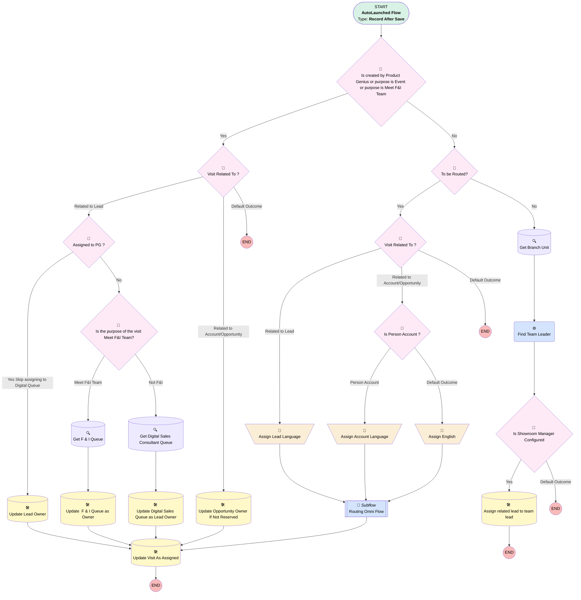

# EGH Lead And Visit Showroom Assignment Flow

## Flow Diagram

<!-- Flow description -->

## General Information

|<!-- -->|<!-- -->|
|:---|:---|
|Object|EGH_ShowroomVisit__c|
|Process Type| Auto Launched Flow|
|Trigger Type| Record After Save|
|Record Trigger Type| Create|
|Label|EGH Lead And Visit Showroom Assignment Flow|
|Status|Active|
|Description|Flow to assign a Lead to the appropriate Sales Consultant or the Team Leader based on Skills, Presence Status and previously assign Sales Consultant. Check if the purpose of the visit is Meet F&I Team.|
|Environments|Default|
|Interview Label|Lead And Visit Assignment Flow {!$Flow.CurrentDateTime}|
| Builder Type (PM)|LightningFlowBuilder|
| Canvas Mode (PM)|AUTO_LAYOUT_CANVAS|
| Origin Builder Type (PM)|LightningFlowBuilder|
|Connector|[Is_created_by_Product_Genius_or_purpose_is_Event](#is_created_by_product_genius_or_purpose_is_event)|
|Next Node|[Is_created_by_Product_Genius_or_purpose_is_Event](#is_created_by_product_genius_or_purpose_is_event)|

#### Filters (logic: **or**)

|Filter Id|Field|Operator|Value|
|:-- |:-- |:--:|:--: |
|1|EGH_LeadLookup__c| Is Null|<!-- -->|
|2|EGH_AccountLookup__c| Is Null|<!-- -->|

## Variables

|Name|Data Type|Is Collection|Is Input|Is Output|Object Type|Description|
|:-- |:--:|:--:|:--:|:--:|:--:|:--  |
|recordId|String|⬜|⬜|⬜|<!-- -->|Lead record Id|
|varSkillLanguage|String|⬜|⬜|⬜|<!-- -->|<!-- -->|

## Formulas

|Name|Data Type|Expression|Description|
|:-- |:--:|:-- |:--  |
|varShowroomBackupQueueName|String|'Showroom'+'_'+{!$User.Division}+'_'+'Backup'+'_'+'Queue'|<!-- -->|
|varShowroomQueueName|String|'Showroom'+'_'+{!$User.Division}+'_'+'Lead'+'_'+'Queue'|<!-- -->|

## Flow Nodes Details

### Find_Team_Leader

|<!-- -->|<!-- -->|
|:---|:---|
|Type|Action Call|
|Label|Find Team Leader|
|Action Type|Apex|
|Action Name|[EGH_TeamLeaderControllerClass](../apex/EGH_TeamLeaderControllerClass.md)|
|Flow Transaction Model|Automatic|
|Name Segment|EGH_TeamLeaderControllerClass|
|Offset|0|
|Store Output Automatically|✅|
|Record Id (input)|Get_Branch_Unit.Id|
|Connector|[Is_Showroom_Manager_Configured](#is_showroom_manager_configured)|

### Assign_Account_Language

|<!-- -->|<!-- -->|
|:---|:---|
|Type|Assignment|
|Label|Assign Account Language|
|Connector|[Routing_Omni_Flow](#routing_omni_flow)|

#### Assignments

|Assign To Reference|Operator|Value|
|:-- |:--:|:--: |
|varSkillLanguage| Assign|$Record.EGH_AccountLookup__r.EGH_ContactLanguagePicklist__pc|

### Assign_English

|<!-- -->|<!-- -->|
|:---|:---|
|Type|Assignment|
|Label|Assign English|
|Connector|[Routing_Omni_Flow](#routing_omni_flow)|

#### Assignments

|Assign To Reference|Operator|Value|
|:-- |:--:|:--: |
|varSkillLanguage| Assign|English|

### Assign_Lead_Language

|<!-- -->|<!-- -->|
|:---|:---|
|Type|Assignment|
|Label|Assign Lead Language|
|Connector|[Routing_Omni_Flow](#routing_omni_flow)|

#### Assignments

|Assign To Reference|Operator|Value|
|:-- |:--:|:--: |
|varSkillLanguage| Assign|$Record.EGH_LeadLookup__r.EGH_LeadLanguagePicklist__c|

### Assigned_to_PG

|<!-- -->|<!-- -->|
|:---|:---|
|Type|Decision|
|Label|Assigned to PG ?|
|Default Connector|[Is_the_purpose_of_the_visit_Meet_F_I_Team](#is_the_purpose_of_the_visit_meet_f_i_team)|
|Default Connector Label|No|

#### Rule Yes_Skip_assigning_to_Digital_Queue (Yes Skip assigning to Digital Queue)

|<!-- -->|<!-- -->|
|:---|:---|
|Connector|[Update_Lead_Owner](#update_lead_owner)|
|Condition Logic|and|

|Condition Id|Left Value Reference|Operator|Right Value|
|:-- |:-- |:--:|:--: |
|1|$UserRole.Name| Contains|$Label.EGH_Product_Genius_Role|
|2|$Record.EGH_LeadLookup__r.EGH_AssignToPG__c| Equal To|✅|

### Copy_1_of_Visit_Related_To

|<!-- -->|<!-- -->|
|:---|:---|
|Type|Decision|
|Label|Visit Related To ?|
|Default Connector Label|Default Outcome|

#### Rule Copy_1_of_Related_to_Lead (Related to Lead)

|<!-- -->|<!-- -->|
|:---|:---|
|Connector|[Assigned_to_PG](#assigned_to_pg)|
|Condition Logic|and|

|Condition Id|Left Value Reference|Operator|Right Value|
|:-- |:-- |:--:|:--: |
|1|$Record.EGH_LeadLookup__c| Is Null|⬜|

#### Rule Copy_1_of_Related_to_Account_Opportunity (Related to Account/Opportunity)

|<!-- -->|<!-- -->|
|:---|:---|
|Connector|[Update_Opportunity_Owner_If_Not_Reserved](#update_opportunity_owner_if_not_reserved)|
|Condition Logic|and|

|Condition Id|Left Value Reference|Operator|Right Value|
|:-- |:-- |:--:|:--: |
|1|$Record.EGH_SR_Opportunity__c| Is Null|⬜|
|2|$Record.EGH_AccountLookup__c| Is Null|⬜|

### Is_created_by_Product_Genius_or_purpose_is_Event

|<!-- -->|<!-- -->|
|:---|:---|
|Type|Decision|
|Label|Is created by Product Genius or purpose is Event or purpose is Meet F&I Team|
|Description|This check if the purpose of the visit is Event or if the Visit is created by the Product Genius or if the purpose of the visit is Meet F&I Team|
|Default Connector|[To_be_Routed](#to_be_routed)|
|Default Connector Label|No|

#### Rule Yes (Yes)

|<!-- -->|<!-- -->|
|:---|:---|
|Connector|[Copy_1_of_Visit_Related_To](#copy_1_of_visit_related_to)|
|Condition Logic|or|

|Condition Id|Left Value Reference|Operator|Right Value|
|:-- |:-- |:--:|:--: |
|1|$UserRole.Name| Contains|$Label.EGH_Product_Genius_Role|
|2|$Record.PurposeVisit__c| Equal To|Event|
|3|$Record.PurposeVisit__c| Equal To|Meet F&I Team|

### Is_Person_Account

|<!-- -->|<!-- -->|
|:---|:---|
|Type|Decision|
|Label|Is Person Account ?|
|Default Connector|[Assign_English](#assign_english)|
|Default Connector Label|Default Outcome|

#### Rule Person_Account (Person Account)

|<!-- -->|<!-- -->|
|:---|:---|
|Connector|[Assign_Account_Language](#assign_account_language)|
|Condition Logic|and|

|Condition Id|Left Value Reference|Operator|Right Value|
|:-- |:-- |:--:|:--: |
|1|$Record.EGH_AccountLookup__r.IsPersonAccount| Equal To|✅|

### Is_Showroom_Manager_Configured

|<!-- -->|<!-- -->|
|:---|:---|
|Type|Decision|
|Label|Is Showroom Manager Configured|
|Default Connector Label|Default Outcome|

#### Rule Yess (Yes)

|<!-- -->|<!-- -->|
|:---|:---|
|Connector|[Assign_related_lead_to_team_lead](#assign_related_lead_to_team_lead)|
|Condition Logic|and|

|Condition Id|Left Value Reference|Operator|Right Value|
|:-- |:-- |:--:|:--: |
|1|Find_Team_Leader.teamLeaderId| Is Null|⬜|

### Is_the_purpose_of_the_visit_Meet_F_I_Team

|<!-- -->|<!-- -->|
|:---|:---|
|Type|Decision|
|Label|Is the purpose of the visit Meet F&I Team?|
|Description|This decision is taken if the purpose of the visit is Meet F & I team|
|Default Connector|[Get_Digital_Sales_Consultant_Queue](#get_digital_sales_consultant_queue)|
|Default Connector Label|Not F&I|

#### Rule MeetAndI (Meet F&I Team)

|<!-- -->|<!-- -->|
|:---|:---|
|Connector|[Get_F_I_Queue](#get_f_i_queue)|
|Condition Logic|and|

|Condition Id|Left Value Reference|Operator|Right Value|
|:-- |:-- |:--:|:--: |
|1|$Record.PurposeVisit__c| Equal To|Meet F&I Team|

### To_be_Routed

|<!-- -->|<!-- -->|
|:---|:---|
|Type|Decision|
|Label|To be Routed?|
|Default Connector|[Get_Branch_Unit](#get_branch_unit)|
|Default Connector Label|No|

#### Rule YesRoute (Yes)

|<!-- -->|<!-- -->|
|:---|:---|
|Connector|[Visit_Related_To](#visit_related_to)|
|Condition Logic|and|

|Condition Id|Left Value Reference|Operator|Right Value|
|:-- |:-- |:--:|:--: |
|1|$Record.Route_to_Sales__c| Equal To|✅|

### Visit_Related_To

|<!-- -->|<!-- -->|
|:---|:---|
|Type|Decision|
|Label|Visit Related To ?|
|Default Connector Label|Default Outcome|

#### Rule Related_to_Lead (Related to Lead)

|<!-- -->|<!-- -->|
|:---|:---|
|Connector|[Assign_Lead_Language](#assign_lead_language)|
|Condition Logic|and|

|Condition Id|Left Value Reference|Operator|Right Value|
|:-- |:-- |:--:|:--: |
|1|$Record.EGH_LeadLookup__c| Is Null|⬜|

#### Rule Related_to_Account_Opportunity (Related to Account/Opportunity)

|<!-- -->|<!-- -->|
|:---|:---|
|Connector|[Is_Person_Account](#is_person_account)|
|Condition Logic|and|

|Condition Id|Left Value Reference|Operator|Right Value|
|:-- |:-- |:--:|:--: |
|1|$Record.EGH_SR_Opportunity__c| Is Null|⬜|
|2|$Record.EGH_AccountLookup__c| Is Null|⬜|

### Get_Branch_Unit

|<!-- -->|<!-- -->|
|:---|:---|
|Type|Record Lookup|
|Object|BranchUnit|
|Label|Get Branch Unit|
|Assign Null Values If No Records Found|⬜|
|Get First Record Only|✅|
|Store Output Automatically|✅|
|Connector|[Find_Team_Leader](#find_team_leader)|

#### Filters (logic: **and**)

|Filter Id|Field|Operator|Value|
|:-- |:-- |:--:|:--: |
|1|Name| Equal To|$User.Division|

### Get_Digital_Sales_Consultant_Queue

|<!-- -->|<!-- -->|
|:---|:---|
|Type|Record Lookup|
|Object|Group|
|Label|Get Digital Sales Consultant Queue|
|Assign Null Values If No Records Found|⬜|
|Get First Record Only|✅|
|Store Output Automatically|✅|
|Connector|[Update_Digital_Sales_Queue_as_Owner](#update_digital_sales_queue_as_owner)|

#### Filters (logic: **1 AND 2**)

|Filter Id|Field|Operator|Value|
|:-- |:-- |:--:|:--: |
|1|Name| Starts With|Digital Sales|
|2|Type| Equal To|Queue|

### Get_F_I_Queue

|<!-- -->|<!-- -->|
|:---|:---|
|Type|Record Lookup|
|Object|Group|
|Label|Get F & I Queue|
|Description|Get the F&I Queue for the Showroom of the visit|
|Assign Null Values If No Records Found|⬜|
|Get First Record Only|✅|
|Store Output Automatically|✅|
|Connector|[Update_F_I_Queue_as_Owner](#update_f_i_queue_as_owner)|

#### Filters (logic: **and**)

|Filter Id|Field|Operator|Value|
|:-- |:-- |:--:|:--: |
|1|Type| Equal To|Queue|
|2|Name| Starts With|$Record.EGH_RelatedShowroomBranch__r.Name|
|3|Name| Ends With|F&I|

### Assign_related_lead_to_team_lead

|<!-- -->|<!-- -->|
|:---|:---|
|Type|Record Update|
|Label|Assign related lead to team lead|
|Input Reference|$Record.EGH_LeadLookup__r|

#### Filters (logic: **and**)

|Filter Id|Field|Operator|Value|
|:-- |:-- |:--:|:--: |
|1|Id| Equal To|$Record.EGH_LeadLookup__r.Id|

#### Input Assignments

|Field|Value|
|:-- |:--: |
|OwnerId|Find_Team_Leader.teamLeaderId|

### Update_Digital_Sales_Queue_as_Owner

|<!-- -->|<!-- -->|
|:---|:---|
|Type|Record Update|
|Label|Update Digital Sales Queue as Lead Owner|
|Input Reference|$Record.EGH_LeadLookup__r|
|Connector|[Update_Visit_As_Assigned](#update_visit_as_assigned)|

#### Input Assignments

|Field|Value|
|:-- |:--: |
|EGH_BranchCode__c|$Record.EGH_RelatedShowroomBranch__r.BranchCode|
|EGH_LeadBranchUnitLookup__c|$Record.EGH_RelatedShowroomBranch__c|
|OwnerId|Get_Digital_Sales_Consultant_Queue.Id|

### Update_F_I_Queue_as_Owner

|<!-- -->|<!-- -->|
|:---|:---|
|Type|Record Update|
|Label|Update  F & I Queue as Owner|
|Input Reference|$Record|
|Connector|[Update_Visit_As_Assigned](#update_visit_as_assigned)|

#### Input Assignments

|Field|Value|
|:-- |:--: |
|OwnerId|Get_F_I_Queue.Id|

### Update_Lead_Owner

|<!-- -->|<!-- -->|
|:---|:---|
|Type|Record Update|
|Label|Update Lead Owner|
|Input Reference|$Record.EGH_LeadLookup__r|
|Connector|[Update_Visit_As_Assigned](#update_visit_as_assigned)|

#### Input Assignments

|Field|Value|
|:-- |:--: |
|EGH_BranchCode__c|$Record.EGH_RelatedShowroomBranch__r.BranchCode|
|EGH_LeadBranchUnitLookup__c|$Record.EGH_RelatedShowroomBranch__c|
|OwnerId|$Record.OwnerId|

### Update_Opportunity_Owner_If_Not_Reserved

|<!-- -->|<!-- -->|
|:---|:---|
|Type|Record Update|
|Object|Opportunity|
|Label|Update Opportunity Owner If Not Reserved|
|Connector|[Update_Visit_As_Assigned](#update_visit_as_assigned)|

#### Filters (logic: **and**)

|Filter Id|Field|Operator|Value|
|:-- |:-- |:--:|:--: |
|1|Id| Equal To|$Record.EGH_SR_Opportunity__c|
|2|StageName| Not Equal To|Closed Won|
|3|StageName| Not Equal To|Closed Lost|
|4|StageName| Not Equal To|Reserved/Pre Booked|

#### Input Assignments

|Field|Value|
|:-- |:--: |
|EGH_BranchUnitLookup__c|$Record.EGH_RelatedShowroomBranch__c|
|OwnerId|$Record.OwnerId|

### Update_Visit_As_Assigned

|<!-- -->|<!-- -->|
|:---|:---|
|Type|Record Update|
|Label|Update Visit As Assigned|
|Input Reference|$Record|

#### Input Assignments

|Field|Value|
|:-- |:--: |
|EGH_Is_Assigned__c|✅|

### Routing_Omni_Flow

|<!-- -->|<!-- -->|
|:---|:---|
|Type|Subflow|
|Label|Routing Omni Flow|
|Flow Name|EGH_Lead_Routing_SubFlow|
|Connector|[Update_Visit_As_Assigned](#update_visit_as_assigned)|

#### Input Assignments

|Field|Value|
|:-- |:--: |
|<!-- -->|$Record.Id|
|<!-- -->|$Record.EGH_LeadLookup__r.Id|
|<!-- -->|$Record.EGH_RelatedShowroomBranch__r.Id|
|<!-- -->|varSkillLanguage|
|<!-- -->|$Record.EGH_RelatedShowroomBranch__r.Name|

___

_Documentation generated from branch null by [sfdx-hardis](https://sfdx-hardis.cloudity.com), featuring [salesforce-flow-visualiser](https://github.com/toddhalfpenny/salesforce-flow-visualiser)_