# Lead Follow Up Task Creation (1st Follow Up)

## Flow Diagram

```mermaid
%% If you read this, your Markdown visualizer does not handle MermaidJS syntax.
%% - If you are in VS Code, install extension `Markdown Preview Mermaid Support` at https://marketplace.visualstudio.com/items?itemName=bierner.markdown-mermaid
%% - If you are using sfdx-hardis, try to define env variable `MERMAID_MODES=cli,docker` ,then run again the command to regenerate markdown with SVG images.
%% - If you are within mkdocs-material, define mermaid plugin in `mkdocs.yml` as described in https://squidfunk.github.io/mkdocs-material/extensions/mermaid/
%% - As a last resort, you can copy-paste this MermaidJS code into https://mermaid.live/ to see the flow diagram

flowchart TB
START(["START<br/><b>AutoLaunched Flow</b></br>Type: <b> Record After Save</b>"]):::startClass
click START "#general-information" "452859958"

Assign_Variables_to_Task[\"🟰 <em></em><br/>Assign Variables to Task"/]:::assignments
click Assign_Variables_to_Task "#assign_variables_to_task" "1570277543"

Follow_Up_already_Exists{"🔀 <em></em><br/>Follow Up already Exists?"}:::decisions
click Follow_Up_already_Exists "#follow_up_already_exists" "2776002513"

Create_Initial_Follow_Up_Task[("➕ <em></em><br/>Create Initial Follow Up Task")]:::recordCreates
click Create_Initial_Follow_Up_Task "#create_initial_follow_up_task" "1185518121"

Get_Existing_FollowUp_Tasks[("🔍 <em></em><br/>Get Existing FollowUp Tasks")]:::recordLookups
click Get_Existing_FollowUp_Tasks "#get_existing_followup_tasks" "314207602"

Get_Last_Interaction[("🔍 <em></em><br/>Get Last Digital Interaction")]:::recordLookups
click Get_Last_Interaction "#get_last_interaction" "499821101"

Get_Record_Type[("🔍 <em></em><br/>Get Record Type")]:::recordLookups
click Get_Record_Type "#get_record_type" "2420876610"

Assign_Variables_to_Task --> Create_Initial_Follow_Up_Task
Follow_Up_already_Exists --> |"No"| Get_Last_Interaction
Create_Initial_Follow_Up_Task --> END_Create_Initial_Follow_Up_Task
Get_Existing_FollowUp_Tasks --> Follow_Up_already_Exists
Get_Last_Interaction --> Assign_Variables_to_Task
Get_Record_Type --> Get_Existing_FollowUp_Tasks
START -->  Get_Record_Type
END_Create_Initial_Follow_Up_Task(( END )):::endClass


classDef actionCalls fill:#D4E4FC,color:black,text-decoration:none,max-height:100px
classDef assignments fill:#FBEED7,color:black,text-decoration:none,max-height:100px
classDef collectionProcessors fill:#F0E3FA,color:black,text-decoration:none,max-height:100px
classDef customErrors fill:#FFE9E9,color:black,text-decoration:none,max-height:100px
classDef decisions fill:#FDEAF6,color:black,text-decoration:none,max-height:100px
classDef loops fill:#FDEAF6,color:black,text-decoration:none,max-height:100px
classDef recordCreates fill:#FFF8C9,color:black,text-decoration:none,max-height:100px
classDef recordDeletes fill:#FFF8C9,color:black,text-decoration:none,max-height:100px
classDef recordLookups fill:#EDEAFF,color:black,text-decoration:none,max-height:100px
classDef recordUpdates fill:#FFF8C9,color:black,text-decoration:none,max-height:100px
classDef screens fill:#DFF6FF,color:black,text-decoration:none,max-height:100px
classDef subflows fill:#D4E4FC,color:black,text-decoration:none,max-height:100px
classDef startClass fill:#D9F2E6,color:black,text-decoration:none,max-height:100px
classDef endClass fill:#F9BABA,color:black,text-decoration:none,max-height:100px
classDef transforms fill:#FDEAF6,color:black,text-decoration:none,max-height:100px


```

<!-- Flow description -->

## General Information

|<!-- -->|<!-- -->|
|:---|:---|
|Object|Lead|
|Process Type| Auto Launched Flow|
|Trigger Type| Record After Save|
|Record Trigger Type| Update|
|Label|Lead Follow Up Task Creation (1st Follow Up)|
|Status|Obsolete|
|Filter Formula|ISCHANGED({!$Record.OwnerId}) && NOT(ISBLANK({!$Record__Prior.OwnerId})) && BEGINS({!$Record__Prior.OwnerId}, '00G') && BEGINS({!$Record.OwnerId}, '005') && {!$Record.Owner:User.UserRole.Name}="Digital Sales Consultant"|
|Description|Creates Lead Follow up tasks after record ownership change from Queue. Add Attempt Number and Brand.|
|Environments|Default|
|Interview Label|Lead {!$Flow.CurrentDateTime}|
| Builder Type (PM)|LightningFlowBuilder|
| Canvas Mode (PM)|AUTO_LAYOUT_CANVAS|
| Origin Builder Type (PM)|LightningFlowBuilder|
|Connector|[Get_Record_Type](#get_record_type)|
|Next Node|[Get_Record_Type](#get_record_type)|

## Variables

|Name|Data Type|Is Collection|Is Input|Is Output|Object Type|Description|
|:-- |:--:|:--:|:--:|:--:|:--:|:--  |
|FollowUpTask|SObject|⬜|⬜|⬜|Task|Create Follow Up Task|

## Formulas

|Name|Data Type|Expression|Description|
|:-- |:--:|:-- |:--  |
|CurrentDate|Date|TODAY()|<!-- -->|
|TaskDueTime|DateTime|NOW() + (30 / 1440)|<!-- -->|
|TaskReminderTime|DateTime|{!TaskDueTime} - (5 / 1440)|Reminder time for the task|
|TaskSubject|String|{!$Record.FirstName} + ' ' + {!$Record.LastName} + ' - ' + '1st Follow-up'|<!-- -->|

## Flow Nodes Details

### Assign_Variables_to_Task

|<!-- -->|<!-- -->|
|:---|:---|
|Type|Assignment|
|Label|Assign Variables to Task|
|Connector|[Create_Initial_Follow_Up_Task](#create_initial_follow_up_task)|

#### Assignments

|Assign To Reference|Operator|Value|
|:-- |:--:|:--: |
|FollowUpTask.WhoId| Assign|$Record.Id|
|FollowUpTask.ActivityDate| Assign|CurrentDate|
|FollowUpTask.EGH_ContactTypePicklist__c| Assign|1st Attempt|
|FollowUpTask.IsHighPriority| Assign|✅|
|FollowUpTask.IsReminderSet| Assign|✅|
|FollowUpTask.EGH_DueDateTime__c| Assign|TaskDueTime|
|FollowUpTask.Subject| Assign|TaskSubject|
|FollowUpTask.ReminderDateTime| Assign|TaskReminderTime|
|FollowUpTask.RecordTypeId| Assign|Get_Record_Type.Id|
|FollowUpTask.EGH_Attempt_Number__c| Assign|1|
|FollowUpTask.EGH_Brand__c| Assign|Get_Last_Interaction.EGH_BrandPicklist__c|
|FollowUpTask.OwnerId| Assign|$Record.OwnerId|

### Follow_Up_already_Exists

|<!-- -->|<!-- -->|
|:---|:---|
|Type|Decision|
|Label|Follow Up already Exists?|
|Default Connector|[Get_Last_Interaction](#get_last_interaction)|
|Default Connector Label|No|

#### Rule Yes (Yes)

|<!-- -->|<!-- -->|
|:---|:---|
|Condition Logic|and|

|Condition Id|Left Value Reference|Operator|Right Value|
|:-- |:-- |:--:|:--: |
|1|[Get_Existing_FollowUp_Tasks](#get_existing_followup_tasks)| Is Null|⬜|

### Create_Initial_Follow_Up_Task

|<!-- -->|<!-- -->|
|:---|:---|
|Type|Record Create|
|Label|Create Initial Follow Up Task|
|Description|Create Initial Follow Up Task|
|Input Reference|FollowUpTask|

### Get_Existing_FollowUp_Tasks

|<!-- -->|<!-- -->|
|:---|:---|
|Type|Record Lookup|
|Object|Task|
|Label|Get Existing FollowUp Tasks|
|Assign Null Values If No Records Found|⬜|
|Get First Record Only|✅|
|Store Output Automatically|✅|
|Connector|[Follow_Up_already_Exists](#follow_up_already_exists)|

#### Filters (logic: **and**)

|Filter Id|Field|Operator|Value|
|:-- |:-- |:--:|:--: |
|1|EGH_ContactTypePicklist__c| Equal To|1st Attempt|
|2|WhoId| Equal To|$Record.Id|

### Get_Last_Interaction

|<!-- -->|<!-- -->|
|:---|:---|
|Type|Record Lookup|
|Object|EGH_Interaction__c|
|Label|Get Last Digital Interaction|
|Description|Get the last Digital Interaction from the Lead|
|Assign Null Values If No Records Found|⬜|
|Get First Record Only|✅|
|Sort Field|CreatedDate|
|Sort Order|Desc|
|Store Output Automatically|✅|
|Connector|[Assign_Variables_to_Task](#assign_variables_to_task)|

#### Filters (logic: **and**)

|Filter Id|Field|Operator|Value|
|:-- |:-- |:--:|:--: |
|1|EGH_LeadLookup__c| Equal To|$Record.Id|

### Get_Record_Type

|<!-- -->|<!-- -->|
|:---|:---|
|Type|Record Lookup|
|Object|RecordType|
|Label|Get Record Type|
|Assign Null Values If No Records Found|⬜|
|Get First Record Only|✅|
|Store Output Automatically|✅|
|Connector|[Get_Existing_FollowUp_Tasks](#get_existing_followup_tasks)|

#### Filters (logic: **and**)

|Filter Id|Field|Operator|Value|
|:-- |:-- |:--:|:--: |
|1|DeveloperName| Equal To|EGH_LeadFollowUpTasks|

___

_Documentation generated from branch null by [sfdx-hardis](https://sfdx-hardis.cloudity.com), featuring [salesforce-flow-visualiser](https://github.com/toddhalfpenny/salesforce-flow-visualiser)_