# EGH Lead Auto-Rejection Scheduled Flow

## Flow Diagram

```mermaid
%% If you read this, your Markdown visualizer does not handle MermaidJS syntax.
%% - If you are in VS Code, install extension `Markdown Preview Mermaid Support` at https://marketplace.visualstudio.com/items?itemName=bierner.markdown-mermaid
%% - If you are using sfdx-hardis, try to define env variable `MERMAID_MODES=cli,docker` ,then run again the command to regenerate markdown with SVG images.
%% - If you are within mkdocs-material, define mermaid plugin in `mkdocs.yml` as described in https://squidfunk.github.io/mkdocs-material/extensions/mermaid/
%% - As a last resort, you can copy-paste this MermaidJS code into https://mermaid.live/ to see the flow diagram

flowchart TB
START(["START<br/><b>AutoLaunched Flow</b></br>Type: <b> Scheduled</b>"]):::startClass
click START "#general-information" "3728218449"

Lead_Created_within_3_months_and_Inactive_20_days{"🔀 <em></em><br/>Lead Created within 3 months and Inactive 20 days"}:::decisions
click Lead_Created_within_3_months_and_Inactive_20_days "#lead_created_within_3_months_and_inactive_20_days" "427060111"

Auto_Reject_Leads[("🛠️ <em></em><br/>Auto Reject Leads")]:::recordUpdates
click Auto_Reject_Leads "#auto_reject_leads" "693466576"

Lead_Created_within_3_months_and_Inactive_20_days --> |"Auto-Reject Lead"| Auto_Reject_Leads
Lead_Created_within_3_months_and_Inactive_20_days --> |"Default Outcome"| END_Lead_Created_within_3_months_and_Inactive_20_days
Auto_Reject_Leads --> END_Auto_Reject_Leads
START -->  Lead_Created_within_3_months_and_Inactive_20_days
END_Lead_Created_within_3_months_and_Inactive_20_days(( END )):::endClass
END_Auto_Reject_Leads(( END )):::endClass


classDef actionCalls fill:#D4E4FC,color:black,text-decoration:none,max-height:100px
classDef assignments fill:#FBEED7,color:black,text-decoration:none,max-height:100px
classDef collectionProcessors fill:#F0E3FA,color:black,text-decoration:none,max-height:100px
classDef customErrors fill:#FFE9E9,color:black,text-decoration:none,max-height:100px
classDef decisions fill:#FDEAF6,color:black,text-decoration:none,max-height:100px
classDef loops fill:#FDEAF6,color:black,text-decoration:none,max-height:100px
classDef recordCreates fill:#FFF8C9,color:black,text-decoration:none,max-height:100px
classDef recordDeletes fill:#FFF8C9,color:black,text-decoration:none,max-height:100px
classDef recordLookups fill:#EDEAFF,color:black,text-decoration:none,max-height:100px
classDef recordUpdates fill:#FFF8C9,color:black,text-decoration:none,max-height:100px
classDef screens fill:#DFF6FF,color:black,text-decoration:none,max-height:100px
classDef subflows fill:#D4E4FC,color:black,text-decoration:none,max-height:100px
classDef startClass fill:#D9F2E6,color:black,text-decoration:none,max-height:100px
classDef endClass fill:#F9BABA,color:black,text-decoration:none,max-height:100px
classDef transforms fill:#FDEAF6,color:black,text-decoration:none,max-height:100px


```

<!-- Flow description -->

## General Information

|<!-- -->|<!-- -->|
|:---|:---|
|Object|Lead|
|Process Type| Auto Launched Flow|
|Trigger Type| Scheduled|
|Label|EGH Lead Auto-Rejection Scheduled Flow|
|Status|Active|
|Description|If the lead is created within 3 months and been inactive for 20 days it is auto rejected.|
|Environments|Default|
|Interview Label|EGH Lead Auto-Rejection Scheduled Flow {!$Flow.CurrentDateTime}|
| Builder Type (PM)|LightningFlowBuilder|
| Canvas Mode (PM)|AUTO_LAYOUT_CANVAS|
| Origin Builder Type (PM)|LightningFlowBuilder|
|Connector|[Lead_Created_within_3_months_and_Inactive_20_days](#lead_created_within_3_months_and_inactive_20_days)|
|Next Node|[Lead_Created_within_3_months_and_Inactive_20_days](#lead_created_within_3_months_and_inactive_20_days)|

#### Schedules

|Frequency|Start Date|Start Time|
|:-- |:--:|:--: |
|Daily|Jan 7, 2026|03:00|

#### Filters (logic: **and**)

|Filter Id|Field|Operator|Value|
|:-- |:-- |:--:|:--: |
|1|IsConverted| Equal To|⬜|
|2|Status| Not Equal To|Rejected|

## Formulas

|Name|Data Type|Expression|Description|
|:-- |:--:|:-- |:--  |
|IsInactive20Days|Boolean|(Today() - DATEVALUE({!$Record.LastModifiedDate})) > 20|<!-- -->|
|IsWithin3Months|Boolean|(Today() - DATEVALUE({!$Record.CreatedDate})) <= 90|<!-- -->|

## Flow Nodes Details

### Lead_Created_within_3_months_and_Inactive_20_days

|<!-- -->|<!-- -->|
|:---|:---|
|Type|Decision|
|Label|Lead Created within 3 months and Inactive 20 days|
|Default Connector Label|Default Outcome|

#### Rule Auto_Reject_Lead (Auto-Reject Lead)

|<!-- -->|<!-- -->|
|:---|:---|
|Connector|[Auto_Reject_Leads](#auto_reject_leads)|
|Condition Logic|and|

|Condition Id|Left Value Reference|Operator|Right Value|
|:-- |:-- |:--:|:--: |
|1|IsWithin3Months| Equal To|✅|
|2|IsInactive20Days| Equal To|✅|

### Auto_Reject_Leads

|<!-- -->|<!-- -->|
|:---|:---|
|Type|Record Update|
|Label|Auto Reject Leads|
|Input Reference|$Record|

#### Input Assignments

|Field|Value|
|:-- |:--: |
|Status|Rejected|

___

_Documentation generated from branch null by [sfdx-hardis](https://sfdx-hardis.cloudity.com), featuring [salesforce-flow-visualiser](https://github.com/toddhalfpenny/salesforce-flow-visualiser)_