# EGH Lead Create Follow Up Task

## Flow Diagram

```mermaid
%% If you read this, your Markdown visualizer does not handle MermaidJS syntax.
%% - If you are in VS Code, install extension `Markdown Preview Mermaid Support` at https://marketplace.visualstudio.com/items?itemName=bierner.markdown-mermaid
%% - If you are using sfdx-hardis, try to define env variable `MERMAID_MODES=cli,docker` ,then run again the command to regenerate markdown with SVG images.
%% - If you are within mkdocs-material, define mermaid plugin in `mkdocs.yml` as described in https://squidfunk.github.io/mkdocs-material/extensions/mermaid/
%% - As a last resort, you can copy-paste this MermaidJS code into https://mermaid.live/ to see the flow diagram

flowchart TB
START(["START<br/><b>AutoLaunched Flow</b></br>Type: <b> Record After Save</b>"]):::startClass
click START "#general-information" "2273034718"

X1st_Follow_Up_Task_Exist{"🔀 <em></em><br/>1st Follow Up Task Exist"}:::decisions
click X1st_Follow_Up_Task_Exist "#x1st_follow_up_task_exist" "3500499552"

Create_Follow_Up_Task[("➕ <em></em><br/>Create Follow Up Task")]:::recordCreates
click Create_Follow_Up_Task "#create_follow_up_task" "3925187571"

Get_Associated_Lead[("🔍 <em></em><br/>Get Associated Lead")]:::recordLookups
click Get_Associated_Lead "#get_associated_lead" "964150922"

Get_Existing_Follow_Up_Taks[("🔍 <em></em><br/>Get Existing Follow Up Taks")]:::recordLookups
click Get_Existing_Follow_Up_Taks "#get_existing_follow_up_taks" "3609529401"

Get_Follow_Up_Record_Type[("🔍 <em></em><br/>Get Follow Up Record Type")]:::recordLookups
click Get_Follow_Up_Record_Type "#get_follow_up_record_type" "2872243028"

Update_Lead_Status[("🛠️ <em></em><br/>Update Lead Status")]:::recordUpdates
click Update_Lead_Status "#update_lead_status" "2503948349"

X1st_Follow_Up_Task_Exist --> |"Default Outcome"| Get_Associated_Lead
Create_Follow_Up_Task --> Update_Lead_Status
Get_Associated_Lead --> Create_Follow_Up_Task
Get_Existing_Follow_Up_Taks --> X1st_Follow_Up_Task_Exist
Get_Follow_Up_Record_Type --> Get_Existing_Follow_Up_Taks
Update_Lead_Status --> END_Update_Lead_Status
START -->  Get_Follow_Up_Record_Type
END_Update_Lead_Status(( END )):::endClass


classDef actionCalls fill:#D4E4FC,color:black,text-decoration:none,max-height:100px
classDef assignments fill:#FBEED7,color:black,text-decoration:none,max-height:100px
classDef collectionProcessors fill:#F0E3FA,color:black,text-decoration:none,max-height:100px
classDef customErrors fill:#FFE9E9,color:black,text-decoration:none,max-height:100px
classDef decisions fill:#FDEAF6,color:black,text-decoration:none,max-height:100px
classDef loops fill:#FDEAF6,color:black,text-decoration:none,max-height:100px
classDef recordCreates fill:#FFF8C9,color:black,text-decoration:none,max-height:100px
classDef recordDeletes fill:#FFF8C9,color:black,text-decoration:none,max-height:100px
classDef recordLookups fill:#EDEAFF,color:black,text-decoration:none,max-height:100px
classDef recordUpdates fill:#FFF8C9,color:black,text-decoration:none,max-height:100px
classDef screens fill:#DFF6FF,color:black,text-decoration:none,max-height:100px
classDef subflows fill:#D4E4FC,color:black,text-decoration:none,max-height:100px
classDef startClass fill:#D9F2E6,color:black,text-decoration:none,max-height:100px
classDef endClass fill:#F9BABA,color:black,text-decoration:none,max-height:100px
classDef transforms fill:#FDEAF6,color:black,text-decoration:none,max-height:100px


```

<!-- Flow description -->

## General Information

|<!-- -->|<!-- -->|
|:---|:---|
|Object|AgentWork|
|Process Type| Auto Launched Flow|
|Trigger Type| Record After Save|
|Record Trigger Type| Create And Update|
|Label|EGH Lead Create Follow Up Task|
|Status|Active|
|Filter Formula|CONTAINS({!$Record.OriginalQueue.DeveloperName},{!$Label.EGH_Digital_Sales_Consultant_Queue}) && ISPICKVAL({!$Record.Status},'Assigned') && {!$Record.User.UserRole.Name}=='Digital Sales Consultant'|
|Environments|Default|
|Interview Label|EGH Lead Create Follow Up Task {!$Flow.CurrentDateTime}|
| Builder Type (PM)|LightningFlowBuilder|
| Canvas Mode (PM)|AUTO_LAYOUT_CANVAS|
| Origin Builder Type (PM)|LightningFlowBuilder|
|Connector|[Get_Follow_Up_Record_Type](#get_follow_up_record_type)|
|Next Node|[Get_Follow_Up_Record_Type](#get_follow_up_record_type)|

## Formulas

|Name|Data Type|Expression|Description|
|:-- |:--:|:-- |:--  |
|varTaskDueTime|DateTime|NOW() + (30 / 1440)|<!-- -->|
|varTaskReminderTime|DateTime|{!varTaskDueTime}- (5 / 1440)|Reminder time for the task|
|varTaskSubject|String|{!Get_Associated_Lead.FirstName}+ ' ' + {!Get_Associated_Lead.LastName}+ ' - ' + '1st Follow-up'|<!-- -->|

## Flow Nodes Details

### X1st_Follow_Up_Task_Exist

|<!-- -->|<!-- -->|
|:---|:---|
|Type|Decision|
|Label|1st Follow Up Task Exist|
|Default Connector|[Get_Associated_Lead](#get_associated_lead)|
|Default Connector Label|Default Outcome|

#### Rule Outcome_1_of_X1st_Follow_Up_Task_Exist (Outcome 1 of 1st Follow Up Task Exist)

|<!-- -->|<!-- -->|
|:---|:---|
|Condition Logic|and|

|Condition Id|Left Value Reference|Operator|Right Value|
|:-- |:-- |:--:|:--: |
|1|[Get_Existing_Follow_Up_Taks](#get_existing_follow_up_taks)| Is Null|⬜|

### Create_Follow_Up_Task

|<!-- -->|<!-- -->|
|:---|:---|
|Type|Record Create|
|Object|Task|
|Label|Create Follow Up Task|
|Store Output Automatically|✅|
|Connector|[Update_Lead_Status](#update_lead_status)|

#### Input Assignments

|Field|Value|
|:-- |:--: |
|ActivityDate|$Flow.CurrentDate|
|EGH_Attempt_Number__c|1|
|EGH_Brand__c|Get_Associated_Lead.EGH_BrandListPicklist__c|
|EGH_ContactTypePicklist__c|1st Attempt|
|EGH_DueDateTime__c|varTaskDueTime|
|IsReminderSet|✅|
|OwnerId|$Record.UserId|
|Priority|High|
|RecordTypeId|Get_Follow_Up_Record_Type.Id|
|ReminderDateTime|varTaskReminderTime|
|Subject|varTaskSubject|
|WhoId|$Record.WorkItemId|

### Get_Associated_Lead

|<!-- -->|<!-- -->|
|:---|:---|
|Type|Record Lookup|
|Object|Lead|
|Label|Get Associated Lead|
|Assign Null Values If No Records Found|⬜|
|Get First Record Only|✅|
|Store Output Automatically|✅|
|Connector|[Create_Follow_Up_Task](#create_follow_up_task)|

#### Filters (logic: **and**)

|Filter Id|Field|Operator|Value|
|:-- |:-- |:--:|:--: |
|1|Id| Equal To|$Record.WorkItemId|

### Get_Existing_Follow_Up_Taks

|<!-- -->|<!-- -->|
|:---|:---|
|Type|Record Lookup|
|Object|Task|
|Label|Get Existing Follow Up Taks|
|Assign Null Values If No Records Found|⬜|
|Get First Record Only|✅|
|Store Output Automatically|✅|
|Connector|[X1st_Follow_Up_Task_Exist](#x1st_follow_up_task_exist)|

#### Filters (logic: **and**)

|Filter Id|Field|Operator|Value|
|:-- |:-- |:--:|:--: |
|1|EGH_ContactTypePicklist__c| Equal To|1st Attempt|
|2|WhoId| Equal To|$Record.WorkItemId|

### Get_Follow_Up_Record_Type

|<!-- -->|<!-- -->|
|:---|:---|
|Type|Record Lookup|
|Object|RecordType|
|Label|Get Follow Up Record Type|
|Assign Null Values If No Records Found|⬜|
|Get First Record Only|✅|
|Store Output Automatically|✅|
|Connector|[Get_Existing_Follow_Up_Taks](#get_existing_follow_up_taks)|

#### Filters (logic: **and**)

|Filter Id|Field|Operator|Value|
|:-- |:-- |:--:|:--: |
|1|DeveloperName| Equal To|EGH_LeadFollowUpTasks|

### Update_Lead_Status

|<!-- -->|<!-- -->|
|:---|:---|
|Type|Record Update|
|Object|Lead|
|Label|Update Lead Status|

#### Filters (logic: **and**)

|Filter Id|Field|Operator|Value|
|:-- |:-- |:--:|:--: |
|1|Id| Equal To|$Record.WorkItemId|

#### Input Assignments

|Field|Value|
|:-- |:--: |
|Status|Assigned|

___

_Documentation generated from branch null by [sfdx-hardis](https://sfdx-hardis.cloudity.com), featuring [salesforce-flow-visualiser](https://github.com/toddhalfpenny/salesforce-flow-visualiser)_