# EGH Lead Lost Reason Capture

## Flow Diagram

```mermaid
%% If you read this, your Markdown visualizer does not handle MermaidJS syntax.
%% - If you are in VS Code, install extension `Markdown Preview Mermaid Support` at https://marketplace.visualstudio.com/items?itemName=bierner.markdown-mermaid
%% - If you are using sfdx-hardis, try to define env variable `MERMAID_MODES=cli,docker` ,then run again the command to regenerate markdown with SVG images.
%% - If you are within mkdocs-material, define mermaid plugin in `mkdocs.yml` as described in https://squidfunk.github.io/mkdocs-material/extensions/mermaid/
%% - As a last resort, you can copy-paste this MermaidJS code into https://mermaid.live/ to see the flow diagram

flowchart TB
START(["START<br/><b>Screen Flow</b>"]):::startClass
click START "#general-information" "3568262657"

Update_Lead_Lost_Reason[("🛠️ <em></em><br/>Update Lead Lost Reason")]:::recordUpdates
click Update_Lead_Lost_Reason "#update_lead_lost_reason" "2348749172"

Lead_Lost_Reason_Capture_Screen(["💻 <em></em><br/>Lead Lost Reason Capture Screen"]):::screens
click Lead_Lost_Reason_Capture_Screen "#lead_lost_reason_capture_screen" "3177442415"

Update_Lead_Lost_Reason --> END_Update_Lead_Lost_Reason
Lead_Lost_Reason_Capture_Screen --> Update_Lead_Lost_Reason
START -->  Lead_Lost_Reason_Capture_Screen
END_Update_Lead_Lost_Reason(( END )):::endClass


classDef actionCalls fill:#D4E4FC,color:black,text-decoration:none,max-height:100px
classDef assignments fill:#FBEED7,color:black,text-decoration:none,max-height:100px
classDef collectionProcessors fill:#F0E3FA,color:black,text-decoration:none,max-height:100px
classDef customErrors fill:#FFE9E9,color:black,text-decoration:none,max-height:100px
classDef decisions fill:#FDEAF6,color:black,text-decoration:none,max-height:100px
classDef loops fill:#FDEAF6,color:black,text-decoration:none,max-height:100px
classDef recordCreates fill:#FFF8C9,color:black,text-decoration:none,max-height:100px
classDef recordDeletes fill:#FFF8C9,color:black,text-decoration:none,max-height:100px
classDef recordLookups fill:#EDEAFF,color:black,text-decoration:none,max-height:100px
classDef recordUpdates fill:#FFF8C9,color:black,text-decoration:none,max-height:100px
classDef screens fill:#DFF6FF,color:black,text-decoration:none,max-height:100px
classDef subflows fill:#D4E4FC,color:black,text-decoration:none,max-height:100px
classDef startClass fill:#D9F2E6,color:black,text-decoration:none,max-height:100px
classDef endClass fill:#F9BABA,color:black,text-decoration:none,max-height:100px
classDef transforms fill:#FDEAF6,color:black,text-decoration:none,max-height:100px


```

<!-- Flow description -->

## General Information

|<!-- -->|<!-- -->|
|:---|:---|
|Process Type| Flow|
|Label|EGH Lead Lost Reason Capture|
|Status|Active|
|Environments|Default|
|Interview Label|EGH Lead Lost Reason Capture {!$Flow.CurrentDateTime}|
| Builder Type (PM)|LightningFlowBuilder|
| Canvas Mode (PM)|AUTO_LAYOUT_CANVAS|
| Origin Builder Type (PM)|LightningFlowBuilder|
|Connector|[Lead_Lost_Reason_Capture_Screen](#lead_lost_reason_capture_screen)|
|Next Node|[Lead_Lost_Reason_Capture_Screen](#lead_lost_reason_capture_screen)|

## Variables

|Name|Data Type|Is Collection|Is Input|Is Output|Object Type|Description|
|:-- |:--:|:--:|:--:|:--:|:--:|:--  |
|LeadLostValue|String|⬜|⬜|⬜|<!-- -->|<!-- -->|
|recordId|String|⬜|✅|⬜|<!-- -->|<!-- -->|

## Flow Nodes Details

### Update_Lead_Lost_Reason

|<!-- -->|<!-- -->|
|:---|:---|
|Type|Record Update|
|Object|Lead|
|Label|Update Lead Lost Reason|

#### Filters (logic: **and**)

|Filter Id|Field|Operator|Value|
|:-- |:-- |:--:|:--: |
|1|Id| Equal To|recordId|

#### Input Assignments

|Field|Value|
|:-- |:--: |
|EGH_Lead_Lost_Reason__c|Lost_Reason|

### Lead_Lost_Reason_Capture_Screen

|<!-- -->|<!-- -->|
|:---|:---|
|Type|Screen|
|Label|Lead Lost Reason Capture Screen|
|Allow Back|✅|
|Allow Finish|✅|
|Allow Pause|✅|
|Show Footer|✅|
|Show Header|✅|
|Connector|[Update_Lead_Lost_Reason](#update_lead_lost_reason)|

#### Lost_Reason

|<!-- -->|<!-- -->|
|:---|:---|
|Data Type|String|
|Choice References|LeadLostReasonPicklist|
|Default Value|LeadLostValue|
|Field Text|Lost Reason|
|Field Type| Dropdown Box|
|Inputs On Next Nav To Assoc Scrn| Use Stored Values|
|Is Required|⬜|
|Style Properties|verticalAlignment: &nbsp;&nbsp;stringValue: top width: &nbsp;&nbsp;stringValue: 12 |

___

_Documentation generated from branch null by [sfdx-hardis](https://sfdx-hardis.cloudity.com), featuring [salesforce-flow-visualiser](https://github.com/toddhalfpenny/salesforce-flow-visualiser)_