# EGH Lead Owner information

## Flow Diagram

```mermaid
%% If you read this, your Markdown visualizer does not handle MermaidJS syntax.
%% - If you are in VS Code, install extension `Markdown Preview Mermaid Support` at https://marketplace.visualstudio.com/items?itemName=bierner.markdown-mermaid
%% - If you are using sfdx-hardis, try to define env variable `MERMAID_MODES=cli,docker` ,then run again the command to regenerate markdown with SVG images.
%% - If you are within mkdocs-material, define mermaid plugin in `mkdocs.yml` as described in https://squidfunk.github.io/mkdocs-material/extensions/mermaid/
%% - As a last resort, you can copy-paste this MermaidJS code into https://mermaid.live/ to see the flow diagram

flowchart TB
START(["START<br/><b>Screen Flow</b>"]):::startClass
click START "#general-information" "124258489"

Send_Custom_Notification_for_Visit_Assignment("⚡ <em></em><br/>Send Custom Notification for Visit Assignment"):::actionCalls
click Send_Custom_Notification_for_Visit_Assignment "#send_custom_notification_for_visit_assignment" "2909192146"

Assign_Owner_Name[\"🟰 <em></em><br/>Assign Owner Name"/]:::assignments
click Assign_Owner_Name "#assign_owner_name" "260052788"

Assign_Queue_Name[\"🟰 <em></em><br/>Assign Queue Name"/]:::assignments
click Assign_Queue_Name "#assign_queue_name" "4210242488"

Assign_Queue_Name2[\"🟰 <em></em><br/>Assign Queue Name"/]:::assignments
click Assign_Queue_Name2 "#assign_queue_name2" "3454276943"

Assign_User_Name[\"🟰 <em></em><br/>Assign User Name"/]:::assignments
click Assign_User_Name "#assign_user_name" "524988682"

Assign_User_Name2[\"🟰 <em></em><br/>Assign User Name"/]:::assignments
click Assign_User_Name2 "#assign_user_name2" "2288948590"

Empty_Name[\"🟰 <em></em><br/>Empty Name"/]:::assignments
click Empty_Name "#empty_name" "1204093849"

Empty_Name2[\"🟰 <em></em><br/>Empty Name"/]:::assignments
click Empty_Name2 "#empty_name2" "2768539859"

Flag_Reserved_Opportunity[\"🟰 <em></em><br/>Flag Reserved Opportunity"/]:::assignments
click Flag_Reserved_Opportunity "#flag_reserved_opportunity" "3609590658"

Visit_Owner_Collection_Assignment[\"🟰 <em></em><br/>Visit Owner Collection Assignment"/]:::assignments
click Visit_Owner_Collection_Assignment "#visit_owner_collection_assignment" "1945361013"

Is_Selected_Opportunity_Reserved{"🔀 <em></em><br/>Is Selected Opportunity Reserved ?"}:::decisions
click Is_Selected_Opportunity_Reserved "#is_selected_opportunity_reserved" "1237153215"

is_the_Purpose_F_I{"🔀 <em></em><br/>is the Purpose F&I ?"}:::decisions
click is_the_Purpose_F_I "#is_the_purpose_f_i" "828579929"

Lead_Owner_Queue_or_User{"🔀 <em></em><br/>Lead Owner Queue or User ?"}:::decisions
click Lead_Owner_Queue_or_User "#lead_owner_queue_or_user" "139877342"

Visit_Assigned_to_Queue_or_User{"🔀 <em></em><br/>Visit Assigned to Queue or User"}:::decisions
click Visit_Assigned_to_Queue_or_User "#visit_assigned_to_queue_or_user" "3169957334"

Visit_Related_to{"🔀 <em></em><br/>Visit Related to ?"}:::decisions
click Visit_Related_to "#visit_related_to" "2384321633"

Visit_related_to_2{"🔀 <em></em><br/>Visit related to ?"}:::decisions
click Visit_related_to_2 "#visit_related_to_2" "46071905"

Visit_Routed_To_Sales{"🔀 <em></em><br/>Visit Routed To Sales ?"}:::decisions
click Visit_Routed_To_Sales "#visit_routed_to_sales" "3619401748"

Get_Custom_Notification[("🔍 <em></em><br/>Get Custom Notification")]:::recordLookups
click Get_Custom_Notification "#get_custom_notification" "1955911862"

Get_Visit[("🔍 <em></em><br/>Get Visit")]:::recordLookups
click Get_Visit "#get_visit" "3235420218"

Update_Lead_Owner[("🛠️ <em></em><br/>Update Lead Owner")]:::recordUpdates
click Update_Lead_Owner "#update_lead_owner" "319115299"

Update_Opportunity_Owner_If_Not_Reserved[("🛠️ <em></em><br/>Update Opportunity Owner If Not Reserved")]:::recordUpdates
click Update_Opportunity_Owner_If_Not_Reserved "#update_opportunity_owner_if_not_reserved" "145700182"

Update_Visit_Owner_With_Lead_Owner[("🛠️ <em></em><br/>Update Visit Owner With Lead Owner")]:::recordUpdates
click Update_Visit_Owner_With_Lead_Owner "#update_visit_owner_with_lead_owner" "3535042262"

Update_Visit_Owner_with_Opportunity_Owner[("🛠️ <em></em><br/>Update Visit Owner with Opportunity Owner")]:::recordUpdates
click Update_Visit_Owner_with_Opportunity_Owner "#update_visit_owner_with_opportunity_owner" "1041056560"

LeadOwner(["💻 <em></em><br/>LeadOwner"]):::screens
click LeadOwner "#leadowner" "1269595526"

Send_Custom_Notification_for_Visit_Assignment --> LeadOwner
Assign_Owner_Name --> Visit_Owner_Collection_Assignment
Assign_Queue_Name --> is_the_Purpose_F_I
Assign_Queue_Name2 --> Visit_Owner_Collection_Assignment
Assign_User_Name --> is_the_Purpose_F_I
Assign_User_Name2 --> Visit_Owner_Collection_Assignment
Empty_Name --> Lead_Owner_Queue_or_User
Empty_Name2 --> Assign_Owner_Name
Flag_Reserved_Opportunity --> Visit_Owner_Collection_Assignment
Visit_Owner_Collection_Assignment --> Get_Custom_Notification
Is_Selected_Opportunity_Reserved --> |"Reserved"| Flag_Reserved_Opportunity
Is_Selected_Opportunity_Reserved --> |"Not Reserved"| Update_Opportunity_Owner_If_Not_Reserved
is_the_Purpose_F_I --> |"Yes"| LeadOwner
is_the_Purpose_F_I --> |"Default Outcome"| Visit_Routed_To_Sales
Lead_Owner_Queue_or_User --> |"Queue"| Assign_Queue_Name2
Lead_Owner_Queue_or_User --> |"User"| Assign_User_Name2
Visit_Assigned_to_Queue_or_User --> |"Queue"| Assign_Queue_Name
Visit_Assigned_to_Queue_or_User --> |"User"| Assign_User_Name
Visit_Related_to --> |"Related To Lead"| Update_Visit_Owner_With_Lead_Owner
Visit_Related_to --> |"Related To Account / Opportunity"| Update_Visit_Owner_with_Opportunity_Owner
Visit_Related_to --> |"Default Outcome"| Visit_Owner_Collection_Assignment
Visit_related_to_2 --> |"Related to Lead"| Update_Lead_Owner
Visit_related_to_2 --> |"Related to Account/Opportunity"| Is_Selected_Opportunity_Reserved
Visit_related_to_2 --> |"Default Outcome"| Visit_Owner_Collection_Assignment
Visit_Routed_To_Sales --> |"Routed"| Visit_related_to_2
Visit_Routed_To_Sales --> |"Not Routed"| Visit_Related_to
Get_Custom_Notification --> Send_Custom_Notification_for_Visit_Assignment
Get_Visit --> Visit_Assigned_to_Queue_or_User
Update_Lead_Owner --> Visit_Owner_Collection_Assignment
Update_Opportunity_Owner_If_Not_Reserved --> Visit_Owner_Collection_Assignment
Update_Visit_Owner_With_Lead_Owner --> Empty_Name
Update_Visit_Owner_with_Opportunity_Owner --> Empty_Name2
LeadOwner --> END_LeadOwner
START -->  Get_Visit
END_LeadOwner(( END )):::endClass


classDef actionCalls fill:#D4E4FC,color:black,text-decoration:none,max-height:100px
classDef assignments fill:#FBEED7,color:black,text-decoration:none,max-height:100px
classDef collectionProcessors fill:#F0E3FA,color:black,text-decoration:none,max-height:100px
classDef customErrors fill:#FFE9E9,color:black,text-decoration:none,max-height:100px
classDef decisions fill:#FDEAF6,color:black,text-decoration:none,max-height:100px
classDef loops fill:#FDEAF6,color:black,text-decoration:none,max-height:100px
classDef recordCreates fill:#FFF8C9,color:black,text-decoration:none,max-height:100px
classDef recordDeletes fill:#FFF8C9,color:black,text-decoration:none,max-height:100px
classDef recordLookups fill:#EDEAFF,color:black,text-decoration:none,max-height:100px
classDef recordUpdates fill:#FFF8C9,color:black,text-decoration:none,max-height:100px
classDef screens fill:#DFF6FF,color:black,text-decoration:none,max-height:100px
classDef subflows fill:#D4E4FC,color:black,text-decoration:none,max-height:100px
classDef startClass fill:#D9F2E6,color:black,text-decoration:none,max-height:100px
classDef endClass fill:#F9BABA,color:black,text-decoration:none,max-height:100px
classDef transforms fill:#FDEAF6,color:black,text-decoration:none,max-height:100px


```

<!-- Flow description -->

## General Information

|<!-- -->|<!-- -->|
|:---|:---|
|Process Type| Flow|
|Label|EGH Lead Owner information|
|Status|Active|
|Environments|Default|
|Interview Label|EGH Lead Owner information {!$Flow.CurrentDateTime}|
|Run In Mode| System Mode Without Sharing|
| Builder Type (PM)|LightningFlowBuilder|
| Canvas Mode (PM)|AUTO_LAYOUT_CANVAS|
| Origin Builder Type (PM)|LightningFlowBuilder|
|Connector|[Get_Visit](#get_visit)|
|Next Node|[Get_Visit](#get_visit)|

## Variables

|Name|Data Type|Is Collection|Is Input|Is Output|Object Type|Description|
|:-- |:--:|:--:|:--:|:--:|:--:|:--  |
|ReservedOpportunity|Boolean|⬜|⬜|⬜|<!-- -->|<!-- -->|
|ReservedOpportunityPreferredBranch|String|⬜|⬜|⬜|<!-- -->|<!-- -->|
|varVisitID|String|⬜|✅|⬜|<!-- -->|<!-- -->|
|varVisitOwnerCollection|String|✅|⬜|⬜|<!-- -->|<!-- -->|
|VisitOwner_Name|String|⬜|⬜|⬜|<!-- -->|<!-- -->|

## Formulas

|Name|Data Type|Expression|Description|
|:-- |:--:|:-- |:--  |
|varNotificationTitle|String|{!Get_Visit.Name} + ' for '  +(IF(NOT(ISNULL({!Get_Visit.EGH_AccountLookup__r.Id})),{!Get_Visit.EGH_AccountLookup__r.Id},{!Get_Visit.EGH_LeadLookup__r.Id}))|This is the title of the notification for the Visit|

## Flow Nodes Details

### Send_Custom_Notification_for_Visit_Assignment

|<!-- -->|<!-- -->|
|:---|:---|
|Type|Action Call|
|Label|Send Custom Notification for Visit Assignment|
|Action Type|Custom Notification Action|
|Action Name|customNotificationAction|
|Flow Transaction Model|CurrentTransaction|
|Name Segment|customNotificationAction|
|Offset|0|
|Custom Notif Type Id (input)|Get_Custom_Notification.Id|
|Recipient Ids (input)|varVisitOwnerCollection|
|Title (input)|varNotificationTitle|
|Body (input)|A new visit has been assigned to you.|
|Target Id (input)|Get_Visit.Id|
|Connector|[LeadOwner](#leadowner)|

### Assign_Owner_Name

|<!-- -->|<!-- -->|
|:---|:---|
|Type|Assignment|
|Label|Assign Owner Name|
|Connector|[Visit_Owner_Collection_Assignment](#visit_owner_collection_assignment)|

#### Assignments

|Assign To Reference|Operator|Value|
|:-- |:--:|:--: |
|VisitOwner_Name| Add|Get_Visit.EGH_SR_Opportunity__r.Owner.FirstName|
|VisitOwner_Name| Add|stringValue: '' |
|VisitOwner_Name| Add|Get_Visit.EGH_SR_Opportunity__r.Owner.LastName|

### Assign_Queue_Name

|<!-- -->|<!-- -->|
|:---|:---|
|Type|Assignment|
|Label|Assign Queue Name|
|Connector|[is_the_Purpose_F_I](#is_the_purpose_f_i)|

#### Assignments

|Assign To Reference|Operator|Value|
|:-- |:--:|:--: |
|VisitOwner_Name| Assign|Get_Visit.Owner:Group.Name|

### Assign_Queue_Name2

|<!-- -->|<!-- -->|
|:---|:---|
|Type|Assignment|
|Label|Assign Queue Name|
|Connector|[Visit_Owner_Collection_Assignment](#visit_owner_collection_assignment)|

#### Assignments

|Assign To Reference|Operator|Value|
|:-- |:--:|:--: |
|VisitOwner_Name| Assign|Get_Visit.EGH_LeadLookup__r.Owner:Group.Name|

### Assign_User_Name

|<!-- -->|<!-- -->|
|:---|:---|
|Type|Assignment|
|Label|Assign User Name|
|Connector|[is_the_Purpose_F_I](#is_the_purpose_f_i)|

#### Assignments

|Assign To Reference|Operator|Value|
|:-- |:--:|:--: |
|VisitOwner_Name| Add|Get_Visit.Owner:User.FirstName|
|VisitOwner_Name| Add|stringValue: '' |
|VisitOwner_Name| Add|Get_Visit.Owner:User.LastName|

### Assign_User_Name2

|<!-- -->|<!-- -->|
|:---|:---|
|Type|Assignment|
|Label|Assign User Name|
|Connector|[Visit_Owner_Collection_Assignment](#visit_owner_collection_assignment)|

#### Assignments

|Assign To Reference|Operator|Value|
|:-- |:--:|:--: |
|VisitOwner_Name| Add|Get_Visit.EGH_LeadLookup__r.Owner:User.FirstName|
|VisitOwner_Name| Add|stringValue: '' |
|VisitOwner_Name| Add|Get_Visit.EGH_LeadLookup__r.Owner:User.LastName|

### Empty_Name

|<!-- -->|<!-- -->|
|:---|:---|
|Type|Assignment|
|Label|Empty Name|
|Connector|[Lead_Owner_Queue_or_User](#lead_owner_queue_or_user)|

#### Assignments

|Assign To Reference|Operator|Value|
|:-- |:--:|:--: |
|VisitOwner_Name| Assign|stringValue: '' |

### Empty_Name2

|<!-- -->|<!-- -->|
|:---|:---|
|Type|Assignment|
|Label|Empty Name|
|Connector|[Assign_Owner_Name](#assign_owner_name)|

#### Assignments

|Assign To Reference|Operator|Value|
|:-- |:--:|:--: |
|VisitOwner_Name| Assign|stringValue: '' |

### Flag_Reserved_Opportunity

|<!-- -->|<!-- -->|
|:---|:---|
|Type|Assignment|
|Label|Flag Reserved Opportunity|
|Connector|[Visit_Owner_Collection_Assignment](#visit_owner_collection_assignment)|

#### Assignments

|Assign To Reference|Operator|Value|
|:-- |:--:|:--: |
|ReservedOpportunity| Assign|✅|
|ReservedOpportunityPreferredBranch| Assign|Get_Visit.EGH_SR_Opportunity__r.EGH_BranchUnitLookup__r.Name|

### Visit_Owner_Collection_Assignment

|<!-- -->|<!-- -->|
|:---|:---|
|Type|Assignment|
|Label|Visit Owner Collection Assignment|
|Connector|[Get_Custom_Notification](#get_custom_notification)|

#### Assignments

|Assign To Reference|Operator|Value|
|:-- |:--:|:--: |
|varVisitOwnerCollection| Add|Get_Visit.OwnerId|

### Is_Selected_Opportunity_Reserved

|<!-- -->|<!-- -->|
|:---|:---|
|Type|Decision|
|Label|Is Selected Opportunity Reserved ?|
|Default Connector|[Update_Opportunity_Owner_If_Not_Reserved](#update_opportunity_owner_if_not_reserved)|
|Default Connector Label|Not Reserved|

#### Rule Reserved (Reserved)

|<!-- -->|<!-- -->|
|:---|:---|
|Connector|[Flag_Reserved_Opportunity](#flag_reserved_opportunity)|
|Condition Logic|and|

|Condition Id|Left Value Reference|Operator|Right Value|
|:-- |:-- |:--:|:--: |
|1|Get_Visit.EGH_SR_Opportunity__r.StageName| Equal To|Reserved/Pre Booked|

### is_the_Purpose_F_I

|<!-- -->|<!-- -->|
|:---|:---|
|Type|Decision|
|Label|is the Purpose F&I ?|
|Default Connector|[Visit_Routed_To_Sales](#visit_routed_to_sales)|
|Default Connector Label|Default Outcome|

#### Rule Yes (Yes)

|<!-- -->|<!-- -->|
|:---|:---|
|Connector|[LeadOwner](#leadowner)|
|Condition Logic|and|

|Condition Id|Left Value Reference|Operator|Right Value|
|:-- |:-- |:--:|:--: |
|1|Get_Visit.PurposeVisit__c| Equal To|Meet F&I Team|

### Lead_Owner_Queue_or_User

|<!-- -->|<!-- -->|
|:---|:---|
|Type|Decision|
|Label|Lead Owner Queue or User ?|
|Default Connector|[Assign_User_Name2](#assign_user_name2)|
|Default Connector Label|User|

#### Rule Queue2 (Queue)

|<!-- -->|<!-- -->|
|:---|:---|
|Connector|[Assign_Queue_Name2](#assign_queue_name2)|
|Condition Logic|and|

|Condition Id|Left Value Reference|Operator|Right Value|
|:-- |:-- |:--:|:--: |
|1|Get_Visit.EGH_LeadLookup__r.OwnerId| Starts With|00G|

### Visit_Assigned_to_Queue_or_User

|<!-- -->|<!-- -->|
|:---|:---|
|Type|Decision|
|Label|Visit Assigned to Queue or User|
|Default Connector|[Assign_User_Name](#assign_user_name)|
|Default Connector Label|User|

#### Rule Queue (Queue)

|<!-- -->|<!-- -->|
|:---|:---|
|Connector|[Assign_Queue_Name](#assign_queue_name)|
|Condition Logic|and|

|Condition Id|Left Value Reference|Operator|Right Value|
|:-- |:-- |:--:|:--: |
|1|Get_Visit.OwnerId| Starts With|00G|

### Visit_Related_to

|<!-- -->|<!-- -->|
|:---|:---|
|Type|Decision|
|Label|Visit Related to ?|
|Default Connector|[Visit_Owner_Collection_Assignment](#visit_owner_collection_assignment)|
|Default Connector Label|Default Outcome|

#### Rule Related_To_Lead (Related To Lead)

|<!-- -->|<!-- -->|
|:---|:---|
|Connector|[Update_Visit_Owner_With_Lead_Owner](#update_visit_owner_with_lead_owner)|
|Condition Logic|and|

|Condition Id|Left Value Reference|Operator|Right Value|
|:-- |:-- |:--:|:--: |
|1|Get_Visit.EGH_LeadLookup__c| Is Null|⬜|

#### Rule Related_To_Account_Opportunity (Related To Account / Opportunity)

|<!-- -->|<!-- -->|
|:---|:---|
|Connector|[Update_Visit_Owner_with_Opportunity_Owner](#update_visit_owner_with_opportunity_owner)|
|Condition Logic|and|

|Condition Id|Left Value Reference|Operator|Right Value|
|:-- |:-- |:--:|:--: |
|1|Get_Visit.EGH_AccountLookup__c| Is Null|⬜|
|2|Get_Visit.EGH_SR_Opportunity__c| Is Null|⬜|

### Visit_related_to_2

|<!-- -->|<!-- -->|
|:---|:---|
|Type|Decision|
|Label|Visit related to ?|
|Default Connector|[Visit_Owner_Collection_Assignment](#visit_owner_collection_assignment)|
|Default Connector Label|Default Outcome|

#### Rule Related_to_Lead_2 (Related to Lead)

|<!-- -->|<!-- -->|
|:---|:---|
|Connector|[Update_Lead_Owner](#update_lead_owner)|
|Condition Logic|and|

|Condition Id|Left Value Reference|Operator|Right Value|
|:-- |:-- |:--:|:--: |
|1|Get_Visit.EGH_LeadLookup__c| Is Null|⬜|

#### Rule Related_to_Account_Opportunity_2 (Related to Account/Opportunity)

|<!-- -->|<!-- -->|
|:---|:---|
|Connector|[Is_Selected_Opportunity_Reserved](#is_selected_opportunity_reserved)|
|Condition Logic|and|

|Condition Id|Left Value Reference|Operator|Right Value|
|:-- |:-- |:--:|:--: |
|1|Get_Visit.EGH_AccountLookup__c| Is Null|⬜|
|2|Get_Visit.EGH_SR_Opportunity__c| Is Null|⬜|

### Visit_Routed_To_Sales

|<!-- -->|<!-- -->|
|:---|:---|
|Type|Decision|
|Label|Visit Routed To Sales ?|
|Default Connector|[Visit_Related_to](#visit_related_to)|
|Default Connector Label|Not Routed|

#### Rule Routed (Routed)

|<!-- -->|<!-- -->|
|:---|:---|
|Connector|[Visit_related_to_2](#visit_related_to_2)|
|Condition Logic|and|

|Condition Id|Left Value Reference|Operator|Right Value|
|:-- |:-- |:--:|:--: |
|1|Get_Visit.Route_to_Sales__c| Equal To|✅|

### Get_Custom_Notification

|<!-- -->|<!-- -->|
|:---|:---|
|Type|Record Lookup|
|Object|CustomNotificationType|
|Label|Get Custom Notification|
|Assign Null Values If No Records Found|⬜|
|Get First Record Only|✅|
|Store Output Automatically|✅|
|Connector|[Send_Custom_Notification_for_Visit_Assignment](#send_custom_notification_for_visit_assignment)|

#### Filters (logic: **and**)

|Filter Id|Field|Operator|Value|
|:-- |:-- |:--:|:--: |
|1|DeveloperName| Equal To|EGH_Visit_Assignment_Notification|

### Get_Visit

|<!-- -->|<!-- -->|
|:---|:---|
|Type|Record Lookup|
|Object|EGH_ShowroomVisit__c|
|Label|Get Visit|
|Assign Null Values If No Records Found|⬜|
|Get First Record Only|✅|
|Store Output Automatically|✅|
|Connector|[Visit_Assigned_to_Queue_or_User](#visit_assigned_to_queue_or_user)|

#### Filters (logic: **and**)

|Filter Id|Field|Operator|Value|
|:-- |:-- |:--:|:--: |
|1|Id| Equal To|varVisitID|

### Update_Lead_Owner

|<!-- -->|<!-- -->|
|:---|:---|
|Type|Record Update|
|Object|Lead|
|Label|Update Lead Owner|
|Connector|[Visit_Owner_Collection_Assignment](#visit_owner_collection_assignment)|

#### Filters (logic: **and**)

|Filter Id|Field|Operator|Value|
|:-- |:-- |:--:|:--: |
|1|Id| Equal To|Get_Visit.EGH_LeadLookup__c|

#### Input Assignments

|Field|Value|
|:-- |:--: |
|EGH_BranchCode__c|Get_Visit.EGH_RelatedShowroomBranch__r.BranchCode|
|EGH_LeadBranchUnitLookup__c|Get_Visit.EGH_RelatedShowroomBranch__c|
|OwnerId|Get_Visit.OwnerId|

### Update_Opportunity_Owner_If_Not_Reserved

|<!-- -->|<!-- -->|
|:---|:---|
|Type|Record Update|
|Object|Opportunity|
|Label|Update Opportunity Owner If Not Reserved|
|Connector|[Visit_Owner_Collection_Assignment](#visit_owner_collection_assignment)|

#### Filters (logic: **and**)

|Filter Id|Field|Operator|Value|
|:-- |:-- |:--:|:--: |
|1|Id| Equal To|Get_Visit.EGH_SR_Opportunity__c|
|2|StageName| Not Equal To|Reserved/Pre Booked|
|3|StageName| Not Equal To|Closed Lost|
|4|StageName| Not Equal To|Closed Won|

#### Input Assignments

|Field|Value|
|:-- |:--: |
|EGH_BranchUnitLookup__c|Get_Visit.EGH_RelatedShowroomBranch__c|
|OwnerId|Get_Visit.OwnerId|

### Update_Visit_Owner_With_Lead_Owner

|<!-- -->|<!-- -->|
|:---|:---|
|Type|Record Update|
|Object|EGH_ShowroomVisit__c|
|Label|Update Visit Owner With Lead Owner|
|Connector|[Empty_Name](#empty_name)|

#### Filters (logic: **and**)

|Filter Id|Field|Operator|Value|
|:-- |:-- |:--:|:--: |
|1|Id| Equal To|Get_Visit.Id|

#### Input Assignments

|Field|Value|
|:-- |:--: |
|OwnerId|Get_Visit.EGH_LeadLookup__r.OwnerId|

### Update_Visit_Owner_with_Opportunity_Owner

|<!-- -->|<!-- -->|
|:---|:---|
|Type|Record Update|
|Object|EGH_ShowroomVisit__c|
|Label|Update Visit Owner with Opportunity Owner|
|Connector|[Empty_Name2](#empty_name2)|

#### Filters (logic: **and**)

|Filter Id|Field|Operator|Value|
|:-- |:-- |:--:|:--: |
|1|Id| Equal To|Get_Visit.Id|

#### Input Assignments

|Field|Value|
|:-- |:--: |
|OwnerId|Get_Visit.EGH_SR_Opportunity__r.OwnerId|

### LeadOwner

|<!-- -->|<!-- -->|
|:---|:---|
|Type|Screen|
|Label|[LeadOwner](#leadowner)|
|Allow Back|✅|
|Allow Finish|✅|
|Allow Pause|✅|
|Show Footer|✅|
|Show Header|⬜|

#### LeadOwnerNameQueue

|<!-- -->|<!-- -->|
|:---|:---|
|Field Text|
<strong style="font-size: 20px;">Visit has been assigned to       :     </strong><strong style="font-size: 20px; color: rgb(235, 17, 17);">{!VisitOwner_Name}</strong>
|
|Field Type| Display Text|
|Style Properties|verticalAlignment: &nbsp;&nbsp;stringValue: top width: &nbsp;&nbsp;stringValue: 12 |

#### ReservedOpportunityMessage

|<!-- -->|<!-- -->|
|:---|:---|
|Field Text|
<strong style="background-color: rgb(255, 255, 255); color: rgb(228, 19, 19); font-size: 20px;">{!$Label.EGH_ReservedOpportunity} {!ReservedOpportunityPreferredBranch}</strong>
|
|Field Type| Display Text|
|Style Properties|verticalAlignment: &nbsp;&nbsp;stringValue: top width: &nbsp;&nbsp;stringValue: 12 |
|Visibility Rule|conditionLogic: and conditions: &nbsp;&nbsp;leftValueReference: ReservedOpportunity &nbsp;&nbsp;operator: EqualTo &nbsp;&nbsp;rightValue: &nbsp;&nbsp;&nbsp;&nbsp;booleanValue: true |

___

_Documentation generated from branch null by [sfdx-hardis](https://sfdx-hardis.cloudity.com), featuring [salesforce-flow-visualiser](https://github.com/toddhalfpenny/salesforce-flow-visualiser)_

## Dependencies

- [EGH_MeetGreetTestFlow](EGH_MeetGreetTestFlow.md)
