# EGH Lead Routing SubFlow

## Flow Diagram

```mermaid
%% If you read this, your Markdown visualizer does not handle MermaidJS syntax.
%% - If you are in VS Code, install extension `Markdown Preview Mermaid Support` at https://marketplace.visualstudio.com/items?itemName=bierner.markdown-mermaid
%% - If you are using sfdx-hardis, try to define env variable `MERMAID_MODES=cli,docker` ,then run again the command to regenerate markdown with SVG images.
%% - If you are within mkdocs-material, define mermaid plugin in `mkdocs.yml` as described in https://squidfunk.github.io/mkdocs-material/extensions/mermaid/
%% - As a last resort, you can copy-paste this MermaidJS code into https://mermaid.live/ to see the flow diagram

flowchart TB
START(["START"]):::startClass
click START "#general-information" "3768680605"

Add_Skill_Requirements("⚡ <em></em><br/>Add Skill Requirements"):::actionCalls
click Add_Skill_Requirements "#add_skill_requirements" "1424195319"

Check_Availability_for_Routing_Action("⚡ <em></em><br/>Check Availability for Routing Action"):::actionCalls
click Check_Availability_for_Routing_Action "#check_availability_for_routing_action" "214130852"

Check_Capacity_for_Visit_routing_Action("⚙️ <em></em><br/>Check Capacity for Visit routing Action"):::actionCalls
click Check_Capacity_for_Visit_routing_Action "#check_capacity_for_visit_routing_action" "417819724"

Find_Team_Leader("⚙️ <em></em><br/>Find Team Leader"):::actionCalls
click Find_Team_Leader "#find_team_leader" "3357316624"

Route_to_Existing_Sales_Member("⚡ <em></em><br/>Route to Existing Sales Member"):::actionCalls
click Route_to_Existing_Sales_Member "#route_to_existing_sales_member" "650599059"

Route_To_Language_Skills("⚡ <em></em><br/>Route To Language Skills"):::actionCalls
click Route_To_Language_Skills "#route_to_language_skills" "2927803845"

Route_To_Showroom_Manager("⚡ <em></em><br/>Route To Showroom Manager"):::actionCalls
click Route_To_Showroom_Manager "#route_to_showroom_manager" "4026997033"

Assign_Sales_Team[\"🟰 <em></em><br/>Assign Sales Team"/]:::assignments
click Assign_Sales_Team "#assign_sales_team" "3910448230"

Assign_Sales_Team_2[\"🟰 <em></em><br/>Assign Sales Team"/]:::assignments
click Assign_Sales_Team_2 "#assign_sales_team_2" "2962344274"

Assign_Workload_Size[\"🟰 <em></em><br/>Assign Workload Size"/]:::assignments
click Assign_Workload_Size "#assign_workload_size" "3327405704"

Agent_Available{"🔀 <em></em><br/>Agent Available"}:::decisions
click Agent_Available "#agent_available" "1048802289"

Is_Opportunity_Already_Reserved{"🔀 <em></em><br/>Is Opportunity Already Reserved ?"}:::decisions
click Is_Opportunity_Already_Reserved "#is_opportunity_already_reserved" "605892569"

Is_User_Available_or_Online{"🔀 <em></em><br/>Is User Available or Online and Has Capacity?"}:::decisions
click Is_User_Available_or_Online "#is_user_available_or_online" "1164354422"

Lead_Team_Member_Found{"🔀 <em></em><br/>Lead Team Member Found"}:::decisions
click Lead_Team_Member_Found "#lead_team_member_found" "859739185"

Visit_Related_to{"🔀 <em></em><br/>Visit Related to ?"}:::decisions
click Visit_Related_to "#visit_related_to" "71819818"

Get_Language_Skill_ID[("🔍 <em></em><br/>Get Language Skill ID")]:::recordLookups
click Get_Language_Skill_ID "#get_language_skill_id" "2780571401"

Get_Lead_Sales_Team_Records[("🔍 <em></em><br/>Get Lead Sales Team Related to Lead")]:::recordLookups
click Get_Lead_Sales_Team_Records "#get_lead_sales_team_records" "3826302616"

Get_Lead_Sales_Team_Related_to_Opportunity[("🔍 <em></em><br/>Get Lead Sales Team Related to Opportunity")]:::recordLookups
click Get_Lead_Sales_Team_Related_to_Opportunity "#get_lead_sales_team_related_to_opportunity" "3291529050"

Get_Omni_Queue[("🔍 <em></em><br/>Get Omni Queue")]:::recordLookups
click Get_Omni_Queue "#get_omni_queue" "2147467599"

Get_Required_Manager_Routing_Configuration[("🔍 <em></em><br/>Get Required Manager Routing Configuration")]:::recordLookups
click Get_Required_Manager_Routing_Configuration "#get_required_manager_routing_configuration" "2580870929"

Get_Showroom[("🔍 <em></em><br/>Get Showroom")]:::recordLookups
click Get_Showroom "#get_showroom" "182524879"

Get_Showroom_Skill_ID[("🔍 <em></em><br/>Get Showroom Skill ID")]:::recordLookups
click Get_Showroom_Skill_ID "#get_showroom_skill_id" "3472682978"

Get_Showroom_Visit[("🔍 <em></em><br/>Get Showroom Visit")]:::recordLookups
click Get_Showroom_Visit "#get_showroom_visit" "2773991880"

Get_Status_from_Status_ID[("🔍 <em></em><br/>Get Status from Status ID")]:::recordLookups
click Get_Status_from_Status_ID "#get_status_from_status_id" "2410245786"

Get_The_Backup_Queue[("🔍 <em></em><br/>Get The Backup Queue")]:::recordLookups
click Get_The_Backup_Queue "#get_the_backup_queue" "3944964237"

Get_User_s_Active_Workload[("🔍 <em></em><br/>Get User's Active Workload")]:::recordLookups
click Get_User_s_Active_Workload "#get_user_s_active_workload" "2716630421"

Get_User_s_Current_Status_ID[("🔍 <em></em><br/>Get User's Current Status ID")]:::recordLookups
click Get_User_s_Current_Status_ID "#get_user_s_current_status_id" "1868749051"

Add_Skill_Requirements --> Check_Availability_for_Routing_Action
Check_Availability_for_Routing_Action --> Check_Capacity_for_Visit_routing_Action
Check_Capacity_for_Visit_routing_Action --> Agent_Available
Find_Team_Leader --> Route_To_Showroom_Manager
Route_to_Existing_Sales_Member --> END_Route_to_Existing_Sales_Member
Route_To_Language_Skills --> END_Route_To_Language_Skills
Route_To_Showroom_Manager --> END_Route_To_Showroom_Manager
Assign_Sales_Team --> Lead_Team_Member_Found
Assign_Sales_Team_2 --> Lead_Team_Member_Found
Assign_Workload_Size --> Is_User_Available_or_Online
Agent_Available --> |"Agent Available"| Route_To_Language_Skills
Agent_Available --> |"No Agent Available"| Get_Omni_Queue
Is_Opportunity_Already_Reserved --> |"Reserved Assign Visit to Showroom Manager"| Get_Omni_Queue
Is_Opportunity_Already_Reserved --> |"Default Outcome"| Get_Lead_Sales_Team_Related_to_Opportunity
Is_User_Available_or_Online --> |"Yes"| Route_to_Existing_Sales_Member
Is_User_Available_or_Online --> |"Not Available"| Get_Omni_Queue
Lead_Team_Member_Found --> |"Lead Team Found"| Get_User_s_Current_Status_ID
Lead_Team_Member_Found --> |"No Lead Team Found"| Get_Language_Skill_ID
Visit_Related_to --> |"Related to Lead"| Get_Lead_Sales_Team_Records
Visit_Related_to --> |"Related to Account/Opportunity"| Is_Opportunity_Already_Reserved
Visit_Related_to --> |"Default Outcome"| END_Visit_Related_to
Get_Language_Skill_ID --> Get_Showroom_Skill_ID
Get_Lead_Sales_Team_Records --> Assign_Sales_Team
Get_Lead_Sales_Team_Related_to_Opportunity --> Assign_Sales_Team_2
Get_Omni_Queue --> Get_Required_Manager_Routing_Configuration
Get_Required_Manager_Routing_Configuration --> Get_Showroom
Get_Showroom --> Find_Team_Leader
Get_Showroom_Skill_ID --> Add_Skill_Requirements
Get_Showroom_Visit --> Visit_Related_to
Get_Status_from_Status_ID --> Get_The_Backup_Queue
Get_The_Backup_Queue --> Get_User_s_Active_Workload
Get_User_s_Active_Workload --> Assign_Workload_Size
Get_User_s_Current_Status_ID --> Get_Status_from_Status_ID
START -->  Get_Showroom_Visit
END_Route_to_Existing_Sales_Member(( END )):::endClass
END_Route_To_Language_Skills(( END )):::endClass
END_Route_To_Showroom_Manager(( END )):::endClass
END_Visit_Related_to(( END )):::endClass


classDef actionCalls fill:#D4E4FC,color:black,text-decoration:none,max-height:100px
classDef assignments fill:#FBEED7,color:black,text-decoration:none,max-height:100px
classDef collectionProcessors fill:#F0E3FA,color:black,text-decoration:none,max-height:100px
classDef customErrors fill:#FFE9E9,color:black,text-decoration:none,max-height:100px
classDef decisions fill:#FDEAF6,color:black,text-decoration:none,max-height:100px
classDef loops fill:#FDEAF6,color:black,text-decoration:none,max-height:100px
classDef recordCreates fill:#FFF8C9,color:black,text-decoration:none,max-height:100px
classDef recordDeletes fill:#FFF8C9,color:black,text-decoration:none,max-height:100px
classDef recordLookups fill:#EDEAFF,color:black,text-decoration:none,max-height:100px
classDef recordUpdates fill:#FFF8C9,color:black,text-decoration:none,max-height:100px
classDef screens fill:#DFF6FF,color:black,text-decoration:none,max-height:100px
classDef subflows fill:#D4E4FC,color:black,text-decoration:none,max-height:100px
classDef startClass fill:#D9F2E6,color:black,text-decoration:none,max-height:100px
classDef endClass fill:#F9BABA,color:black,text-decoration:none,max-height:100px
classDef transforms fill:#FDEAF6,color:black,text-decoration:none,max-height:100px


```

<!-- Flow description -->

## General Information

|<!-- -->|<!-- -->|
|:---|:---|
|Process Type| Routing Flow|
|Label|EGH Lead Routing SubFlow|
|Status|Active|
|Environments|Default|
|Interview Label|EGH_Lead_Routing_SubFlow {!$Flow.CurrentDateTime}|
| Builder Type (PM)|LightningFlowBuilder|
| Canvas Mode (PM)|AUTO_LAYOUT_CANVAS|
| Origin Builder Type (PM)|LightningFlowBuilder|
|Connector|[Get_Showroom_Visit](#get_showroom_visit)|
|Next Node|[Get_Showroom_Visit](#get_showroom_visit)|

## Variables

|Name|Data Type|Is Collection|Is Input|Is Output|Object Type|Description|
|:-- |:--:|:--:|:--:|:--:|:--:|:--  |
|isAnyAgentWithRequiredSkillsHasCapacity|Boolean|⬜|⬜|⬜|<!-- -->|<!-- -->|
|recordId|String|⬜|✅|⬜|<!-- -->|This is the ID of the Lead Record that is going to trigger the omni flow|
|SalesTeamMemberId|String|⬜|⬜|⬜|<!-- -->|<!-- -->|
|varleadID|String|⬜|✅|⬜|<!-- -->|<!-- -->|
|varShowroomID|String|⬜|✅|⬜|<!-- -->|<!-- -->|
|varSkillLanguage|String|⬜|✅|⬜|<!-- -->|<!-- -->|
|varSkillRequirementList|SObject|✅|⬜|⬜|SkillRequirement|<!-- -->|
|varSkillShowroomName|String|⬜|✅|⬜|<!-- -->|<!-- -->|
|WorkloadSize|Number|⬜|⬜|⬜|<!-- -->|<!-- -->|

## Formulas

|Name|Data Type|Expression|Description|
|:-- |:--:|:-- |:--  |
|BackupQueueName|String|UPPER(TEXT({!Get_Showroom_Visit.EGH_Brand__c})) & "_" & "BACKUP"|<!-- -->|
|HasCapacity|Boolean|{!WorkloadSize} < {!Get_User_s_Current_Status_ID.ConfiguredCapacity}|<!-- -->|
|varShowroomBackupQueueName|String|'Showroom'+'_'+{!$User.Division}+'_'+'Backup'+'_'+'Queue'|<!-- -->|
|varShowroomQueueName|String|'Showroom'+'_'+{!$User.Division}+'_'+'Lead'+'_'+'Queue'|<!-- -->|

## Flow Nodes Details

### Add_Skill_Requirements

|<!-- -->|<!-- -->|
|:---|:---|
|Type|Action Call|
|Label|Add Skill Requirements|
|Action Type|Add Skill Requirements|
|Action Name|addSkillRequirements|
|Flow Transaction Model|CurrentTransaction|
|Name Segment|addSkillRequirements|
|Offset|0|
|Output Parameters|assignToReference: varSkillRequirementList name: skillRequirements |
|Skill Requirement (input)|[{"id":"c517446c","skillId":"{!Get_Language_Skill_ID.Id}","skillLabel":"","skillLevel":"5","skillPriority":"0","isAdditionalSkill":false,"skillDevName":""},{"id":"96fef63f","skillId":"{!Get_Showroom_Skill_ID.Id}","skillLabel":"","skillLevel":"5","skillPriority":"0","isAdditionalSkill":false}]|
|Skill Input Type (input)|variable|
|Connector|[Check_Availability_for_Routing_Action](#check_availability_for_routing_action)|

### Check_Availability_for_Routing_Action

|<!-- -->|<!-- -->|
|:---|:---|
|Type|Action Call|
|Label|Check Availability for Routing Action|
|Action Type|Check Availability For Routing|
|Action Name|checkAvailabilityForRouting|
|Flow Transaction Model|CurrentTransaction|
|Name Segment|checkAvailabilityForRouting|
|Offset|0|
|Store Output Automatically|✅|
|Routing Type (input)|SkillsBased|
|Service Channel Label (input)|Showroom Visit Service Channel|
|Is Queue Variable (input)|✅|
|Skill Option (input)|DefineSkillRequirements|
|Record Id (input)|varleadID|
|Selected Outputs (input)|GET_ALL|
|Skill Requirements Resource Item (input)|varSkillRequirementList|
|Service Channel Id (input)|0N9FV00000004A50AI|
|Agent Id (input)|<!-- -->|
|Queue Id (input)|<!-- -->|
|Service Channel Dev Name (input)|Showroom_Visit_Service_Channel|
|Queue Label (input)|<!-- -->|
|Agent Label (input)|<!-- -->|
|Connector|[Check_Capacity_for_Visit_routing_Action](#check_capacity_for_visit_routing_action)|

### Check_Capacity_for_Visit_routing_Action

|<!-- -->|<!-- -->|
|:---|:---|
|Type|Action Call|
|Label|Check Capacity for Visit routing Action|
|Action Type|Apex|
|Action Name|[EGH_CheckCapacityForVisitRouting](../apex/EGH_CheckCapacityForVisitRouting.md)|
|Flow Transaction Model|Automatic|
|Name Segment|EGH_CheckCapacityForVisitRouting|
|Offset|0|
|Output Parameters|assignToReference: isAnyAgentWithRequiredSkillsHasCapacity name: output |
|Language Skill Id (input)|Get_Language_Skill_ID.Id|
|Language Skill Level (input)|5|
|Showroom Skill Id (input)|Get_Showroom_Skill_ID.Id|
|Showroom Skill Level (input)|5|
|Connector|[Agent_Available](#agent_available)|

### Find_Team_Leader

|<!-- -->|<!-- -->|
|:---|:---|
|Type|Action Call|
|Label|Find Team Leader|
|Action Type|Apex|
|Action Name|[EGH_TeamLeaderControllerClass](../apex/EGH_TeamLeaderControllerClass.md)|
|Flow Transaction Model|CurrentTransaction|
|Name Segment|EGH_TeamLeaderControllerClass|
|Offset|0|
|Store Output Automatically|✅|
|Record Id (input)|Get_Showroom.Id|
|Connector|[Route_To_Showroom_Manager](#route_to_showroom_manager)|

### Route_to_Existing_Sales_Member

|<!-- -->|<!-- -->|
|:---|:---|
|Type|Action Call|
|Label|Route to Existing Sales Member|
|Action Type|Route Work|
|Action Name|routeWork|
|Flow Transaction Model|CurrentTransaction|
|Name Segment|routeWork|
|Offset|0|
|Record Id (input)|recordId|
|Service Channel Id (input)|0N9FV00000004A50AI|
|Service Channel Label (input)|Showroom Visit Service Channel|
|Service Channel Dev Name (input)|Showroom_Visit_Service_Channel|
|Routing Type (input)|Agent|
|Routing Config Id (input)|0K9FV00000006QP0AY|
|Routing Config Label (input)|Team Leader Routing Configuration|
|Queue Id (input)|Get_The_Backup_Queue.Id|
|Agent Id (input)|SalesTeamMemberId|
|Agent Label (input)|<!-- -->|
|Is Agent Required (input)|⬜|
|Queue Label (input)|<!-- -->|
|Skill Option (input)|<!-- -->|
|Skill Requirements Resource Item (input)|<!-- -->|
|Is Agent Variable (input)|✅|
|Bot Id (input)|<!-- -->|
|Bot Label (input)|<!-- -->|
|External Conversation Bot Id (input)|<!-- -->|
|External Conversation Bot Label (input)|<!-- -->|
|Copilot Id (input)|<!-- -->|
|Copilot Label (input)|<!-- -->|
|Agentforce Employee Agent Id (input)|<!-- -->|
|Agentforce Employee Agent Label (input)|<!-- -->|
|Is Queue Variable (input)|✅|

### Route_To_Language_Skills

|<!-- -->|<!-- -->|
|:---|:---|
|Type|Action Call|
|Label|Route To Language Skills|
|Action Type|Route Work|
|Action Name|routeWork|
|Flow Transaction Model|CurrentTransaction|
|Name Segment|routeWork|
|Offset|0|
|Record Id (input)|recordId|
|Service Channel Id (input)|0N9FV00000004A50AI|
|Service Channel Label (input)|Showroom Visit Service Channel|
|Service Channel Dev Name (input)|Showroom_Visit_Service_Channel|
|Routing Type (input)|SkillsBased|
|Routing Config Id (input)|0K9FV00000009Ul0AI|
|Routing Config Label (input)|Visit Routing Configuration|
|Queue Id (input)|<!-- -->|
|Agent Id (input)|<!-- -->|
|Agent Label (input)|<!-- -->|
|Queue Label (input)|<!-- -->|
|Skill Option (input)|DefineSkillRequirements|
|Skill Requirements Resource Item (input)|varSkillRequirementList|
|Bot Id (input)|<!-- -->|
|Bot Label (input)|<!-- -->|
|External Conversation Bot Id (input)|<!-- -->|
|External Conversation Bot Label (input)|<!-- -->|
|Copilot Id (input)|<!-- -->|
|Copilot Label (input)|<!-- -->|
|Agentforce Employee Agent Id (input)|<!-- -->|
|Agentforce Employee Agent Label (input)|<!-- -->|
|Is Queue Variable (input)|✅|
|Is Routing Config Variable (input)|⬜|

### Route_To_Showroom_Manager

|<!-- -->|<!-- -->|
|:---|:---|
|Type|Action Call|
|Label|Route To Showroom Manager|
|Action Type|Route Work|
|Action Name|routeWork|
|Flow Transaction Model|CurrentTransaction|
|Name Segment|routeWork|
|Offset|0|
|Record Id (input)|recordId|
|Service Channel Id (input)|0N9FV00000004A50AI|
|Service Channel Label (input)|Showroom Visit Service Channel|
|Service Channel Dev Name (input)|Showroom_Visit_Service_Channel|
|Routing Type (input)|Agent|
|Routing Config Id (input)|Get_Required_Manager_Routing_Configuration.Id|
|Routing Config Label (input)|<!-- -->|
|Queue Id (input)|Get_Omni_Queue.Id|
|Agent Id (input)|Find_Team_Leader.teamLeaderId|
|Agent Label (input)|<!-- -->|
|Is Agent Required (input)|✅|
|Queue Label (input)|<!-- -->|
|Skill Option (input)|<!-- -->|
|Skill Requirements Resource Item (input)|<!-- -->|
|Is Agent Variable (input)|✅|
|Bot Id (input)|<!-- -->|
|Bot Label (input)|<!-- -->|
|External Conversation Bot Id (input)|<!-- -->|
|External Conversation Bot Label (input)|<!-- -->|
|Copilot Id (input)|<!-- -->|
|Copilot Label (input)|<!-- -->|
|Agentforce Employee Agent Id (input)|<!-- -->|
|Agentforce Employee Agent Label (input)|<!-- -->|
|Is Queue Variable (input)|✅|
|Is Routing Config Variable (input)|✅|

### Assign_Sales_Team

|<!-- -->|<!-- -->|
|:---|:---|
|Type|Assignment|
|Label|Assign Sales Team|
|Connector|[Lead_Team_Member_Found](#lead_team_member_found)|

#### Assignments

|Assign To Reference|Operator|Value|
|:-- |:--:|:--: |
|SalesTeamMemberId| Assign|Get_Lead_Sales_Team_Records.EGH_TeamMemberLookup__c|

### Assign_Sales_Team_2

|<!-- -->|<!-- -->|
|:---|:---|
|Type|Assignment|
|Label|Assign Sales Team|
|Connector|[Lead_Team_Member_Found](#lead_team_member_found)|

#### Assignments

|Assign To Reference|Operator|Value|
|:-- |:--:|:--: |
|SalesTeamMemberId| Assign|Get_Lead_Sales_Team_Related_to_Opportunity.EGH_TeamMemberLookup__c|

### Assign_Workload_Size

|<!-- -->|<!-- -->|
|:---|:---|
|Type|Assignment|
|Label|Assign Workload Size|
|Connector|[Is_User_Available_or_Online](#is_user_available_or_online)|

#### Assignments

|Assign To Reference|Operator|Value|
|:-- |:--:|:--: |
|WorkloadSize| Assign Count|[Get_User_s_Active_Workload](#get_user_s_active_workload)|

### Agent_Available

|<!-- -->|<!-- -->|
|:---|:---|
|Type|Decision|
|Label|Agent Available|
|Default Connector|[Get_Omni_Queue](#get_omni_queue)|
|Default Connector Label|No Agent Available|

#### Rule Agent_Available_true (Agent Available)

|<!-- -->|<!-- -->|
|:---|:---|
|Connector|[Route_To_Language_Skills](#route_to_language_skills)|
|Condition Logic|and|

|Condition Id|Left Value Reference|Operator|Right Value|
|:-- |:-- |:--:|:--: |
|1|Check_Availability_for_Routing_Action.onlineAgentsCount| Greater Than|numberValue: 0 |
|2|isAnyAgentWithRequiredSkillsHasCapacity| Equal To|✅|

### Is_Opportunity_Already_Reserved

|<!-- -->|<!-- -->|
|:---|:---|
|Type|Decision|
|Label|Is Opportunity Already Reserved ?|
|Default Connector|[Get_Lead_Sales_Team_Related_to_Opportunity](#get_lead_sales_team_related_to_opportunity)|
|Default Connector Label|Default Outcome|

#### Rule Reserved (Reserved Assign Visit to Showroom Manager)

|<!-- -->|<!-- -->|
|:---|:---|
|Connector|isGoTo: true targetReference: Get_Omni_Queue |
|Condition Logic|and|

|Condition Id|Left Value Reference|Operator|Right Value|
|:-- |:-- |:--:|:--: |
|1|Get_Showroom_Visit.EGH_SR_Opportunity__r.StageName| Equal To|Reserved/Pre Booked|

### Is_User_Available_or_Online

|<!-- -->|<!-- -->|
|:---|:---|
|Type|Decision|
|Label|Is User Available or Online and Has Capacity?|
|Default Connector|[Get_Omni_Queue](#get_omni_queue)|
|Default Connector Label|Not Available|

#### Rule Yes (Yes)

|<!-- -->|<!-- -->|
|:---|:---|
|Connector|[Route_to_Existing_Sales_Member](#route_to_existing_sales_member)|
|Condition Logic|(1 OR 2) AND 3|

|Condition Id|Left Value Reference|Operator|Right Value|
|:-- |:-- |:--:|:--: |
|1|Get_Status_from_Status_ID.DeveloperName| Equal To|Available|
|2|Get_Status_from_Status_ID.DeveloperName| Equal To|Online|
|3|HasCapacity| Equal To|✅|

### Lead_Team_Member_Found

|<!-- -->|<!-- -->|
|:---|:---|
|Type|Decision|
|Label|Lead Team Member Found|
|Default Connector|[Get_Language_Skill_ID](#get_language_skill_id)|
|Default Connector Label|No Lead Team Found|

#### Rule Lead_Team_Found (Lead Team Found)

|<!-- -->|<!-- -->|
|:---|:---|
|Connector|[Get_User_s_Current_Status_ID](#get_user_s_current_status_id)|
|Condition Logic|and|

|Condition Id|Left Value Reference|Operator|Right Value|
|:-- |:-- |:--:|:--: |
|1|SalesTeamMemberId| Is Null|⬜|

### Visit_Related_to

|<!-- -->|<!-- -->|
|:---|:---|
|Type|Decision|
|Label|Visit Related to ?|
|Default Connector Label|Default Outcome|

#### Rule Related_to_Lead (Related to Lead)

|<!-- -->|<!-- -->|
|:---|:---|
|Connector|[Get_Lead_Sales_Team_Records](#get_lead_sales_team_records)|
|Condition Logic|and|

|Condition Id|Left Value Reference|Operator|Right Value|
|:-- |:-- |:--:|:--: |
|1|Get_Showroom_Visit.EGH_LeadLookup__c| Is Null|⬜|

#### Rule Related_to_Account_Opportunity (Related to Account/Opportunity)

|<!-- -->|<!-- -->|
|:---|:---|
|Connector|[Is_Opportunity_Already_Reserved](#is_opportunity_already_reserved)|
|Condition Logic|and|

|Condition Id|Left Value Reference|Operator|Right Value|
|:-- |:-- |:--:|:--: |
|1|Get_Showroom_Visit.EGH_AccountLookup__c| Is Null|⬜|
|2|Get_Showroom_Visit.EGH_SR_Opportunity__c| Is Null|⬜|

### Get_Language_Skill_ID

|<!-- -->|<!-- -->|
|:---|:---|
|Type|Record Lookup|
|Object|Skill|
|Label|Get Language Skill ID|
|Assign Null Values If No Records Found|⬜|
|Get First Record Only|✅|
|Queried Fields|Id|
|Store Output Automatically|✅|
|Connector|[Get_Showroom_Skill_ID](#get_showroom_skill_id)|

#### Filters (logic: **and**)

|Filter Id|Field|Operator|Value|
|:-- |:-- |:--:|:--: |
|1|MasterLabel| Contains|varSkillLanguage|

### Get_Lead_Sales_Team_Records

|<!-- -->|<!-- -->|
|:---|:---|
|Type|Record Lookup|
|Object|EGH_LeadSalesTeam__c|
|Label|Get Lead Sales Team Related to Lead|
|Assign Null Values If No Records Found|⬜|
|Get First Record Only|✅|
|Sort Field|CreatedDate|
|Sort Order|Desc|
|Store Output Automatically|✅|
|Connector|[Assign_Sales_Team](#assign_sales_team)|

#### Filters (logic: **and**)

|Filter Id|Field|Operator|Value|
|:-- |:-- |:--:|:--: |
|1|EGH_LeadLookup__c| Equal To|varleadID|
|2|EGH_ShowroomLookup__c| Equal To|varShowroomID|

### Get_Lead_Sales_Team_Related_to_Opportunity

|<!-- -->|<!-- -->|
|:---|:---|
|Type|Record Lookup|
|Object|EGH_LeadSalesTeam__c|
|Label|Get Lead Sales Team Related to Opportunity|
|Assign Null Values If No Records Found|⬜|
|Get First Record Only|✅|
|Sort Field|CreatedDate|
|Sort Order|Desc|
|Store Output Automatically|✅|
|Connector|[Assign_Sales_Team_2](#assign_sales_team_2)|

#### Filters (logic: **and**)

|Filter Id|Field|Operator|Value|
|:-- |:-- |:--:|:--: |
|1|EGH_OpportunityLookup__c| Equal To|Get_Showroom_Visit.EGH_SR_Opportunity__c|
|2|EGH_ShowroomLookup__c| Equal To|varShowroomID|

### Get_Omni_Queue

|<!-- -->|<!-- -->|
|:---|:---|
|Type|Record Lookup|
|Object|Group|
|Label|Get Omni Queue|
|Assign Null Values If No Records Found|⬜|
|Get First Record Only|✅|
|Store Output Automatically|✅|
|Connector|[Get_Required_Manager_Routing_Configuration](#get_required_manager_routing_configuration)|

#### Filters (logic: **and**)

|Filter Id|Field|Operator|Value|
|:-- |:-- |:--:|:--: |
|1|DeveloperName| Equal To|varShowroomQueueName|

### Get_Required_Manager_Routing_Configuration

|<!-- -->|<!-- -->|
|:---|:---|
|Type|Record Lookup|
|Object|QueueRoutingConfig|
|Label|Get Required Manager Routing Configuration|
|Assign Null Values If No Records Found|⬜|
|Get First Record Only|✅|
|Store Output Automatically|✅|
|Connector|[Get_Showroom](#get_showroom)|

#### Filters (logic: **and**)

|Filter Id|Field|Operator|Value|
|:-- |:-- |:--:|:--: |
|1|DeveloperName| Equal To|Team_Leader_Routing_Configuration|

### Get_Showroom

|<!-- -->|<!-- -->|
|:---|:---|
|Type|Record Lookup|
|Object|BranchUnit|
|Label|Get Showroom|
|Assign Null Values If No Records Found|⬜|
|Get First Record Only|✅|
|Store Output Automatically|✅|
|Connector|[Find_Team_Leader](#find_team_leader)|

#### Filters (logic: **and**)

|Filter Id|Field|Operator|Value|
|:-- |:-- |:--:|:--: |
|1|Name| Equal To|varSkillShowroomName|

### Get_Showroom_Skill_ID

|<!-- -->|<!-- -->|
|:---|:---|
|Type|Record Lookup|
|Object|Skill|
|Label|Get Showroom Skill ID|
|Assign Null Values If No Records Found|⬜|
|Get First Record Only|✅|
|Store Output Automatically|✅|
|Connector|[Add_Skill_Requirements](#add_skill_requirements)|

#### Filters (logic: **and**)

|Filter Id|Field|Operator|Value|
|:-- |:-- |:--:|:--: |
|1|MasterLabel| Contains|varSkillShowroomName|

### Get_Showroom_Visit

|<!-- -->|<!-- -->|
|:---|:---|
|Type|Record Lookup|
|Object|EGH_ShowroomVisit__c|
|Label|Get Showroom Visit|
|Assign Null Values If No Records Found|⬜|
|Get First Record Only|✅|
|Store Output Automatically|✅|
|Connector|[Visit_Related_to](#visit_related_to)|

#### Filters (logic: **and**)

|Filter Id|Field|Operator|Value|
|:-- |:-- |:--:|:--: |
|1|Id| Equal To|recordId|

### Get_Status_from_Status_ID

|<!-- -->|<!-- -->|
|:---|:---|
|Type|Record Lookup|
|Object|ServicePresenceStatus|
|Label|Get Status from Status ID|
|Assign Null Values If No Records Found|⬜|
|Get First Record Only|✅|
|Store Output Automatically|✅|
|Connector|[Get_The_Backup_Queue](#get_the_backup_queue)|

#### Filters (logic: **and**)

|Filter Id|Field|Operator|Value|
|:-- |:-- |:--:|:--: |
|1|Id| Equal To|Get_User_s_Current_Status_ID.ServicePresenceStatus.Id|

### Get_The_Backup_Queue

|<!-- -->|<!-- -->|
|:---|:---|
|Type|Record Lookup|
|Object|Group|
|Label|Get The Backup Queue|
|Assign Null Values If No Records Found|⬜|
|Get First Record Only|✅|
|Store Output Automatically|✅|
|Connector|[Get_User_s_Active_Workload](#get_user_s_active_workload)|

#### Filters (logic: **and**)

|Filter Id|Field|Operator|Value|
|:-- |:-- |:--:|:--: |
|1|Type| Equal To|Queue|
|2|Name| Equal To|BackupQueueName|

### Get_User_s_Active_Workload

|<!-- -->|<!-- -->|
|:---|:---|
|Type|Record Lookup|
|Object|AgentWork|
|Label|Get User's Active Workload|
|Assign Null Values If No Records Found|⬜|
|Get First Record Only|⬜|
|Store Output Automatically|✅|
|Connector|[Assign_Workload_Size](#assign_workload_size)|

#### Filters (logic: **1 AND (2 OR 3)**)

|Filter Id|Field|Operator|Value|
|:-- |:-- |:--:|:--: |
|1|UserId| Equal To|SalesTeamMemberId|
|2|Status| Equal To|Opened|
|3|Status| Equal To|Assigned|

### Get_User_s_Current_Status_ID

|<!-- -->|<!-- -->|
|:---|:---|
|Type|Record Lookup|
|Object|UserServicePresence|
|Label|Get User's Current Status ID|
|Assign Null Values If No Records Found|⬜|
|Get First Record Only|✅|
|Queried Fields|- Id - ServicePresenceStatusId - ConfiguredCapacity |
|Store Output Automatically|✅|
|Connector|[Get_Status_from_Status_ID](#get_status_from_status_id)|

#### Filters (logic: **and**)

|Filter Id|Field|Operator|Value|
|:-- |:-- |:--:|:--: |
|1|UserId| Equal To|SalesTeamMemberId|
|2|IsCurrentState| Equal To|✅|

___

_Documentation generated from branch null by [sfdx-hardis](https://sfdx-hardis.cloudity.com), featuring [salesforce-flow-visualiser](https://github.com/toddhalfpenny/salesforce-flow-visualiser)_

## Dependencies

- [EGH_LeadAndVisitShowroomAssignmentFlow](EGH_LeadAndVisitShowroomAssignmentFlow.md)
