# EGH Lead Sales Team Account Mapping

## Flow Diagram

```mermaid
%% If you read this, your Markdown visualizer does not handle MermaidJS syntax.
%% - If you are in VS Code, install extension `Markdown Preview Mermaid Support` at https://marketplace.visualstudio.com/items?itemName=bierner.markdown-mermaid
%% - If you are using sfdx-hardis, try to define env variable `MERMAID_MODES=cli,docker` ,then run again the command to regenerate markdown with SVG images.
%% - If you are within mkdocs-material, define mermaid plugin in `mkdocs.yml` as described in https://squidfunk.github.io/mkdocs-material/extensions/mermaid/
%% - As a last resort, you can copy-paste this MermaidJS code into https://mermaid.live/ to see the flow diagram

flowchart TB
START(["START<br/><b>AutoLaunched Flow</b></br>Type: <b> Record After Save</b>"]):::startClass
click START "#general-information" "602170199"

Get_Appraisal_Records[("🔍 <em></em><br/>Get Appraisal Records")]:::recordLookups
click Get_Appraisal_Records "#get_appraisal_records" "2950567619"

Get_Interaction_Records[("🔍 <em></em><br/>Get Interaction Records")]:::recordLookups
click Get_Interaction_Records "#get_interaction_records" "3768379544"

Get_Lead_Sales_Team_Records[("🔍 <em></em><br/>Get Lead Sales Team Records")]:::recordLookups
click Get_Lead_Sales_Team_Records "#get_lead_sales_team_records" "1380383257"

Get_Showroom_Visits[("🔍 <em></em><br/>Get Showroom Visits")]:::recordLookups
click Get_Showroom_Visits "#get_showroom_visits" "2657259125"

Update_Appraisal_Records[("🛠️ <em></em><br/>Update Appraisal Records")]:::recordUpdates
click Update_Appraisal_Records "#update_appraisal_records" "3326043621"

Update_Interaction_Records[("🛠️ <em></em><br/>Update Interaction Records")]:::recordUpdates
click Update_Interaction_Records "#update_interaction_records" "3253538332"

Update_Lead_Sales_Team_Record[("🛠️ <em></em><br/>Update Lead Sales Team Record")]:::recordUpdates
click Update_Lead_Sales_Team_Record "#update_lead_sales_team_record" "3139660476"

Update_Showroom_Visit_Records[("🛠️ <em></em><br/>Update Showroom Visit Records")]:::recordUpdates
click Update_Showroom_Visit_Records "#update_showroom_visit_records" "2633786608"

Update_Account_ID_On_Appraisal{{"♻️ <em></em><br/>Update Account ID On Appraisal"}}:::transforms
click Update_Account_ID_On_Appraisal "#update_account_id_on_appraisal" "3644406105"

Update_Account_ID_on_Digital_Interaction_Recordds{{"♻️ <em></em><br/>Update Account ID on Digital Interaction Recordds"}}:::transforms
click Update_Account_ID_on_Digital_Interaction_Recordds "#update_account_id_on_digital_interaction_recordds" "3620486057"

Update_Account_ID_on_Lead_Team_Records{{"♻️ <em></em><br/>Update Account ID on Lead Team Records"}}:::transforms
click Update_Account_ID_on_Lead_Team_Records "#update_account_id_on_lead_team_records" "3279435089"

Update_Account_ID_on_Showroom_Visit_Records{{"♻️ <em></em><br/>Update Account ID on Showroom Visit Records"}}:::transforms
click Update_Account_ID_on_Showroom_Visit_Records "#update_account_id_on_showroom_visit_records" "725810954"

Get_Appraisal_Records --> Update_Account_ID_On_Appraisal
Get_Interaction_Records --> Update_Account_ID_on_Digital_Interaction_Recordds
Get_Lead_Sales_Team_Records --> Update_Account_ID_on_Lead_Team_Records
Get_Showroom_Visits --> Update_Account_ID_on_Showroom_Visit_Records
Update_Appraisal_Records --> END_Update_Appraisal_Records
Update_Interaction_Records --> Get_Appraisal_Records
Update_Lead_Sales_Team_Record --> Get_Showroom_Visits
Update_Showroom_Visit_Records --> Get_Interaction_Records
START -->  Get_Lead_Sales_Team_Records
Update_Account_ID_On_Appraisal --> Update_Appraisal_Records
Update_Account_ID_on_Digital_Interaction_Recordds --> Update_Interaction_Records
Update_Account_ID_on_Lead_Team_Records --> Update_Lead_Sales_Team_Record
Update_Account_ID_on_Showroom_Visit_Records --> Update_Showroom_Visit_Records
END_Update_Appraisal_Records(( END )):::endClass


classDef actionCalls fill:#D4E4FC,color:black,text-decoration:none,max-height:100px
classDef assignments fill:#FBEED7,color:black,text-decoration:none,max-height:100px
classDef collectionProcessors fill:#F0E3FA,color:black,text-decoration:none,max-height:100px
classDef customErrors fill:#FFE9E9,color:black,text-decoration:none,max-height:100px
classDef decisions fill:#FDEAF6,color:black,text-decoration:none,max-height:100px
classDef loops fill:#FDEAF6,color:black,text-decoration:none,max-height:100px
classDef recordCreates fill:#FFF8C9,color:black,text-decoration:none,max-height:100px
classDef recordDeletes fill:#FFF8C9,color:black,text-decoration:none,max-height:100px
classDef recordLookups fill:#EDEAFF,color:black,text-decoration:none,max-height:100px
classDef recordUpdates fill:#FFF8C9,color:black,text-decoration:none,max-height:100px
classDef screens fill:#DFF6FF,color:black,text-decoration:none,max-height:100px
classDef subflows fill:#D4E4FC,color:black,text-decoration:none,max-height:100px
classDef startClass fill:#D9F2E6,color:black,text-decoration:none,max-height:100px
classDef endClass fill:#F9BABA,color:black,text-decoration:none,max-height:100px
classDef transforms fill:#FDEAF6,color:black,text-decoration:none,max-height:100px


```

<!-- Flow description -->

## General Information

|<!-- -->|<!-- -->|
|:---|:---|
|Object|Lead|
|Process Type| Auto Launched Flow|
|Trigger Type| Record After Save|
|Record Trigger Type| Update|
|Label|EGH Lead Sales Team Account Mapping|
|Status|Active|
|Environments|Default|
|Interview Label|EGH Lead Sales Team Account Mapping {!$Flow.CurrentDateTime}|
| Builder Type (PM)|LightningFlowBuilder|
| Canvas Mode (PM)|AUTO_LAYOUT_CANVAS|
| Origin Builder Type (PM)|LightningFlowBuilder|
|Connector|[Get_Lead_Sales_Team_Records](#get_lead_sales_team_records)|
|Next Node|[Get_Lead_Sales_Team_Records](#get_lead_sales_team_records)|

#### Filters (logic: **and**)

|Filter Id|Field|Operator|Value|
|:-- |:-- |:--:|:--: |
|1|IsConverted| Equal To|✅|

## Flow Nodes Details

### Get_Appraisal_Records

|<!-- -->|<!-- -->|
|:---|:---|
|Type|Record Lookup|
|Object|Appraisal|
|Label|Get Appraisal Records|
|Assign Null Values If No Records Found|⬜|
|Get First Record Only|⬜|
|Store Output Automatically|✅|
|Connector|[Update_Account_ID_On_Appraisal](#update_account_id_on_appraisal)|

#### Filters (logic: **and**)

|Filter Id|Field|Operator|Value|
|:-- |:-- |:--:|:--: |
|1|ReferenceRecordId| Equal To|$Record.Id|

### Get_Interaction_Records

|<!-- -->|<!-- -->|
|:---|:---|
|Type|Record Lookup|
|Object|EGH_Interaction__c|
|Label|Get Interaction Records|
|Assign Null Values If No Records Found|⬜|
|Get First Record Only|⬜|
|Store Output Automatically|✅|
|Connector|[Update_Account_ID_on_Digital_Interaction_Recordds](#update_account_id_on_digital_interaction_recordds)|

#### Filters (logic: **and**)

|Filter Id|Field|Operator|Value|
|:-- |:-- |:--:|:--: |
|1|EGH_LeadLookup__c| Equal To|$Record.Id|

### Get_Lead_Sales_Team_Records

|<!-- -->|<!-- -->|
|:---|:---|
|Type|Record Lookup|
|Object|EGH_LeadSalesTeam__c|
|Label|Get Lead Sales Team Records|
|Assign Null Values If No Records Found|⬜|
|Get First Record Only|⬜|
|Store Output Automatically|✅|
|Connector|[Update_Account_ID_on_Lead_Team_Records](#update_account_id_on_lead_team_records)|

#### Filters (logic: **and**)

|Filter Id|Field|Operator|Value|
|:-- |:-- |:--:|:--: |
|1|EGH_LeadLookup__c| Equal To|$Record.Id|

### Get_Showroom_Visits

|<!-- -->|<!-- -->|
|:---|:---|
|Type|Record Lookup|
|Object|EGH_ShowroomVisit__c|
|Label|Get Showroom Visits|
|Assign Null Values If No Records Found|⬜|
|Get First Record Only|⬜|
|Store Output Automatically|✅|
|Connector|[Update_Account_ID_on_Showroom_Visit_Records](#update_account_id_on_showroom_visit_records)|

#### Filters (logic: **and**)

|Filter Id|Field|Operator|Value|
|:-- |:-- |:--:|:--: |
|1|EGH_LeadLookup__c| Equal To|$Record.Id|

### Update_Appraisal_Records

|<!-- -->|<!-- -->|
|:---|:---|
|Type|Record Update|
|Label|Update Appraisal Records|
|Input Reference|[Update_Account_ID_On_Appraisal](#update_account_id_on_appraisal)|

### Update_Interaction_Records

|<!-- -->|<!-- -->|
|:---|:---|
|Type|Record Update|
|Label|Update Interaction Records|
|Input Reference|[Update_Account_ID_on_Digital_Interaction_Recordds](#update_account_id_on_digital_interaction_recordds)|
|Connector|[Get_Appraisal_Records](#get_appraisal_records)|

### Update_Lead_Sales_Team_Record

|<!-- -->|<!-- -->|
|:---|:---|
|Type|Record Update|
|Label|Update Lead Sales Team Record|
|Input Reference|[Update_Account_ID_on_Lead_Team_Records](#update_account_id_on_lead_team_records)|
|Connector|[Get_Showroom_Visits](#get_showroom_visits)|

### Update_Showroom_Visit_Records

|<!-- -->|<!-- -->|
|:---|:---|
|Type|Record Update|
|Label|Update Showroom Visit Records|
|Input Reference|[Update_Account_ID_on_Showroom_Visit_Records](#update_account_id_on_showroom_visit_records)|
|Connector|[Get_Interaction_Records](#get_interaction_records)|

### Update_Account_ID_On_Appraisal

|<!-- -->|<!-- -->|
|:---|:---|
|Type|Transform|
|Label|Update Account ID On Appraisal|
|Data Type|SObject|
|Object Type|Appraisal|
|Is Collection|✅|
|Scale|0|
|Store Output Automatically|✅|
|Connector|[Update_Appraisal_Records](#update_appraisal_records)|

#### Transform actions

|Transform Type|Value|Output Field Api Name|
|:-- |:--:|:--  |
|Map|Get_Appraisal_Records[$EachItem].AppraisalNumber|AppraisalNumber|
|Map|Get_Appraisal_Records[$EachItem].AppraisedById|AppraisedById|
|Map|Get_Appraisal_Records[$EachItem].Comment|Comment|
|Map|Get_Appraisal_Records[$EachItem].Fee|Fee|
|Map|Get_Appraisal_Records[$EachItem].FinalAppraisalValue|FinalAppraisalValue|
|Map|Get_Appraisal_Records[$EachItem].Id|Id|
|Map|Get_Appraisal_Records[$EachItem].InitiatedById|InitiatedById|
|Map|Get_Appraisal_Records[$EachItem].OwnerId|OwnerId|
|Map|Get_Appraisal_Records[$EachItem].PurposeType|PurposeType|
|Map|Get_Appraisal_Records[$EachItem].Status|Status|
|Map|Get_Appraisal_Records[$EachItem].TotalAdjustmentValue|TotalAdjustmentValue|
|Map|Get_Appraisal_Records[$EachItem].TotalItemFinalValue|TotalItemFinalValue|
|Map|Get_Appraisal_Records[$EachItem].UsageType|UsageType|
|Map|Get_Appraisal_Records[$EachItem].ValidityEndDate|ValidityEndDate|
|Map|$Record.ConvertedAccountId|ReferenceRecordId|
|Map|Get_Appraisal_Records[$EachItem].CreatedById|CreatedById|
|Map|Get_Appraisal_Records[$EachItem].CreatedDate|CreatedDate|
|Map|Get_Appraisal_Records[$EachItem].IsActive|IsActive|
|Map|Get_Appraisal_Records[$EachItem].IsDeleted|IsDeleted|
|Map|Get_Appraisal_Records[$EachItem].LastModifiedById|LastModifiedById|
|Map|Get_Appraisal_Records[$EachItem].LastModifiedDate|LastModifiedDate|
|Map|Get_Appraisal_Records[$EachItem].LastReferencedDate|LastReferencedDate|
|Map|Get_Appraisal_Records[$EachItem].LastViewedDate|LastViewedDate|
|Map|Get_Appraisal_Records[$EachItem].SystemModstamp|SystemModstamp|

### Update_Account_ID_on_Digital_Interaction_Recordds

|<!-- -->|<!-- -->|
|:---|:---|
|Type|Transform|
|Label|Update Account ID on Digital Interaction Recordds|
|Data Type|SObject|
|Object Type|EGH_Interaction__c|
|Is Collection|✅|
|Scale|0|
|Store Output Automatically|✅|
|Connector|[Update_Interaction_Records](#update_interaction_records)|

#### Transform actions

|Transform Type|Value|Output Field Api Name|
|:-- |:--:|:--  |
|Map|Get_Interaction_Records[$EachItem].CreatedDate|CreatedDate|
|Map|Get_Interaction_Records[$EachItem].EGH_BrandPicklist__c|EGH_BrandPicklist__c|
|Map|Get_Interaction_Records[$EachItem].EGH_Campaign__c|EGH_Campaign__c|
|Map|Get_Interaction_Records[$EachItem].EGH_ChannelPicklist__c|EGH_ChannelPicklist__c|
|Map|Get_Interaction_Records[$EachItem].EGH_DirectionPicklist__c|EGH_DirectionPicklist__c|
|Map|Get_Interaction_Records[$EachItem].EGH_ExternalID__c|EGH_ExternalID__c|
|Map|Get_Interaction_Records[$EachItem].EGH_InteractionDateTime__c|EGH_InteractionDateTime__c|
|Map|Get_Interaction_Records[$EachItem].EGH_JourneyNameText__c|EGH_JourneyNameText__c|
|Map|Get_Interaction_Records[$EachItem].EGH_MessageContextRichText__c|EGH_MessageContextRichText__c|
|Map|Get_Interaction_Records[$EachItem].EGH_ModelOfInterestPicklist__c|EGH_ModelOfInterestPicklist__c|
|Map|Get_Interaction_Records[$EachItem].EGH_StatusPicklist__c|EGH_StatusPicklist__c|
|Map|Get_Interaction_Records[$EachItem].EGH_LeadLookup__c|EGH_LeadLookup__c|
|Map|Get_Interaction_Records[$EachItem].Name|Name|
|Map|Get_Interaction_Records[$EachItem].Id|Id|
|Map|$Record.ConvertedAccountId|EGH_Account__c|

### Update_Account_ID_on_Lead_Team_Records

|<!-- -->|<!-- -->|
|:---|:---|
|Type|Transform|
|Label|Update Account ID on Lead Team Records|
|Data Type|SObject|
|Object Type|EGH_LeadSalesTeam__c|
|Description|Update the account ID on Lead Team Records|
|Is Collection|✅|
|Scale|0|
|Store Output Automatically|✅|
|Connector|[Update_Lead_Sales_Team_Record](#update_lead_sales_team_record)|

#### Transform actions

|Transform Type|Value|Output Field Api Name|
|:-- |:--:|:--  |
|Map|Get_Lead_Sales_Team_Records[$EachItem].EGH_TeamMemberLookup__c|EGH_TeamMemberLookup__c|
|Map|Get_Lead_Sales_Team_Records[$EachItem].EGH_MemberRoleText__c|EGH_MemberRoleText__c|
|Map|Get_Lead_Sales_Team_Records[$EachItem].EGH_LeadLookup__c|EGH_LeadLookup__c|
|Map|$Record.ConvertedAccountId|EGH_CustomerLookup__c|
|Map|Get_Lead_Sales_Team_Records[$EachItem].Id|Id|
|Map|Get_Lead_Sales_Team_Records[$EachItem].EGH_ShowroomLookup__c|EGH_ShowroomLookup__c|
|Map|$Record.ConvertedOpportunityId|EGH_OpportunityLookup__c|

### Update_Account_ID_on_Showroom_Visit_Records

|<!-- -->|<!-- -->|
|:---|:---|
|Type|Transform|
|Label|Update Account ID on Showroom Visit Records|
|Data Type|SObject|
|Object Type|EGH_ShowroomVisit__c|
|Is Collection|✅|
|Scale|0|
|Store Output Automatically|✅|
|Connector|[Update_Showroom_Visit_Records](#update_showroom_visit_records)|

#### Transform actions

|Transform Type|Value|Output Field Api Name|
|:-- |:--:|:--  |
|Map|Get_Showroom_Visits[$EachItem].PurposeVisit__c|PurposeVisit__c|
|Map|Get_Showroom_Visits[$EachItem].Route_to_Sales__c|Route_to_Sales__c|
|Map|Get_Showroom_Visits[$EachItem].Name|Name|
|Map|Get_Showroom_Visits[$EachItem].LastActivityDate|LastActivityDate|
|Map|Get_Showroom_Visits[$EachItem].Id|Id|
|Map|Get_Showroom_Visits[$EachItem].EGH_StartDateTime__c|EGH_StartDateTime__c|
|Map|Get_Showroom_Visits[$EachItem].EGH_RelatedShowroomBranch__c|EGH_RelatedShowroomBranch__c|
|Map|Get_Showroom_Visits[$EachItem].EGH_RelatedShowroom__c|EGH_RelatedShowroom__c|
|Map|Get_Showroom_Visits[$EachItem].EGH_EndDateTime__c|EGH_EndDateTime__c|
|Map|Get_Showroom_Visits[$EachItem].EGH_CommentsRichText__c|EGH_CommentsRichText__c|
|Map|$Record.ConvertedAccountId|EGH_AccountLookup__c|
|Map|$Record.ConvertedOpportunityId|EGH_SR_Opportunity__c|

___

_Documentation generated from branch null by [sfdx-hardis](https://sfdx-hardis.cloudity.com), featuring [salesforce-flow-visualiser](https://github.com/toddhalfpenny/salesforce-flow-visualiser)_