# Leads Rejection Approval Process Screen Flow

## Flow Diagram

```mermaid
%% If you read this, your Markdown visualizer does not handle MermaidJS syntax.
%% - If you are in VS Code, install extension `Markdown Preview Mermaid Support` at https://marketplace.visualstudio.com/items?itemName=bierner.markdown-mermaid
%% - If you are using sfdx-hardis, try to define env variable `MERMAID_MODES=cli,docker` ,then run again the command to regenerate markdown with SVG images.
%% - If you are within mkdocs-material, define mermaid plugin in `mkdocs.yml` as described in https://squidfunk.github.io/mkdocs-material/extensions/mermaid/
%% - As a last resort, you can copy-paste this MermaidJS code into https://mermaid.live/ to see the flow diagram

flowchart TB
START(["START<br/><b>Screen Flow</b>"]):::startClass
click START "#general-information" "1200893068"

Approval_Process("⚡ <em></em><br/>Approval Process"):::actionCalls
click Approval_Process "#approval_process" "1429661612"

Assign_Lead_Variables[\"🟰 <em></em><br/>Assign Lead Variables"/]:::assignments
click Assign_Lead_Variables "#assign_lead_variables" "471805238"

Manager_is_Assigned{"🔀 <em></em><br/>Manager is Assigned"}:::decisions
click Manager_is_Assigned "#manager_is_assigned" "633460722"

GetLead[("🔍 <em></em><br/>GetLead")]:::recordLookups
click GetLead "#getlead" "3504935930"

Update_Lead_Record[("🛠️ <em></em><br/>Update Lead Record")]:::recordUpdates
click Update_Lead_Record "#update_lead_record" "1484386192"

Fault_Screen(["💻 <em></em><br/>Fault Screen"]):::screens
click Fault_Screen "#fault_screen" "559320753"

Lead_Rejection(["💻 <em></em><br/>Lead Rejection"]):::screens
click Lead_Rejection "#lead_rejection" "1017584060"

LeadRejectionConfirmationScreen(["💻 <em></em><br/>Lead Rejection Confirmation Screen"]):::screens
click LeadRejectionConfirmationScreen "#leadrejectionconfirmationscreen" "3100780338"

No_Manager_Defined(["💻 <em></em><br/>No Manager Defined"]):::screens
click No_Manager_Defined "#no_manager_defined" "3711302486"

OutcomeScreen(["💻 <em></em><br/>Outcome Screen"]):::screens
click OutcomeScreen "#outcomescreen" "2541525185"

Approval_Process --> OutcomeScreen
Approval_Process -. Fault .->Fault_Screen
Assign_Lead_Variables --> Update_Lead_Record
Manager_is_Assigned --> |"Yes"| Lead_Rejection
Manager_is_Assigned --> |"No"| No_Manager_Defined
GetLead --> Manager_is_Assigned
Update_Lead_Record --> Approval_Process
Update_Lead_Record -. Fault .->Fault_Screen
Fault_Screen --> END_Fault_Screen
Lead_Rejection --> LeadRejectionConfirmationScreen
LeadRejectionConfirmationScreen --> Assign_Lead_Variables
No_Manager_Defined --> END_No_Manager_Defined
OutcomeScreen --> END_OutcomeScreen
START -->  GetLead
END_Fault_Screen(( END )):::endClass
END_No_Manager_Defined(( END )):::endClass
END_OutcomeScreen(( END )):::endClass


classDef actionCalls fill:#D4E4FC,color:black,text-decoration:none,max-height:100px
classDef assignments fill:#FBEED7,color:black,text-decoration:none,max-height:100px
classDef collectionProcessors fill:#F0E3FA,color:black,text-decoration:none,max-height:100px
classDef customErrors fill:#FFE9E9,color:black,text-decoration:none,max-height:100px
classDef decisions fill:#FDEAF6,color:black,text-decoration:none,max-height:100px
classDef loops fill:#FDEAF6,color:black,text-decoration:none,max-height:100px
classDef recordCreates fill:#FFF8C9,color:black,text-decoration:none,max-height:100px
classDef recordDeletes fill:#FFF8C9,color:black,text-decoration:none,max-height:100px
classDef recordLookups fill:#EDEAFF,color:black,text-decoration:none,max-height:100px
classDef recordUpdates fill:#FFF8C9,color:black,text-decoration:none,max-height:100px
classDef screens fill:#DFF6FF,color:black,text-decoration:none,max-height:100px
classDef subflows fill:#D4E4FC,color:black,text-decoration:none,max-height:100px
classDef startClass fill:#D9F2E6,color:black,text-decoration:none,max-height:100px
classDef endClass fill:#F9BABA,color:black,text-decoration:none,max-height:100px
classDef transforms fill:#FDEAF6,color:black,text-decoration:none,max-height:100px


```

<!-- Flow description -->

## General Information

|<!-- -->|<!-- -->|
|:---|:---|
|Process Type| Flow|
|Label|Leads Rejection Approval Process Screen Flow|
|Status|Active|
|Description|Submits lead for Rejection via approval process (Added Lead Lost Reason)|
|Environments|Default|
|Interview Label|Leads Rejection Approval Process Screen Flow {!$Flow.CurrentDateTime}|
| Builder Type (PM)|LightningFlowBuilder|
| Canvas Mode (PM)|AUTO_LAYOUT_CANVAS|
| Origin Builder Type (PM)|LightningFlowBuilder|
|Connector|[GetLead](#getlead)|
|Next Node|[GetLead](#getlead)|

## Variables

|Name|Data Type|Is Collection|Is Input|Is Output|Object Type|Description|
|:-- |:--:|:--:|:--:|:--:|:--:|:--  |
|recordId|String|⬜|✅|⬜|<!-- -->|<!-- -->|

## Formulas

|Name|Data Type|Expression|Description|
|:-- |:--:|:-- |:--  |
|ResultVariable|String|IF(   ISBLANK({!$Flow.FaultMessage}),   "Lead has been successfully submitted for Rejection.Thank You",   {!$Flow.FaultMessage} )|<!-- -->|

## Flow Nodes Details

### Approval_Process

|<!-- -->|<!-- -->|
|:---|:---|
|Type|Action Call|
|Label|Approval Process|
|Action Type|Submit|
|Action Name|submit|
|Fault Connector|[Fault_Screen](#fault_screen)|
|Flow Transaction Model|CurrentTransaction|
|Name Segment|submit|
|Offset|0|
|Store Output Automatically|✅|
|Object Id (input)|recordId|
|Comment (input)|Rejection_Reason|
|Submitter Id (input)|$User.Id|
|Process Definition Name Or Id (input)|EGH_LeadsRejectionApprovalProcess|
|Connector|[OutcomeScreen](#outcomescreen)|

### Assign_Lead_Variables

|<!-- -->|<!-- -->|
|:---|:---|
|Type|Assignment|
|Label|Assign Lead Variables|
|Connector|[Update_Lead_Record](#update_lead_record)|

#### Assignments

|Assign To Reference|Operator|Value|
|:-- |:--:|:--: |
|GetLead.EGH_RejectionReasonText__c| Assign|Rejection_Reason|
|GetLead.EGH_Lead_Lost_Reason__c| Assign|LostReasonPicklist|

### Manager_is_Assigned

|<!-- -->|<!-- -->|
|:---|:---|
|Type|Decision|
|Label|Manager is Assigned|
|Default Connector|[No_Manager_Defined](#no_manager_defined)|
|Default Connector Label|No|

#### Rule Yes (Yes)

|<!-- -->|<!-- -->|
|:---|:---|
|Connector|[Lead_Rejection](#lead_rejection)|
|Condition Logic|and|

|Condition Id|Left Value Reference|Operator|Right Value|
|:-- |:-- |:--:|:--: |
|1|$User.ManagerId| Is Null|⬜|

### GetLead

|<!-- -->|<!-- -->|
|:---|:---|
|Type|Record Lookup|
|Object|Lead|
|Label|[GetLead](#getlead)|
|Assign Null Values If No Records Found|⬜|
|Get First Record Only|✅|
|Store Output Automatically|✅|
|Connector|[Manager_is_Assigned](#manager_is_assigned)|

#### Filters (logic: **and**)

|Filter Id|Field|Operator|Value|
|:-- |:-- |:--:|:--: |
|1|Id| Equal To|recordId|

### Update_Lead_Record

|<!-- -->|<!-- -->|
|:---|:---|
|Type|Record Update|
|Label|Update Lead Record|
|Fault Connector|isGoTo: true targetReference: Fault_Screen |
|Input Reference|[GetLead](#getlead)|
|Connector|[Approval_Process](#approval_process)|

### Fault_Screen

|<!-- -->|<!-- -->|
|:---|:---|
|Type|Screen|
|Label|Fault Screen|
|Allow Back|⬜|
|Allow Finish|✅|
|Allow Pause|⬜|
|Next Or Finish Button Label|Finish|
|Show Footer|✅|
|Show Header|✅|

#### FaultScreen

|<!-- -->|<!-- -->|
|:---|:---|
|Field Text|
{!$Flow.FaultMessage}
|
|Field Type| Display Text|
|Style Properties|verticalAlignment: &nbsp;&nbsp;stringValue: top width: &nbsp;&nbsp;stringValue: 12 |

### Lead_Rejection

|<!-- -->|<!-- -->|
|:---|:---|
|Type|Screen|
|Label|Lead Rejection|
|Allow Back|⬜|
|Allow Finish|✅|
|Allow Pause|⬜|
|Next Or Finish Button Label|Next|
|Show Footer|✅|
|Show Header|⬜|
|Connector|[LeadRejectionConfirmationScreen](#leadrejectionconfirmationscreen)|

#### LostReasonPicklist

|<!-- -->|<!-- -->|
|:---|:---|
|Data Type|String|
|Choice References|LeadLostPicklistChoiceSet|
|Field Text|Lost Reason|
|Field Type| Dropdown Box|
|Inputs On Next Nav To Assoc Scrn| Use Stored Values|
|Is Required|✅|
|Style Properties|verticalAlignment: &nbsp;&nbsp;stringValue: top width: &nbsp;&nbsp;stringValue: 12 |

#### Rejection_Reason

|<!-- -->|<!-- -->|
|:---|:---|
|Default Value|{!GetLead.EGH_RejectionReasonText__c}|
|Field Text|Rejection Reason|
|Field Type| Large Text Area|
|Inputs On Next Nav To Assoc Scrn| Use Stored Values|
|Is Required|✅|
|Style Properties|verticalAlignment: &nbsp;&nbsp;stringValue: top width: &nbsp;&nbsp;stringValue: 12 |

### LeadRejectionConfirmationScreen

|<!-- -->|<!-- -->|
|:---|:---|
|Type|Screen|
|Label|Lead Rejection Confirmation Screen|
|Allow Back|✅|
|Allow Finish|✅|
|Allow Pause|⬜|
|Next Or Finish Button Label|Submit For Rejection|
|Show Footer|✅|
|Show Header|✅|
|Connector|[Assign_Lead_Variables](#assign_lead_variables)|

#### LeadRejectionConfimrationScreen

|<!-- -->|<!-- -->|
|:---|:---|
|Field Text|
<strong>Are you sure that you want to submit the lead for rejection with the reason as   </strong><strong style="color: rgb(255, 5, 5);">{!LostReasonPicklist}</strong><strong style="color: rgb(31, 30, 30);">.</strong>

<strong style="color: rgb(31, 30, 30);">To change the reason go back to previous screen.</strong>
|
|Field Type| Display Text|
|Style Properties|verticalAlignment: &nbsp;&nbsp;stringValue: top width: &nbsp;&nbsp;stringValue: 12 |

### No_Manager_Defined

|<!-- -->|<!-- -->|
|:---|:---|
|Type|Screen|
|Label|No Manager Defined|
|Allow Back|✅|
|Allow Finish|✅|
|Allow Pause|✅|
|Show Footer|✅|
|Show Header|⬜|

#### NoManagerScreen

|<!-- -->|<!-- -->|
|:---|:---|
|Field Text|
<strong style="color: rgb(255, 0, 0);">No Manager on User Record:</strong>

 

There is no Manager defined on your user record, please contact an Administrator to Assign your Manager.
|
|Field Type| Display Text|
|Style Properties|verticalAlignment: &nbsp;&nbsp;stringValue: top width: &nbsp;&nbsp;stringValue: 12 |

### OutcomeScreen

|<!-- -->|<!-- -->|
|:---|:---|
|Type|Screen|
|Label|Outcome Screen|
|Allow Back|⬜|
|Allow Finish|✅|
|Allow Pause|✅|
|Show Footer|✅|
|Show Header|⬜|

#### LeadRejectionFinalMessage

|<!-- -->|<!-- -->|
|:---|:---|
|Field Text|
<strong style="color: rgb(34, 137, 88);">Lead has been successfully submitted for Rejection.Thank You</strong>
|
|Field Type| Display Text|
|Style Properties|verticalAlignment: &nbsp;&nbsp;stringValue: top width: &nbsp;&nbsp;stringValue: 12 |

___

_Documentation generated from branch null by [sfdx-hardis](https://sfdx-hardis.cloudity.com), featuring [salesforce-flow-visualiser](https://github.com/toddhalfpenny/salesforce-flow-visualiser)_