# EGH Opportunity Follow-up Tasks Creation Scheduled Flow

## Flow Diagram

```mermaid
%% If you read this, your Markdown visualizer does not handle MermaidJS syntax.
%% - If you are in VS Code, install extension `Markdown Preview Mermaid Support` at https://marketplace.visualstudio.com/items?itemName=bierner.markdown-mermaid
%% - If you are using sfdx-hardis, try to define env variable `MERMAID_MODES=cli,docker` ,then run again the command to regenerate markdown with SVG images.
%% - If you are within mkdocs-material, define mermaid plugin in `mkdocs.yml` as described in https://squidfunk.github.io/mkdocs-material/extensions/mermaid/
%% - As a last resort, you can copy-paste this MermaidJS code into https://mermaid.live/ to see the flow diagram

flowchart TB
START(["START<br/><b>AutoLaunched Flow</b></br>Type: <b> Scheduled</b>"]):::startClass
click START "#general-information" "3587858864"

Assign_Number_of_Follow_up_Tasks[\"🟰 <em></em><br/>Assign Number of Follow-up Tasks"/]:::assignments
click Assign_Number_of_Follow_up_Tasks "#assign_number_of_follow_up_tasks" "2541373221"

Get_Last_Task_Created_Date[\"🟰 <em></em><br/>Get Last Task Created Date"/]:::assignments
click Get_Last_Task_Created_Date "#get_last_task_created_date" "2954528995"

Is_Number_of_Follow_up_Task_Less_Than_3_and_Last_Task_Created_Date_2_days_Ago{"🔀 <em></em><br/>Is Number of Follow-up Task Less Than 3 and Last Task Created Date 2 days Ago ?"}:::decisions
click Is_Number_of_Follow_up_Task_Less_Than_3_and_Last_Task_Created_Date_2_days_Ago "#is_number_of_follow_up_task_less_than_3_and_last_task_created_date_2_days_ago" "3077576876"

Related_Follow_up_Tasks_Exist{"🔀 <em></em><br/>Related Follow-up Tasks Exist ?"}:::decisions
click Related_Follow_up_Tasks_Exist "#related_follow_up_tasks_exist" "1574713336"

Loop_on_Existing_Tasks{{"🔁 <em></em><br/>Loop on Existing Tasks"}}:::loops
click Loop_on_Existing_Tasks "#loop_on_existing_tasks" "2291188589"

Create_First_Follow_up_Task[("➕ <em></em><br/>Create First Follow-up Task")]:::recordCreates
click Create_First_Follow_up_Task "#create_first_follow_up_task" "384083871"

Create_Follow_up_Task[("➕ <em></em><br/>Create Follow-up Task")]:::recordCreates
click Create_Follow_up_Task "#create_follow_up_task" "494628539"

Get_Related_Follow_up_Tasks[("🔍 <em></em><br/>Get Related Follow-up Tasks")]:::recordLookups
click Get_Related_Follow_up_Tasks "#get_related_follow_up_tasks" "2129571775"

Assign_Number_of_Follow_up_Tasks --> Is_Number_of_Follow_up_Task_Less_Than_3_and_Last_Task_Created_Date_2_days_Ago
Get_Last_Task_Created_Date --> Loop_on_Existing_Tasks
Is_Number_of_Follow_up_Task_Less_Than_3_and_Last_Task_Created_Date_2_days_Ago --> |"Yes"| Create_Follow_up_Task
Is_Number_of_Follow_up_Task_Less_Than_3_and_Last_Task_Created_Date_2_days_Ago --> |"Default Outcome"| END_Is_Number_of_Follow_up_Task_Less_Than_3_and_Last_Task_Created_Date_2_days_Ago
Related_Follow_up_Tasks_Exist --> |"Yes"| Loop_on_Existing_Tasks
Related_Follow_up_Tasks_Exist --> |"No"| Create_First_Follow_up_Task
Loop_on_Existing_Tasks --> |"For Each"|Get_Last_Task_Created_Date
Loop_on_Existing_Tasks ---> |"After Last"|Assign_Number_of_Follow_up_Tasks
Create_First_Follow_up_Task --> END_Create_First_Follow_up_Task
Create_Follow_up_Task --> END_Create_Follow_up_Task
Get_Related_Follow_up_Tasks --> Related_Follow_up_Tasks_Exist
START -->  Get_Related_Follow_up_Tasks
END_Is_Number_of_Follow_up_Task_Less_Than_3_and_Last_Task_Created_Date_2_days_Ago(( END )):::endClass
END_Create_First_Follow_up_Task(( END )):::endClass
END_Create_Follow_up_Task(( END )):::endClass


classDef actionCalls fill:#D4E4FC,color:black,text-decoration:none,max-height:100px
classDef assignments fill:#FBEED7,color:black,text-decoration:none,max-height:100px
classDef collectionProcessors fill:#F0E3FA,color:black,text-decoration:none,max-height:100px
classDef customErrors fill:#FFE9E9,color:black,text-decoration:none,max-height:100px
classDef decisions fill:#FDEAF6,color:black,text-decoration:none,max-height:100px
classDef loops fill:#FDEAF6,color:black,text-decoration:none,max-height:100px
classDef recordCreates fill:#FFF8C9,color:black,text-decoration:none,max-height:100px
classDef recordDeletes fill:#FFF8C9,color:black,text-decoration:none,max-height:100px
classDef recordLookups fill:#EDEAFF,color:black,text-decoration:none,max-height:100px
classDef recordUpdates fill:#FFF8C9,color:black,text-decoration:none,max-height:100px
classDef screens fill:#DFF6FF,color:black,text-decoration:none,max-height:100px
classDef subflows fill:#D4E4FC,color:black,text-decoration:none,max-height:100px
classDef startClass fill:#D9F2E6,color:black,text-decoration:none,max-height:100px
classDef endClass fill:#F9BABA,color:black,text-decoration:none,max-height:100px
classDef transforms fill:#FDEAF6,color:black,text-decoration:none,max-height:100px


```

<!-- Flow description -->

## General Information

|<!-- -->|<!-- -->|
|:---|:---|
|Object|Opportunity|
|Process Type| Auto Launched Flow|
|Trigger Type| Scheduled|
|Label|EGH Opportunity Follow-up Tasks Creation Scheduled Flow|
|Status|Active|
|Environments|Default|
|Interview Label|EGH {!$Flow.CurrentDateTime}|
| Builder Type (PM)|LightningFlowBuilder|
| Canvas Mode (PM)|AUTO_LAYOUT_CANVAS|
| Origin Builder Type (PM)|LightningFlowBuilder|
|Connector|[Get_Related_Follow_up_Tasks](#get_related_follow_up_tasks)|
|Next Node|[Get_Related_Follow_up_Tasks](#get_related_follow_up_tasks)|

#### Schedules

|Frequency|Start Date|Start Time|
|:-- |:--:|:--: |
|Daily|Jan 11, 2026|04:00|

#### Filters (logic: **and**)

|Filter Id|Field|Operator|Value|
|:-- |:-- |:--:|:--: |
|1|StageName| Not Equal To|Reserved/Pre Booked|
|2|IsClosed| Equal To|⬜|

## Variables

|Name|Data Type|Is Collection|Is Input|Is Output|Object Type|Description|
|:-- |:--:|:--:|:--:|:--:|:--:|:--  |
|FollowupTaskCount|Number|⬜|⬜|⬜|<!-- -->|<!-- -->|
|LastCreatedTask|SObject|⬜|⬜|⬜|Task|<!-- -->|
|LastTaskCreatedDatetime|DateTime|⬜|⬜|⬜|<!-- -->|<!-- -->|

## Formulas

|Name|Data Type|Expression|Description|
|:-- |:--:|:-- |:--  |
|ContactTypeFormula|String|CASE({!FollowupTaskCount},  0, "1st Attempt",  1, "2nd Attempt", 2, "3rd Attempt", "3rd Attempt")|<!-- -->|
|DaysBetweenTodayAndLastTaskCreatedDate|Number|{!$Flow.CurrentDate} - DATEVALUE({!LastTaskCreatedDatetime})|<!-- -->|

## Flow Nodes Details

### Assign_Number_of_Follow_up_Tasks

|<!-- -->|<!-- -->|
|:---|:---|
|Type|Assignment|
|Label|Assign Number of Follow-up Tasks|
|Connector|[Is_Number_of_Follow_up_Task_Less_Than_3_and_Last_Task_Created_Date_2_days_Ago](#is_number_of_follow_up_task_less_than_3_and_last_task_created_date_2_days_ago)|

#### Assignments

|Assign To Reference|Operator|Value|
|:-- |:--:|:--: |
|FollowupTaskCount| Assign Count|[Get_Related_Follow_up_Tasks](#get_related_follow_up_tasks)|

### Get_Last_Task_Created_Date

|<!-- -->|<!-- -->|
|:---|:---|
|Type|Assignment|
|Label|Get Last Task Created Date|
|Connector|[Loop_on_Existing_Tasks](#loop_on_existing_tasks)|

#### Assignments

|Assign To Reference|Operator|Value|
|:-- |:--:|:--: |
|LastTaskCreatedDatetime| Assign|Loop_on_Existing_Tasks.CreatedDate|

### Is_Number_of_Follow_up_Task_Less_Than_3_and_Last_Task_Created_Date_2_days_Ago

|<!-- -->|<!-- -->|
|:---|:---|
|Type|Decision|
|Label|Is Number of Follow-up Task Less Than 3 and Last Task Created Date 2 days Ago ?|
|Default Connector Label|Default Outcome|

#### Rule Yes2 (Yes)

|<!-- -->|<!-- -->|
|:---|:---|
|Connector|[Create_Follow_up_Task](#create_follow_up_task)|
|Condition Logic|and|

|Condition Id|Left Value Reference|Operator|Right Value|
|:-- |:-- |:--:|:--: |
|1|FollowupTaskCount| Less Than|3|
|2|DaysBetweenTodayAndLastTaskCreatedDate| Greater Than Or Equal To|2|

### Related_Follow_up_Tasks_Exist

|<!-- -->|<!-- -->|
|:---|:---|
|Type|Decision|
|Label|Related Follow-up Tasks Exist ?|
|Default Connector|[Create_First_Follow_up_Task](#create_first_follow_up_task)|
|Default Connector Label|No|

#### Rule Yes (Yes)

|<!-- -->|<!-- -->|
|:---|:---|
|Connector|[Loop_on_Existing_Tasks](#loop_on_existing_tasks)|
|Condition Logic|and|

|Condition Id|Left Value Reference|Operator|Right Value|
|:-- |:-- |:--:|:--: |
|1|[Get_Related_Follow_up_Tasks](#get_related_follow_up_tasks)| Is Null|⬜|

### Loop_on_Existing_Tasks

|<!-- -->|<!-- -->|
|:---|:---|
|Type|Loop|
|Label|Loop on Existing Tasks|
|Collection Reference|[Get_Related_Follow_up_Tasks](#get_related_follow_up_tasks)|
|Iteration Order|Desc|
|Next Value Connector|[Get_Last_Task_Created_Date](#get_last_task_created_date)|
|No More Values Connector|[Assign_Number_of_Follow_up_Tasks](#assign_number_of_follow_up_tasks)|

### Create_First_Follow_up_Task

|<!-- -->|<!-- -->|
|:---|:---|
|Type|Record Create|
|Object|Task|
|Label|Create First Follow-up Task|
|Store Output Automatically|✅|

#### Input Assignments

|Field|Value|
|:-- |:--: |
|EGH_ContactTypePicklist__c|1st Attempt|
|OwnerId|$Record.OwnerId|
|Subject|Follow-up Task|
|WhatId|$Record.Id|

### Create_Follow_up_Task

|<!-- -->|<!-- -->|
|:---|:---|
|Type|Record Create|
|Object|Task|
|Label|Create Follow-up Task|
|Store Output Automatically|✅|

#### Input Assignments

|Field|Value|
|:-- |:--: |
|EGH_ContactTypePicklist__c|ContactTypeFormula|
|OwnerId|$Record.OwnerId|
|Subject|Follow-up Task|
|WhatId|$Record.Id|

### Get_Related_Follow_up_Tasks

|<!-- -->|<!-- -->|
|:---|:---|
|Type|Record Lookup|
|Object|Task|
|Label|Get Related Follow-up Tasks|
|Assign Null Values If No Records Found|⬜|
|Get First Record Only|⬜|
|Sort Field|CreatedDate|
|Sort Order|Desc|
|Store Output Automatically|✅|
|Connector|[Related_Follow_up_Tasks_Exist](#related_follow_up_tasks_exist)|

#### Filters (logic: **and**)

|Filter Id|Field|Operator|Value|
|:-- |:-- |:--:|:--: |
|1|WhatId| Equal To|$Record.Id|
|2|Subject| Equal To|Follow-up Task|

___

_Documentation generated from branch null by [sfdx-hardis](https://sfdx-hardis.cloudity.com), featuring [salesforce-flow-visualiser](https://github.com/toddhalfpenny/salesforce-flow-visualiser)_