# Outbound Test Drive Appointment

## Flow Diagram

```mermaid
%% If you read this, your Markdown visualizer does not handle MermaidJS syntax.
%% - If you are in VS Code, install extension `Markdown Preview Mermaid Support` at https://marketplace.visualstudio.com/items?itemName=bierner.markdown-mermaid
%% - If you are using sfdx-hardis, try to define env variable `MERMAID_MODES=cli,docker` ,then run again the command to regenerate markdown with SVG images.
%% - If you are within mkdocs-material, define mermaid plugin in `mkdocs.yml` as described in https://squidfunk.github.io/mkdocs-material/extensions/mermaid/
%% - As a last resort, you can copy-paste this MermaidJS code into https://mermaid.live/ to see the flow diagram

flowchart TB
START(["START"]):::startClass
click START "#general-information" "1927736741"

Save_Appointment("⚡ <em></em><br/>Save Appointment"):::actionCalls
click Save_Appointment "#save_appointment" "910470313"

Clear_Selected_Values_on_Change[\"🟰 <em></em><br/>Clear Selected Values on Change"/]:::assignments
click Clear_Selected_Values_on_Change "#clear_selected_values_on_change" "928788742"

Set_Anonymous_Status[\"🟰 <em></em><br/>Set Anonymous Status"/]:::assignments
click Set_Anonymous_Status "#set_anonymous_status" "3575400139"

Set_Triage_Option[\"🟰 <em></em><br/>Set Triage Option"/]:::assignments
click Set_Triage_Option "#set_triage_option" "2494880719"

SetAppointmentStage[\"🟰 <em></em><br/>Set Appointment Stage"/]:::assignments
click SetAppointmentStage "#setappointmentstage" "121634283"

SetCandidateStage[\"🟰 <em></em><br/>Set Candidate Stage"/]:::assignments
click SetCandidateStage "#setcandidatestage" "3935374592"

SetConfirmationStage[\"🟰 <em></em><br/>Set Confirmation Stage"/]:::assignments
click SetConfirmationStage "#setconfirmationstage" "3753511937"

SetHideAppointmentModeSelectionOptionsFalse[\"🟰 <em></em><br/>Set Hide Appointment Mode Selection Options Variable"/]:::assignments
click SetHideAppointmentModeSelectionOptionsFalse "#sethideappointmentmodeselectionoptionsfalse" "2743202051"

SetHideAppointmentModeSelectionOptionsTrue[\"🟰 <em></em><br/>Set Hide Appointment Mode Selection Options Variable"/]:::assignments
click SetHideAppointmentModeSelectionOptionsTrue "#sethideappointmentmodeselectionoptionstrue" "2092744865"

SetInitialValues[\"🟰 <em></em><br/>Set Initial Values"/]:::assignments
click SetInitialValues "#setinitialvalues" "482531133"

SetLocationStage[\"🟰 <em></em><br/>Set Location Stage"/]:::assignments
click SetLocationStage "#setlocationstage" "1670035190"

SetReviewStage[\"🟰 <em></em><br/>Set Review Stage"/]:::assignments
click SetReviewStage "#setreviewstage" "1666253409"

SetStageToSelectGroupAppointmentDetails[\"🟰 <em></em><br/>Set Stage to Select Group Appointment Details"/]:::assignments
click SetStageToSelectGroupAppointmentDetails "#setstagetoselectgroupappointmentdetails" "2194102380"

SetTimeSlotStage[\"🟰 <em></em><br/>Set Time Slot Stage"/]:::assignments
click SetTimeSlotStage "#settimeslotstage" "2093073136"

SetTopicStage[\"🟰 <em></em><br/>Set Topic Stage"/]:::assignments
click SetTopicStage "#settopicstage" "3484323925"

Change_Primary{"🔀 <em></em><br/>Change Primary"}:::decisions
click Change_Primary "#change_primary" "1212132924"

DisplayServiceAppointmentModeSelectionOptions{"🔀 <em></em><br/>Display Service Appointment Mode Selection Options?"}:::decisions
click DisplayServiceAppointmentModeSelectionOptions "#displayserviceappointmentmodeselectionoptions" "3894845622"

Is_Payment_Required{"🔀 <em></em><br/>Is Payment Required"}:::decisions
click Is_Payment_Required "#is_payment_required" "3649169333"

IsAddAttendeesCheckboxSelected{"🔀 <em></em><br/>Is Add Attendees Checkbox Selected?"}:::decisions
click IsAddAttendeesCheckboxSelected "#isaddattendeescheckboxselected" "828243667"

IsServiceAppointmentModeGroup{"🔀 <em></em><br/>Is Service Appointment Mode Group?"}:::decisions
click IsServiceAppointmentModeGroup "#isserviceappointmentmodegroup" "1025641332"

Primary_Resource_Change_Screen_Decision{"🔀 <em></em><br/>Primary Resource Change Screen Decision"}:::decisions
click Primary_Resource_Change_Screen_Decision "#primary_resource_change_screen_decision" "2999730927"

ResourceDecision{"🔀 <em></em><br/>Resource Decision"}:::decisions
click ResourceDecision "#resourcedecision" "652519521"

Service_Resource_Selection_Screen_Decision{"🔀 <em></em><br/>Service Resource Selection Screen Decision"}:::decisions
click Service_Resource_Selection_Screen_Decision "#service_resource_selection_screen_decision" "2891551502"

AppointmentTypeScreen(["💻 <em></em><br/>Appointment Type Screen"]):::screens
click AppointmentTypeScreen "#appointmenttypescreen" "2239868104"

AttendeesScreen(["💻 <em></em><br/>Attendees Screen"]):::screens
click AttendeesScreen "#attendeesscreen" "1944654535"

CandidateScreen(["💻 <em></em><br/>Candidate Screen"]):::screens
click CandidateScreen "#candidatescreen" "4247417856"

ConfirmationScreen(["💻 <em></em><br/>Confirmation Screen"]):::screens
click ConfirmationScreen "#confirmationscreen" "1723768915"

LocationScreen(["💻 <em></em><br/>Location Screen"]):::screens
click LocationScreen "#locationscreen" "3748858597"

ReviewScreen(["💻 <em></em><br/>Review Screen"]):::screens
click ReviewScreen "#reviewscreen" "2834867766"

ScreenSelectGroupServiceAppointmentDetails(["💻 <em></em><br/>Select Group Service Appointment Details"]):::screens
click ScreenSelectGroupServiceAppointmentDetails "#screenselectgroupserviceappointmentdetails" "3542625516"

TimeSlotScreen(["💻 <em></em><br/>Time Slot Screen"]):::screens
click TimeSlotScreen "#timeslotscreen" "3557970492"

TopicScreen(["💻 <em></em><br/>Topic Screen"]):::screens
click TopicScreen "#topicscreen" "1755169068"

AddOrModifyAttendees[["🔗 <em>Subflow</em><br/>Add or Modify Attendees"]]:::subflows
click AddOrModifyAttendees "#addormodifyattendees" "2084853864"

Generate_Payment_Link_For_Appointment_Booking[["🔗 <em>Subflow</em><br/>Generate Payment Link For Appointment Booking"]]:::subflows
click Generate_Payment_Link_For_Appointment_Booking "#generate_payment_link_for_appointment_booking" "3080305479"

Save_Appointment --> IsAddAttendeesCheckboxSelected
Save_Appointment -. Fault .->SetReviewStage
Clear_Selected_Values_on_Change --> Primary_Resource_Change_Screen_Decision
Set_Anonymous_Status --> SetTimeSlotStage
Set_Triage_Option --> TopicScreen
SetAppointmentStage --> AppointmentTypeScreen
SetCandidateStage --> CandidateScreen
SetConfirmationStage --> ConfirmationScreen
SetHideAppointmentModeSelectionOptionsFalse --> AttendeesScreen
SetHideAppointmentModeSelectionOptionsTrue --> AttendeesScreen
SetInitialValues --> Service_Resource_Selection_Screen_Decision
SetLocationStage --> LocationScreen
SetReviewStage --> ReviewScreen
SetStageToSelectGroupAppointmentDetails --> ScreenSelectGroupServiceAppointmentDetails
SetTimeSlotStage --> TimeSlotScreen
SetTopicStage --> TopicScreen
Change_Primary --> |"Change Primary Selected"| Clear_Selected_Values_on_Change
Change_Primary --> |"Default Outcome"| IsServiceAppointmentModeGroup
DisplayServiceAppointmentModeSelectionOptions --> |"No"| SetHideAppointmentModeSelectionOptionsTrue
DisplayServiceAppointmentModeSelectionOptions --> |"Yes (Default)"| SetHideAppointmentModeSelectionOptionsFalse
Is_Payment_Required --> |"Yes"| Generate_Payment_Link_For_Appointment_Booking
Is_Payment_Required --> |"Default Outcome"| SetConfirmationStage
IsAddAttendeesCheckboxSelected --> |"Yes"| AddOrModifyAttendees
IsAddAttendeesCheckboxSelected --> |"No (Default)"| Is_Payment_Required
IsServiceAppointmentModeGroup --> |"Yes"| SetStageToSelectGroupAppointmentDetails
IsServiceAppointmentModeGroup --> |"No (Default)"| SetReviewStage
Primary_Resource_Change_Screen_Decision --> |"Filter By Resource IDs"| Set_Triage_Option
Primary_Resource_Change_Screen_Decision --> |"Default Outcome"| DisplayServiceAppointmentModeSelectionOptions
ResourceDecision --> |"Find Resource"| SetCandidateStage
ResourceDecision --> |"Anonymous Booking"| Set_Anonymous_Status
ResourceDecision --> |"[Default Outcome]"| SetTimeSlotStage
Service_Resource_Selection_Screen_Decision --> |"Anonymous Booking"| Set_Triage_Option
Service_Resource_Selection_Screen_Decision --> |"Filter By Resource IDs"| Set_Triage_Option
Service_Resource_Selection_Screen_Decision --> |"Default Outcome"| DisplayServiceAppointmentModeSelectionOptions
AppointmentTypeScreen --> SetLocationStage
AttendeesScreen --> SetTopicStage
CandidateScreen --> SetTimeSlotStage
ConfirmationScreen --> END_ConfirmationScreen
LocationScreen --> ResourceDecision
ReviewScreen --> Save_Appointment
ScreenSelectGroupServiceAppointmentDetails --> SetReviewStage
TimeSlotScreen --> Change_Primary
TopicScreen --> SetAppointmentStage
START -->  SetInitialValues
AddOrModifyAttendees --> Is_Payment_Required
Generate_Payment_Link_For_Appointment_Booking --> END_Generate_Payment_Link_For_Appointment_Booking
END_ConfirmationScreen(( END )):::endClass
END_Generate_Payment_Link_For_Appointment_Booking(( END )):::endClass


classDef actionCalls fill:#D4E4FC,color:black,text-decoration:none,max-height:100px
classDef assignments fill:#FBEED7,color:black,text-decoration:none,max-height:100px
classDef collectionProcessors fill:#F0E3FA,color:black,text-decoration:none,max-height:100px
classDef customErrors fill:#FFE9E9,color:black,text-decoration:none,max-height:100px
classDef decisions fill:#FDEAF6,color:black,text-decoration:none,max-height:100px
classDef loops fill:#FDEAF6,color:black,text-decoration:none,max-height:100px
classDef recordCreates fill:#FFF8C9,color:black,text-decoration:none,max-height:100px
classDef recordDeletes fill:#FFF8C9,color:black,text-decoration:none,max-height:100px
classDef recordLookups fill:#EDEAFF,color:black,text-decoration:none,max-height:100px
classDef recordUpdates fill:#FFF8C9,color:black,text-decoration:none,max-height:100px
classDef screens fill:#DFF6FF,color:black,text-decoration:none,max-height:100px
classDef subflows fill:#D4E4FC,color:black,text-decoration:none,max-height:100px
classDef startClass fill:#D9F2E6,color:black,text-decoration:none,max-height:100px
classDef endClass fill:#F9BABA,color:black,text-decoration:none,max-height:100px
classDef transforms fill:#FDEAF6,color:black,text-decoration:none,max-height:100px


```

<!-- Flow description -->

## General Information

|<!-- -->|<!-- -->|
|:---|:---|
|Process Type| Appointments|
|Label|Outbound Test Drive Appointment|
|Status|Active|
|Environments|Default|
|Interview Label|$Label.Industries_LightningSchedulerFileFlow.Out_New {!$Flow.CurrentDateTime}|
|Source Template|runtime_appointmentbooking__Flow|
| Builder Type (PM)|LightningFlowBuilder|
| Canvas Mode (PM)|AUTO_LAYOUT_CANVAS|
|Connector|[SetInitialValues](#setinitialvalues)|
|Next Node|[SetInitialValues](#setinitialvalues)|

## Variables

|Name|Data Type|Is Collection|Is Input|Is Output|Object Type|Description|
|:-- |:--:|:--:|:--:|:--:|:--:|:--  |
|allowAnonymousBooking|Boolean|⬜|⬜|⬜|<!-- -->|<!-- -->|
|allowResourceBooking|Boolean|⬜|⬜|⬜|<!-- -->|<!-- -->|
|AppointmentCategory|String|⬜|⬜|⬜|<!-- -->|Stores a value that indicates the appointment category of the service appointment.|
|appointmentMode|String|⬜|✅|⬜|<!-- -->|Stores the appointment mode selected for the service appointment.|
|AppointmentToken|String|⬜|⬜|⬜|<!-- -->|Stores an encrypted token that’s used to identify the service appointment that the flow user created.|
|changePrimary|Boolean|⬜|⬜|⬜|<!-- -->|<!-- -->|
|correlationId|String|⬜|⬜|⬜|<!-- -->|<!-- -->|
|DefaultTimeZone|String|⬜|⬜|⬜|<!-- -->|Specify a default time zone for Lightning Scheduler appointments.|
|distanceUnit|String|⬜|⬜|⬜|<!-- -->|variable to hold values of distance units|
|EmailTemplate|String|⬜|⬜|⬜|<!-- -->|Stores the developer name of the email template that’s sent to the service appointment attendee for enrollment or unenrollment.|
|engagementChannelTypeId|String|⬜|⬜|⬜|<!-- -->|The ID of the selected Engagement Channel Type.|
|FilterByResourceIds|String|⬜|⬜|⬜|<!-- -->|Specify a comma-separated list of service resource IDs. Depending on the page, these IDs are used to filter work type groups, service territories, or service resources.|
|FilterByWorkTypeGroupIds|String|⬜|⬜|⬜|<!-- -->|<!-- -->|
|HideAppointmentModeSelectionOptions|Boolean|⬜|⬜|⬜|<!-- -->|Stores a boolean value that indicates whether to display or hide the appointment mode selection options.|
|hideStOh|Boolean|⬜|⬜|⬜|<!-- -->|Specify whether to display ST OH or not|
|InvitationURLPrefixGuest|String|⬜|⬜|⬜|<!-- -->|Stores the prefix for the group appointment enrollment URL for unauthenticated users.|
|InvitationURLPrefixSite1|String|⬜|⬜|⬜|<!-- -->|Stores the prefix for the group appointment enrollment URL for the first experience site.|
|InvitationURLPrefixSite2|String|⬜|⬜|⬜|<!-- -->|Stores the prefix for the group appointment enrollment URL for the second experience site.|
|isPaymentApplicable|Boolean|⬜|⬜|⬜|<!-- -->|Stores whether the Salesforce Scheduler org preference is enabled or not and if payment is applicable for the service appointment based on the selected service territories and work types.|
|locationDistance|Number|⬜|⬜|⬜|<!-- -->|<!-- -->|
|locationLatitude|String|⬜|⬜|⬜|<!-- -->|<!-- -->|
|locationLongitude|String|⬜|⬜|⬜|<!-- -->|<!-- -->|
|MaximumAttendeeLimit|Number|⬜|⬜|⬜|<!-- -->|Stores the maximum number of attendees who can be added to a group appointment.|
|optionalAttendees|String|⬜|⬜|⬜|<!-- -->|<!-- -->|
|paymentMethodSetKeyId|String|⬜|⬜|⬜|<!-- -->|A payment method set is a group of payment methods from which your buyers select their preferred method of payment.|
|paymentReminderEmailTemplate|String|⬜|⬜|⬜|<!-- -->|The unique name of classic Email template which will be used to send payment links after successful appointment booking.|
|recordId|String|⬜|✅|⬜|<!-- -->|<!-- -->|
|SchedulingPolicyName|String|⬜|⬜|⬜|<!-- -->|Stores the API name of the scheduling policy you want to associate with the flow.|
|selectedLocation|String|⬜|⬜|⬜|<!-- -->|<!-- -->|
|selectedTimezone|String|⬜|⬜|⬜|<!-- -->|<!-- -->|
|selectedTriageOption|String|⬜|⬜|⬜|<!-- -->|<!-- -->|
|ServiceAppointment|SObject|⬜|⬜|⬜|ServiceAppointment|<!-- -->|
|serviceAppointmentFields|String|⬜|⬜|⬜|<!-- -->|<!-- -->|
|serviceResourceId|String|⬜|⬜|⬜|<!-- -->|<!-- -->|
|serviceResourceName|String|⬜|⬜|⬜|<!-- -->|<!-- -->|
|serviceResources|String|⬜|⬜|⬜|<!-- -->|<!-- -->|
|showServiceResource|Boolean|⬜|⬜|⬜|<!-- -->|<!-- -->|
|showTimeZonePicklist|Boolean|⬜|⬜|⬜|<!-- -->|<!-- -->|
|skillsStartDate|DateTime|⬜|⬜|⬜|<!-- -->|<!-- -->|
|startDate|String|⬜|⬜|⬜|<!-- -->|<!-- -->|
|UnenrollUrlPrefix|String|⬜|⬜|⬜|<!-- -->|Stores the prefix for the URL that opens the page that allows the flow user to unenroll from the service appointment.|
|validationErrors|String|⬜|⬜|⬜|<!-- -->|<!-- -->|
|workTypeGroupId|String|⬜|⬜|⬜|<!-- -->|<!-- -->|

## Constants

|Name|Data Type|Value|Description|
|:-- |:--:|:--:|:--  |
|CompositeMode|String|Composite|Stores the value that indicates that the AddOrModifySvcApptAttendees flow is invoked and the service appointment attendee enrollment summary is shown on the parent flow’s confirmation screen.|
|FIND_RESOURCE|String|findResource|<!-- -->|
|Group|String|Group|Stores the value that indicates that the service appointment mode is Group.|
|Regular|String|Regular|Stores the value that indicates that the service appointment mode is Regular.|

## Flow Nodes Details

### Save_Appointment

|<!-- -->|<!-- -->|
|:---|:---|
|Type|Action Call|
|Label|Save Appointment|
|Action Type|Save Appointment|
|Action Name|saveAppointment|
|Fault Connector|isGoTo: true targetReference: SetReviewStage |
|Flow Transaction Model|CurrentTransaction|
|Name Segment|saveAppointment|
|Offset|0|
|Output Parameters|- assignToReference: ServiceAppointment.Id &nbsp;&nbsp;name: serviceAppointmentId - assignToReference: AppointmentToken &nbsp;&nbsp;name: appointmentToken - assignToReference: isPaymentApplicable &nbsp;&nbsp;name: isPaymentApplicable |
|Optional Service Resource Id (input)|optionalAttendees|
|Service Appointment Fields (input)|serviceAppointmentFields|
|Service Resources (input)|serviceResources|
|Selected Timezone (input)|selectedTimezone|
|Connector|[IsAddAttendeesCheckboxSelected](#isaddattendeescheckboxselected)|

### Clear_Selected_Values_on_Change

|<!-- -->|<!-- -->|
|:---|:---|
|Type|Assignment|
|Label|Clear Selected Values on Change|
|Connector|[Primary_Resource_Change_Screen_Decision](#primary_resource_change_screen_decision)|

#### Assignments

|Assign To Reference|Operator|Value|
|:-- |:--:|:--: |
|ServiceAppointment.AdditionalInformation| Assign|stringValue: '' |
|ServiceAppointment.Comments| Assign|stringValue: '' |
|ServiceAppointment.AppointmentType| Assign|stringValue: '' |
|ServiceAppointment.Street| Assign|stringValue: '' |
|ServiceAppointment.City| Assign|stringValue: '' |
|ServiceAppointment.State| Assign|stringValue: '' |
|ServiceAppointment.PostalCode| Assign|stringValue: '' |
|ServiceAppointment.Country| Assign|stringValue: '' |
|ServiceAppointment.ServiceTerritoryId| Assign|stringValue: '' |
|ServiceAppointment.SchedStartTime| Assign|<!-- -->|
|ServiceAppointment.SchedEndTime| Assign|<!-- -->|
|optionalAttendees| Assign|stringValue: '' |
|serviceAppointmentFields| Assign|stringValue: '' |
|validationErrors| Assign|stringValue: '' |
|workTypeGroupId| Assign|stringValue: '' |
|selectedTriageOption| Assign|FIND_RESOURCE|
|$Flow.CurrentStage| Assign|AttendeesStage|
|changePrimary| Assign|⬜|
|serviceResources| Assign|stringValue: '' |
|skillsStartDate| Assign|<!-- -->|

### Set_Anonymous_Status

|<!-- -->|<!-- -->|
|:---|:---|
|Type|Assignment|
|Label|Set Anonymous Status|
|Connector|[SetTimeSlotStage](#settimeslotstage)|

#### Assignments

|Assign To Reference|Operator|Value|
|:-- |:--:|:--: |
|ServiceAppointment.IsAnonymousBooking| Assign|✅|

### Set_Triage_Option

|<!-- -->|<!-- -->|
|:---|:---|
|Type|Assignment|
|Label|Set Triage Option|
|Connector|[TopicScreen](#topicscreen)|

#### Assignments

|Assign To Reference|Operator|Value|
|:-- |:--:|:--: |
|selectedTriageOption| Assign|FIND_RESOURCE|

### SetAppointmentStage

|<!-- -->|<!-- -->|
|:---|:---|
|Type|Assignment|
|Label|Set Appointment Stage|
|Connector|[AppointmentTypeScreen](#appointmenttypescreen)|

#### Assignments

|Assign To Reference|Operator|Value|
|:-- |:--:|:--: |
|$Flow.CurrentStage| Assign|AppointmentTypeStage|

### SetCandidateStage

|<!-- -->|<!-- -->|
|:---|:---|
|Type|Assignment|
|Label|Set Candidate Stage|
|Connector|[CandidateScreen](#candidatescreen)|

#### Assignments

|Assign To Reference|Operator|Value|
|:-- |:--:|:--: |
|$Flow.CurrentStage| Assign|CandidateStage|

### SetConfirmationStage

|<!-- -->|<!-- -->|
|:---|:---|
|Type|Assignment|
|Label|Set Confirmation Stage|
|Connector|[ConfirmationScreen](#confirmationscreen)|

#### Assignments

|Assign To Reference|Operator|Value|
|:-- |:--:|:--: |
|$Flow.CurrentStage| Assign|ConfirmationStage|

### SetHideAppointmentModeSelectionOptionsFalse

|<!-- -->|<!-- -->|
|:---|:---|
|Type|Assignment|
|Label|Set Hide Appointment Mode Selection Options Variable|
|Description|Sets HideAppointmentModeSelectionOptions to False.|
|Connector|[AttendeesScreen](#attendeesscreen)|

#### Assignments

|Assign To Reference|Operator|Value|
|:-- |:--:|:--: |
|HideAppointmentModeSelectionOptions| Assign|⬜|

### SetHideAppointmentModeSelectionOptionsTrue

|<!-- -->|<!-- -->|
|:---|:---|
|Type|Assignment|
|Label|Set Hide Appointment Mode Selection Options Variable|
|Description|Sets HideAppointmentModeSelectionOptions to True.|
|Connector|[AttendeesScreen](#attendeesscreen)|

#### Assignments

|Assign To Reference|Operator|Value|
|:-- |:--:|:--: |
|HideAppointmentModeSelectionOptions| Assign|✅|

### SetInitialValues

|<!-- -->|<!-- -->|
|:---|:---|
|Type|Assignment|
|Label|Set Initial Values|
|Connector|[Service_Resource_Selection_Screen_Decision](#service_resource_selection_screen_decision)|

#### Assignments

|Assign To Reference|Operator|Value|
|:-- |:--:|:--: |
|ServiceAppointment.ParentRecordId| Assign|recordId|
|ServiceAppointment.AdditionalInformation| Assign|stringValue: '' |
|ServiceAppointment.Comments| Assign|stringValue: '' |
|ServiceAppointment.AppointmentType| Assign|stringValue: '' |
|ServiceAppointment.Street| Assign|stringValue: '' |
|ServiceAppointment.City| Assign|stringValue: '' |
|ServiceAppointment.State| Assign|stringValue: '' |
|ServiceAppointment.PostalCode| Assign|stringValue: '' |
|ServiceAppointment.Country| Assign|stringValue: '' |
|ServiceAppointment.ServiceTerritoryId| Assign|stringValue: '' |
|ServiceAppointment.SchedStartTime| Assign|<!-- -->|
|ServiceAppointment.SchedEndTime| Assign|<!-- -->|
|optionalAttendees| Assign|stringValue: '' |
|serviceAppointmentFields| Assign|stringValue: '' |
|validationErrors| Assign|stringValue: '' |
|workTypeGroupId| Assign|stringValue: '' |
|serviceResourceId| Assign|stringValue: '' |
|selectedTriageOption| Assign|FIND_RESOURCE|
|selectedTimezone| Assign|stringValue: '' |
|ServiceAppointment.IsAnonymousBooking| Assign|<!-- -->|
|ServiceAppointment.EngagementChannelTypeId| Assign|<!-- -->|

### SetLocationStage

|<!-- -->|<!-- -->|
|:---|:---|
|Type|Assignment|
|Label|Set Location Stage|
|Connector|[LocationScreen](#locationscreen)|

#### Assignments

|Assign To Reference|Operator|Value|
|:-- |:--:|:--: |
|$Flow.CurrentStage| Assign|LocationStage|

### SetReviewStage

|<!-- -->|<!-- -->|
|:---|:---|
|Type|Assignment|
|Label|Set Review Stage|
|Connector|[ReviewScreen](#reviewscreen)|

#### Assignments

|Assign To Reference|Operator|Value|
|:-- |:--:|:--: |
|$Flow.CurrentStage| Assign|ReviewStage|

### SetStageToSelectGroupAppointmentDetails

|<!-- -->|<!-- -->|
|:---|:---|
|Type|Assignment|
|Label|Set Stage to Select Group Appointment Details|
|Description|Sets the flow’s current stage to SelectGroupAppointmentDetailsStage, and sets AppointmentCategory to the value of the appointmentMode variable.|
|Connector|[ScreenSelectGroupServiceAppointmentDetails](#screenselectgroupserviceappointmentdetails)|

#### Assignments

|Assign To Reference|Operator|Value|
|:-- |:--:|:--: |
|$Flow.CurrentStage| Assign|SelectGroupAppointmentDetailsStage|
|AppointmentCategory| Assign|ServiceAppointment.AppointmentMode|

### SetTimeSlotStage

|<!-- -->|<!-- -->|
|:---|:---|
|Type|Assignment|
|Label|Set Time Slot Stage|
|Connector|[TimeSlotScreen](#timeslotscreen)|

#### Assignments

|Assign To Reference|Operator|Value|
|:-- |:--:|:--: |
|$Flow.CurrentStage| Assign|TimeSlotStage|

### SetTopicStage

|<!-- -->|<!-- -->|
|:---|:---|
|Type|Assignment|
|Label|Set Topic Stage|
|Connector|isGoTo: true targetReference: TopicScreen |

#### Assignments

|Assign To Reference|Operator|Value|
|:-- |:--:|:--: |
|$Flow.CurrentStage| Assign|TopicStage|

### Change_Primary

|<!-- -->|<!-- -->|
|:---|:---|
|Type|Decision|
|Label|Change Primary|
|Default Connector|[IsServiceAppointmentModeGroup](#isserviceappointmentmodegroup)|
|Default Connector Label|Default Outcome|

#### Rule Change_Primary_Selected (Change Primary Selected)

|<!-- -->|<!-- -->|
|:---|:---|
|Connector|[Clear_Selected_Values_on_Change](#clear_selected_values_on_change)|
|Condition Logic|and|

|Condition Id|Left Value Reference|Operator|Right Value|
|:-- |:-- |:--:|:--: |
|1|changePrimary| Equal To|✅|

### DisplayServiceAppointmentModeSelectionOptions

|<!-- -->|<!-- -->|
|:---|:---|
|Type|Decision|
|Label|Display Service Appointment Mode Selection Options?|
|Description|Determines whether to display the service appointment mode selection options by checking if appointmentMode is either Group or Regular.|
|Default Connector|[SetHideAppointmentModeSelectionOptionsFalse](#sethideappointmentmodeselectionoptionsfalse)|
|Default Connector Label|Yes (Default)|

#### Rule DoNotDisplayServiceAppointmentModeSelectionOptions (No)

|<!-- -->|<!-- -->|
|:---|:---|
|Connector|[SetHideAppointmentModeSelectionOptionsTrue](#sethideappointmentmodeselectionoptionstrue)|
|Condition Logic|or|

|Condition Id|Left Value Reference|Operator|Right Value|
|:-- |:-- |:--:|:--: |
|1|appointmentMode| Equal To|Group|
|2|appointmentMode| Equal To|Regular|

### Is_Payment_Required

|<!-- -->|<!-- -->|
|:---|:---|
|Type|Decision|
|Label|Is Payment Required|
|Description|Determines whether the service appointment requires payment or not. For group appointments, returns the default outcome (false).|
|Default Connector|[SetConfirmationStage](#setconfirmationstage)|
|Default Connector Label|Default Outcome|

#### Rule Yes (Yes)

|<!-- -->|<!-- -->|
|:---|:---|
|Connector|[Generate_Payment_Link_For_Appointment_Booking](#generate_payment_link_for_appointment_booking)|
|Condition Logic|and|

|Condition Id|Left Value Reference|Operator|Right Value|
|:-- |:-- |:--:|:--: |
|1|isPaymentApplicable| Equal To|✅|

### IsAddAttendeesCheckboxSelected

|<!-- -->|<!-- -->|
|:---|:---|
|Type|Decision|
|Label|Is Add Attendees Checkbox Selected?|
|Description|Determines whether the Add Attendees to Service Appointment checkbox is selected on the ScreenSelectGroupServiceAppointmentDetails screen.|
|Default Connector|[Is_Payment_Required](#is_payment_required)|
|Default Connector Label|No (Default)|

#### Rule IsSelected (Yes)

|<!-- -->|<!-- -->|
|:---|:---|
|Connector|[AddOrModifyAttendees](#addormodifyattendees)|
|Condition Logic|and|

|Condition Id|Left Value Reference|Operator|Right Value|
|:-- |:-- |:--:|:--: |
|1|CheckboxAddAttendees| Equal To|✅|

### IsServiceAppointmentModeGroup

|<!-- -->|<!-- -->|
|:---|:---|
|Type|Decision|
|Label|Is Service Appointment Mode Group?|
|Description|Determines if the service appointment mode is Group.|
|Default Connector|[SetReviewStage](#setreviewstage)|
|Default Connector Label|No (Default)|

#### Rule IsGroupServiceAppointment (Yes)

|<!-- -->|<!-- -->|
|:---|:---|
|Connector|[SetStageToSelectGroupAppointmentDetails](#setstagetoselectgroupappointmentdetails)|
|Condition Logic|and|

|Condition Id|Left Value Reference|Operator|Right Value|
|:-- |:-- |:--:|:--: |
|1|ServiceAppointment.AppointmentMode| Equal To|Group|

### Primary_Resource_Change_Screen_Decision

|<!-- -->|<!-- -->|
|:---|:---|
|Type|Decision|
|Label|Primary Resource Change Screen Decision|
|Default Connector|[DisplayServiceAppointmentModeSelectionOptions](#displayserviceappointmentmodeselectionoptions)|
|Default Connector Label|Default Outcome|

#### Rule Filter_By_Resource_ID (Filter By Resource IDs)

|<!-- -->|<!-- -->|
|:---|:---|
|Connector|isGoTo: true targetReference: Set_Triage_Option |
|Condition Logic|and|

|Condition Id|Left Value Reference|Operator|Right Value|
|:-- |:-- |:--:|:--: |
|1|FilterByResourceIds| Is Null|⬜|

### ResourceDecision

|<!-- -->|<!-- -->|
|:---|:---|
|Type|Decision|
|Label|Resource Decision|
|Default Connector|[SetTimeSlotStage](#settimeslotstage)|
|Default Connector Label|[Default Outcome]|

#### Rule FindResource (Find Resource)

|<!-- -->|<!-- -->|
|:---|:---|
|Connector|[SetCandidateStage](#setcandidatestage)|
|Condition Logic|1 AND (2 OR 3)|

|Condition Id|Left Value Reference|Operator|Right Value|
|:-- |:-- |:--:|:--: |
|1|selectedTriageOption| Equal To|FIND_RESOURCE|
|2|allowResourceBooking| Equal To|✅|
|3|allowAnonymousBooking| Equal To|⬜|

#### Rule Anonymous_Booking (Anonymous Booking)

|<!-- -->|<!-- -->|
|:---|:---|
|Connector|[Set_Anonymous_Status](#set_anonymous_status)|
|Condition Logic|and|

|Condition Id|Left Value Reference|Operator|Right Value|
|:-- |:-- |:--:|:--: |
|1|selectedTriageOption| Equal To|FIND_RESOURCE|
|2|allowAnonymousBooking| Equal To|✅|

### Service_Resource_Selection_Screen_Decision

|<!-- -->|<!-- -->|
|:---|:---|
|Type|Decision|
|Label|Service Resource Selection Screen Decision|
|Default Connector|[DisplayServiceAppointmentModeSelectionOptions](#displayserviceappointmentmodeselectionoptions)|
|Default Connector Label|Default Outcome|

#### Rule Anonymous_Bookings (Anonymous Booking)

|<!-- -->|<!-- -->|
|:---|:---|
|Connector|[Set_Triage_Option](#set_triage_option)|
|Condition Logic|and|

|Condition Id|Left Value Reference|Operator|Right Value|
|:-- |:-- |:--:|:--: |
|1|allowAnonymousBooking| Equal To|✅|
|2|allowResourceBooking| Equal To|⬜|

#### Rule Filter_By_Resource_IDs (Filter By Resource IDs)

|<!-- -->|<!-- -->|
|:---|:---|
|Connector|isGoTo: true targetReference: Set_Triage_Option |
|Condition Logic|and|

|Condition Id|Left Value Reference|Operator|Right Value|
|:-- |:-- |:--:|:--: |
|1|FilterByResourceIds| Is Null|⬜|

### AppointmentTypeScreen

|<!-- -->|<!-- -->|
|:---|:---|
|Type|Screen|
|Label|Appointment Type Screen|
|Allow Back|✅|
|Allow Finish|✅|
|Allow Pause|⬜|
|Show Footer|✅|
|Show Header|✅|
|Connector|[SetLocationStage](#setlocationstage)|

#### flowApptType

|<!-- -->|<!-- -->|
|:---|:---|
|Extension Name|runtime_appointmentbooking:flowApptType|
|Field Type| Component Instance|
|Inputs On Next Nav To Assoc Scrn| Reset Values|
|Is Required|✅|
|Output Parameters|- assignToReference: ServiceAppointment.AppointmentType &nbsp;&nbsp;name: selectedApptType - assignToReference: engagementChannelTypeId &nbsp;&nbsp;name: engagementChannelType - assignToReference: workTypeGroupId &nbsp;&nbsp;name: workTypeGroupId |
|Style Properties|verticalAlignment: &nbsp;&nbsp;stringValue: top width: &nbsp;&nbsp;stringValue: 12 |
|Selected Appt Type (input)|ServiceAppointment.AppointmentType|
|Engagement Channel Type (input)|engagementChannelTypeId|
|Work Type Group Id (input)|workTypeGroupId|

### AttendeesScreen

|<!-- -->|<!-- -->|
|:---|:---|
|Type|Screen|
|Label|Attendees Screen|
|Allow Back|✅|
|Allow Finish|✅|
|Allow Pause|⬜|
|Show Footer|✅|
|Show Header|✅|
|Connector|[SetTopicStage](#settopicstage)|

#### flowTriage

|<!-- -->|<!-- -->|
|:---|:---|
|Extension Name|runtime_appointmentbooking:flowTriage|
|Field Type| Component Instance|
|Inputs On Next Nav To Assoc Scrn| Reset Values|
|Is Required|✅|
|Output Parameters|- assignToReference: ServiceAppointment.ParentRecordId &nbsp;&nbsp;name: parentRecordId - assignToReference: selectedTriageOption &nbsp;&nbsp;name: option - assignToReference: serviceResourceId &nbsp;&nbsp;name: serviceResourceId - assignToReference: serviceResourceName &nbsp;&nbsp;name: serviceResourceName - assignToReference: validationErrors &nbsp;&nbsp;name: validationErrors - assignToReference: ServiceAppointment.AppointmentMode &nbsp;&nbsp;name: appointmentMode |
|Style Properties|verticalAlignment: &nbsp;&nbsp;stringValue: top width: &nbsp;&nbsp;stringValue: 12 |
|Parent Record Id (input)|ServiceAppointment.ParentRecordId|
|Option (input)|selectedTriageOption|
|Service Resource Id (input)|serviceResourceId|
|Service Resource Name (input)|serviceResourceName|
|Validation Errors (input)|validationErrors|
|Appointment Mode (input)|appointmentMode|
|Hide Appointment Mode Picker (input)|DoNotDisplayServiceAppointmentModeSelectionOptions|
|Scheduling Policy Name (input)|SchedulingPolicyName|

### CandidateScreen

|<!-- -->|<!-- -->|
|:---|:---|
|Type|Screen|
|Label|Candidate Screen|
|Allow Back|✅|
|Allow Finish|✅|
|Allow Pause|⬜|
|Show Footer|✅|
|Show Header|✅|
|Connector|[SetTimeSlotStage](#settimeslotstage)|

#### flowCandidate

|<!-- -->|<!-- -->|
|:---|:---|
|Extension Name|runtime_appointmentbooking:flowCandidate|
|Field Type| Component Instance|
|Inputs On Next Nav To Assoc Scrn| Reset Values|
|Is Required|✅|
|Output Parameters|- assignToReference: workTypeGroupId &nbsp;&nbsp;name: workTypeGroupId - assignToReference: serviceResourceId &nbsp;&nbsp;name: selectedServiceResourceId - assignToReference: validationErrors &nbsp;&nbsp;name: validationErrors - assignToReference: skillsStartDate &nbsp;&nbsp;name: skillsStartDate - assignToReference: ServiceAppointment.IsAnonymousBooking &nbsp;&nbsp;name: isAnonymousBooking - assignToReference: engagementChannelTypeId &nbsp;&nbsp;name: engagementChannelType |
|Style Properties|verticalAlignment: &nbsp;&nbsp;stringValue: top width: &nbsp;&nbsp;stringValue: 12 |
|Parent Record Id (input)|ServiceAppointment.ParentRecordId|
|Service Territory Id (input)|ServiceAppointment.ServiceTerritoryId|
|Work Type Group Id (input)|workTypeGroupId|
|Selected Service Resource Id (input)|serviceResourceId|
|Validation Errors (input)|validationErrors|
|Skills Start Date (input)|skillsStartDate|
|Anonymous Booking (input)|allowAnonymousBooking|
|Resource Booking (input)|allowResourceBooking|
|Is Anonymous Booking (input)|ServiceAppointment.IsAnonymousBooking|
|Scheduling Policy Name (input)|SchedulingPolicyName|
|Filter By Resources (input)|FilterByResourceIds|
|Default Timezone (input)|DefaultTimeZone|
|Correlation Id (input)|correlationId|
|Engagement Channel Type (input)|engagementChannelTypeId|
|Appointment Mode (input)|ServiceAppointment.AppointmentMode|

### ConfirmationScreen

|<!-- -->|<!-- -->|
|:---|:---|
|Type|Screen|
|Label|Confirmation Screen|
|Allow Back|⬜|
|Allow Finish|✅|
|Allow Pause|⬜|
|Show Footer|✅|
|Show Header|✅|

#### flowConfirm

|<!-- -->|<!-- -->|
|:---|:---|
|Extension Name|runtime_appointmentbooking:flowConfirm|
|Field Type| Component Instance|
|Inputs On Next Nav To Assoc Scrn| Reset Values|
|Is Required|✅|
|Style Properties|verticalAlignment: &nbsp;&nbsp;stringValue: top width: &nbsp;&nbsp;stringValue: 12 |
|Category (input)|AppointmentCategory|
|Is Cancel (input)|⬜|
|Appointment Token (input)|AppointmentToken|
|Create Success Count (input)|AddOrModifyAttendees.createdServiceAppointmentAttendeeCount|
|Create Total Count (input)|AddOrModifyAttendees.totServiceAppointmentAttendeeCreateCount|
|Delete Success Count (input)|AddOrModifyAttendees.deletedServiceAppointmentAttendeeCount|
|Delete Total Count (input)|AddOrModifyAttendees.totServiceAppointmentAttendeeDeleteCount|
|Update Success Count (input)|AddOrModifyAttendees.updatedServiceAppointmentAttendeeCount|
|Update Total Count (input)|AddOrModifyAttendees.totServiceAppointmentAttendeeUpdateCount|
|Invitation U R L Prefix1 (input)|InvitationURLPrefixSite1|
|Invitation U R L Prefix2 (input)|InvitationURLPrefixSite2|
|Invitation U R L Prefix Guest (input)|InvitationURLPrefixGuest|

### LocationScreen

|<!-- -->|<!-- -->|
|:---|:---|
|Type|Screen|
|Label|Location Screen|
|Allow Back|✅|
|Allow Finish|✅|
|Allow Pause|⬜|
|Show Footer|✅|
|Show Header|✅|
|Connector|[ResourceDecision](#resourcedecision)|

#### flowLocation

|<!-- -->|<!-- -->|
|:---|:---|
|Extension Name|runtime_appointmentbooking:flowLocation|
|Field Type| Component Instance|
|Inputs On Next Nav To Assoc Scrn| Reset Values|
|Is Required|✅|
|Output Parameters|- assignToReference: ServiceAppointment.ServiceTerritoryId &nbsp;&nbsp;name: serviceTerritoryId - assignToReference: ServiceAppointment.City &nbsp;&nbsp;name: city - assignToReference: ServiceAppointment.Country &nbsp;&nbsp;name: country - assignToReference: ServiceAppointment.PostalCode &nbsp;&nbsp;name: postalCode - assignToReference: ServiceAppointment.State &nbsp;&nbsp;name: state - assignToReference: ServiceAppointment.Street &nbsp;&nbsp;name: street - assignToReference: selectedLocation &nbsp;&nbsp;name: enteredLocation - assignToReference: locationDistance &nbsp;&nbsp;name: distance - assignToReference: locationLatitude &nbsp;&nbsp;name: lat - assignToReference: locationLongitude &nbsp;&nbsp;name: long - assignToReference: validationErrors &nbsp;&nbsp;name: validationErrors |
|Style Properties|verticalAlignment: &nbsp;&nbsp;stringValue: top width: &nbsp;&nbsp;stringValue: 12 |
|Work Type Group Id (input)|workTypeGroupId|
|Service Territory Id (input)|ServiceAppointment.ServiceTerritoryId|
|Service Resource Id (input)|serviceResourceId|
|Entered Location (input)|selectedLocation|
|Distance (input)|locationDistance|
|Lat (input)|locationLatitude|
|Long (input)|locationLongitude|
|Validation Errors (input)|validationErrors|
|Distance Unit (input)|distanceUnit|
|Filter By Resources (input)|FilterByResourceIds|
|Hide St Oh (input)|hideStOh|

### ReviewScreen

|<!-- -->|<!-- -->|
|:---|:---|
|Type|Screen|
|Label|Review Screen|
|Allow Back|✅|
|Allow Finish|✅|
|Allow Pause|⬜|
|Show Footer|✅|
|Show Header|✅|
|Connector|[Save_Appointment](#save_appointment)|

#### newFlowReview

|<!-- -->|<!-- -->|
|:---|:---|
|Extension Name|runtime_appointmentbooking:flowReviewIO|
|Field Type| Component Instance|
|Inputs On Next Nav To Assoc Scrn| Reset Values|
|Is Required|✅|
|Output Parameters|- assignToReference: serviceAppointmentFields &nbsp;&nbsp;name: serviceAppointmentFields - assignToReference: optionalAttendees &nbsp;&nbsp;name: optionalAttendees - assignToReference: validationErrors &nbsp;&nbsp;name: validationErrors - assignToReference: engagementChannelTypeId &nbsp;&nbsp;name: engagementChannelType |
|Style Properties|verticalAlignment: &nbsp;&nbsp;stringValue: top width: &nbsp;&nbsp;stringValue: 12 |
|Appointment Mode (input)|ServiceAppointment.AppointmentMode|
|Attendee Limit (input)|AttendeeLimit|
|Appointment Type (input)|ServiceAppointment.AppointmentType|
|Contact Id (input)|stringValue: '' |
|Parent Record Id (input)|ServiceAppointment.ParentRecordId|
|Additional Information (input)|ServiceAppointment.AdditionalInformation|
|City (input)|ServiceAppointment.City|
|Comments (input)|ServiceAppointment.Comments|
|Country (input)|ServiceAppointment.Country|
|End Date Time (input)|ServiceAppointment.SchedEndTime|
|Postal Code (input)|ServiceAppointment.PostalCode|
|Start Date Time (input)|ServiceAppointment.SchedStartTime|
|State (input)|ServiceAppointment.State|
|Street (input)|ServiceAppointment.Street|
|Service Resource Id (input)|serviceResourceId|
|Service Territory Id (input)|ServiceAppointment.ServiceTerritoryId|
|Work Type Group Id (input)|workTypeGroupId|
|Service Appointment Fields (input)|serviceAppointmentFields|
|Is Anonymous Booking (input)|ServiceAppointment.IsAnonymousBooking|
|Optional Attendees (input)|optionalAttendees|
|Save Errors (input)|$Flow.FaultMessage|
|Service Resources (input)|serviceResources|
|Is Show Resource Section (input)|showServiceResource|
|Selected Timezone (input)|selectedTimezone|
|Validation Errors (input)|validationErrors|
|Scheduling Policy Name (input)|SchedulingPolicyName|
|Engagement Channel Type (input)|engagementChannelTypeId|
|Group Appointment Access Type (input)|GroupAppointmentAccessType|

### ScreenSelectGroupServiceAppointmentDetails

|<!-- -->|<!-- -->|
|:---|:---|
|Type|Screen|
|Label|Select Group Service Appointment Details|
|Description|Allows the flow user to select group appointment details, such as attendee limit and group appointment access type.|
|Allow Back|✅|
|Allow Finish|✅|
|Allow Pause|✅|
|Show Footer|✅|
|Show Header|✅|
|Connector|[SetReviewStage](#setreviewstage)|

#### SelectGroupServiceAppointmentDetailsHeader

|<!-- -->|<!-- -->|
|:---|:---|
|Field Text|
Select Group Service Appointment Details
|
|Field Type| Display Text|
|Style Properties|verticalAlignment: &nbsp;&nbsp;stringValue: top width: &nbsp;&nbsp;stringValue: 12 |

#### AttendeeLimit

|<!-- -->|<!-- -->|
|:---|:---|
|Data Type|Number|
|Field Text|Attendee Limit|
|Field Type| Input Field|
|Help Text|
Enter a value from 1 through  {!MaximumAttendeeLimit}
|
|Inputs On Next Nav To Assoc Scrn| Use Stored Values|
|Is Required|✅|
|Scale|0|
|Style Properties|verticalAlignment: &nbsp;&nbsp;stringValue: top width: &nbsp;&nbsp;stringValue: 12 |
|Validation Rule|errorMessage: >- &nbsp;&nbsp;
Enter a value from 1 through  {!MaximumAttendeeLimit}
 formulaExpression: '{!AttendeeLimit} >= 1 && {!AttendeeLimit} <= {!MaximumAttendeeLimit}' |
|Parent Field|[ScreenSelectGroupServiceAppointmentDetails_Section1_Column1](#screenselectgroupserviceappointmentdetails_section1_column1)|

#### ScreenSelectGroupServiceAppointmentDetails_Section1_Column1

|<!-- -->|<!-- -->|
|:---|:---|
|Field Type| Region|
|Is Required|⬜|
|Parent Field|[ScreenSelectGroupServiceAppointmentDetails_Section1](#screenselectgroupserviceappointmentdetails_section1)|
|Width (input)|6|

#### GroupAppointmentAccessType

|<!-- -->|<!-- -->|
|:---|:---|
|Data Type|String|
|Choice References|ChoiceUsersAddedAsAttendeesAndExperienceSiteUsers|
|Field Text|Group Appointment Access Type|
|Field Type| Dropdown Box|
|Inputs On Next Nav To Assoc Scrn| Use Stored Values|
|Is Required|✅|
|Style Properties|verticalAlignment: &nbsp;&nbsp;stringValue: top width: &nbsp;&nbsp;stringValue: 12 |
|Parent Field|[ScreenSelectGroupServiceAppointmentDetails_Section1_Column2](#screenselectgroupserviceappointmentdetails_section1_column2)|

#### ScreenSelectGroupServiceAppointmentDetails_Section1_Column2

|<!-- -->|<!-- -->|
|:---|:---|
|Field Type| Region|
|Is Required|⬜|
|Parent Field|[ScreenSelectGroupServiceAppointmentDetails_Section1](#screenselectgroupserviceappointmentdetails_section1)|
|Width (input)|6|

#### ScreenSelectGroupServiceAppointmentDetails_Section1

|<!-- -->|<!-- -->|
|:---|:---|
|Field Type| Region Container|
|Is Required|⬜|
|Region Container Type| Section Without Header|
|Style Properties|verticalAlignment: &nbsp;&nbsp;stringValue: top width: &nbsp;&nbsp;stringValue: 12 |

#### CheckboxAddAttendees

|<!-- -->|<!-- -->|
|:---|:---|
|Data Type|Boolean|
|Field Text|Add Service Appointment Attendees to Service Appointment|
|Field Type| Input Field|
|Inputs On Next Nav To Assoc Scrn| Use Stored Values|
|Is Required|✅|
|Style Properties|verticalAlignment: &nbsp;&nbsp;stringValue: top width: &nbsp;&nbsp;stringValue: 12 |

### TimeSlotScreen

|<!-- -->|<!-- -->|
|:---|:---|
|Type|Screen|
|Label|Time Slot Screen|
|Allow Back|✅|
|Allow Finish|✅|
|Allow Pause|⬜|
|Show Footer|✅|
|Show Header|✅|
|Connector|[Change_Primary](#change_primary)|

#### flowTimeslot

|<!-- -->|<!-- -->|
|:---|:---|
|Extension Name|runtime_appointmentbooking:flowTimeslot|
|Field Type| Component Instance|
|Inputs On Next Nav To Assoc Scrn| Reset Values|
|Is Required|✅|
|Output Parameters|- assignToReference: ServiceAppointment.SchedEndTime &nbsp;&nbsp;name: selectedEndTime - assignToReference: ServiceAppointment.SchedStartTime &nbsp;&nbsp;name: selectedStartTime - assignToReference: validationErrors &nbsp;&nbsp;name: validationErrors - assignToReference: startDate &nbsp;&nbsp;name: currStartDate - assignToReference: changePrimary &nbsp;&nbsp;name: changePrimary - assignToReference: workTypeGroupId &nbsp;&nbsp;name: workTypeGroupId - assignToReference: ServiceAppointment.ServiceTerritoryId &nbsp;&nbsp;name: serviceTerritoryId - assignToReference: serviceResourceId &nbsp;&nbsp;name: serviceResourceId - assignToReference: serviceResources &nbsp;&nbsp;name: serviceResources - assignToReference: selectedTimezone &nbsp;&nbsp;name: selectedTimezone - assignToReference: engagementChannelTypeId &nbsp;&nbsp;name: engagementChannelType - assignToReference: MaximumAttendeeLimit &nbsp;&nbsp;name: maxAttendeeLimit |
|Style Properties|verticalAlignment: &nbsp;&nbsp;stringValue: top width: &nbsp;&nbsp;stringValue: 12 |
|Show Time Zone Picklist (input)|showTimeZonePicklist|
|Parent Record Id (input)|ServiceAppointment.ParentRecordId|
|Service Resource Id (input)|serviceResourceId|
|Service Territory Id (input)|ServiceAppointment.ServiceTerritoryId|
|Curr Start Date (input)|startDate|
|Validation Errors (input)|validationErrors|
|Work Type Group Id (input)|workTypeGroupId|
|Selected End Time (input)|ServiceAppointment.SchedEndTime|
|Selected Start Time (input)|ServiceAppointment.SchedStartTime|
|Service Resources (input)|serviceResources|
|Skills Start Date (input)|skillsStartDate|
|Is Anonymous Booking (input)|ServiceAppointment.IsAnonymousBooking|
|Scheduling Policy Name (input)|SchedulingPolicyName|
|Filter By Resources (input)|FilterByResourceIds|
|Preselected Timezone (input)|DefaultTimeZone|
|Selected Timezone (input)|selectedTimezone|
|Correlation Id (input)|correlationId|
|Engagement Channel Type (input)|engagementChannelTypeId|
|Appointment Mode (input)|ServiceAppointment.AppointmentMode|

### TopicScreen

|<!-- -->|<!-- -->|
|:---|:---|
|Type|Screen|
|Label|Topic Screen|
|Allow Back|✅|
|Allow Finish|✅|
|Allow Pause|⬜|
|Show Footer|✅|
|Show Header|✅|
|Connector|[SetAppointmentStage](#setappointmentstage)|

#### flowWorkType

|<!-- -->|<!-- -->|
|:---|:---|
|Extension Name|runtime_appointmentbooking:flowWorkType|
|Field Type| Component Instance|
|Inputs On Next Nav To Assoc Scrn| Reset Values|
|Is Required|✅|
|Output Parameters|- assignToReference: workTypeGroupId &nbsp;&nbsp;name: workTypeGroupId - assignToReference: ServiceAppointment.AdditionalInformation &nbsp;&nbsp;name: additionalInformation - assignToReference: ServiceAppointment.Comments &nbsp;&nbsp;name: comments - assignToReference: validationErrors &nbsp;&nbsp;name: validationErrors |
|Style Properties|verticalAlignment: &nbsp;&nbsp;stringValue: top width: &nbsp;&nbsp;stringValue: 12 |
|Service Resource Id (input)|serviceResourceId|
|Work Type Group Id (input)|workTypeGroupId|
|Additional Information (input)|ServiceAppointment.AdditionalInformation|
|Comments (input)|ServiceAppointment.Comments|
|Validation Errors (input)|validationErrors|
|Filter By Resources (input)|FilterByResourceIds|
|Filter By Work Type Groups (input)|FilterByWorkTypeGroupIds|
|Scheduling Policy Name (input)|SchedulingPolicyName|
|Appointment Mode (input)|ServiceAppointment.AppointmentMode|

### AddOrModifyAttendees

|<!-- -->|<!-- -->|
|:---|:---|
|Type|Subflow|
|Label|Add or Modify Attendees|
|Description|Calls a sub-flow that adds, modifies, or deletes service appointment attendee records for a group service appointment.|
|Flow Name|runtime_appointmentbooking__AddAttnd|
|Store Output Automatically|✅|
|Connector|[Is_Payment_Required](#is_payment_required)|

#### Input Assignments

|Field|Value|
|:-- |:--: |
|<!-- -->|EmailTemplate|
|<!-- -->|CompositeMode|
|<!-- -->|ServiceAppointment.Id|
|<!-- -->|UnenrollUrlPrefix|

### Generate_Payment_Link_For_Appointment_Booking

|<!-- -->|<!-- -->|
|:---|:---|
|Type|Subflow|
|Label|Generate Payment Link For Appointment Booking|
|Description|This sub-flow helps in generating payment links considering the service appointment and also sends email reminders to the parent record (lead/person account) of the appointment.|
|Flow Name|runtime_appointmentbooking__PymtLnk|

#### Input Assignments

|Field|Value|
|:-- |:--: |
|<!-- -->|paymentMethodSetKeyId|
|<!-- -->|paymentReminderEmailTemplate|
|<!-- -->|ServiceAppointment.Id|

___

_Documentation generated from branch null by [sfdx-hardis](https://sfdx-hardis.cloudity.com), featuring [salesforce-flow-visualiser](https://github.com/toddhalfpenny/salesforce-flow-visualiser)_