# EGH Showroom Visit - Populate Contact

## Flow Diagram

```mermaid
%% If you read this, your Markdown visualizer does not handle MermaidJS syntax.
%% - If you are in VS Code, install extension `Markdown Preview Mermaid Support` at https://marketplace.visualstudio.com/items?itemName=bierner.markdown-mermaid
%% - If you are using sfdx-hardis, try to define env variable `MERMAID_MODES=cli,docker` ,then run again the command to regenerate markdown with SVG images.
%% - If you are within mkdocs-material, define mermaid plugin in `mkdocs.yml` as described in https://squidfunk.github.io/mkdocs-material/extensions/mermaid/
%% - As a last resort, you can copy-paste this MermaidJS code into https://mermaid.live/ to see the flow diagram

flowchart TB
START(["START<br/><b>AutoLaunched Flow</b></br>Type: <b> Record Before Save</b>"]):::startClass
click START "#general-information" "2435437097"

Primary_Contact_Exist{"🔀 <em></em><br/>Primary Contact Exist ?"}:::decisions
click Primary_Contact_Exist "#primary_contact_exist" "62394033"

Get_Account_Primary_Contact[("🔍 <em></em><br/>Get Account Primary Contact")]:::recordLookups
click Get_Account_Primary_Contact "#get_account_primary_contact" "1912538640"

Add_Contact_to_Visit[("🛠️ <em></em><br/>Add Contact to Visit")]:::recordUpdates
click Add_Contact_to_Visit "#add_contact_to_visit" "3025191144"

Primary_Contact_Exist --> |"Yes"| Add_Contact_to_Visit
Primary_Contact_Exist --> |"No"| END_Primary_Contact_Exist
Get_Account_Primary_Contact --> Primary_Contact_Exist
Add_Contact_to_Visit --> END_Add_Contact_to_Visit
START -->  Get_Account_Primary_Contact
END_Primary_Contact_Exist(( END )):::endClass
END_Add_Contact_to_Visit(( END )):::endClass


classDef actionCalls fill:#D4E4FC,color:black,text-decoration:none,max-height:100px
classDef assignments fill:#FBEED7,color:black,text-decoration:none,max-height:100px
classDef collectionProcessors fill:#F0E3FA,color:black,text-decoration:none,max-height:100px
classDef customErrors fill:#FFE9E9,color:black,text-decoration:none,max-height:100px
classDef decisions fill:#FDEAF6,color:black,text-decoration:none,max-height:100px
classDef loops fill:#FDEAF6,color:black,text-decoration:none,max-height:100px
classDef recordCreates fill:#FFF8C9,color:black,text-decoration:none,max-height:100px
classDef recordDeletes fill:#FFF8C9,color:black,text-decoration:none,max-height:100px
classDef recordLookups fill:#EDEAFF,color:black,text-decoration:none,max-height:100px
classDef recordUpdates fill:#FFF8C9,color:black,text-decoration:none,max-height:100px
classDef screens fill:#DFF6FF,color:black,text-decoration:none,max-height:100px
classDef subflows fill:#D4E4FC,color:black,text-decoration:none,max-height:100px
classDef startClass fill:#D9F2E6,color:black,text-decoration:none,max-height:100px
classDef endClass fill:#F9BABA,color:black,text-decoration:none,max-height:100px
classDef transforms fill:#FDEAF6,color:black,text-decoration:none,max-height:100px


```

<!-- Flow description -->

## General Information

|<!-- -->|<!-- -->|
|:---|:---|
|Object|EGH_ShowroomVisit__c|
|Process Type| Auto Launched Flow|
|Trigger Type| Record Before Save|
|Record Trigger Type| Create|
|Label|EGH Showroom Visit - Populate Contact|
|Status|Active|
|Filter Formula|OR( {!$Record.EGH_AccountLookup__r.RecordType.DeveloperName} = "EGH_BusinessAccountRecordType" , {!$Record.EGH_AccountLookup__r.RecordType.DeveloperName} = "EGH_FleetAccountRecordType" )|
|Environments|Default|
|Interview Label|EGH {!$Flow.CurrentDateTime}|
| Builder Type (PM)|LightningFlowBuilder|
| Canvas Mode (PM)|AUTO_LAYOUT_CANVAS|
| Origin Builder Type (PM)|LightningFlowBuilder|
|Connector|[Get_Account_Primary_Contact](#get_account_primary_contact)|
|Next Node|[Get_Account_Primary_Contact](#get_account_primary_contact)|

## Flow Nodes Details

### Primary_Contact_Exist

|<!-- -->|<!-- -->|
|:---|:---|
|Type|Decision|
|Label|Primary Contact Exist ?|
|Default Connector Label|No|

#### Rule Yes (Yes)

|<!-- -->|<!-- -->|
|:---|:---|
|Connector|[Add_Contact_to_Visit](#add_contact_to_visit)|
|Condition Logic|and|

|Condition Id|Left Value Reference|Operator|Right Value|
|:-- |:-- |:--:|:--: |
|1|[Get_Account_Primary_Contact](#get_account_primary_contact)| Is Null|⬜|

### Get_Account_Primary_Contact

|<!-- -->|<!-- -->|
|:---|:---|
|Type|Record Lookup|
|Object|AccountContactRelation|
|Label|Get Account Primary Contact|
|Assign Null Values If No Records Found|⬜|
|Get First Record Only|✅|
|Store Output Automatically|✅|
|Connector|[Primary_Contact_Exist](#primary_contact_exist)|

#### Filters (logic: **and**)

|Filter Id|Field|Operator|Value|
|:-- |:-- |:--:|:--: |
|1|AccountId| Equal To|$Record.EGH_AccountLookup__c|
|2|IsPrimaryMember| Equal To|✅|

### Add_Contact_to_Visit

|<!-- -->|<!-- -->|
|:---|:---|
|Type|Record Update|
|Label|Add Contact to Visit|
|Input Reference|$Record|

#### Input Assignments

|Field|Value|
|:-- |:--: |
|EGH_ContactLookup__c|Get_Account_Primary_Contact.ContactId|

___

_Documentation generated from branch null by [sfdx-hardis](https://sfdx-hardis.cloudity.com), featuring [salesforce-flow-visualiser](https://github.com/toddhalfpenny/salesforce-flow-visualiser)_