# EGH Stop Test Drive Flow

## Flow Diagram

```mermaid
%% If you read this, your Markdown visualizer does not handle MermaidJS syntax.
%% - If you are in VS Code, install extension `Markdown Preview Mermaid Support` at https://marketplace.visualstudio.com/items?itemName=bierner.markdown-mermaid
%% - If you are using sfdx-hardis, try to define env variable `MERMAID_MODES=cli,docker` ,then run again the command to regenerate markdown with SVG images.
%% - If you are within mkdocs-material, define mermaid plugin in `mkdocs.yml` as described in https://squidfunk.github.io/mkdocs-material/extensions/mermaid/
%% - As a last resort, you can copy-paste this MermaidJS code into https://mermaid.live/ to see the flow diagram

flowchart TB
START(["START<br/><b>Screen Flow</b>"]):::startClass
click START "#general-information" "3400943552"

Get_Service_Appointment[("🔍 <em></em><br/>Get Service Appointment")]:::recordLookups
click Get_Service_Appointment "#get_service_appointment" "3999323417"

Update_Service_Appointment[("🛠️ <em></em><br/>Update Service Appointment")]:::recordUpdates
click Update_Service_Appointment "#update_service_appointment" "1743931155"

Stop_Test_Drive_Screen(["💻 <em></em><br/>Stop Test Drive Screen"]):::screens
click Stop_Test_Drive_Screen "#stop_test_drive_screen" "3276763619"

Get_Service_Appointment --> Stop_Test_Drive_Screen
Update_Service_Appointment --> END_Update_Service_Appointment
Stop_Test_Drive_Screen --> Update_Service_Appointment
START -->  Get_Service_Appointment
END_Update_Service_Appointment(( END )):::endClass


classDef actionCalls fill:#D4E4FC,color:black,text-decoration:none,max-height:100px
classDef assignments fill:#FBEED7,color:black,text-decoration:none,max-height:100px
classDef collectionProcessors fill:#F0E3FA,color:black,text-decoration:none,max-height:100px
classDef customErrors fill:#FFE9E9,color:black,text-decoration:none,max-height:100px
classDef decisions fill:#FDEAF6,color:black,text-decoration:none,max-height:100px
classDef loops fill:#FDEAF6,color:black,text-decoration:none,max-height:100px
classDef recordCreates fill:#FFF8C9,color:black,text-decoration:none,max-height:100px
classDef recordDeletes fill:#FFF8C9,color:black,text-decoration:none,max-height:100px
classDef recordLookups fill:#EDEAFF,color:black,text-decoration:none,max-height:100px
classDef recordUpdates fill:#FFF8C9,color:black,text-decoration:none,max-height:100px
classDef screens fill:#DFF6FF,color:black,text-decoration:none,max-height:100px
classDef subflows fill:#D4E4FC,color:black,text-decoration:none,max-height:100px
classDef startClass fill:#D9F2E6,color:black,text-decoration:none,max-height:100px
classDef endClass fill:#F9BABA,color:black,text-decoration:none,max-height:100px
classDef transforms fill:#FDEAF6,color:black,text-decoration:none,max-height:100px


```

<!-- Flow description -->

## General Information

|<!-- -->|<!-- -->|
|:---|:---|
|Process Type| Flow|
|Label|EGH Stop Test Drive Flow|
|Status|Active|
|Description|Stop Test Drive Screen Flow|
|Environments|Default|
|Interview Label|EGH Stop Test Drive Flow {!$Flow.CurrentDateTime}|
| Builder Type (PM)|LightningFlowBuilder|
| Canvas Mode (PM)|AUTO_LAYOUT_CANVAS|
| Origin Builder Type (PM)|LightningFlowBuilder|
|Connector|[Get_Service_Appointment](#get_service_appointment)|
|Next Node|[Get_Service_Appointment](#get_service_appointment)|

## Variables

|Name|Data Type|Is Collection|Is Input|Is Output|Object Type|Description|
|:-- |:--:|:--:|:--:|:--:|:--:|:--  |
|recordId|String|⬜|✅|⬜|<!-- -->|ID of the Service Appointment record|

## Flow Nodes Details

### Get_Service_Appointment

|<!-- -->|<!-- -->|
|:---|:---|
|Type|Record Lookup|
|Object|ServiceAppointment|
|Label|Get Service Appointment|
|Description|Get Service Appointment record|
|Assign Null Values If No Records Found|⬜|
|Get First Record Only|✅|
|Store Output Automatically|✅|
|Connector|[Stop_Test_Drive_Screen](#stop_test_drive_screen)|

#### Filters (logic: **and**)

|Filter Id|Field|Operator|Value|
|:-- |:-- |:--:|:--: |
|1|Id| Equal To|recordId|

### Update_Service_Appointment

|<!-- -->|<!-- -->|
|:---|:---|
|Type|Record Update|
|Object|ServiceAppointment|
|Label|Update Service Appointment|
|Description|Update Service Appointment End date and Status|

#### Filters (logic: **and**)

|Filter Id|Field|Operator|Value|
|:-- |:-- |:--:|:--: |
|1|Id| Equal To|Get_Service_Appointment.Id|

#### Input Assignments

|Field|Value|
|:-- |:--: |
|ActualEndTime|$Flow.CurrentDateTime|
|Status|Completed|

### Stop_Test_Drive_Screen

|<!-- -->|<!-- -->|
|:---|:---|
|Type|Screen|
|Label|Stop Test Drive Screen|
|Description|Stop Test Drive Screen|
|Allow Back|⬜|
|Allow Finish|✅|
|Allow Pause|⬜|
|Show Footer|✅|
|Show Header|⬜|
|Connector|[Update_Service_Appointment](#update_service_appointment)|

#### Message

|<!-- -->|<!-- -->|
|:---|:---|
|Field Text|
<strong style="font-size: 16px; color: rgb(53, 131, 38);">The Test Drive Appointment is completed. Please, remember to update the Post Inspection Vehicle report.</strong>
|
|Field Type| Display Text|
|Style Properties|verticalAlignment: &nbsp;&nbsp;stringValue: top width: &nbsp;&nbsp;stringValue: 12 |

___

_Documentation generated from branch null by [sfdx-hardis](https://sfdx-hardis.cloudity.com), featuring [salesforce-flow-visualiser](https://github.com/toddhalfpenny/salesforce-flow-visualiser)_