# EGH  Update Case Status to In Progress

## Flow Diagram

```mermaid
%% If you read this, your Markdown visualizer does not handle MermaidJS syntax.
%% - If you are in VS Code, install extension `Markdown Preview Mermaid Support` at https://marketplace.visualstudio.com/items?itemName=bierner.markdown-mermaid
%% - If you are using sfdx-hardis, try to define env variable `MERMAID_MODES=cli,docker` ,then run again the command to regenerate markdown with SVG images.
%% - If you are within mkdocs-material, define mermaid plugin in `mkdocs.yml` as described in https://squidfunk.github.io/mkdocs-material/extensions/mermaid/
%% - As a last resort, you can copy-paste this MermaidJS code into https://mermaid.live/ to see the flow diagram

flowchart TB
START(["START<br/><b>AutoLaunched Flow</b></br>Type: <b> Record After Save</b>"]):::startClass
click START "#general-information" "2740876198"

Is_Assigned_to_Agent{"🔀 <em></em><br/>Is Assigned to Agent"}:::decisions
click Is_Assigned_to_Agent "#is_assigned_to_agent" "2271258619"

Is_Case_Object{"🔀 <em></em><br/>Is Case Object?"}:::decisions
click Is_Case_Object "#is_case_object" "289477775"

Update_Related_Case[("🛠️ <em></em><br/>Update Related Case")]:::recordUpdates
click Update_Related_Case "#update_related_case" "3401957804"

Identify_Object[["🔗 <em>Subflow</em><br/>Identify Object"]]:::subflows
click Identify_Object "#identify_object" "1051618797"

Is_Assigned_to_Agent --> |"Yes"| Update_Related_Case
Is_Assigned_to_Agent --> |"Default Outcome"| END_Is_Assigned_to_Agent
Is_Case_Object --> |"Yes"| Is_Assigned_to_Agent
Is_Case_Object --> |"No"| END_Is_Case_Object
Update_Related_Case --> END_Update_Related_Case
START -->  Identify_Object
Identify_Object --> Is_Case_Object
END_Is_Assigned_to_Agent(( END )):::endClass
END_Is_Case_Object(( END )):::endClass
END_Update_Related_Case(( END )):::endClass


classDef actionCalls fill:#D4E4FC,color:black,text-decoration:none,max-height:100px
classDef assignments fill:#FBEED7,color:black,text-decoration:none,max-height:100px
classDef collectionProcessors fill:#F0E3FA,color:black,text-decoration:none,max-height:100px
classDef customErrors fill:#FFE9E9,color:black,text-decoration:none,max-height:100px
classDef decisions fill:#FDEAF6,color:black,text-decoration:none,max-height:100px
classDef loops fill:#FDEAF6,color:black,text-decoration:none,max-height:100px
classDef recordCreates fill:#FFF8C9,color:black,text-decoration:none,max-height:100px
classDef recordDeletes fill:#FFF8C9,color:black,text-decoration:none,max-height:100px
classDef recordLookups fill:#EDEAFF,color:black,text-decoration:none,max-height:100px
classDef recordUpdates fill:#FFF8C9,color:black,text-decoration:none,max-height:100px
classDef screens fill:#DFF6FF,color:black,text-decoration:none,max-height:100px
classDef subflows fill:#D4E4FC,color:black,text-decoration:none,max-height:100px
classDef startClass fill:#D9F2E6,color:black,text-decoration:none,max-height:100px
classDef endClass fill:#F9BABA,color:black,text-decoration:none,max-height:100px
classDef transforms fill:#FDEAF6,color:black,text-decoration:none,max-height:100px


```

<!-- Flow description -->

## General Information

|<!-- -->|<!-- -->|
|:---|:---|
|Object|AgentWork|
|Process Type| Auto Launched Flow|
|Trigger Type| Record After Save|
|Record Trigger Type| Create|
|Label|EGH  Update Case Status to In Progress|
|Status|Obsolete|
|Environments|Default|
|Interview Label|EGH  Update Case Status to In Progress {!$Flow.CurrentDateTime}|
| Builder Type (PM)|LightningFlowBuilder|
| Canvas Mode (PM)|AUTO_LAYOUT_CANVAS|
| Origin Builder Type (PM)|LightningFlowBuilder|
|Connector|[Identify_Object](#identify_object)|
|Next Node|[Identify_Object](#identify_object)|

## Variables

|Name|Data Type|Is Collection|Is Input|Is Output|Object Type|Description|
|:-- |:--:|:--:|:--:|:--:|:--:|:--  |
|varEntityDefinition|SObject|⬜|⬜|⬜|EntityDefinition|<!-- -->|

## Flow Nodes Details

### Is_Assigned_to_Agent

|<!-- -->|<!-- -->|
|:---|:---|
|Type|Decision|
|Label|Is Assigned to Agent|
|Default Connector Label|Default Outcome|

#### Rule YesCaseAssigned (Yes)

|<!-- -->|<!-- -->|
|:---|:---|
|Connector|[Update_Related_Case](#update_related_case)|
|Condition Logic|and|

|Condition Id|Left Value Reference|Operator|Right Value|
|:-- |:-- |:--:|:--: |
|1|$Record.Status| Equal To|Assigned|

### Is_Case_Object

|<!-- -->|<!-- -->|
|:---|:---|
|Type|Decision|
|Label|Is Case Object?|
|Default Connector Label|No|

#### Rule YesCAse (Yes)

|<!-- -->|<!-- -->|
|:---|:---|
|Connector|[Is_Assigned_to_Agent](#is_assigned_to_agent)|
|Condition Logic|and|

|Condition Id|Left Value Reference|Operator|Right Value|
|:-- |:-- |:--:|:--: |
|1|varEntityDefinition.DeveloperName| Equal To|Case|

### Update_Related_Case

|<!-- -->|<!-- -->|
|:---|:---|
|Type|Record Update|
|Object|Case|
|Label|Update Related Case|

#### Filters (logic: **and**)

|Filter Id|Field|Operator|Value|
|:-- |:-- |:--:|:--: |
|1|Id| Equal To|$Record.WorkItemId|

#### Input Assignments

|Field|Value|
|:-- |:--: |
|Status|In Progress|

### Identify_Object

|<!-- -->|<!-- -->|
|:---|:---|
|Type|Subflow|
|Label|Identify Object|
|Flow Name|EGH_Object_Identifier_Using_RecordID|
|Output Assignments|assignToReference: varEntityDefinition name: varEntityDefinition |
|Connector|[Is_Case_Object](#is_case_object)|

#### Input Assignments

|Field|Value|
|:-- |:--: |
|<!-- -->|$Record.WorkItemId|

___

_Documentation generated from branch null by [sfdx-hardis](https://sfdx-hardis.cloudity.com), featuring [salesforce-flow-visualiser](https://github.com/toddhalfpenny/salesforce-flow-visualiser)_