# Get Related Record (Voice Call)

## Flow Diagram

```mermaid
%% If you read this, your Markdown visualizer does not handle MermaidJS syntax.
%% - If you are in VS Code, install extension `Markdown Preview Mermaid Support` at https://marketplace.visualstudio.com/items?itemName=bierner.markdown-mermaid
%% - If you are using sfdx-hardis, try to define env variable `MERMAID_MODES=cli,docker` ,then run again the command to regenerate markdown with SVG images.
%% - If you are within mkdocs-material, define mermaid plugin in `mkdocs.yml` as described in https://squidfunk.github.io/mkdocs-material/extensions/mermaid/
%% - As a last resort, you can copy-paste this MermaidJS code into https://mermaid.live/ to see the flow diagram

flowchart TB
START(["START<br/><b>AutoLaunched Flow</b></br>Type: <b> Record After Save</b>"]):::startClass
click START "#general-information" "3333145173"

Where_the_value_come_from{"🔀 <em></em><br/>Where the value come from"}:::decisions
click Where_the_value_come_from "#where_the_value_come_from" "3097417210"

account_field[("🛠️ <em></em><br/>account field")]:::recordUpdates
click account_field "#account_field" "2345335006"

Contact_field[("🛠️ <em></em><br/>Contact field")]:::recordUpdates
click Contact_field "#contact_field" "1462634490"

lead_field[("🛠️ <em></em><br/>lead field")]:::recordUpdates
click lead_field "#lead_field" "2770272316"

Where_the_value_come_from --> |"account"| account_field
Where_the_value_come_from --> |"lead"| lead_field
Where_the_value_come_from --> |"contact"| Contact_field
Where_the_value_come_from --> |"Default Outcome"| END_Where_the_value_come_from
account_field --> END_account_field
Contact_field --> END_Contact_field
lead_field --> END_lead_field
START -->  Where_the_value_come_from
END_Where_the_value_come_from(( END )):::endClass
END_account_field(( END )):::endClass
END_Contact_field(( END )):::endClass
END_lead_field(( END )):::endClass


classDef actionCalls fill:#D4E4FC,color:black,text-decoration:none,max-height:100px
classDef assignments fill:#FBEED7,color:black,text-decoration:none,max-height:100px
classDef collectionProcessors fill:#F0E3FA,color:black,text-decoration:none,max-height:100px
classDef customErrors fill:#FFE9E9,color:black,text-decoration:none,max-height:100px
classDef decisions fill:#FDEAF6,color:black,text-decoration:none,max-height:100px
classDef loops fill:#FDEAF6,color:black,text-decoration:none,max-height:100px
classDef recordCreates fill:#FFF8C9,color:black,text-decoration:none,max-height:100px
classDef recordDeletes fill:#FFF8C9,color:black,text-decoration:none,max-height:100px
classDef recordLookups fill:#EDEAFF,color:black,text-decoration:none,max-height:100px
classDef recordUpdates fill:#FFF8C9,color:black,text-decoration:none,max-height:100px
classDef screens fill:#DFF6FF,color:black,text-decoration:none,max-height:100px
classDef subflows fill:#D4E4FC,color:black,text-decoration:none,max-height:100px
classDef startClass fill:#D9F2E6,color:black,text-decoration:none,max-height:100px
classDef endClass fill:#F9BABA,color:black,text-decoration:none,max-height:100px
classDef transforms fill:#FDEAF6,color:black,text-decoration:none,max-height:100px


```

<!-- Flow description -->

## General Information

|<!-- -->|<!-- -->|
|:---|:---|
|Object|VoiceCall|
|Process Type| Auto Launched Flow|
|Trigger Type| Record After Save|
|Record Trigger Type| Create|
|Label|Get Related Record (Voice Call)|
|Status|Active|
|Environments|Default|
|Interview Label|Get Related Record (Voice Call) {!$Flow.CurrentDateTime}|
| Builder Type (PM)|LightningFlowBuilder|
| Canvas Mode (PM)|AUTO_LAYOUT_CANVAS|
| Origin Builder Type (PM)|LightningFlowBuilder|
|Connector|[Where_the_value_come_from](#where_the_value_come_from)|
|Next Node|[Where_the_value_come_from](#where_the_value_come_from)|

## Formulas

|Name|Data Type|Expression|Description|
|:-- |:--:|:-- |:--  |
|Genesys|String|'https://apps.mec1.pure.cloud/directory/#/analytics/interactions/'+{!$Record.External_ID__c}+'/recording/'|<!-- -->|

## Flow Nodes Details

### Where_the_value_come_from

|<!-- -->|<!-- -->|
|:---|:---|
|Type|Decision|
|Label|Where the value come from|
|Default Connector Label|Default Outcome|

#### Rule account (account)

|<!-- -->|<!-- -->|
|:---|:---|
|Connector|[account_field](#account_field)|
|Condition Logic|and|

|Condition Id|Left Value Reference|Operator|Right Value|
|:-- |:-- |:--:|:--: |
|1|$Record.AccountRecord__c| Is Null|⬜|

#### Rule lead (lead)

|<!-- -->|<!-- -->|
|:---|:---|
|Connector|[lead_field](#lead_field)|
|Condition Logic|and|

|Condition Id|Left Value Reference|Operator|Right Value|
|:-- |:-- |:--:|:--: |
|1|$Record.LeadRecord__c| Is Null|⬜|

#### Rule contact (contact)

|<!-- -->|<!-- -->|
|:---|:---|
|Connector|[Contact_field](#contact_field)|
|Condition Logic|and|

|Condition Id|Left Value Reference|Operator|Right Value|
|:-- |:-- |:--:|:--: |
|1|$Record.ContactRecord__c| Is Null|⬜|

### account_field

|<!-- -->|<!-- -->|
|:---|:---|
|Type|Record Update|
|Label|account field|
|Input Reference|$Record|

#### Input Assignments

|Field|Value|
|:-- |:--: |
|Account__c|$Record.AccountRecord__c|

### Contact_field

|<!-- -->|<!-- -->|
|:---|:---|
|Type|Record Update|
|Label|Contact field|
|Input Reference|$Record|

#### Input Assignments

|Field|Value|
|:-- |:--: |
|Contact__c|$Record.ContactRecord__c|

### lead_field

|<!-- -->|<!-- -->|
|:---|:---|
|Type|Record Update|
|Label|lead field|
|Input Reference|$Record|

#### Input Assignments

|Field|Value|
|:-- |:--: |
|Lead1__c|$Record.LeadRecord__c|

___

_Documentation generated from branch null by [sfdx-hardis](https://sfdx-hardis.cloudity.com), featuring [salesforce-flow-visualiser](https://github.com/toddhalfpenny/salesforce-flow-visualiser)_