# EGH Set Parent Lead as Qualified

## Flow Diagram

```mermaid
%% If you read this, your Markdown visualizer does not handle MermaidJS syntax.
%% - If you are in VS Code, install extension `Markdown Preview Mermaid Support` at https://marketplace.visualstudio.com/items?itemName=bierner.markdown-mermaid
%% - If you are using sfdx-hardis, try to define env variable `MERMAID_MODES=cli,docker` ,then run again the command to regenerate markdown with SVG images.
%% - If you are within mkdocs-material, define mermaid plugin in `mkdocs.yml` as described in https://squidfunk.github.io/mkdocs-material/extensions/mermaid/
%% - As a last resort, you can copy-paste this MermaidJS code into https://mermaid.live/ to see the flow diagram

flowchart TB
START(["START<br/><b>AutoLaunched Flow</b></br>Type: <b> Record After Save</b>"]):::startClass
click START "#general-information" "1588000533"

Check_if_the_Parent_Record_is_Lead{"🔀 <em></em><br/>Check if the Parent Record is Lead"}:::decisions
click Check_if_the_Parent_Record_is_Lead "#check_if_the_parent_record_is_lead" "2537338724"

Get_Lead_Definiation[("🔍 <em></em><br/>Get Lead Definiation")]:::recordLookups
click Get_Lead_Definiation "#get_lead_definiation" "3413744402"

Set_Parent_Lead_as_Qualified[("🛠️ <em></em><br/>Set Parent Lead as Qualified")]:::recordUpdates
click Set_Parent_Lead_as_Qualified "#set_parent_lead_as_qualified" "1461589020"

Check_if_the_Parent_Record_is_Lead --> |"Yes"| Set_Parent_Lead_as_Qualified
Check_if_the_Parent_Record_is_Lead --> |"Default Outcome"| END_Check_if_the_Parent_Record_is_Lead
Get_Lead_Definiation --> Check_if_the_Parent_Record_is_Lead
Set_Parent_Lead_as_Qualified --> END_Set_Parent_Lead_as_Qualified
START -->  Get_Lead_Definiation
END_Check_if_the_Parent_Record_is_Lead(( END )):::endClass
END_Set_Parent_Lead_as_Qualified(( END )):::endClass


classDef actionCalls fill:#D4E4FC,color:black,text-decoration:none,max-height:100px
classDef assignments fill:#FBEED7,color:black,text-decoration:none,max-height:100px
classDef collectionProcessors fill:#F0E3FA,color:black,text-decoration:none,max-height:100px
classDef customErrors fill:#FFE9E9,color:black,text-decoration:none,max-height:100px
classDef decisions fill:#FDEAF6,color:black,text-decoration:none,max-height:100px
classDef loops fill:#FDEAF6,color:black,text-decoration:none,max-height:100px
classDef recordCreates fill:#FFF8C9,color:black,text-decoration:none,max-height:100px
classDef recordDeletes fill:#FFF8C9,color:black,text-decoration:none,max-height:100px
classDef recordLookups fill:#EDEAFF,color:black,text-decoration:none,max-height:100px
classDef recordUpdates fill:#FFF8C9,color:black,text-decoration:none,max-height:100px
classDef screens fill:#DFF6FF,color:black,text-decoration:none,max-height:100px
classDef subflows fill:#D4E4FC,color:black,text-decoration:none,max-height:100px
classDef startClass fill:#D9F2E6,color:black,text-decoration:none,max-height:100px
classDef endClass fill:#F9BABA,color:black,text-decoration:none,max-height:100px
classDef transforms fill:#FDEAF6,color:black,text-decoration:none,max-height:100px


```

<!-- Flow description -->

## General Information

|<!-- -->|<!-- -->|
|:---|:---|
|Object|ServiceAppointment|
|Process Type| Auto Launched Flow|
|Trigger Type| Record After Save|
|Record Trigger Type| Create|
|Label|EGH Set Parent Lead as Qualified|
|Status|Active|
|Environments|Default|
|Interview Label|Set Parent Lead as Qualified {!$Flow.CurrentDateTime}|
| Builder Type (PM)|LightningFlowBuilder|
| Canvas Mode (PM)|AUTO_LAYOUT_CANVAS|
| Origin Builder Type (PM)|LightningFlowBuilder|
|Connector|[Get_Lead_Definiation](#get_lead_definiation)|
|Next Node|[Get_Lead_Definiation](#get_lead_definiation)|

## Flow Nodes Details

### Check_if_the_Parent_Record_is_Lead

|<!-- -->|<!-- -->|
|:---|:---|
|Type|Decision|
|Label|Check if the Parent Record is Lead|
|Default Connector Label|Default Outcome|

#### Rule Yes (Yes)

|<!-- -->|<!-- -->|
|:---|:---|
|Connector|[Set_Parent_Lead_as_Qualified](#set_parent_lead_as_qualified)|
|Condition Logic|and|

|Condition Id|Left Value Reference|Operator|Right Value|
|:-- |:-- |:--:|:--: |
|1|$Record.ParentRecordId| Starts With|Get_Lead_Definiation.KeyPrefix|

### Get_Lead_Definiation

|<!-- -->|<!-- -->|
|:---|:---|
|Type|Record Lookup|
|Object|EntityDefinition|
|Label|Get Lead Definiation|
|Assign Null Values If No Records Found|⬜|
|Get First Record Only|✅|
|Store Output Automatically|✅|
|Connector|[Check_if_the_Parent_Record_is_Lead](#check_if_the_parent_record_is_lead)|

#### Filters (logic: **and**)

|Filter Id|Field|Operator|Value|
|:-- |:-- |:--:|:--: |
|1|QualifiedApiName| Equal To|Lead|

### Set_Parent_Lead_as_Qualified

|<!-- -->|<!-- -->|
|:---|:---|
|Type|Record Update|
|Object|Lead|
|Label|Set Parent Lead as Qualified|

#### Filters (logic: **and**)

|Filter Id|Field|Operator|Value|
|:-- |:-- |:--:|:--: |
|1|Id| Equal To|$Record.ParentRecordId|

#### Input Assignments

|Field|Value|
|:-- |:--: |
|Status|Qualified|

___

_Documentation generated from branch null by [sfdx-hardis](https://sfdx-hardis.cloudity.com), featuring [salesforce-flow-visualiser](https://github.com/toddhalfpenny/salesforce-flow-visualiser)_