# Arts Lead Lost Survey Flow

## Flow Diagram

```mermaid
%% If you read this, your Markdown visualizer does not handle MermaidJS syntax.
%% - If you are in VS Code, install extension `Markdown Preview Mermaid Support` at https://marketplace.visualstudio.com/items?itemName=bierner.markdown-mermaid
%% - If you are using sfdx-hardis, try to define env variable `MERMAID_MODES=cli,docker` ,then run again the command to regenerate markdown with SVG images.
%% - If you are within mkdocs-material, define mermaid plugin in `mkdocs.yml` as described in https://squidfunk.github.io/mkdocs-material/extensions/mermaid/
%% - As a last resort, you can copy-paste this MermaidJS code into https://mermaid.live/ to see the flow diagram

flowchart TB
START(["START"]):::startClass
click START "#general-information" "2023393898"

START --> pageNamesInOrder_Assignment
pageNamesInOrder_Assignment[\"🟰 <em></em><br/>pageNamesInOrder_Assignment"/]:::assignments
click pageNamesInOrder_Assignment "#pagenamesinorder_assignment" "2199530833"

thankYouCustomSectionAssignment1[\"🟰 <em></em><br/>thankYouCustomSectionAssignment1"/]:::assignments
click thankYouCustomSectionAssignment1 "#thankyoucustomsectionassignment1" "531162385"

thankYouDefaultSectionAssignment[\"🟰 <em></em><br/>thankYouDefaultSectionAssignment"/]:::assignments
click thankYouDefaultSectionAssignment "#thankyoudefaultsectionassignment" "343307774"

d_1c47256a_6c56_4744_a047_266132ad2aa7{"🔀 <em></em><br/>my_decision"}:::decisions
click d_1c47256a_6c56_4744_a047_266132ad2aa7 "#d_1c47256a_6c56_4744_a047_266132ad2aa7" "3938682829"

defNav_p_95b9834a_3864_40c0_a22b_854dde24587a{"🔀 <em></em><br/>my_default_decision"}:::decisions
click defNav_p_95b9834a_3864_40c0_a22b_854dde24587a "#defnav_p_95b9834a_3864_40c0_a22b_854dde24587a" "2737835435"

thankYouDecisionAfterAllNodes{"🔀 <em></em><br/>Thank You Decision"}:::decisions
click thankYouDecisionAfterAllNodes "#thankyoudecisionafterallnodes" "367333173"

p_16a12d9f_d87f_4821_8b69_ac9aea95f44b(["💻 <em></em><br/>Arabic"]):::screens
click p_16a12d9f_d87f_4821_8b69_ac9aea95f44b "#p_16a12d9f_d87f_4821_8b69_ac9aea95f44b" "614179329"

p_292599ca_d101_4b4e_b218_bb6de738e5e9(["💻 <em></em><br/>Welcome/Language Selection Page"]):::screens
click p_292599ca_d101_4b4e_b218_bb6de738e5e9 "#p_292599ca_d101_4b4e_b218_bb6de738e5e9" "3824495042"

p_95b9834a_3864_40c0_a22b_854dde24587a(["💻 <em></em><br/>English"]):::screens
click p_95b9834a_3864_40c0_a22b_854dde24587a "#p_95b9834a_3864_40c0_a22b_854dde24587a" "534552682"

pageNamesInOrder_Assignment --> p_292599ca_d101_4b4e_b218_bb6de738e5e9
thankYouCustomSectionAssignment1 --> END_thankYouCustomSectionAssignment1
thankYouDefaultSectionAssignment --> END_thankYouDefaultSectionAssignment
d_1c47256a_6c56_4744_a047_266132ad2aa7 --> |"my_rule"| p_95b9834a_3864_40c0_a22b_854dde24587a
d_1c47256a_6c56_4744_a047_266132ad2aa7 --> |"my_rule"| p_16a12d9f_d87f_4821_8b69_ac9aea95f44b
d_1c47256a_6c56_4744_a047_266132ad2aa7 --> |"Next Page"| p_95b9834a_3864_40c0_a22b_854dde24587a
defNav_p_95b9834a_3864_40c0_a22b_854dde24587a --> |"my_rule"| thankYouDecisionAfterAllNodes
defNav_p_95b9834a_3864_40c0_a22b_854dde24587a --> |"Next Page"| p_16a12d9f_d87f_4821_8b69_ac9aea95f44b
thankYouDecisionAfterAllNodes --> |"thankYouPageRule1"| thankYouCustomSectionAssignment1
thankYouDecisionAfterAllNodes --> |"default"| thankYouDefaultSectionAssignment
p_16a12d9f_d87f_4821_8b69_ac9aea95f44b --> thankYouDecisionAfterAllNodes
p_292599ca_d101_4b4e_b218_bb6de738e5e9 --> d_1c47256a_6c56_4744_a047_266132ad2aa7
p_95b9834a_3864_40c0_a22b_854dde24587a --> defNav_p_95b9834a_3864_40c0_a22b_854dde24587a
END_thankYouCustomSectionAssignment1(( END )):::endClass
END_thankYouDefaultSectionAssignment(( END )):::endClass


classDef actionCalls fill:#D4E4FC,color:black,text-decoration:none,max-height:100px
classDef assignments fill:#FBEED7,color:black,text-decoration:none,max-height:100px
classDef collectionProcessors fill:#F0E3FA,color:black,text-decoration:none,max-height:100px
classDef customErrors fill:#FFE9E9,color:black,text-decoration:none,max-height:100px
classDef decisions fill:#FDEAF6,color:black,text-decoration:none,max-height:100px
classDef loops fill:#FDEAF6,color:black,text-decoration:none,max-height:100px
classDef recordCreates fill:#FFF8C9,color:black,text-decoration:none,max-height:100px
classDef recordDeletes fill:#FFF8C9,color:black,text-decoration:none,max-height:100px
classDef recordLookups fill:#EDEAFF,color:black,text-decoration:none,max-height:100px
classDef recordUpdates fill:#FFF8C9,color:black,text-decoration:none,max-height:100px
classDef screens fill:#DFF6FF,color:black,text-decoration:none,max-height:100px
classDef subflows fill:#D4E4FC,color:black,text-decoration:none,max-height:100px
classDef startClass fill:#D9F2E6,color:black,text-decoration:none,max-height:100px
classDef endClass fill:#F9BABA,color:black,text-decoration:none,max-height:100px
classDef transforms fill:#FDEAF6,color:black,text-decoration:none,max-height:100px


```

<!-- Flow description -->

## General Information

|<!-- -->|<!-- -->|
|:---|:---|
|Process Type| Survey|
|Label|Arts Lead Lost Survey Flow|
|Status|Active|
|Interview Label|Arts Lead Lost Survey Flow|
|Start Element Reference|[pageNamesInOrder_Assignment](#pagenamesinorder_assignment)|
| Branding Set (PM)|sb_arts_lead_lost_survey_flow_2_1dc49932_f334_435e_9f1b_2dc3479f5348|
|Advance Thank You Page Enabled (PM)|✅|
|Auto Progress Enabled (PM)|⬜|
|Autosave Time Window (PM)|15|
|Has Welcome Page (PM)|⬜|
|Is Autosave Enabled (PM)|✅|
|Is Simple Survey (PM)|⬜|
|Override Active Version (PM)|⬜|
|Page Options Map (PM)|{"p_16a12d9f_d87f_4821_8b69_ac9aea95f44b":{"isMovable":true,"isDeletable":true},"p_292599ca_d101_4b4e_b218_bb6de738e5e9":{"isMovable":true,"isDeletable":true},"p_95b9834a_3864_40c0_a22b_854dde24587a":{"isMovable":true,"isDeletable":true}}|
|Survey Type (PM)|Survey|

## Variables

|Name|Data Type|Is Collection|Is Input|Is Output|Object Type|Description|
|:-- |:--:|:--:|:--:|:--:|:--:|:--  |
|guestUserLang|String|⬜|✅|✅|<!-- -->|<!-- -->|
|invitationId|String|⬜|✅|✅|<!-- -->|<!-- -->|
|pageNamesInOrder|String|✅|⬜|✅|<!-- -->|<!-- -->|
|previewMode|Boolean|⬜|✅|✅|<!-- -->|<!-- -->|
|thankYouCtaText0|String|⬜|✅|✅|<!-- -->|<!-- -->|
|thankYouCtaText1|String|⬜|✅|✅|<!-- -->|<!-- -->|
|thankYouCtaText2|String|⬜|✅|✅|<!-- -->|<!-- -->|
|thankYouCtaUrl0|String|⬜|✅|✅|<!-- -->|<!-- -->|
|thankYouCtaUrl1|String|⬜|✅|✅|<!-- -->|<!-- -->|
|thankYouCtaUrl2|String|⬜|✅|✅|<!-- -->|<!-- -->|
|thankYouDescription|String|⬜|✅|✅|<!-- -->|<!-- -->|
|thankYouLabel|String|⬜|✅|✅|<!-- -->|<!-- -->|
|thankYouRedirectUrl|String|⬜|✅|✅|<!-- -->|<!-- -->|
|thankYouRedirectUrlInternalVar0|String|⬜|✅|⬜|<!-- -->|<!-- -->|
|thankYouRedirectUrlInternalVar1|String|⬜|✅|⬜|<!-- -->|<!-- -->|
|var_q_2011fc9d_94ba_466a_94e8_7a41980aff2c_defaultValue|Number|⬜|✅|⬜|<!-- -->|<!-- -->|
|var_q_329e1b21_40c1_496e_9656_9632e2b30303_defaultValue|Number|⬜|✅|⬜|<!-- -->|<!-- -->|

## Constants

|Name|Data Type|Value|Description|
|:-- |:--:|:--:|:--  |
|defaultPageNav|Boolean|true|<!-- -->|

## Text Templates

|Name|Text|Description|
|:-- |:-- |:--  |
|thankYouDescriptionTextTemplate||<!-- -->|
|thankYouDescriptionTextTemplate1||<!-- -->|
|thankYouLabelTextTemplate|
<strong style="font-family: sans-serif; font-size: 14px;">Thank you very much for your time! We appreciate your comments and we will use them to improve your future experiences.</strong>
|<!-- -->|
|thankYouLabelTextTemplate1|
<strong>شكرًا جزيلاً على وقتك! نحن نقدر تعليقاتك وسنستخدمها لتحسين تجاربك المستقبلية.</strong>
|<!-- -->|

## Flow Nodes Details

### pageNamesInOrder_Assignment

|<!-- -->|<!-- -->|
|:---|:---|
|Type|Assignment|
|Label|[pageNamesInOrder_Assignment](#pagenamesinorder_assignment)|
|Connector|[p_292599ca_d101_4b4e_b218_bb6de738e5e9](#p_292599ca_d101_4b4e_b218_bb6de738e5e9)|

#### Assignments

|Assign To Reference|Operator|Value|
|:-- |:--:|:--: |
|pageNamesInOrder| Add|[p_292599ca_d101_4b4e_b218_bb6de738e5e9](#p_292599ca_d101_4b4e_b218_bb6de738e5e9)|
|pageNamesInOrder| Add|[p_95b9834a_3864_40c0_a22b_854dde24587a](#p_95b9834a_3864_40c0_a22b_854dde24587a)|
|pageNamesInOrder| Add|[p_16a12d9f_d87f_4821_8b69_ac9aea95f44b](#p_16a12d9f_d87f_4821_8b69_ac9aea95f44b)|
|pageNamesInOrder| Add|thank_you_page|

### thankYouCustomSectionAssignment1

|<!-- -->|<!-- -->|
|:---|:---|
|Type|Assignment|
|Label|[thankYouCustomSectionAssignment1](#thankyoucustomsectionassignment1)|

#### Assignments

|Assign To Reference|Operator|Value|
|:-- |:--:|:--: |
|thankYouLabel| Assign|thankYouLabelTextTemplate1|
|thankYouDescription| Assign|thankYouDescriptionTextTemplate1|
|thankYouRedirectUrl| Assign|thankYouRedirectUrlInternalVar1|

### thankYouDefaultSectionAssignment

|<!-- -->|<!-- -->|
|:---|:---|
|Type|Assignment|
|Label|[thankYouDefaultSectionAssignment](#thankyoudefaultsectionassignment)|

#### Assignments

|Assign To Reference|Operator|Value|
|:-- |:--:|:--: |
|thankYouLabel| Assign|thankYouLabelTextTemplate|
|thankYouDescription| Assign|thankYouDescriptionTextTemplate|
|thankYouRedirectUrl| Assign|thankYouRedirectUrlInternalVar0|

### d_1c47256a_6c56_4744_a047_266132ad2aa7

|<!-- -->|<!-- -->|
|:---|:---|
|Type|Decision|
|Label|my_decision|
|Default Connector|[p_95b9834a_3864_40c0_a22b_854dde24587a](#p_95b9834a_3864_40c0_a22b_854dde24587a)|
|Default Connector Label|Next Page|

#### Rule r_f634d0bb_1ae9_44fa_bbf7_77d4d4331673 (my_rule)

|<!-- -->|<!-- -->|
|:---|:---|
|Connector|[p_95b9834a_3864_40c0_a22b_854dde24587a](#p_95b9834a_3864_40c0_a22b_854dde24587a)|
|Condition Logic|and|

|Condition Id|Left Value Reference|Operator|Right Value|
|:-- |:-- |:--:|:--: |
|1|q_355664a4_d124_4d1c_b891_a32efb7fe461| Equal To|c_66204299_a589_41fe_b51e_7d8b5ad794e3|

#### Rule r_f8233315_d46b_4126_9b48_88a2d9a53360 (my_rule)

|<!-- -->|<!-- -->|
|:---|:---|
|Connector|[p_16a12d9f_d87f_4821_8b69_ac9aea95f44b](#p_16a12d9f_d87f_4821_8b69_ac9aea95f44b)|
|Condition Logic|and|

|Condition Id|Left Value Reference|Operator|Right Value|
|:-- |:-- |:--:|:--: |
|1|q_355664a4_d124_4d1c_b891_a32efb7fe461| Equal To|c_61a7968e_352f_4dc7_b67a_4144b6205c21|

### defNav_p_95b9834a_3864_40c0_a22b_854dde24587a

|<!-- -->|<!-- -->|
|:---|:---|
|Type|Decision|
|Label|my_default_decision|
|Default Connector|[p_16a12d9f_d87f_4821_8b69_ac9aea95f44b](#p_16a12d9f_d87f_4821_8b69_ac9aea95f44b)|
|Default Connector Label|Next Page|

#### Rule r_56fb77ae_296a_4963_93f2_443bb1483800 (my_rule)

|<!-- -->|<!-- -->|
|:---|:---|
|Connector|[thankYouDecisionAfterAllNodes](#thankyoudecisionafterallnodes)|
|Condition Logic|and|

|Condition Id|Left Value Reference|Operator|Right Value|
|:-- |:-- |:--:|:--: |
|1|defaultPageNav| Equal To|✅|

### thankYouDecisionAfterAllNodes

|<!-- -->|<!-- -->|
|:---|:---|
|Type|Decision|
|Label|Thank You Decision|
|Default Connector|[thankYouDefaultSectionAssignment](#thankyoudefaultsectionassignment)|
|Default Connector Label|default|

#### Rule thankYouPageRule1 (thankYouPageRule1)

|<!-- -->|<!-- -->|
|:---|:---|
|Connector|[thankYouCustomSectionAssignment1](#thankyoucustomsectionassignment1)|
|Condition Logic|and|

|Condition Id|Left Value Reference|Operator|Right Value|
|:-- |:-- |:--:|:--: |
|1|q_355664a4_d124_4d1c_b891_a32efb7fe461| Equal To|c_61a7968e_352f_4dc7_b67a_4144b6205c21|

### p_16a12d9f_d87f_4821_8b69_ac9aea95f44b

|<!-- -->|<!-- -->|
|:---|:---|
|Type|Screen|
|Label|Arabic|
|Allow Back|✅|
|Allow Finish|✅|
|Allow Pause|✅|
|Paused Text|To pick up where you left off, refresh this page, or open the survey again.|
|Show Footer|✅|
|Show Header|✅|
|Connector|[thankYouDecisionAfterAllNodes](#thankyoudecisionafterallnodes)|

#### q_d7f4115c_969f_475e_b46d_0ce261d5a69c

|<!-- -->|<!-- -->|
|:---|:---|
|Data Type|String|
|Process Metadata Values|- name: autoProgressAction &nbsp;&nbsp;value: &nbsp;&nbsp;&nbsp;&nbsp;stringValue: NONE - name: isDeletable &nbsp;&nbsp;value: &nbsp;&nbsp;&nbsp;&nbsp;booleanValue: true - name: isEditable &nbsp;&nbsp;value: &nbsp;&nbsp;&nbsp;&nbsp;booleanValue: true - name: isMovableDown &nbsp;&nbsp;value: &nbsp;&nbsp;&nbsp;&nbsp;booleanValue: true - name: isMovableUp &nbsp;&nbsp;value: &nbsp;&nbsp;&nbsp;&nbsp;booleanValue: true |
|Choice References|- c_dfe66f70_cbf7_45d1_83aa_c7e96af4166f - c_1fb48edc_8e14_48af_b7c2_b0a19e981c6c - c_37ceb3ed_5fed_48b1_b227_f86e5f7198bb - c_423d3a03_8ead_4fb3_b886_156876c082c6 - c_ea769b1f_a219_4bd6_9970_93ac8df92016 - c_f24bdf12_cdc9_48ca_85e9_b33d3bd94290 |
|Extension Name|survey:runtimePicklist|
|Field Text|
<strong style="font-size: 14.6667px; font-family: &quot;Aptos Narrow&quot;, Calibri, &quot;sans-serif&quot;, &quot;Mongolian Baiti&quot;, &quot;Microsoft Yi Baiti&quot;, &quot;Javanese Text&quot;, &quot;Yu Gothic&quot;;"> ما السبب الرئيسي الذي جعلك لا تُكمل عملية الشراء؟</strong>
|
|Field Type| Component Choice|
|Is Required|✅|
|Style Properties|verticalAlignment: &nbsp;&nbsp;stringValue: top width: &nbsp;&nbsp;stringValue: 12 |

#### q_329e1b21_40c1_496e_9656_9632e2b30303

|<!-- -->|<!-- -->|
|:---|:---|
|Data Type|Number|
|Process Metadata Values|- name: autoProgressAction &nbsp;&nbsp;value: &nbsp;&nbsp;&nbsp;&nbsp;stringValue: NONE - name: defaultValue &nbsp;&nbsp;value: &nbsp;&nbsp;&nbsp;&nbsp;elementReference: var_q_329e1b21_40c1_496e_9656_9632e2b30303_defaultValue - name: isDeletable &nbsp;&nbsp;value: &nbsp;&nbsp;&nbsp;&nbsp;booleanValue: true - name: isEditable &nbsp;&nbsp;value: &nbsp;&nbsp;&nbsp;&nbsp;booleanValue: true - name: isMovableDown &nbsp;&nbsp;value: &nbsp;&nbsp;&nbsp;&nbsp;booleanValue: true - name: isMovableUp &nbsp;&nbsp;value: &nbsp;&nbsp;&nbsp;&nbsp;booleanValue: true - name: max &nbsp;&nbsp;value: &nbsp;&nbsp;&nbsp;&nbsp;stringValue: 10 - name: min &nbsp;&nbsp;value: &nbsp;&nbsp;&nbsp;&nbsp;stringValue: 0 |
|Extension Name|survey:cmpInputRuntimeCsat|
|Field Text|
<strong style="font-size: 14.6667px; font-family: &quot;Aptos Narrow&quot;, Calibri, &quot;sans-serif&quot;, &quot;Mongolian Baiti&quot;, &quot;Microsoft Yi Baiti&quot;, &quot;Javanese Text&quot;, &quot;Yu Gothic&quot;;"> كيف تُقيّم التعامل الذي حصل بينك وبين مستشارنا؟</strong>
|
|Field Type| Component Input|
|Is Required|✅|
|Scale|0|
|Style Properties|verticalAlignment: &nbsp;&nbsp;stringValue: top width: &nbsp;&nbsp;stringValue: 12 |

#### q_8b49760c_be97_410b_a695_5c20579e0e3c

|<!-- -->|<!-- -->|
|:---|:---|
|Data Type|String|
|Process Metadata Values|- name: autoProgressAction &nbsp;&nbsp;value: &nbsp;&nbsp;&nbsp;&nbsp;stringValue: NONE - name: isDeletable &nbsp;&nbsp;value: &nbsp;&nbsp;&nbsp;&nbsp;booleanValue: true - name: isEditable &nbsp;&nbsp;value: &nbsp;&nbsp;&nbsp;&nbsp;booleanValue: true - name: isMovableDown &nbsp;&nbsp;value: &nbsp;&nbsp;&nbsp;&nbsp;booleanValue: true - name: isMovableUp &nbsp;&nbsp;value: &nbsp;&nbsp;&nbsp;&nbsp;booleanValue: true |
|Choice References|- c_c498f259_2de1_4329_87b6_01af1d6049fe - c_7c480ea5_1895_4e09_b708_ace7938e547c |
|Extension Name|survey:runtimeRadioButton|
|Field Text|
<strong style="font-size: 14.6667px; font-family: &quot;Aptos Narrow&quot;, Calibri, &quot;sans-serif&quot;, &quot;Mongolian Baiti&quot;, &quot;Microsoft Yi Baiti&quot;, &quot;Javanese Text&quot;, &quot;Yu Gothic&quot;;">هل كانت السيارة التي كنت مهتمًا بها متوفرة للعرض أو لتجربة القيادة؟</strong>
|
|Field Type| Component Choice|
|Is Required|✅|
|Style Properties|verticalAlignment: &nbsp;&nbsp;stringValue: top width: &nbsp;&nbsp;stringValue: 12 |

#### q_a57cb521_8bdb_491a_abf4_adaf3a7f6e3d

|<!-- -->|<!-- -->|
|:---|:---|
|Data Type|String|
|Process Metadata Values|- name: autoProgressAction &nbsp;&nbsp;value: &nbsp;&nbsp;&nbsp;&nbsp;stringValue: NONE - name: isDeletable &nbsp;&nbsp;value: &nbsp;&nbsp;&nbsp;&nbsp;booleanValue: true - name: isEditable &nbsp;&nbsp;value: &nbsp;&nbsp;&nbsp;&nbsp;booleanValue: true - name: isMovableDown &nbsp;&nbsp;value: &nbsp;&nbsp;&nbsp;&nbsp;booleanValue: true - name: isMovableUp &nbsp;&nbsp;value: &nbsp;&nbsp;&nbsp;&nbsp;booleanValue: true |
|Field Text|
<strong style="font-size: 14.6667px; font-family: &quot;Aptos Narrow&quot;, Calibri, &quot;sans-serif&quot;, &quot;Mongolian Baiti&quot;, &quot;Microsoft Yi Baiti&quot;, &quot;Javanese Text&quot;, &quot;Yu Gothic&quot;;"> هل كنت تفكر في علامات تجارية أو وكالات أخرى؟ إذا كانت الإجابة نعم، فما هي؟</strong>
|
|Field Type| Input Field|
|Is Required|⬜|
|Style Properties|verticalAlignment: &nbsp;&nbsp;stringValue: top width: &nbsp;&nbsp;stringValue: 12 |

#### q_208219b0_0dbb_4e61_a951_df2ac2afebde

|<!-- -->|<!-- -->|
|:---|:---|
|Data Type|String|
|Process Metadata Values|- name: autoProgressAction &nbsp;&nbsp;value: &nbsp;&nbsp;&nbsp;&nbsp;stringValue: NONE - name: isDeletable &nbsp;&nbsp;value: &nbsp;&nbsp;&nbsp;&nbsp;booleanValue: true - name: isEditable &nbsp;&nbsp;value: &nbsp;&nbsp;&nbsp;&nbsp;booleanValue: true - name: isMovableDown &nbsp;&nbsp;value: &nbsp;&nbsp;&nbsp;&nbsp;booleanValue: true - name: isMovableUp &nbsp;&nbsp;value: &nbsp;&nbsp;&nbsp;&nbsp;booleanValue: true |
|Choice References|- c_93520ad1_7e28_4d4d_8dcc_61d654efcb63 - c_cc7703b1_3762_49fb_a42f_20ff24659246 - c_7b1924c8_2fd1_4a01_9981_c6e22c15f8bf |
|Extension Name|survey:runtimePicklist|
|Field Text|
<strong style="font-size: 14.6667px; font-family: &quot;Aptos Narrow&quot;, Calibri, &quot;sans-serif&quot;, &quot;Mongolian Baiti&quot;, &quot;Microsoft Yi Baiti&quot;, &quot;Javanese Text&quot;, &quot;Yu Gothic&quot;;">هل ترغب في أن نتواصل معك مستقبلاً بشأن العروض أو توفر المركبات؟</strong>
|
|Field Type| Component Choice|
|Is Required|✅|
|Style Properties|verticalAlignment: &nbsp;&nbsp;stringValue: top width: &nbsp;&nbsp;stringValue: 12 |

### p_292599ca_d101_4b4e_b218_bb6de738e5e9

|<!-- -->|<!-- -->|
|:---|:---|
|Type|Screen|
|Label|Welcome/Language Selection Page|
|Allow Back|✅|
|Allow Finish|✅|
|Allow Pause|✅|
|Paused Text|To pick up where you left off, refresh this page, or open the survey again.|
|Show Footer|✅|
|Show Header|✅|
|Connector|[d_1c47256a_6c56_4744_a047_266132ad2aa7](#d_1c47256a_6c56_4744_a047_266132ad2aa7)|

#### q_355664a4_d124_4d1c_b891_a32efb7fe461

|<!-- -->|<!-- -->|
|:---|:---|
|Data Type|String|
|Process Metadata Values|- name: autoProgressAction &nbsp;&nbsp;value: &nbsp;&nbsp;&nbsp;&nbsp;stringValue: NONE - name: isDeletable &nbsp;&nbsp;value: &nbsp;&nbsp;&nbsp;&nbsp;booleanValue: true - name: isEditable &nbsp;&nbsp;value: &nbsp;&nbsp;&nbsp;&nbsp;booleanValue: true - name: isMovableDown &nbsp;&nbsp;value: &nbsp;&nbsp;&nbsp;&nbsp;booleanValue: true - name: isMovableUp &nbsp;&nbsp;value: &nbsp;&nbsp;&nbsp;&nbsp;booleanValue: true |
|Choice References|- c_66204299_a589_41fe_b51e_7d8b5ad794e3 - c_61a7968e_352f_4dc7_b67a_4144b6205c21 |
|Extension Name|survey:runtimePicklist|
|Field Text|
<strong style="font-family: sans-serif; font-size: 14px;">We would like to know how was your experience with us. Please, select your preferred language for the survey.</strong>
|
|Field Type| Component Choice|
|Is Required|✅|
|Style Properties|verticalAlignment: &nbsp;&nbsp;stringValue: top width: &nbsp;&nbsp;stringValue: 12 |

### p_95b9834a_3864_40c0_a22b_854dde24587a

|<!-- -->|<!-- -->|
|:---|:---|
|Type|Screen|
|Label|English|
|Allow Back|✅|
|Allow Finish|✅|
|Allow Pause|✅|
|Paused Text|To pick up where you left off, refresh this page, or open the survey again.|
|Show Footer|✅|
|Show Header|✅|
|Connector|[defNav_p_95b9834a_3864_40c0_a22b_854dde24587a](#defnav_p_95b9834a_3864_40c0_a22b_854dde24587a)|

#### q_b36c2319_3b84_4638_80e8_068d48cfa8b1

|<!-- -->|<!-- -->|
|:---|:---|
|Data Type|String|
|Process Metadata Values|- name: autoProgressAction &nbsp;&nbsp;value: &nbsp;&nbsp;&nbsp;&nbsp;stringValue: NONE - name: isDeletable &nbsp;&nbsp;value: &nbsp;&nbsp;&nbsp;&nbsp;booleanValue: true - name: isEditable &nbsp;&nbsp;value: &nbsp;&nbsp;&nbsp;&nbsp;booleanValue: true - name: isMovableDown &nbsp;&nbsp;value: &nbsp;&nbsp;&nbsp;&nbsp;booleanValue: true - name: isMovableUp &nbsp;&nbsp;value: &nbsp;&nbsp;&nbsp;&nbsp;booleanValue: true |
|Choice References|- c_94c5d2e2_0a67_4937_90cc_5cf397bf98ee - c_d3283407_f364_423e_ad49_6607e37652d5 - c_47d8e163_22f0_4604_928c_219668c03f0f - c_803ba225_ad31_41c1_a750_d1ed72ae7df5 - c_7aa70480_9d7f_4ea5_859a_60bf19ab1f3a - c_cdb15309_990d_4877_81bc_03675f622e44 |
|Extension Name|survey:runtimePicklist|
|Field Text|
<strong>What was the main reason you chose not to proceed with the purchase?</strong>
|
|Field Type| Component Choice|
|Is Required|✅|
|Style Properties|verticalAlignment: &nbsp;&nbsp;stringValue: top width: &nbsp;&nbsp;stringValue: 12 |

#### q_2011fc9d_94ba_466a_94e8_7a41980aff2c

|<!-- -->|<!-- -->|
|:---|:---|
|Data Type|Number|
|Process Metadata Values|- name: autoProgressAction &nbsp;&nbsp;value: &nbsp;&nbsp;&nbsp;&nbsp;stringValue: NONE - name: defaultValue &nbsp;&nbsp;value: &nbsp;&nbsp;&nbsp;&nbsp;elementReference: var_q_2011fc9d_94ba_466a_94e8_7a41980aff2c_defaultValue - name: isDeletable &nbsp;&nbsp;value: &nbsp;&nbsp;&nbsp;&nbsp;booleanValue: true - name: isEditable &nbsp;&nbsp;value: &nbsp;&nbsp;&nbsp;&nbsp;booleanValue: true - name: isMovableDown &nbsp;&nbsp;value: &nbsp;&nbsp;&nbsp;&nbsp;booleanValue: true - name: isMovableUp &nbsp;&nbsp;value: &nbsp;&nbsp;&nbsp;&nbsp;booleanValue: true - name: max &nbsp;&nbsp;value: &nbsp;&nbsp;&nbsp;&nbsp;stringValue: 10 - name: min &nbsp;&nbsp;value: &nbsp;&nbsp;&nbsp;&nbsp;stringValue: 0 |
|Extension Name|survey:cmpInputRuntimeCsat|
|Field Text|
<strong>How would you rate the interaction you had with our consultant?</strong>
|
|Field Type| Component Input|
|Is Required|✅|
|Scale|0|
|Style Properties|verticalAlignment: &nbsp;&nbsp;stringValue: top width: &nbsp;&nbsp;stringValue: 12 |

#### q_4f683840_d407_4a6a_b0ab_ec0cc16f8bfa

|<!-- -->|<!-- -->|
|:---|:---|
|Data Type|String|
|Process Metadata Values|- name: autoProgressAction &nbsp;&nbsp;value: &nbsp;&nbsp;&nbsp;&nbsp;stringValue: NONE - name: isDeletable &nbsp;&nbsp;value: &nbsp;&nbsp;&nbsp;&nbsp;booleanValue: true - name: isEditable &nbsp;&nbsp;value: &nbsp;&nbsp;&nbsp;&nbsp;booleanValue: true - name: isMovableDown &nbsp;&nbsp;value: &nbsp;&nbsp;&nbsp;&nbsp;booleanValue: true - name: isMovableUp &nbsp;&nbsp;value: &nbsp;&nbsp;&nbsp;&nbsp;booleanValue: true |
|Choice References|- c_c7e7d1bf_43c4_4196_9f7c_c14fc5ff453c - c_d615e794_a09e_454f_a9bc_6f48284ab202 |
|Extension Name|survey:runtimeRadioButton|
|Field Text|
<strong>Was the vehicle you were interested in available for viewing or test drive?</strong>
|
|Field Type| Component Choice|
|Is Required|✅|
|Style Properties|verticalAlignment: &nbsp;&nbsp;stringValue: top width: &nbsp;&nbsp;stringValue: 12 |

#### q_ca64988d_fde0_445a_b522_25d96ac696b9

|<!-- -->|<!-- -->|
|:---|:---|
|Data Type|String|
|Process Metadata Values|- name: autoProgressAction &nbsp;&nbsp;value: &nbsp;&nbsp;&nbsp;&nbsp;stringValue: NONE - name: isDeletable &nbsp;&nbsp;value: &nbsp;&nbsp;&nbsp;&nbsp;booleanValue: true - name: isEditable &nbsp;&nbsp;value: &nbsp;&nbsp;&nbsp;&nbsp;booleanValue: true - name: isMovableDown &nbsp;&nbsp;value: &nbsp;&nbsp;&nbsp;&nbsp;booleanValue: true - name: isMovableUp &nbsp;&nbsp;value: &nbsp;&nbsp;&nbsp;&nbsp;booleanValue: true |
|Field Text|
<strong>Were you considering any other brands or dealerships? If yes, which ones?</strong>
|
|Field Type| Input Field|
|Is Required|⬜|
|Style Properties|verticalAlignment: &nbsp;&nbsp;stringValue: top width: &nbsp;&nbsp;stringValue: 12 |

#### q_a929e4a7_69a1_4eef_895a_63b2422f2ce9

|<!-- -->|<!-- -->|
|:---|:---|
|Data Type|String|
|Process Metadata Values|- name: autoProgressAction &nbsp;&nbsp;value: &nbsp;&nbsp;&nbsp;&nbsp;stringValue: NONE - name: isDeletable &nbsp;&nbsp;value: &nbsp;&nbsp;&nbsp;&nbsp;booleanValue: true - name: isEditable &nbsp;&nbsp;value: &nbsp;&nbsp;&nbsp;&nbsp;booleanValue: true - name: isMovableDown &nbsp;&nbsp;value: &nbsp;&nbsp;&nbsp;&nbsp;booleanValue: true - name: isMovableUp &nbsp;&nbsp;value: &nbsp;&nbsp;&nbsp;&nbsp;booleanValue: true |
|Choice References|- c_0c7e6f95_43a3_49ee_9055_26dbd629edbb - c_c03772ef_9249_4103_8286_4e4767919db2 - c_68a392e4_db6e_464b_8cb7_8a7fbbc17f36 |
|Extension Name|survey:runtimePicklist|
|Field Text|
<strong>Would you like us to contact you in the future for offers or availability?</strong>
|
|Field Type| Component Choice|
|Is Required|✅|
|Style Properties|verticalAlignment: &nbsp;&nbsp;stringValue: top width: &nbsp;&nbsp;stringValue: 12 |

___

_Documentation generated from branch null by [sfdx-hardis](https://sfdx-hardis.cloudity.com), featuring [salesforce-flow-visualiser](https://github.com/toddhalfpenny/salesforce-flow-visualiser)_