# dm_266cd062_188e_478b_b6e1_00b3901d4b47

## Flow Diagram

```mermaid
%% If you read this, your Markdown visualizer does not handle MermaidJS syntax.
%% - If you are in VS Code, install extension `Markdown Preview Mermaid Support` at https://marketplace.visualstudio.com/items?itemName=bierner.markdown-mermaid
%% - If you are using sfdx-hardis, try to define env variable `MERMAID_MODES=cli,docker` ,then run again the command to regenerate markdown with SVG images.
%% - If you are within mkdocs-material, define mermaid plugin in `mkdocs.yml` as described in https://squidfunk.github.io/mkdocs-material/extensions/mermaid/
%% - As a last resort, you can copy-paste this MermaidJS code into https://mermaid.live/ to see the flow diagram

flowchart TB
START(["START"]):::startClass
click START "#general-information" "1047934877"

START --> d_7272f274_2fa1_46fe_b0a5_0ec142ebc380
d_7272f274_2fa1_46fe_b0a5_0ec142ebc380{"🔀 <em></em><br/>my_decision"}:::decisions
click d_7272f274_2fa1_46fe_b0a5_0ec142ebc380 "#d_7272f274_2fa1_46fe_b0a5_0ec142ebc380" "3069222004"

rc_375daab9_8cf7_4385_be06_2f535cfec423[("➕ <em></em><br/>CaseJetourTestDriveExperince")]:::recordCreates
click rc_375daab9_8cf7_4385_be06_2f535cfec423 "#rc_375daab9_8cf7_4385_be06_2f535cfec423" "1064308479"

d_7272f274_2fa1_46fe_b0a5_0ec142ebc380 --> |"my_rule"| rc_375daab9_8cf7_4385_be06_2f535cfec423
d_7272f274_2fa1_46fe_b0a5_0ec142ebc380 --> |"Next Data Map"| END_d_7272f274_2fa1_46fe_b0a5_0ec142ebc380
rc_375daab9_8cf7_4385_be06_2f535cfec423 --> END_rc_375daab9_8cf7_4385_be06_2f535cfec423
END_d_7272f274_2fa1_46fe_b0a5_0ec142ebc380(( END )):::endClass
END_rc_375daab9_8cf7_4385_be06_2f535cfec423(( END )):::endClass


classDef actionCalls fill:#D4E4FC,color:black,text-decoration:none,max-height:100px
classDef assignments fill:#FBEED7,color:black,text-decoration:none,max-height:100px
classDef collectionProcessors fill:#F0E3FA,color:black,text-decoration:none,max-height:100px
classDef customErrors fill:#FFE9E9,color:black,text-decoration:none,max-height:100px
classDef decisions fill:#FDEAF6,color:black,text-decoration:none,max-height:100px
classDef loops fill:#FDEAF6,color:black,text-decoration:none,max-height:100px
classDef recordCreates fill:#FFF8C9,color:black,text-decoration:none,max-height:100px
classDef recordDeletes fill:#FFF8C9,color:black,text-decoration:none,max-height:100px
classDef recordLookups fill:#EDEAFF,color:black,text-decoration:none,max-height:100px
classDef recordUpdates fill:#FFF8C9,color:black,text-decoration:none,max-height:100px
classDef screens fill:#DFF6FF,color:black,text-decoration:none,max-height:100px
classDef subflows fill:#D4E4FC,color:black,text-decoration:none,max-height:100px
classDef startClass fill:#D9F2E6,color:black,text-decoration:none,max-height:100px
classDef endClass fill:#F9BABA,color:black,text-decoration:none,max-height:100px
classDef transforms fill:#FDEAF6,color:black,text-decoration:none,max-height:100px


```

<!-- Flow description -->

## General Information

|<!-- -->|<!-- -->|
|:---|:---|
|Process Type| Survey Enrich|
|Label|dm_266cd062_188e_478b_b6e1_00b3901d4b47|
|Status|Active|
|Interview Label|dm_266cd062_188e_478b_b6e1_00b3901d4b47|
|Start Element Reference|[d_7272f274_2fa1_46fe_b0a5_0ec142ebc380](#d_7272f274_2fa1_46fe_b0a5_0ec142ebc380)|
|Survey Version (PM)|4|
|Survey Version Name (PM)|jetour_test_drive_experience|

## Variables

|Name|Data Type|Is Collection|Is Input|Is Output|Object Type|Description|
|:-- |:--:|:--:|:--:|:--:|:--:|:--  |
|q_72b08b70_fd34_4d8d_84b0_06df734864f7|Number|⬜|✅|⬜|<!-- -->|<!-- -->|
|q_7888c23a_5905_4f4f_b1db_576cfde393bb|Number|⬜|✅|⬜|<!-- -->|<!-- -->|
|q_dfb159e9_b64d_4b4d_9dd7_facea54801b9|Number|⬜|✅|⬜|<!-- -->|<!-- -->|
|sif_var_survey_invitation_participant_id_8cb6_e12e4e63fd74|String|⬜|✅|⬜|<!-- -->|<!-- -->|
|sq_3282761e_bfea_43d3_a866_c14fb06c0ca2|String|⬜|⬜|⬜|<!-- -->|<!-- -->|

## Flow Nodes Details

### d_7272f274_2fa1_46fe_b0a5_0ec142ebc380

|<!-- -->|<!-- -->|
|:---|:---|
|Type|Decision|
|Label|my_decision|
|Default Connector Label|Next Data Map|

#### Rule r_8f4d4adc_83c2_4ce9_96ac_6f127c29b13b (my_rule)

|<!-- -->|<!-- -->|
|:---|:---|
|Connector|[rc_375daab9_8cf7_4385_be06_2f535cfec423](#rc_375daab9_8cf7_4385_be06_2f535cfec423)|
|Condition Logic|or|

|Condition Id|Left Value Reference|Operator|Right Value|
|:-- |:-- |:--:|:--: |
|1|q_7888c23a_5905_4f4f_b1db_576cfde393bb| Less Than|5|
|2|q_72b08b70_fd34_4d8d_84b0_06df734864f7| Less Than|5|
|3|q_dfb159e9_b64d_4b4d_9dd7_facea54801b9| Less Than|5|

### rc_375daab9_8cf7_4385_be06_2f535cfec423

|<!-- -->|<!-- -->|
|:---|:---|
|Type|Record Create|
|Object|Case|
|Label|CaseJetourTestDriveExperince|
|Assign Record Id To Reference|sq_3282761e_bfea_43d3_a866_c14fb06c0ca2|

#### Input Assignments

|Field|Value|
|:-- |:--: |
|AccountId|sif_var_survey_invitation_participant_id_8cb6_e12e4e63fd74|
|BusinessHoursId|0OHFV000001LPpF4AW|
|ContactId|sif_var_survey_invitation_participant_id_8cb6_e12e4e63fd74|
|Description|Test Drive Experience Survey response was poor score. At least one of the questions was scored less than 5.|
|EGH_Category__c|Other|
|EGH_Department__c|Contact Center|
|EGH_Source__c|Customer|
|RecordTypeId|012FV000000ECanYAG|
|Status|New|
|Subject|Test Drive Experience Survey response was poor score|
|Type|Problem|

___

_Documentation generated from branch null by [sfdx-hardis](https://sfdx-hardis.cloudity.com), featuring [salesforce-flow-visualiser](https://github.com/toddhalfpenny/salesforce-flow-visualiser)_