# Get Related Record (Experience)

## Flow Diagram

```mermaid
%% If you read this, your Markdown visualizer does not handle MermaidJS syntax.
%% - If you are in VS Code, install extension `Markdown Preview Mermaid Support` at https://marketplace.visualstudio.com/items?itemName=bierner.markdown-mermaid
%% - If you are using sfdx-hardis, try to define env variable `MERMAID_MODES=cli,docker` ,then run again the command to regenerate markdown with SVG images.
%% - If you are within mkdocs-material, define mermaid plugin in `mkdocs.yml` as described in https://squidfunk.github.io/mkdocs-material/extensions/mermaid/
%% - As a last resort, you can copy-paste this MermaidJS code into https://mermaid.live/ to see the flow diagram

flowchart TB
START(["START<br/><b>AutoLaunched Flow</b></br>Type: <b> Record After Save</b>"]):::startClass
click START "#general-information" "3343102540"

is_there_value_in_Formula_or_not{"🔀 <em></em><br/>is there value in Formula or not"}:::decisions
click is_there_value_in_Formula_or_not "#is_there_value_in_formula_or_not" "3842421854"

get_account[("🔍 <em></em><br/>get account")]:::recordLookups
click get_account "#get_account" "3816415786"

get_contact[("🔍 <em></em><br/>get contact")]:::recordLookups
click get_contact "#get_contact" "3418338753"

get_lead[("🔍 <em></em><br/>get lead")]:::recordLookups
click get_lead "#get_lead" "3227485880"

update_account[("🛠️ <em></em><br/>update account")]:::recordUpdates
click update_account "#update_account" "1955828349"

update_contact[("🛠️ <em></em><br/>update contact")]:::recordUpdates
click update_contact "#update_contact" "1963217064"

update_customer_details[("🛠️ <em></em><br/>update customer details")]:::recordUpdates
click update_customer_details "#update_customer_details" "3547029870"

update_lead[("🛠️ <em></em><br/>update lead")]:::recordUpdates
click update_lead "#update_lead" "3213128438"

is_there_value_in_Formula_or_not --> |"Account"| get_account
is_there_value_in_Formula_or_not --> |"Lead"| get_lead
is_there_value_in_Formula_or_not --> |"Contact"| get_contact
is_there_value_in_Formula_or_not --> |"Default Outcome"| END_is_there_value_in_Formula_or_not
get_account --> update_account
get_contact --> update_contact
get_lead --> update_lead
update_account --> END_update_account
update_contact --> END_update_contact
update_customer_details --> is_there_value_in_Formula_or_not
update_lead --> END_update_lead
START -->  update_customer_details
END_is_there_value_in_Formula_or_not(( END )):::endClass
END_update_account(( END )):::endClass
END_update_contact(( END )):::endClass
END_update_lead(( END )):::endClass


classDef actionCalls fill:#D4E4FC,color:black,text-decoration:none,max-height:100px
classDef assignments fill:#FBEED7,color:black,text-decoration:none,max-height:100px
classDef collectionProcessors fill:#F0E3FA,color:black,text-decoration:none,max-height:100px
classDef customErrors fill:#FFE9E9,color:black,text-decoration:none,max-height:100px
classDef decisions fill:#FDEAF6,color:black,text-decoration:none,max-height:100px
classDef loops fill:#FDEAF6,color:black,text-decoration:none,max-height:100px
classDef recordCreates fill:#FFF8C9,color:black,text-decoration:none,max-height:100px
classDef recordDeletes fill:#FFF8C9,color:black,text-decoration:none,max-height:100px
classDef recordLookups fill:#EDEAFF,color:black,text-decoration:none,max-height:100px
classDef recordUpdates fill:#FFF8C9,color:black,text-decoration:none,max-height:100px
classDef screens fill:#DFF6FF,color:black,text-decoration:none,max-height:100px
classDef subflows fill:#D4E4FC,color:black,text-decoration:none,max-height:100px
classDef startClass fill:#D9F2E6,color:black,text-decoration:none,max-height:100px
classDef endClass fill:#F9BABA,color:black,text-decoration:none,max-height:100px
classDef transforms fill:#FDEAF6,color:black,text-decoration:none,max-height:100px


```

<!-- Flow description -->

## General Information

|<!-- -->|<!-- -->|
|:---|:---|
|Object|genesysps__Experience__c|
|Process Type| Auto Launched Flow|
|Trigger Type| Record After Save|
|Record Trigger Type| Create|
|Label|Get Related Record (Experience)|
|Status|Active|
|Description|Added the CurrentMenu to the Experience Layout and added a Formula To the flow to collect it from the MetaData|
|Environments|Default|
|Interview Label|get related record (experience) {!$Flow.CurrentDateTime}|
| Builder Type (PM)|LightningFlowBuilder|
| Canvas Mode (PM)|AUTO_LAYOUT_CANVAS|
| Origin Builder Type (PM)|LightningFlowBuilder|
|Connector|[update_customer_details](#update_customer_details)|
|Next Node|[update_customer_details](#update_customer_details)|

## Formulas

|Name|Data Type|Expression|Description|
|:-- |:--:|:-- |:--  |
|AccountRecord|String|MID(     {!$Record.genesysps__Customer_Data__c},     FIND('":"', {!$Record.genesysps__Customer_Data__c}, FIND('AccountRecord":"', {!$Record.genesysps__Customer_Data__c})) + 3,     FIND('"', {!$Record.genesysps__Customer_Data__c}, FIND('":"', {!$Record.genesysps__Customer_Data__c}, FIND('AccountRecord":"', {!$Record.genesysps__Customer_Data__c})) + 3) -      (FIND('":"', {!$Record.genesysps__Customer_Data__c}, FIND('AccountRecord":"', {!$Record.genesysps__Customer_Data__c})) + 3) )|This formula extracts the value of "AccountRecord" from the genesysps__Customer_Data__c field. It searches for "AccountRecord":", moves past it, and retrieves the value inside the next set of quotation marks|
|ContactRecord|String|MID(     {!$Record.genesysps__Customer_Data__c},     FIND('":"', {!$Record.genesysps__Customer_Data__c}, FIND('ContactRecord":"', {!$Record.genesysps__Customer_Data__c})) + 3,     FIND('"', {!$Record.genesysps__Customer_Data__c}, FIND('":"', {!$Record.genesysps__Customer_Data__c}, FIND('ContactRecord":"', {!$Record.genesysps__Customer_Data__c})) + 3) -      (FIND('":"', {!$Record.genesysps__Customer_Data__c}, FIND('ContactRecord":"', {!$Record.genesysps__Customer_Data__c})) + 3) )|This formula extracts the value of "ContactRecord" from the genesysps__Customer_Data__c field. It searches for "ContactRecord":", moves past it, and retrieves the value inside the next set of quotation marks|
|CurrentMenu|String|MID(     {!$Record.genesysps__Customer_Data__c},     FIND('":"', {!$Record.genesysps__Customer_Data__c}, FIND('"CurrentMenu":"', {!$Record.genesysps__Customer_Data__c})) + 3,     FIND('"', {!$Record.genesysps__Customer_Data__c}, FIND('":"', {!$Record.genesysps__Customer_Data__c}, FIND('"CurrentMenu":"', {!$Record.genesysps__Customer_Data__c})) + 3) -     (FIND('":"', {!$Record.genesysps__Customer_Data__c}, FIND('"CurrentMenu":"', {!$Record.genesysps__Customer_Data__c})) + 3) )|<!-- -->|
|Email|String|IF(     CONTAINS({!$Record.genesysps__Customer_Data__c}, 'email":"'),     MID(         {!$Record.genesysps__Customer_Data__c},         FIND('":"', {!$Record.genesysps__Customer_Data__c}, FIND('email":"', {!$Record.genesysps__Customer_Data__c})) + 3,         FIND('"', {!$Record.genesysps__Customer_Data__c}, FIND('":"', {!$Record.genesysps__Customer_Data__c}, FIND('email":"', {!$Record.genesysps__Customer_Data__c})) + 3) -          (FIND('":"', {!$Record.genesysps__Customer_Data__c}, FIND('email":"', {!$Record.genesysps__Customer_Data__c})) + 3)     ),     "" )|<!-- -->|
|firstName|String|IF(     CONTAINS({!$Record.genesysps__Customer_Data__c}, '"firstName":"'),     MID(         {!$Record.genesysps__Customer_Data__c},         FIND('":"', {!$Record.genesysps__Customer_Data__c}, FIND('"firstName":"', {!$Record.genesysps__Customer_Data__c})) + 3,         FIND('"', {!$Record.genesysps__Customer_Data__c}, FIND('":"', {!$Record.genesysps__Customer_Data__c}, FIND('"firstName":"', {!$Record.genesysps__Customer_Data__c})) + 3) -          (FIND('":"', {!$Record.genesysps__Customer_Data__c}, FIND('"firstName":"', {!$Record.genesysps__Customer_Data__c})) + 3)     ),     "" )|<!-- -->|
|GenesysURL|String|'https://apps.mec1.pure.cloud/directory/#/analytics/interactions/'+{!$Record.genesysps__Interaction_Id__c}+'/recording/'|<!-- -->|
|Lastname|String|IF(     CONTAINS({!$Record.genesysps__Customer_Data__c}, 'lastName":"'),     MID(         {!$Record.genesysps__Customer_Data__c},         FIND('":"', {!$Record.genesysps__Customer_Data__c}, FIND('lastName":"', {!$Record.genesysps__Customer_Data__c})) + 3,         FIND('"', {!$Record.genesysps__Customer_Data__c}, FIND('":"', {!$Record.genesysps__Customer_Data__c}, FIND('lastName":"', {!$Record.genesysps__Customer_Data__c})) + 3) -          (FIND('":"', {!$Record.genesysps__Customer_Data__c}, FIND('lastName":"', {!$Record.genesysps__Customer_Data__c})) + 3)     ),     "" )|<!-- -->|
|LeadRecord|String|MID(     {!$Record.genesysps__Customer_Data__c},     FIND('":"', {!$Record.genesysps__Customer_Data__c}, FIND('LeadRecord":"', {!$Record.genesysps__Customer_Data__c})) + 3,     FIND('"', {!$Record.genesysps__Customer_Data__c}, FIND('":"', {!$Record.genesysps__Customer_Data__c}, FIND('LeadRecord":"', {!$Record.genesysps__Customer_Data__c})) + 3) -      (FIND('":"', {!$Record.genesysps__Customer_Data__c}, FIND('LeadRecord":"', {!$Record.genesysps__Customer_Data__c})) + 3) )|This formula extracts the value of "LeadRecord" from the genesysps__Customer_Data__c field. It searches for "LeadRecord":", moves past it, and retrieves the value inside the next set of quotation marks|
|PhoneNumber|String|IF(     CONTAINS({!$Record.genesysps__Customer_Data__c}, 'phoneNumber":"'),     MID(         {!$Record.genesysps__Customer_Data__c},         FIND('":"', {!$Record.genesysps__Customer_Data__c}, FIND('phoneNumber":"', {!$Record.genesysps__Customer_Data__c})) + 3,         FIND('"', {!$Record.genesysps__Customer_Data__c}, FIND('":"', {!$Record.genesysps__Customer_Data__c}, FIND('phoneNumber":"', {!$Record.genesysps__Customer_Data__c})) + 3) -          (FIND('":"', {!$Record.genesysps__Customer_Data__c}, FIND('phoneNumber":"', {!$Record.genesysps__Customer_Data__c})) + 3)     ),     "" )|<!-- -->|

## Flow Nodes Details

### is_there_value_in_Formula_or_not

|<!-- -->|<!-- -->|
|:---|:---|
|Type|Decision|
|Label|is there value in Formula or not|
|Default Connector Label|Default Outcome|

#### Rule Account (Account)

|<!-- -->|<!-- -->|
|:---|:---|
|Connector|[get_account](#get_account)|
|Condition Logic|and|

|Condition Id|Left Value Reference|Operator|Right Value|
|:-- |:-- |:--:|:--: |
|1|AccountRecord| Starts With|1|

#### Rule Lead (Lead)

|<!-- -->|<!-- -->|
|:---|:---|
|Connector|[get_lead](#get_lead)|
|Condition Logic|and|

|Condition Id|Left Value Reference|Operator|Right Value|
|:-- |:-- |:--:|:--: |
|1|LeadRecord| Starts With|00Q|

#### Rule Contact (Contact)

|<!-- -->|<!-- -->|
|:---|:---|
|Connector|[get_contact](#get_contact)|
|Condition Logic|and|

|Condition Id|Left Value Reference|Operator|Right Value|
|:-- |:-- |:--:|:--: |
|1|ContactRecord| Starts With|3|

### get_account

|<!-- -->|<!-- -->|
|:---|:---|
|Type|Record Lookup|
|Object|Account|
|Label|get account|
|Assign Null Values If No Records Found|⬜|
|Get First Record Only|✅|
|Store Output Automatically|✅|
|Connector|[update_account](#update_account)|

#### Filters (logic: **and**)

|Filter Id|Field|Operator|Value|
|:-- |:-- |:--:|:--: |
|1|Id| Equal To|AccountRecord|

### get_contact

|<!-- -->|<!-- -->|
|:---|:---|
|Type|Record Lookup|
|Object|Contact|
|Label|get contact|
|Assign Null Values If No Records Found|⬜|
|Get First Record Only|✅|
|Store Output Automatically|✅|
|Connector|[update_contact](#update_contact)|

#### Filters (logic: **and**)

|Filter Id|Field|Operator|Value|
|:-- |:-- |:--:|:--: |
|1|Id| Equal To|ContactRecord|

### get_lead

|<!-- -->|<!-- -->|
|:---|:---|
|Type|Record Lookup|
|Object|Lead|
|Label|get lead|
|Assign Null Values If No Records Found|⬜|
|Get First Record Only|✅|
|Store Output Automatically|✅|
|Connector|[update_lead](#update_lead)|

#### Filters (logic: **and**)

|Filter Id|Field|Operator|Value|
|:-- |:-- |:--:|:--: |
|1|Id| Equal To|LeadRecord|

### update_account

|<!-- -->|<!-- -->|
|:---|:---|
|Type|Record Update|
|Label|update account|
|Input Reference|$Record|

#### Input Assignments

|Field|Value|
|:-- |:--: |
|genesysps__Account__c|AccountRecord|

### update_contact

|<!-- -->|<!-- -->|
|:---|:---|
|Type|Record Update|
|Label|update contact|
|Input Reference|$Record|

#### Input Assignments

|Field|Value|
|:-- |:--: |
|genesysps__Contact__c|ContactRecord|

### update_customer_details

|<!-- -->|<!-- -->|
|:---|:---|
|Type|Record Update|
|Label|update customer details|
|Input Reference|$Record|
|Connector|[is_there_value_in_Formula_or_not](#is_there_value_in_formula_or_not)|

#### Input Assignments

|Field|Value|
|:-- |:--: |
|CurrentMenu__c|CurrentMenu|
|Email__c|Email|
|First_name__c|firstName|
|Last_Name__c|Lastname|
|Phone_Number__c|PhoneNumber|

### update_lead

|<!-- -->|<!-- -->|
|:---|:---|
|Type|Record Update|
|Label|update lead|
|Input Reference|$Record|

#### Input Assignments

|Field|Value|
|:-- |:--: |
|Lead__c|LeadRecord|

___

_Documentation generated from branch null by [sfdx-hardis](https://sfdx-hardis.cloudity.com), featuring [salesforce-flow-visualiser](https://github.com/toddhalfpenny/salesforce-flow-visualiser)_