# Jetour Survey Template

## Flow Diagram

```mermaid
%% If you read this, your Markdown visualizer does not handle MermaidJS syntax.
%% - If you are in VS Code, install extension `Markdown Preview Mermaid Support` at https://marketplace.visualstudio.com/items?itemName=bierner.markdown-mermaid
%% - If you are using sfdx-hardis, try to define env variable `MERMAID_MODES=cli,docker` ,then run again the command to regenerate markdown with SVG images.
%% - If you are within mkdocs-material, define mermaid plugin in `mkdocs.yml` as described in https://squidfunk.github.io/mkdocs-material/extensions/mermaid/
%% - As a last resort, you can copy-paste this MermaidJS code into https://mermaid.live/ to see the flow diagram

flowchart TB
START(["START"]):::startClass
click START "#general-information" "2571325891"

START --> pageNamesInOrder_Assignment
pageNamesInOrder_Assignment[\"🟰 <em></em><br/>pageNamesInOrder_Assignment"/]:::assignments
click pageNamesInOrder_Assignment "#pagenamesinorder_assignment" "431744102"

p_589f87a5_b5e7_47ec_8004_7607ddd3abca(["💻 <em></em><br/>Page 1"]):::screens
click p_589f87a5_b5e7_47ec_8004_7607ddd3abca "#p_589f87a5_b5e7_47ec_8004_7607ddd3abca" "2011784345"

welcome_page(["💻 <em></em><br/>Welcome Page"]):::screens
click welcome_page "#welcome_page" "89947127"

pageNamesInOrder_Assignment --> welcome_page
p_589f87a5_b5e7_47ec_8004_7607ddd3abca --> END_p_589f87a5_b5e7_47ec_8004_7607ddd3abca
welcome_page --> p_589f87a5_b5e7_47ec_8004_7607ddd3abca
END_p_589f87a5_b5e7_47ec_8004_7607ddd3abca(( END )):::endClass


classDef actionCalls fill:#D4E4FC,color:black,text-decoration:none,max-height:100px
classDef assignments fill:#FBEED7,color:black,text-decoration:none,max-height:100px
classDef collectionProcessors fill:#F0E3FA,color:black,text-decoration:none,max-height:100px
classDef customErrors fill:#FFE9E9,color:black,text-decoration:none,max-height:100px
classDef decisions fill:#FDEAF6,color:black,text-decoration:none,max-height:100px
classDef loops fill:#FDEAF6,color:black,text-decoration:none,max-height:100px
classDef recordCreates fill:#FFF8C9,color:black,text-decoration:none,max-height:100px
classDef recordDeletes fill:#FFF8C9,color:black,text-decoration:none,max-height:100px
classDef recordLookups fill:#EDEAFF,color:black,text-decoration:none,max-height:100px
classDef recordUpdates fill:#FFF8C9,color:black,text-decoration:none,max-height:100px
classDef screens fill:#DFF6FF,color:black,text-decoration:none,max-height:100px
classDef subflows fill:#D4E4FC,color:black,text-decoration:none,max-height:100px
classDef startClass fill:#D9F2E6,color:black,text-decoration:none,max-height:100px
classDef endClass fill:#F9BABA,color:black,text-decoration:none,max-height:100px
classDef transforms fill:#FDEAF6,color:black,text-decoration:none,max-height:100px


```

<!-- Flow description -->

## General Information

|<!-- -->|<!-- -->|
|:---|:---|
|Process Type| Survey|
|Label|Jetour Survey Template|
|Status|Active|
|Interview Label|Jetour Survey Template|
|Start Element Reference|[pageNamesInOrder_Assignment](#pagenamesinorder_assignment)|
| Branding Set (PM)|sb_jetour_survey_template_9d37a33c_25f8_44b3_8740_abdfa9c5552b|
|Advance Thank You Page Enabled (PM)|⬜|
|Auto Progress Enabled (PM)|⬜|
|Autosave Time Window (PM)|5|
|Has Welcome Page (PM)|✅|
|Is Autosave Enabled (PM)|⬜|
|Is Simple Survey (PM)|⬜|
|Override Active Version (PM)|⬜|
|Page Options Map (PM)|{"p_589f87a5_b5e7_47ec_8004_7607ddd3abca":{"isMovable":true,"isDeletable":true}}|
|Survey Type (PM)|Survey|

## Variables

|Name|Data Type|Is Collection|Is Input|Is Output|Object Type|Description|
|:-- |:--:|:--:|:--:|:--:|:--:|:--  |
|guestUserLang|String|⬜|✅|✅|<!-- -->|<!-- -->|
|invitationId|String|⬜|✅|✅|<!-- -->|<!-- -->|
|pageNamesInOrder|String|✅|⬜|✅|<!-- -->|<!-- -->|
|previewMode|Boolean|⬜|✅|✅|<!-- -->|<!-- -->|
|thankYouDescription|String|⬜|✅|✅|<!-- -->|<!-- -->|
|thankYouLabel|String|⬜|✅|✅|<!-- -->|<!-- -->|
|var_q_a483c74e_4c9d_4d44_9d8d_527021af94ca_defaultValue|String|⬜|✅|⬜|<!-- -->|<!-- -->|

## Text Templates

|Name|Text|Description|
|:-- |:-- |:--  |
|thankYouDescriptionTextTemplate||<!-- -->|
|thankYouLabelTextTemplate|
<strong style="font-size: 14px; font-family: sans-serif;">Thank you very much for your time! We appreciate your comments and we will use them to improve your future experiences.</strong>
|<!-- -->|
|welcome_question_dref_tt|Template for Jetour|<!-- -->|
|welcome_question_lref_tt|
<strong style="font-size: 14px; font-family: sans-serif;">We would like to know how was your experience with us. Please, could you dedicate some minutes to tell us about it?</strong>
|<!-- -->|

## Flow Nodes Details

### pageNamesInOrder_Assignment

|<!-- -->|<!-- -->|
|:---|:---|
|Type|Assignment|
|Label|[pageNamesInOrder_Assignment](#pagenamesinorder_assignment)|
|Connector|[welcome_page](#welcome_page)|

#### Assignments

|Assign To Reference|Operator|Value|
|:-- |:--:|:--: |
|pageNamesInOrder| Add|[welcome_page](#welcome_page)|
|pageNamesInOrder| Add|[p_589f87a5_b5e7_47ec_8004_7607ddd3abca](#p_589f87a5_b5e7_47ec_8004_7607ddd3abca)|
|pageNamesInOrder| Add|thank_you_page|

### p_589f87a5_b5e7_47ec_8004_7607ddd3abca

|<!-- -->|<!-- -->|
|:---|:---|
|Type|Screen|
|Label|Page 1|
|Allow Back|✅|
|Allow Finish|✅|
|Allow Pause|✅|
|Paused Text|To pick up where you left off, refresh this page, or open the survey again.|
|Show Footer|✅|
|Show Header|✅|

#### q_a483c74e_4c9d_4d44_9d8d_527021af94ca

|<!-- -->|<!-- -->|
|:---|:---|
|Data Type|Number|
|Process Metadata Values|- name: autoProgressAction &nbsp;&nbsp;value: &nbsp;&nbsp;&nbsp;&nbsp;stringValue: NONE - name: defaultValue &nbsp;&nbsp;value: &nbsp;&nbsp;&nbsp;&nbsp;elementReference: var_q_a483c74e_4c9d_4d44_9d8d_527021af94ca_defaultValue - name: iconType &nbsp;&nbsp;value: &nbsp;&nbsp;&nbsp;&nbsp;stringValue: star - name: isDeletable &nbsp;&nbsp;value: &nbsp;&nbsp;&nbsp;&nbsp;booleanValue: true - name: isEditable &nbsp;&nbsp;value: &nbsp;&nbsp;&nbsp;&nbsp;booleanValue: true - name: isMovableDown &nbsp;&nbsp;value: &nbsp;&nbsp;&nbsp;&nbsp;booleanValue: true - name: isMovableUp &nbsp;&nbsp;value: &nbsp;&nbsp;&nbsp;&nbsp;booleanValue: true |
|Choice References|- c_c618af2f_f524_4442_9f1c_4c0e0d5d678b - c_cb0e249e_ed7f_4af4_a5bb_c5da75df3e7e - c_358d42be_77ea_4a43_a096_9eb9837419f0 - c_6a6c5eef_d8ea_4ab5_a8b7_e9c6fdac1484 - c_06ee5ac9_1e2f_4797_a55c_e875a804b62d - c_edf5c5c4_7a76_4a24_8deb_8f2f514d2920 - c_44114975_4b1f_4a21_8f01_fb3373d58957 - c_ccc4357d_d67d_459e_a9a0_d6a460c1250c - c_fe0902d9_6c5e_4e54_a20e_10245126926b - c_dd35af7a_e80f_4169_899e_1a889eedde6f |
|Extension Name|survey:runtimeRating|
|Field Text|
<strong style="font-size: 14px; font-family: sans-serif;">How would you rate your overall test drive experience?</strong><strong style="font-size: 14.6667px; font-family: &quot;Aptos Narrow&quot;, Calibri, &quot;sans-serif&quot;, &quot;Mongolian Baiti&quot;, &quot;Microsoft Yi Baiti&quot;, &quot;Javanese Text&quot;, &quot;Yu Gothic&quot;;"></strong>
|
|Field Type| Component Choice|
|Is Required|⬜|
|Scale|0|
|Style Properties|verticalAlignment: &nbsp;&nbsp;stringValue: top width: &nbsp;&nbsp;stringValue: 12 |

### welcome_page

|<!-- -->|<!-- -->|
|:---|:---|
|Type|Screen|
|Label|Welcome Page|
|Allow Back|✅|
|Allow Finish|✅|
|Allow Pause|⬜|
|Show Footer|✅|
|Show Header|✅|
|Connector|[p_589f87a5_b5e7_47ec_8004_7607ddd3abca](#p_589f87a5_b5e7_47ec_8004_7607ddd3abca)|

#### welcome_question

|<!-- -->|<!-- -->|
|:---|:---|
|Extension Name|survey:runtimeWelcome|
|Field Type| Component Instance|
|Is Required|✅|
|Style Properties|verticalAlignment: &nbsp;&nbsp;stringValue: top width: &nbsp;&nbsp;stringValue: 12 |
|Label (input)|{!welcome_question_lref_tt}|
|Description (input)|{!welcome_question_dref_tt}|

___

_Documentation generated from branch null by [sfdx-hardis](https://sfdx-hardis.cloudity.com), featuring [salesforce-flow-visualiser](https://github.com/toddhalfpenny/salesforce-flow-visualiser)_