# Net Promoter Score

## Flow Diagram

```mermaid
%% If you read this, your Markdown visualizer does not handle MermaidJS syntax.
%% - If you are in VS Code, install extension `Markdown Preview Mermaid Support` at https://marketplace.visualstudio.com/items?itemName=bierner.markdown-mermaid
%% - If you are using sfdx-hardis, try to define env variable `MERMAID_MODES=cli,docker` ,then run again the command to regenerate markdown with SVG images.
%% - If you are within mkdocs-material, define mermaid plugin in `mkdocs.yml` as described in https://squidfunk.github.io/mkdocs-material/extensions/mermaid/
%% - As a last resort, you can copy-paste this MermaidJS code into https://mermaid.live/ to see the flow diagram

flowchart TB
START(["START"]):::startClass
click START "#general-information" "1868365004"

START --> surveyQuestionPage
surveyQuestionPage(["💻 <em></em><br/>Page 1"]):::screens
click surveyQuestionPage "#surveyquestionpage" "3393382046"

surveyQuestionPage --> END_surveyQuestionPage
END_surveyQuestionPage(( END )):::endClass


classDef actionCalls fill:#D4E4FC,color:black,text-decoration:none,max-height:100px
classDef assignments fill:#FBEED7,color:black,text-decoration:none,max-height:100px
classDef collectionProcessors fill:#F0E3FA,color:black,text-decoration:none,max-height:100px
classDef customErrors fill:#FFE9E9,color:black,text-decoration:none,max-height:100px
classDef decisions fill:#FDEAF6,color:black,text-decoration:none,max-height:100px
classDef loops fill:#FDEAF6,color:black,text-decoration:none,max-height:100px
classDef recordCreates fill:#FFF8C9,color:black,text-decoration:none,max-height:100px
classDef recordDeletes fill:#FFF8C9,color:black,text-decoration:none,max-height:100px
classDef recordLookups fill:#EDEAFF,color:black,text-decoration:none,max-height:100px
classDef recordUpdates fill:#FFF8C9,color:black,text-decoration:none,max-height:100px
classDef screens fill:#DFF6FF,color:black,text-decoration:none,max-height:100px
classDef subflows fill:#D4E4FC,color:black,text-decoration:none,max-height:100px
classDef startClass fill:#D9F2E6,color:black,text-decoration:none,max-height:100px
classDef endClass fill:#F9BABA,color:black,text-decoration:none,max-height:100px
classDef transforms fill:#FDEAF6,color:black,text-decoration:none,max-height:100px


```

<!-- Flow description -->

## General Information

|<!-- -->|<!-- -->|
|:---|:---|
|Process Type| Survey|
|Label|Net Promoter Score|
|Status|Active|
|Interview Label|Net Promoter Score|
|Start Element Reference|[surveyQuestionPage](#surveyquestionpage)|
|Advance Thank You Page Enabled (PM)|⬜|
|Auto Progress Enabled (PM)|⬜|
|Has Welcome Page (PM)|⬜|
|Is Autosave Enabled (PM)|⬜|
|Is Simple Survey (PM)|⬜|
|Override Active Version (PM)|⬜|

## Variables

|Name|Data Type|Is Collection|Is Input|Is Output|Object Type|Description|
|:-- |:--:|:--:|:--:|:--:|:--:|:--  |
|guestUserLang|String|⬜|✅|✅|<!-- -->|<!-- -->|
|invitationId|String|⬜|✅|✅|<!-- -->|<!-- -->|
|previewMode|Boolean|⬜|✅|✅|<!-- -->|<!-- -->|
|thankYouDescription|String|⬜|✅|✅|<!-- -->|<!-- -->|
|thankYouLabel|String|⬜|✅|✅|<!-- -->|<!-- -->|
|var_q_d08c9dd7_d0a4_4d67_8d0e_a2d33b17c5a0_defaultValue|Number|⬜|✅|⬜|<!-- -->|<!-- -->|

## Text Templates

|Name|Text|Description|
|:-- |:-- |:--  |
|thankYouDescriptionTextTemplate||<!-- -->|
|thankYouLabelTextTemplate|Thanks for participating!|<!-- -->|

## Flow Nodes Details

### surveyQuestionPage

|<!-- -->|<!-- -->|
|:---|:---|
|Type|Screen|
|Label|Page 1|
|Allow Back|✅|
|Allow Finish|✅|
|Allow Pause|✅|
|Paused Text|To pick up where you left off, refresh this page, or open the survey again.|
|Show Footer|✅|
|Show Header|✅|

#### q_d08c9dd7_d0a4_4d67_8d0e_a2d33b17c5a0

|<!-- -->|<!-- -->|
|:---|:---|
|Data Type|Number|
|Process Metadata Values|- name: autoProgressAction &nbsp;&nbsp;value: &nbsp;&nbsp;&nbsp;&nbsp;stringValue: NONE - name: defaultValue &nbsp;&nbsp;value: &nbsp;&nbsp;&nbsp;&nbsp;elementReference: var_q_d08c9dd7_d0a4_4d67_8d0e_a2d33b17c5a0_defaultValue - name: max &nbsp;&nbsp;value: &nbsp;&nbsp;&nbsp;&nbsp;stringValue: 10 - name: min &nbsp;&nbsp;value: &nbsp;&nbsp;&nbsp;&nbsp;stringValue: 0 |
|Extension Name|survey:runtimeNps|
|Field Text|How likely are you to recommend our service to a friend or colleague?|
|Field Type| Component Input|
|Is Required|⬜|
|Scale|0|
|Style Properties|verticalAlignment: &nbsp;&nbsp;stringValue: top width: &nbsp;&nbsp;stringValue: 12 |

#### q_5f4b6fbf_1098_4e77_bf3a_8e6a8ab4bf46

|<!-- -->|<!-- -->|
|:---|:---|
|Data Type|String|
|Process Metadata Values|name: autoProgressAction value: &nbsp;&nbsp;stringValue: NONE |
|Field Text|Any comments or feedback for us?|
|Field Type| Input Field|
|Is Required|⬜|
|Style Properties|verticalAlignment: &nbsp;&nbsp;stringValue: top width: &nbsp;&nbsp;stringValue: 12 |

___

_Documentation generated from branch null by [sfdx-hardis](https://sfdx-hardis.cloudity.com), featuring [salesforce-flow-visualiser](https://github.com/toddhalfpenny/salesforce-flow-visualiser)_