# Soueast Post Bodyshop Survey

## Flow Diagram

```mermaid
%% If you read this, your Markdown visualizer does not handle MermaidJS syntax.
%% - If you are in VS Code, install extension `Markdown Preview Mermaid Support` at https://marketplace.visualstudio.com/items?itemName=bierner.markdown-mermaid
%% - If you are using sfdx-hardis, try to define env variable `MERMAID_MODES=cli,docker` ,then run again the command to regenerate markdown with SVG images.
%% - If you are within mkdocs-material, define mermaid plugin in `mkdocs.yml` as described in https://squidfunk.github.io/mkdocs-material/extensions/mermaid/
%% - As a last resort, you can copy-paste this MermaidJS code into https://mermaid.live/ to see the flow diagram

flowchart TB
START(["START"]):::startClass
click START "#general-information" "1262438323"

START --> pageNamesInOrder_Assignment
pageNamesInOrder_Assignment[\"🟰 <em></em><br/>pageNamesInOrder_Assignment"/]:::assignments
click pageNamesInOrder_Assignment "#pagenamesinorder_assignment" "3016942629"

defNav_p_589f87a5_b5e7_47ec_8004_7607ddd3abca{"🔀 <em></em><br/>my_default_decision"}:::decisions
click defNav_p_589f87a5_b5e7_47ec_8004_7607ddd3abca "#defnav_p_589f87a5_b5e7_47ec_8004_7607ddd3abca" "414831746"

p_589f87a5_b5e7_47ec_8004_7607ddd3abca(["💻 <em></em><br/>English"]):::screens
click p_589f87a5_b5e7_47ec_8004_7607ddd3abca "#p_589f87a5_b5e7_47ec_8004_7607ddd3abca" "2204698016"

pageNamesInOrder_Assignment --> p_589f87a5_b5e7_47ec_8004_7607ddd3abca
defNav_p_589f87a5_b5e7_47ec_8004_7607ddd3abca --> |"Next Page"| END_defNav_p_589f87a5_b5e7_47ec_8004_7607ddd3abca
p_589f87a5_b5e7_47ec_8004_7607ddd3abca --> defNav_p_589f87a5_b5e7_47ec_8004_7607ddd3abca
END_defNav_p_589f87a5_b5e7_47ec_8004_7607ddd3abca(( END )):::endClass


classDef actionCalls fill:#D4E4FC,color:black,text-decoration:none,max-height:100px
classDef assignments fill:#FBEED7,color:black,text-decoration:none,max-height:100px
classDef collectionProcessors fill:#F0E3FA,color:black,text-decoration:none,max-height:100px
classDef customErrors fill:#FFE9E9,color:black,text-decoration:none,max-height:100px
classDef decisions fill:#FDEAF6,color:black,text-decoration:none,max-height:100px
classDef loops fill:#FDEAF6,color:black,text-decoration:none,max-height:100px
classDef recordCreates fill:#FFF8C9,color:black,text-decoration:none,max-height:100px
classDef recordDeletes fill:#FFF8C9,color:black,text-decoration:none,max-height:100px
classDef recordLookups fill:#EDEAFF,color:black,text-decoration:none,max-height:100px
classDef recordUpdates fill:#FFF8C9,color:black,text-decoration:none,max-height:100px
classDef screens fill:#DFF6FF,color:black,text-decoration:none,max-height:100px
classDef subflows fill:#D4E4FC,color:black,text-decoration:none,max-height:100px
classDef startClass fill:#D9F2E6,color:black,text-decoration:none,max-height:100px
classDef endClass fill:#F9BABA,color:black,text-decoration:none,max-height:100px
classDef transforms fill:#FDEAF6,color:black,text-decoration:none,max-height:100px


```

<!-- Flow description -->

## General Information

|<!-- -->|<!-- -->|
|:---|:---|
|Process Type| Survey|
|Label|Soueast Post Bodyshop Survey|
|Status|Active|
|Interview Label|Soueast Post Bodyshop Survey|
|Run In Mode| System Mode Without Sharing|
|Start Element Reference|[pageNamesInOrder_Assignment](#pagenamesinorder_assignment)|
| Branding Set (PM)|sb_soueast_post_bodyshop_survey_6bacfaa1_c1ef_48d7_862b_97418e35498c|
|Advance Thank You Page Enabled (PM)|✅|
|Auto Progress Enabled (PM)|✅|
|Autosave Time Window (PM)|5|
|Has Welcome Page (PM)|⬜|
|Is Autosave Enabled (PM)|⬜|
|Is Simple Survey (PM)|⬜|
|Override Active Version (PM)|⬜|
|Page Options Map (PM)|{"p_589f87a5_b5e7_47ec_8004_7607ddd3abca":{"isMovable":true,"isDeletable":true}}|
|Survey Type (PM)|Survey|

## Variables

|Name|Data Type|Is Collection|Is Input|Is Output|Object Type|Description|
|:-- |:--:|:--:|:--:|:--:|:--:|:--  |
|guestUserLang|String|⬜|✅|✅|<!-- -->|<!-- -->|
|invitationId|String|⬜|✅|✅|<!-- -->|<!-- -->|
|pageNamesInOrder|String|✅|⬜|✅|<!-- -->|<!-- -->|
|previewMode|Boolean|⬜|✅|✅|<!-- -->|<!-- -->|
|thankYouDescription|String|⬜|✅|✅|<!-- -->|<!-- -->|
|thankYouLabel|String|⬜|✅|✅|<!-- -->|<!-- -->|
|thankYouRedirectUrl|String|⬜|✅|✅|<!-- -->|<!-- -->|
|var_q_287c6124_532e_48be_870d_8d722446ed76_defaultValue|Number|⬜|✅|⬜|<!-- -->|<!-- -->|
|var_q_7a7bf8e6_2330_44f0_b713_beb1bac30fdb_defaultValue|Number|⬜|✅|⬜|<!-- -->|<!-- -->|
|var_q_7f95a9a8_b2b4_495a_9730_5446979810d3_defaultValue|Number|⬜|✅|⬜|<!-- -->|<!-- -->|
|var_q_8c81177b_6749_4838_a333_c880a46b536f_defaultValue|Number|⬜|✅|⬜|<!-- -->|<!-- -->|

## Constants

|Name|Data Type|Value|Description|
|:-- |:--:|:--:|:--  |
|defaultPageNav|Boolean|true|<!-- -->|

## Text Templates

|Name|Text|Description|
|:-- |:-- |:--  |
|q_7f95a9a8_b2b4_495a_9730_5446979810d3_nllref_tt|Not at all likely|<!-- -->|
|q_7f95a9a8_b2b4_495a_9730_5446979810d3_nrlref_tt|Extremely likely|<!-- -->|
|thankYouDescriptionTextTemplate||<!-- -->|
|thankYouLabelTextTemplate|
<strong style="font-size: 14px; font-family: sans-serif;">Thank you very much for your time! We appreciate your comments and we will use them to improve your future experiences. </strong>
|<!-- -->|

## Flow Nodes Details

### pageNamesInOrder_Assignment

|<!-- -->|<!-- -->|
|:---|:---|
|Type|Assignment|
|Label|[pageNamesInOrder_Assignment](#pagenamesinorder_assignment)|
|Connector|[p_589f87a5_b5e7_47ec_8004_7607ddd3abca](#p_589f87a5_b5e7_47ec_8004_7607ddd3abca)|

#### Assignments

|Assign To Reference|Operator|Value|
|:-- |:--:|:--: |
|pageNamesInOrder| Add|[p_589f87a5_b5e7_47ec_8004_7607ddd3abca](#p_589f87a5_b5e7_47ec_8004_7607ddd3abca)|
|pageNamesInOrder| Add|thank_you_page|

### defNav_p_589f87a5_b5e7_47ec_8004_7607ddd3abca

|<!-- -->|<!-- -->|
|:---|:---|
|Type|Decision|
|Label|my_default_decision|
|Default Connector Label|Next Page|

#### Rule r_204a6e45_1601_4fa7_b59c_b02c8e3f87e8 (my_rule)

|<!-- -->|<!-- -->|
|:---|:---|
|Condition Logic|and|

|Condition Id|Left Value Reference|Operator|Right Value|
|:-- |:-- |:--:|:--: |
|1|defaultPageNav| Equal To|✅|

### p_589f87a5_b5e7_47ec_8004_7607ddd3abca

|<!-- -->|<!-- -->|
|:---|:---|
|Type|Screen|
|Label|English|
|Allow Back|✅|
|Allow Finish|✅|
|Allow Pause|✅|
|Paused Text|To pick up where you left off, refresh this page, or open the survey again.|
|Show Footer|✅|
|Show Header|✅|
|Connector|[defNav_p_589f87a5_b5e7_47ec_8004_7607ddd3abca](#defnav_p_589f87a5_b5e7_47ec_8004_7607ddd3abca)|

#### q_8c81177b_6749_4838_a333_c880a46b536f

|<!-- -->|<!-- -->|
|:---|:---|
|Data Type|Number|
|Process Metadata Values|- name: autoProgressAction &nbsp;&nbsp;value: &nbsp;&nbsp;&nbsp;&nbsp;stringValue: NONE - name: defaultValue &nbsp;&nbsp;value: &nbsp;&nbsp;&nbsp;&nbsp;elementReference: var_q_8c81177b_6749_4838_a333_c880a46b536f_defaultValue - name: isDeletable &nbsp;&nbsp;value: &nbsp;&nbsp;&nbsp;&nbsp;booleanValue: true - name: isEditable &nbsp;&nbsp;value: &nbsp;&nbsp;&nbsp;&nbsp;booleanValue: true - name: isMovableDown &nbsp;&nbsp;value: &nbsp;&nbsp;&nbsp;&nbsp;booleanValue: true - name: isMovableUp &nbsp;&nbsp;value: &nbsp;&nbsp;&nbsp;&nbsp;booleanValue: true - name: max &nbsp;&nbsp;value: &nbsp;&nbsp;&nbsp;&nbsp;stringValue: 10 - name: min &nbsp;&nbsp;value: &nbsp;&nbsp;&nbsp;&nbsp;stringValue: 0 |
|Extension Name|survey:cmpInputRuntimeCsat|
|Field Text|
<strong style="font-size: 14.6667px;">How satisfied are you with the overall BodyShop service experience?</strong>
|
|Field Type| Component Input|
|Is Required|⬜|
|Scale|0|
|Style Properties|verticalAlignment: &nbsp;&nbsp;stringValue: top width: &nbsp;&nbsp;stringValue: 12 |

#### q_7a7bf8e6_2330_44f0_b713_beb1bac30fdb

|<!-- -->|<!-- -->|
|:---|:---|
|Data Type|Number|
|Process Metadata Values|- name: autoProgressAction &nbsp;&nbsp;value: &nbsp;&nbsp;&nbsp;&nbsp;stringValue: NONE - name: defaultValue &nbsp;&nbsp;value: &nbsp;&nbsp;&nbsp;&nbsp;elementReference: var_q_7a7bf8e6_2330_44f0_b713_beb1bac30fdb_defaultValue - name: isDeletable &nbsp;&nbsp;value: &nbsp;&nbsp;&nbsp;&nbsp;booleanValue: true - name: isEditable &nbsp;&nbsp;value: &nbsp;&nbsp;&nbsp;&nbsp;booleanValue: true - name: isMovableDown &nbsp;&nbsp;value: &nbsp;&nbsp;&nbsp;&nbsp;booleanValue: true - name: isMovableUp &nbsp;&nbsp;value: &nbsp;&nbsp;&nbsp;&nbsp;booleanValue: true - name: max &nbsp;&nbsp;value: &nbsp;&nbsp;&nbsp;&nbsp;stringValue: 10 - name: min &nbsp;&nbsp;value: &nbsp;&nbsp;&nbsp;&nbsp;stringValue: 0 |
|Extension Name|survey:cmpInputRuntimeCsat|
|Field Text|
<strong style="font-size: 14.6667px;">How would you rate the BodyShop Service Advisor, and the communication/updates provided during the service?</strong><strong style="font-family: &quot;Aptos Narrow&quot;, Calibri, &quot;sans-serif&quot;, &quot;Mongolian Baiti&quot;, &quot;Microsoft Yi Baiti&quot;, &quot;Javanese Text&quot;, &quot;Yu Gothic&quot;; font-size: 14.6667px;"></strong>
|
|Field Type| Component Input|
|Is Required|⬜|
|Scale|0|
|Style Properties|verticalAlignment: &nbsp;&nbsp;stringValue: top width: &nbsp;&nbsp;stringValue: 12 |

#### q_287c6124_532e_48be_870d_8d722446ed76

|<!-- -->|<!-- -->|
|:---|:---|
|Data Type|Number|
|Process Metadata Values|- name: autoProgressAction &nbsp;&nbsp;value: &nbsp;&nbsp;&nbsp;&nbsp;stringValue: NONE - name: defaultValue &nbsp;&nbsp;value: &nbsp;&nbsp;&nbsp;&nbsp;elementReference: var_q_287c6124_532e_48be_870d_8d722446ed76_defaultValue - name: isDeletable &nbsp;&nbsp;value: &nbsp;&nbsp;&nbsp;&nbsp;booleanValue: true - name: isEditable &nbsp;&nbsp;value: &nbsp;&nbsp;&nbsp;&nbsp;booleanValue: true - name: isMovableDown &nbsp;&nbsp;value: &nbsp;&nbsp;&nbsp;&nbsp;booleanValue: true - name: isMovableUp &nbsp;&nbsp;value: &nbsp;&nbsp;&nbsp;&nbsp;booleanValue: true - name: max &nbsp;&nbsp;value: &nbsp;&nbsp;&nbsp;&nbsp;stringValue: 10 - name: min &nbsp;&nbsp;value: &nbsp;&nbsp;&nbsp;&nbsp;stringValue: 0 |
|Extension Name|survey:cmpInputRuntimeCsat|
|Field Text|
<strong style="font-size: 14.6667px;">How would you rate the quality of the repair/service performed?</strong>
|
|Field Type| Component Input|
|Is Required|⬜|
|Scale|0|
|Style Properties|verticalAlignment: &nbsp;&nbsp;stringValue: top width: &nbsp;&nbsp;stringValue: 12 |

#### q_7f95a9a8_b2b4_495a_9730_5446979810d3

|<!-- -->|<!-- -->|
|:---|:---|
|Data Type|Number|
|Process Metadata Values|- name: autoProgressAction &nbsp;&nbsp;value: &nbsp;&nbsp;&nbsp;&nbsp;stringValue: NEXT - name: defaultValue &nbsp;&nbsp;value: &nbsp;&nbsp;&nbsp;&nbsp;elementReference: var_q_7f95a9a8_b2b4_495a_9730_5446979810d3_defaultValue - name: isDeletable &nbsp;&nbsp;value: &nbsp;&nbsp;&nbsp;&nbsp;booleanValue: true - name: isEditable &nbsp;&nbsp;value: &nbsp;&nbsp;&nbsp;&nbsp;booleanValue: true - name: isMovableDown &nbsp;&nbsp;value: &nbsp;&nbsp;&nbsp;&nbsp;booleanValue: true - name: isMovableUp &nbsp;&nbsp;value: &nbsp;&nbsp;&nbsp;&nbsp;booleanValue: true - name: max &nbsp;&nbsp;value: &nbsp;&nbsp;&nbsp;&nbsp;stringValue: 10 - name: min &nbsp;&nbsp;value: &nbsp;&nbsp;&nbsp;&nbsp;stringValue: 0 - name: npsColorCodeEnabled &nbsp;&nbsp;value: &nbsp;&nbsp;&nbsp;&nbsp;booleanValue: true - name: npsLeftLabel &nbsp;&nbsp;value: &nbsp;&nbsp;&nbsp;&nbsp;stringValue: '{!q_7f95a9a8_b2b4_495a_9730_5446979810d3_nllref_tt}' - name: npsRightLabel &nbsp;&nbsp;value: &nbsp;&nbsp;&nbsp;&nbsp;stringValue: '{!q_7f95a9a8_b2b4_495a_9730_5446979810d3_nrlref_tt}' |
|Extension Name|survey:runtimeNps|
|Field Text|
<strong style="font-size: 14.6667px;">How likely are you to recommend our services to friend and family?</strong><strong style="font-family: &quot;Aptos Narrow&quot;, Calibri, &quot;sans-serif&quot;, &quot;Mongolian Baiti&quot;, &quot;Microsoft Yi Baiti&quot;, &quot;Javanese Text&quot;, &quot;Yu Gothic&quot;; font-size: 14.6667px;"></strong>
|
|Field Type| Component Input|
|Is Required|⬜|
|Scale|0|
|Style Properties|verticalAlignment: &nbsp;&nbsp;stringValue: top width: &nbsp;&nbsp;stringValue: 12 |

___

_Documentation generated from branch null by [sfdx-hardis](https://sfdx-hardis.cloudity.com), featuring [salesforce-flow-visualiser](https://github.com/toddhalfpenny/salesforce-flow-visualiser)_