# Soueast Post Service Survey

## Flow Diagram

```mermaid
%% If you read this, your Markdown visualizer does not handle MermaidJS syntax.
%% - If you are in VS Code, install extension `Markdown Preview Mermaid Support` at https://marketplace.visualstudio.com/items?itemName=bierner.markdown-mermaid
%% - If you are using sfdx-hardis, try to define env variable `MERMAID_MODES=cli,docker` ,then run again the command to regenerate markdown with SVG images.
%% - If you are within mkdocs-material, define mermaid plugin in `mkdocs.yml` as described in https://squidfunk.github.io/mkdocs-material/extensions/mermaid/
%% - As a last resort, you can copy-paste this MermaidJS code into https://mermaid.live/ to see the flow diagram

flowchart TB
START(["START"]):::startClass
click START "#general-information" "1070580920"

START --> pageNamesInOrder_Assignment
pageNamesInOrder_Assignment[\"🟰 <em></em><br/>pageNamesInOrder_Assignment"/]:::assignments
click pageNamesInOrder_Assignment "#pagenamesinorder_assignment" "380525863"

p_737e632e_4f6f_4eaa_9a7a_322af8f6044b(["💻 <em></em><br/>English"]):::screens
click p_737e632e_4f6f_4eaa_9a7a_322af8f6044b "#p_737e632e_4f6f_4eaa_9a7a_322af8f6044b" "1357654506"

pageNamesInOrder_Assignment --> p_737e632e_4f6f_4eaa_9a7a_322af8f6044b
p_737e632e_4f6f_4eaa_9a7a_322af8f6044b --> END_p_737e632e_4f6f_4eaa_9a7a_322af8f6044b
END_p_737e632e_4f6f_4eaa_9a7a_322af8f6044b(( END )):::endClass


classDef actionCalls fill:#D4E4FC,color:black,text-decoration:none,max-height:100px
classDef assignments fill:#FBEED7,color:black,text-decoration:none,max-height:100px
classDef collectionProcessors fill:#F0E3FA,color:black,text-decoration:none,max-height:100px
classDef customErrors fill:#FFE9E9,color:black,text-decoration:none,max-height:100px
classDef decisions fill:#FDEAF6,color:black,text-decoration:none,max-height:100px
classDef loops fill:#FDEAF6,color:black,text-decoration:none,max-height:100px
classDef recordCreates fill:#FFF8C9,color:black,text-decoration:none,max-height:100px
classDef recordDeletes fill:#FFF8C9,color:black,text-decoration:none,max-height:100px
classDef recordLookups fill:#EDEAFF,color:black,text-decoration:none,max-height:100px
classDef recordUpdates fill:#FFF8C9,color:black,text-decoration:none,max-height:100px
classDef screens fill:#DFF6FF,color:black,text-decoration:none,max-height:100px
classDef subflows fill:#D4E4FC,color:black,text-decoration:none,max-height:100px
classDef startClass fill:#D9F2E6,color:black,text-decoration:none,max-height:100px
classDef endClass fill:#F9BABA,color:black,text-decoration:none,max-height:100px
classDef transforms fill:#FDEAF6,color:black,text-decoration:none,max-height:100px


```

<!-- Flow description -->

## General Information

|<!-- -->|<!-- -->|
|:---|:---|
|Process Type| Survey|
|Label|Soueast Post Service Survey|
|Status|Active|
|Interview Label|Soueast Post Service Survey|
|Start Element Reference|[pageNamesInOrder_Assignment](#pagenamesinorder_assignment)|
| Branding Set (PM)|sb_soueast_post_service_survey_3_6b6b45c7_2add_427f_8ce8_38940fd98db9|
|Advance Thank You Page Enabled (PM)|✅|
|Auto Progress Enabled (PM)|⬜|
|Autosave Time Window (PM)|5|
|Has Welcome Page (PM)|⬜|
|Is Autosave Enabled (PM)|⬜|
|Is Simple Survey (PM)|⬜|
|Override Active Version (PM)|⬜|
|Page Options Map (PM)|{"p_737e632e_4f6f_4eaa_9a7a_322af8f6044b":{"isMovable":true,"isDeletable":true}}|
|Survey Type (PM)|Survey|

## Variables

|Name|Data Type|Is Collection|Is Input|Is Output|Object Type|Description|
|:-- |:--:|:--:|:--:|:--:|:--:|:--  |
|guestUserLang|String|⬜|✅|✅|<!-- -->|<!-- -->|
|invitationId|String|⬜|✅|✅|<!-- -->|<!-- -->|
|pageNamesInOrder|String|✅|⬜|✅|<!-- -->|<!-- -->|
|previewMode|Boolean|⬜|✅|✅|<!-- -->|<!-- -->|
|thankYouDescription|String|⬜|✅|✅|<!-- -->|<!-- -->|
|thankYouLabel|String|⬜|✅|✅|<!-- -->|<!-- -->|
|thankYouRedirectUrl|String|⬜|✅|✅|<!-- -->|<!-- -->|
|var_q_05dce551_79ea_40b1_ab1b_15f8b3eee587_defaultValue|Number|⬜|✅|⬜|<!-- -->|<!-- -->|
|var_q_2a3564b2_d09c_49b3_85c5_1375830f7756_defaultValue|Number|⬜|✅|⬜|<!-- -->|<!-- -->|
|var_q_79818c47_68dd_406e_8ce7_eed51d09ada2_defaultValue|Number|⬜|✅|⬜|<!-- -->|<!-- -->|
|var_q_fc900343_0bfc_45f4_a108_89046cbb3766_defaultValue|Number|⬜|✅|⬜|<!-- -->|<!-- -->|

## Text Templates

|Name|Text|Description|
|:-- |:-- |:--  |
|q_05dce551_79ea_40b1_ab1b_15f8b3eee587_nllref_tt|Not at all likely|<!-- -->|
|q_05dce551_79ea_40b1_ab1b_15f8b3eee587_nrlref_tt|Extremely likely|<!-- -->|
|thankYouDescriptionTextTemplate||<!-- -->|
|thankYouLabelTextTemplate|
<strong style="font-family: sans-serif; font-size: 14px;">Thank you very much for your time! We appreciate your comments and we will use them to improve your future experiences. </strong>
|<!-- -->|

## Flow Nodes Details

### pageNamesInOrder_Assignment

|<!-- -->|<!-- -->|
|:---|:---|
|Type|Assignment|
|Label|[pageNamesInOrder_Assignment](#pagenamesinorder_assignment)|
|Connector|[p_737e632e_4f6f_4eaa_9a7a_322af8f6044b](#p_737e632e_4f6f_4eaa_9a7a_322af8f6044b)|

#### Assignments

|Assign To Reference|Operator|Value|
|:-- |:--:|:--: |
|pageNamesInOrder| Add|[p_737e632e_4f6f_4eaa_9a7a_322af8f6044b](#p_737e632e_4f6f_4eaa_9a7a_322af8f6044b)|
|pageNamesInOrder| Add|thank_you_page|

### p_737e632e_4f6f_4eaa_9a7a_322af8f6044b

|<!-- -->|<!-- -->|
|:---|:---|
|Type|Screen|
|Label|English|
|Allow Back|✅|
|Allow Finish|✅|
|Allow Pause|✅|
|Paused Text|To pick up where you left off, refresh this page, or open the survey again.|
|Show Footer|✅|
|Show Header|✅|

#### q_2a3564b2_d09c_49b3_85c5_1375830f7756

|<!-- -->|<!-- -->|
|:---|:---|
|Data Type|Number|
|Process Metadata Values|- name: autoProgressAction &nbsp;&nbsp;value: &nbsp;&nbsp;&nbsp;&nbsp;stringValue: NONE - name: defaultValue &nbsp;&nbsp;value: &nbsp;&nbsp;&nbsp;&nbsp;elementReference: var_q_2a3564b2_d09c_49b3_85c5_1375830f7756_defaultValue - name: isDeletable &nbsp;&nbsp;value: &nbsp;&nbsp;&nbsp;&nbsp;booleanValue: true - name: isEditable &nbsp;&nbsp;value: &nbsp;&nbsp;&nbsp;&nbsp;booleanValue: true - name: isMovableDown &nbsp;&nbsp;value: &nbsp;&nbsp;&nbsp;&nbsp;booleanValue: true - name: isMovableUp &nbsp;&nbsp;value: &nbsp;&nbsp;&nbsp;&nbsp;booleanValue: true - name: max &nbsp;&nbsp;value: &nbsp;&nbsp;&nbsp;&nbsp;stringValue: 10 - name: min &nbsp;&nbsp;value: &nbsp;&nbsp;&nbsp;&nbsp;stringValue: 0 |
|Extension Name|survey:cmpInputRuntimeCsat|
|Field Text|
<strong>How satisfied are you with the overall service experience ?</strong>
|
|Field Type| Component Input|
|Is Required|✅|
|Scale|0|
|Style Properties|verticalAlignment: &nbsp;&nbsp;stringValue: top width: &nbsp;&nbsp;stringValue: 12 |

#### q_fc900343_0bfc_45f4_a108_89046cbb3766

|<!-- -->|<!-- -->|
|:---|:---|
|Data Type|Number|
|Process Metadata Values|- name: autoProgressAction &nbsp;&nbsp;value: &nbsp;&nbsp;&nbsp;&nbsp;stringValue: NONE - name: defaultValue &nbsp;&nbsp;value: &nbsp;&nbsp;&nbsp;&nbsp;elementReference: var_q_fc900343_0bfc_45f4_a108_89046cbb3766_defaultValue - name: isDeletable &nbsp;&nbsp;value: &nbsp;&nbsp;&nbsp;&nbsp;booleanValue: true - name: isEditable &nbsp;&nbsp;value: &nbsp;&nbsp;&nbsp;&nbsp;booleanValue: true - name: isMovableDown &nbsp;&nbsp;value: &nbsp;&nbsp;&nbsp;&nbsp;booleanValue: true - name: isMovableUp &nbsp;&nbsp;value: &nbsp;&nbsp;&nbsp;&nbsp;booleanValue: true - name: max &nbsp;&nbsp;value: &nbsp;&nbsp;&nbsp;&nbsp;stringValue: 10 - name: min &nbsp;&nbsp;value: &nbsp;&nbsp;&nbsp;&nbsp;stringValue: 0 |
|Extension Name|survey:cmpInputRuntimeCsat|
|Field Text|
<strong>How would you rate the Service Advisor and the communication/updates provided during the service ?</strong>
|
|Field Type| Component Input|
|Is Required|✅|
|Scale|0|
|Style Properties|verticalAlignment: &nbsp;&nbsp;stringValue: top width: &nbsp;&nbsp;stringValue: 12 |

#### q_b304ae3b_9563_4144_8673_d0c6b81b6d05

|<!-- -->|<!-- -->|
|:---|:---|
|Data Type|String|
|Process Metadata Values|- name: autoProgressAction &nbsp;&nbsp;value: &nbsp;&nbsp;&nbsp;&nbsp;stringValue: NONE - name: isDeletable &nbsp;&nbsp;value: &nbsp;&nbsp;&nbsp;&nbsp;booleanValue: true - name: isEditable &nbsp;&nbsp;value: &nbsp;&nbsp;&nbsp;&nbsp;booleanValue: true - name: isMovableDown &nbsp;&nbsp;value: &nbsp;&nbsp;&nbsp;&nbsp;booleanValue: true - name: isMovableUp &nbsp;&nbsp;value: &nbsp;&nbsp;&nbsp;&nbsp;booleanValue: true |
|Choice References|- c_14a1d316_755d_4b84_bfc7_32e68de1a854 - c_d3f64a24_9b9c_48d8_be8e_6bc138cdcd03 |
|Extension Name|survey:runtimeRadioButton|
|Field Text|
<strong>Was the service completed within the promised time frame ?</strong>
|
|Field Type| Component Choice|
|Is Required|✅|
|Style Properties|verticalAlignment: &nbsp;&nbsp;stringValue: top width: &nbsp;&nbsp;stringValue: 12 |

#### q_79818c47_68dd_406e_8ce7_eed51d09ada2

|<!-- -->|<!-- -->|
|:---|:---|
|Data Type|Number|
|Process Metadata Values|- name: autoProgressAction &nbsp;&nbsp;value: &nbsp;&nbsp;&nbsp;&nbsp;stringValue: NONE - name: defaultValue &nbsp;&nbsp;value: &nbsp;&nbsp;&nbsp;&nbsp;elementReference: var_q_79818c47_68dd_406e_8ce7_eed51d09ada2_defaultValue - name: isDeletable &nbsp;&nbsp;value: &nbsp;&nbsp;&nbsp;&nbsp;booleanValue: true - name: isEditable &nbsp;&nbsp;value: &nbsp;&nbsp;&nbsp;&nbsp;booleanValue: true - name: isMovableDown &nbsp;&nbsp;value: &nbsp;&nbsp;&nbsp;&nbsp;booleanValue: true - name: isMovableUp &nbsp;&nbsp;value: &nbsp;&nbsp;&nbsp;&nbsp;booleanValue: true - name: max &nbsp;&nbsp;value: &nbsp;&nbsp;&nbsp;&nbsp;stringValue: 10 - name: min &nbsp;&nbsp;value: &nbsp;&nbsp;&nbsp;&nbsp;stringValue: 0 |
|Extension Name|survey:cmpInputRuntimeCsat|
|Field Text|
<strong>How would you rate the quality of the repair/service performed ?</strong>
|
|Field Type| Component Input|
|Is Required|✅|
|Scale|0|
|Style Properties|verticalAlignment: &nbsp;&nbsp;stringValue: top width: &nbsp;&nbsp;stringValue: 12 |

#### q_05dce551_79ea_40b1_ab1b_15f8b3eee587

|<!-- -->|<!-- -->|
|:---|:---|
|Data Type|Number|
|Process Metadata Values|- name: autoProgressAction &nbsp;&nbsp;value: &nbsp;&nbsp;&nbsp;&nbsp;stringValue: NONE - name: defaultValue &nbsp;&nbsp;value: &nbsp;&nbsp;&nbsp;&nbsp;elementReference: var_q_05dce551_79ea_40b1_ab1b_15f8b3eee587_defaultValue - name: isDeletable &nbsp;&nbsp;value: &nbsp;&nbsp;&nbsp;&nbsp;booleanValue: true - name: isEditable &nbsp;&nbsp;value: &nbsp;&nbsp;&nbsp;&nbsp;booleanValue: true - name: isMovableDown &nbsp;&nbsp;value: &nbsp;&nbsp;&nbsp;&nbsp;booleanValue: true - name: isMovableUp &nbsp;&nbsp;value: &nbsp;&nbsp;&nbsp;&nbsp;booleanValue: true - name: max &nbsp;&nbsp;value: &nbsp;&nbsp;&nbsp;&nbsp;stringValue: 10 - name: min &nbsp;&nbsp;value: &nbsp;&nbsp;&nbsp;&nbsp;stringValue: 0 - name: npsColorCodeEnabled &nbsp;&nbsp;value: &nbsp;&nbsp;&nbsp;&nbsp;booleanValue: true - name: npsLeftLabel &nbsp;&nbsp;value: &nbsp;&nbsp;&nbsp;&nbsp;stringValue: '{!q_05dce551_79ea_40b1_ab1b_15f8b3eee587_nllref_tt}' - name: npsRightLabel &nbsp;&nbsp;value: &nbsp;&nbsp;&nbsp;&nbsp;stringValue: '{!q_05dce551_79ea_40b1_ab1b_15f8b3eee587_nrlref_tt}' |
|Extension Name|survey:runtimeNps|
|Field Text|
<strong>How likely are you to recommend our services to friends and family ?</strong>
|
|Field Type| Component Input|
|Is Required|✅|
|Scale|0|
|Style Properties|verticalAlignment: &nbsp;&nbsp;stringValue: top width: &nbsp;&nbsp;stringValue: 12 |

___

_Documentation generated from branch null by [sfdx-hardis](https://sfdx-hardis.cloudity.com), featuring [salesforce-flow-visualiser](https://github.com/toddhalfpenny/salesforce-flow-visualiser)_