---
hide:
  - path
---

<!-- This file is auto-generated. if you do not want it to be overwritten, set TRUE in the line below -->
<!-- DO_NOT_OVERWRITE_DOC=FALSE -->

## Schema

```mermaid
graph TD
VoiceCall["VoiceCall"]:::object
click VoiceCall "/objects/VoiceCall/"
SurveyInvitation["SurveyInvitation"]:::object
click SurveyInvitation "/objects/SurveyInvitation/"
Fleet["Fleet"]:::object
click Fleet "/objects/Fleet/"
EGH_ShowroomVisit__c["Showroom Visit"]:::customObject
click EGH_ShowroomVisit__c "/objects/EGH_ShowroomVisit__c/"
EGH_PersonalDocumentsObject__c["Personal Document"]:::customObject
click EGH_PersonalDocumentsObject__c "/objects/EGH_PersonalDocumentsObject__c/"
EGH_LeadSalesTeam__c["Lead Sales Team"]:::customObject
click EGH_LeadSalesTeam__c "/objects/EGH_LeadSalesTeam__c/"
EGH_Interaction__c["Digital Interaction"]:::customObject
click EGH_Interaction__c "/objects/EGH_Interaction__c/"
BranchUnitRelatedRecord["BranchUnitRelatedRecord"]:::object
click BranchUnitRelatedRecord "/objects/BranchUnitRelatedRecord/"
Account["Account"]:::mainObject
click Account "/objects/Account/"

VoiceCall -->|Account__c| Account
SurveyInvitation -->|EGH_AccountLookup__c| Account
Fleet -->|EGH_AccountLookup__c| Account
EGH_ShowroomVisit__c -->|EGH_AccountLookup__c| Account
EGH_PersonalDocumentsObject__c -->|Account__c| Account
EGH_LeadSalesTeam__c -->|EGH_CustomerLookup__c| Account
EGH_Interaction__c -->|EGH_Account__c| Account
BranchUnitRelatedRecord -->|EGH_AccountCustomerLookup__c| Account

classDef object fill:#D6E9FF,stroke:#0070D2,stroke-width:3px,rx:12px,ry:12px,shadow:drop,color:#333;
classDef customObject fill:#FFF4C2,stroke:#CCAA00,stroke-width:3px,rx:12px,ry:12px,shadow:drop,color:#333;
classDef customObjectManaged fill:#FFD8B2,stroke:#CC5500,stroke-width:3px,rx:12px,ry:12px,shadow:drop,color:#333;
classDef mainObject fill:#FFB3B3,stroke:#A94442,stroke-width:4px,rx:14px,ry:14px,shadow:drop,color:#333,font-weight:bold;
linkStyle 0,1,2,3,4,5,6,7 stroke:#A6A6A6,stroke-width:2px;

```

<!-- Object description -->

## Fields

| Name      | Label | Type | Description |
| :-------- | :---- | :--: | :---------- | 
| AccountNumber |  |  | undefined |
| AccountSource |  | Picklist | undefined |
| AnnualRevenue |  |  | undefined |
| BillingAddress |  |  | undefined |
| Description |  |  | undefined |
| EGH_AccountContactMethodPicklist__c | Contact Method | Picklist | Contact Method |
| EGH_ArtLeasingEmailOptinCheckbox__c | ArtLeasing Email Optin | Checkbox | ArtLeasing consent field |
| EGH_ArtLeasingPhoneOptinCheckbox__c | ArtLeasing Phone Optin | Checkbox | ArtLeasing consent field |
| EGH_ArtLeasingSMSOptinCheckbox__c | ArtLeasing SMS Optin | Checkbox | ArtLeasing consent field |
| EGH_ArtLeasingWhatsAppOptinCheckbox__c | ArtLeasing WhatsApp Optin | Checkbox | ArtLeasing consent field |
| EGH_Car_Model__c | EGH Car Model | Text | undefined |
| EGH_CompanyEstablishedDate__c | Company Established Date | Date | Company Established Date |
| EGH_CRM_External_Id__c | CRM External Id | Text | undefined |
| EGH_Customer_Category__c | Customer Category | Picklist | undefined |
| EGH_EmiratePicklist__c | Emirates | Picklist | Emirates where the customer belong ex, Dubai, Abu Dhabi, Sharjah, Ras Al Khaima, etc |
| EGH_ExpectedSaleIn3MonthsCheckbox__c | Expected Sale in 3 Months? | Checkbox | Expected Sale in 3 Months? |
| EGH_Fleet_Size__c | Fleet Size | Number | undefined |
| EGH_JetourEmailOptinCheckbox__c | Jetour Email Optin | Checkbox | Jetour consent field |
| EGH_JetourPhoneOptinCheckbox__c | Jetour Phone Optin | Checkbox | Jetour consent field |
| EGH_JetourSMSOptinCheckbox__c | Jetour SMS Optin | Checkbox | Jetour consent field |
| EGH_JetourWhatsAppOptinCheckbox__c | Jetour WhatsApp Optin | Checkbox | Jetour consent field |
| EGH_SoueastEmailOptinCheckbox__c | Soueast Email Optin | Checkbox | Soueast consent field |
| EGH_SoueastPhoneOptinCheckbox__c | Soueast Phone Optin | Checkbox | Soueast consent field |
| EGH_SoueastSMSOptinCheckbox__c | Soueast SMS Optin | Checkbox | Soueast consent field |
| EGH_SoueastWhatsAppOptinCheckbox__c | Soueast WhatsApp Optin | Checkbox | Soueast consent field |
| EGH_TaxRegistrationNumberTRNText__c | Tax Registration Number (TRN) | Text | TRN is an identifier issued by the Federal Tax Authority (FTA) when a company registers for Value Added Tax (VAT) and is required for all tax-related filings, invoicing, and financial transactions. |
| EGH_TheEliteCarsEmailOptinCheckbox__c | EliteCars Email Optin | Checkbox | EliteCars consent field |
| EGH_TheEliteCarsPhoneOptinCheckbox__c | EliteCars Phone Optin | Checkbox | EliteCars consent field |
| EGH_TheEliteCarsSMSOptinCheckbox__c | EliteCars SMS Optin | Checkbox | EliteCars consent field |
| EGH_TheEliteCarsWhatsAppOptinCheckbox__c | EliteCars WhatsApp Optin | Checkbox | EliteCars consent field |
| EGH_TradeLicenseNumberText__c | Trade License Number | Text | Trade License Number of the Company (for Companies in UAE) |
| EGH_TRNIssuingAuthorityText__c | TRN Issuing Authority | Text | TRN Issuing Authority |
| EGH_TRNValidityDate__c | TRN Validity | Date | TRN Validity Date |
| EGH_VATRegistrationFormula__c | VAT Registration | Checkbox | The formula will be marked as true if the Tax Registration Number is not blank |
| Fax |  |  | undefined |
| Industry |  | Picklist | undefined |
| IsExcludedFromRealign |  |  | undefined |
| Jigsaw |  |  | undefined |
| Name |  |  | undefined |
| NumberOfEmployees |  |  | undefined |
| OperatingHoursId |  | Lookup | undefined |
| OwnerId |  | Lookup | undefined |
| Ownership |  | Picklist | undefined |
| ParentId |  | Hierarchy | undefined |
| PersonAssistantName |  |  | undefined |
| PersonAssistantPhone |  |  | undefined |
| PersonBirthdate |  |  | undefined |
| PersonDepartment |  |  | undefined |
| PersonDoNotCall |  |  | undefined |
| PersonEmail |  |  | undefined |
| PersonGenderIdentity |  | Picklist | undefined |
| PersonHasOptedOutOfEmail |  |  | undefined |
| PersonHasOptedOutOfFax |  |  | undefined |
| PersonHomePhone |  |  | undefined |
| PersonIndividualId |  | Lookup | undefined |
| PersonLastCURequestDate |  |  | undefined |
| PersonLastCUUpdateDate |  |  | undefined |
| PersonLeadSource |  | Picklist | undefined |
| PersonMailingAddress |  |  | undefined |
| PersonMobilePhone |  |  | undefined |
| PersonOtherAddress |  |  | undefined |
| PersonOtherPhone |  |  | undefined |
| PersonPronouns |  | Picklist | undefined |
| PersonTitle |  |  | undefined |
| Phone |  |  | undefined |
| Rating |  | Picklist | undefined |
| ShippingAddress |  |  | undefined |
| Sic |  |  | undefined |
| SicDesc |  |  | undefined |
| Site |  |  | undefined |
| SourceSystemIdentifier |  |  | undefined |
| TickerSymbol |  |  | undefined |
| Tier |  |  | undefined |
| Type |  | Picklist | undefined |
| Website |  |  | undefined |

## Validation Rules

| Rule      | Active | Description | Formula |
| :-------- | :---- | :---------- | :------ |
| EGH_Birthdate_Must_Be_In_Past | Yes | Prevents users from entering a birthdate that is in the future. | PersonBirthdate > TODAY() |
| EGH_PersonAccountPhoneValidationRule | Yes | Phone validation:
- phone numbers should be 10-12 digits in length
- only numbers are accepted
- "+" symbol in the beginning of the number is still acceptable | AND( NOT(ISBLANK(  Phone  )), NOT( REGEX(  Phone , "^\\+?[0-9]{10,12}$" ) ), $Setup.EGH_Automation_Bypass__c.EGH_Bypass_Validations__c =False  ) |
| EGH_PersonMobileValidationRule | Yes | Phone validation:
- phone numbers must start with +971 or 00971 | AND( NOT(ISBLANK(  PersonMobilePhone  )), NOT( REGEX( PersonMobilePhone , "^(\\+971[0-9]{9}00971[0-9]{9})$" ) ) ) |

## Related Flows

| Object | Name      | Type | Description |
| :----  | :-------- | :--: | :---------- | 
| 💻 | [EGH_MeetGreetTestFlow](../flows/EGH_MeetGreetTestFlow.md) |  Screen Flow | Test Flow for Meet&Greet Application. To use in discussion with Irshad |
| 💻 | [EGH_Product_Genius](../flows/EGH_Product_Genius.md) |  Screen Flow | Flow for Product Genius Application |
| Account | [EGH_Account_Update_External_ID](../flows/EGH_Account_Update_External_ID.md) |  Record After Save | <!-- --> |
| AgentWork | [EGH_Create_Lead_Sales_Team](../flows/EGH_Create_Lead_Sales_Team.md) |  Record After Save | <!-- --> |
| genesysps__Experience__c | [get_related_record_experience](../flows/get_related_record_experience.md) |  Record After Save | Added the CurrentMenu to the Experience Layout and added a Formula To the flow to collect it from the MetaData |

## Related Apex Classes

| Apex Class | Type |
| :----      | :--: | 
| [EGHResourceTimelineController](../apex/EGHResourceTimelineController.md) | Lightning Controller |
| [EGHResourceTimelineControllerTest](../apex/EGHResourceTimelineControllerTest.md) | Test |
| [EGH_AppraisalAdjustmentTriggerTest](../apex/EGH_AppraisalAdjustmentTriggerTest.md) | Test |
| [EGH_AssignedResourceTriggerTest](../apex/EGH_AssignedResourceTriggerTest.md) | Test |
| [EGH_BookAppointmentRest](../apex/EGH_BookAppointmentRest.md) | REST |
| [EGH_MeetGreetSearchControllerClass](../apex/EGH_MeetGreetSearchControllerClass.md) | Invocable |
| [EGH_MeetGreetSearchControllerClass_Test](../apex/EGH_MeetGreetSearchControllerClass_Test.md) | Test |
| [EGH_OpportunityScoringController](../apex/EGH_OpportunityScoringController.md) | Lightning Controller |
| [EGH_OpportunityScoringControllerTest](../apex/EGH_OpportunityScoringControllerTest.md) | Test |
| [EGH_RestTests](../apex/EGH_RestTests.md) | Test |
| [EGH_ServiceAppointmentUpdateVDCTest](../apex/EGH_ServiceAppointmentUpdateVDCTest.md) | Test |
| [EGH_TestDriveSlotFinder](../apex/EGH_TestDriveSlotFinder.md) | Lightning Controller |
| [EGH_TestDriveSlotFinder_Test](../apex/EGH_TestDriveSlotFinder_Test.md) | Test |
| [MicrobatchSelfRegController](../apex/MicrobatchSelfRegController.md) | Visualforce Controller |
| [RecentAccountsController](../apex/RecentAccountsController.md) | Lightning Controller |
| [eghChecklistManagerControllerTest](../apex/eghChecklistManagerControllerTest.md) | Test |
| [ers_DatatableControllerTest](../apex/ers_DatatableControllerTest.md) | Test |
| [ers_QueryNRecordsTest](../apex/ers_QueryNRecordsTest.md) | Test |

## Related Lightning Pages

| Lightning Page | Type |
| :----      | :--: | 
| [Asset_Record_Page](../pages/Asset_Record_Page.md) |  Record Page |
| [EGH_BusinessAccountLightningPage](../pages/EGH_BusinessAccountLightningPage.md) |  Record Page |
| [EGH_Case_Record_Page](../pages/EGH_Case_Record_Page.md) |  Record Page |
| [EGH_FleetAccountLightningPage](../pages/EGH_FleetAccountLightningPage.md) |  Record Page |
| [EGH_PersonAccountLightningPage](../pages/EGH_PersonAccountLightningPage.md) |  Record Page |
| [EGH_Service_Appointment_Lightning_Page](../pages/EGH_Service_Appointment_Lightning_Page.md) |  Record Page |
| [EGH_Service_Appointment_SystemAdmin](../pages/EGH_Service_Appointment_SystemAdmin.md) |  Record Page |
| [EGH_VehicleLightningRecordPage](../pages/EGH_VehicleLightningRecordPage.md) |  Record Page |
| [Genesys_Experience_Layout](../pages/Genesys_Experience_Layout.md) |  Record Page |
| [Interaction](../pages/Interaction.md) |  Record Page |
| [Service_Appointment_Record_Page1](../pages/Service_Appointment_Record_Page1.md) |  Record Page |

## Related Profiles

| Profile | User License |
| :----      | :--: | 
| [Admin](../profiles/Admin.md) |  Salesforce |
| [EGH Minimum Access Profile](../profiles/EGH%20Minimum%20Access%20Profile.md) |  Salesforce |
| [EGH Sales Profile](../profiles/EGH%20Sales%20Profile.md) |  Salesforce |
| [EGH Service Profile](../profiles/EGH%20Service%20Profile.md) |  Salesforce |

## Related Permission Sets

| Permission Set | User License |
| :----      | :--: | 
| [EGH_Contact_Center_PS](../permissionsets/EGH_Contact_Center_PS.md) | None |
| [EGH_Core_Integration_Permission_Set](../permissionsets/EGH_Core_Integration_Permission_Set.md) | None |
| [EGH_Core_Permission](../permissionsets/EGH_Core_Permission.md) | None |
| [EGH_Digital_Sales_Consultant_Omni_Channel](../permissionsets/EGH_Digital_Sales_Consultant_Omni_Channel.md) | None |
| [EGH_FeedbackManagementAdvancedPermissionSet](../permissionsets/EGH_FeedbackManagementAdvancedPermissionSet.md) | None |
| [EGH_Fleet_Consultant](../permissionsets/EGH_Fleet_Consultant.md) | None |
| [EGH_FleetManagementPermissionSet](../permissionsets/EGH_FleetManagementPermissionSet.md) | None |
| [EGH_Lease_Consultant](../permissionsets/EGH_Lease_Consultant.md) | None |
| [EGH_Meet_and_Greet_Application](../permissionsets/EGH_Meet_and_Greet_Application.md) | None |
| [EGH_ModifyServiceAppointmentsPermissionSet](../permissionsets/EGH_ModifyServiceAppointmentsPermissionSet.md) | None |
| [EGH_Product_Genius](../permissionsets/EGH_Product_Genius.md) | None |
| [EGH_QA_and_Data_Analyst_PS](../permissionsets/EGH_QA_and_Data_Analyst_PS.md) | None |
| [EGH_Sales_Consultant_Omni_Channel](../permissionsets/EGH_Sales_Consultant_Omni_Channel.md) | None |
| [EGH_Sales_Team_Leader_PS](../permissionsets/EGH_Sales_Team_Leader_PS.md) | None |
| [EGH_Service_Consultants_PS](../permissionsets/EGH_Service_Consultants_PS.md) | None |
| [EGH_Service_Team_Leader_PS](../permissionsets/EGH_Service_Team_Leader_PS.md) | None |
| [EGH_SystemAdminPermissionSet](../permissionsets/EGH_SystemAdminPermissionSet.md) | None |
| [EGH_Test_Drive_Admin](../permissionsets/EGH_Test_Drive_Admin.md) | None |
| [EGH_Test_Drive_Team](../permissionsets/EGH_Test_Drive_Team.md) | None |
| [PS_Genesys_Integration](../permissionsets/PS_Genesys_Integration.md) | None |
| [Test](../permissionsets/Test.md) | None |

_Documentation generated with [sfdx-hardis](https://sfdx-hardis.cloudity.com), by [Cloudity](https://www.cloudity.com/) & [friends](https://github.com/hardisgroupcom/sfdx-hardis/graphs/contributors)_
