---
hide:
  - path
---

<!-- This file is auto-generated. if you do not want it to be overwritten, set TRUE in the line below -->
<!-- DO_NOT_OVERWRITE_DOC=FALSE -->

## Schema

```mermaid
graph TD
AppraisalItem["AppraisalItem"]:::mainObject
click AppraisalItem "/objects/AppraisalItem/"


classDef object fill:#D6E9FF,stroke:#0070D2,stroke-width:3px,rx:12px,ry:12px,shadow:drop,color:#333;
classDef customObject fill:#FFF4C2,stroke:#CCAA00,stroke-width:3px,rx:12px,ry:12px,shadow:drop,color:#333;
classDef customObjectManaged fill:#FFD8B2,stroke:#CC5500,stroke-width:3px,rx:12px,ry:12px,shadow:drop,color:#333;
classDef mainObject fill:#FFB3B3,stroke:#A94442,stroke-width:4px,rx:14px,ry:14px,shadow:drop,color:#333,font-weight:bold;

```

<!-- Object description -->

## Fields

| Name      | Label | Type | Description |
| :-------- | :---- | :--: | :---------- | 
| Address |  |  | undefined |
| AppraisalId |  | MasterDetail | undefined |
| AppraisedById |  | Lookup | undefined |
| ConditionType |  | Picklist | undefined |
| CustomerAskingValue |  |  | undefined |
| ExteriorColor |  | Picklist | undefined |
| FinalValue |  |  | undefined |
| FinalValueDate |  |  | undefined |
| IdentificationNumber |  |  | undefined |
| InitialValue |  |  | undefined |
| InitialValueLogic |  | Picklist | undefined |
| InstallDate |  |  | undefined |
| IsAddOnIncluded |  |  | undefined |
| IsCustomized |  |  | undefined |
| IsHandoverComplete |  |  | undefined |
| LicensePlateNumber |  |  | undefined |
| MakeName |  | Picklist | undefined |
| ManufacturedDate |  |  | undefined |
| ModelName |  | Picklist | undefined |
| ModelYear |  | Picklist | undefined |
| OwnershipType |  | Picklist | undefined |
| PurchaseDate |  |  | undefined |
| ReferenceRecordId |  | Lookup | undefined |
| RegistrationState |  | Picklist | undefined |
| RegistrationZipCode |  |  | undefined |
| TotalAdjustmentValue |  |  | undefined |
| Trim |  | Picklist | undefined |
| Type |  |  | undefined |
| Usage |  |  | undefined |
| UsageUnitOfMeasureId |  | Lookup | undefined |
| WarrantyEndDate |  |  | undefined |

## Related Apex Classes

| Apex Class | Type |
| :----      | :--: | 
| [EGH_AppraisalAdjustmentTriggerTest](../apex/EGH_AppraisalAdjustmentTriggerTest.md) | Test |
| [EGH_AppraisalItemTriggerHandler](../apex/EGH_AppraisalItemTriggerHandler.md) | Trigger Handler |
| [EGH_AppraisalItemTrigger](../apex/EGH_AppraisalItemTrigger.md) | Trigger Handler |

## Related Lightning Pages

| Lightning Page | Type |
| :----      | :--: | 
| [EGH_AppraisalLightningPage](../pages/EGH_AppraisalLightningPage.md) |  Record Page |

## Related Profiles

| Profile | User License |
| :----      | :--: | 
| [Admin](../profiles/Admin.md) |  Salesforce |
| [EGH Minimum Access Profile](../profiles/EGH%20Minimum%20Access%20Profile.md) |  Salesforce |
| [EGH Sales Profile](../profiles/EGH%20Sales%20Profile.md) |  Salesforce |
| [EGH Service Profile](../profiles/EGH%20Service%20Profile.md) |  Salesforce |

## Related Permission Sets

| Permission Set | User License |
| :----      | :--: | 
| [EGH_Apex_Classes](../permissionsets/EGH_Apex_Classes.md) | None |
| [EGH_SystemAdminPermissionSet](../permissionsets/EGH_SystemAdminPermissionSet.md) | None |

_Documentation generated with [sfdx-hardis](https://sfdx-hardis.cloudity.com), by [Cloudity](https://www.cloudity.com/) & [friends](https://github.com/hardisgroupcom/sfdx-hardis/graphs/contributors)_
