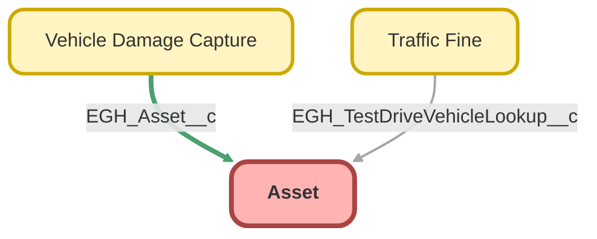

---
hide:
  - path
---

<!-- This file is auto-generated. if you do not want it to be overwritten, set TRUE in the line below -->
<!-- DO_NOT_OVERWRITE_DOC=FALSE -->

## Schema

<!-- Object description -->

## Fields

| Name      | Label | Type | Description |
| :-------- | :---- | :--: | :---------- | 
| AccountId |  | Lookup | undefined |
| Address |  |  | undefined |
| AssetLevel |  |  | undefined |
| AssetProvidedById |  | Lookup | undefined |
| AssetServicedById |  | Lookup | undefined |
| ConsequenceOfFailure |  | Picklist | undefined |
| ContactId |  | Lookup | undefined |
| CurrentQuantityUnitId |  | Lookup | undefined |
| Description |  |  | undefined |
| DigitalAssetStatus |  | Picklist | undefined |
| EGH_Brand__c | Brand | Picklist | undefined |
| EGH_CRMExternalId__c | CRM External ID | Text | undefined |
| ExternalIdentifier |  |  | undefined |
| InstallDate |  |  | undefined |
| IsCompetitorProduct |  |  | undefined |
| IsInternal |  |  | undefined |
| IsRecallOpen |  |  | undefined |
| LocationId |  | Lookup | undefined |
| ManufactureDate |  |  | undefined |
| Name |  |  | undefined |
| OwnerId |  | Lookup | undefined |
| ParentId |  | Lookup | undefined |
| Price |  |  | undefined |
| Product2Id |  | Lookup | undefined |
| ProductCode |  |  | undefined |
| ProductDescription |  |  | undefined |
| ProductFamily |  | Picklist | undefined |
| PurchaseDate |  |  | undefined |
| Quantity |  |  | undefined |
| RootAssetId |  | Lookup | undefined |
| SerialNumber |  |  | undefined |
| Status |  | Picklist | undefined |
| StatusReason |  | Picklist | undefined |
| StockKeepingUnit |  |  | undefined |
| UsageEndDate |  |  | undefined |
| Uuid |  |  | undefined |
| VehicleId |  | Lookup | undefined |

## Related Flows

| Object | Name      | Type | Description |
| :----  | :-------- | :--: | :---------- | 
| Asset | [EGH_Asset_Update_External_ID](../flows/EGH_Asset_Update_External_ID.md) |  Record After Save | <!-- --> |
| ServiceAppointment | [EGH_Update_Time_In_Description](../flows/EGH_Update_Time_In_Description.md) |  Record After Save | This flow is triggered when the Service Appointment’s Arrival Window Start or End time is changed. It uses an Apex action to format the date and time in the user’s timezone, then updates the Description field with the Date, Time, and Timezone in the correct format. |

## Related Apex Classes

| Apex Class | Type |
| :----      | :--: | 
| [EGHTestDriveTimelineControllerTest](../apex/EGHTestDriveTimelineControllerTest.md) | Test |
| [EGH_AssignedResourceInspectTriggerTest](../apex/EGH_AssignedResourceInspectTriggerTest.md) | Test |
| [EGH_AssignedResourceTriggerTest](../apex/EGH_AssignedResourceTriggerTest.md) | Test |
| [EGH_DamageCaptureController](../apex/EGH_DamageCaptureController.md) | Lightning Controller |
| [EGH_DamageCaptureController_Test](../apex/EGH_DamageCaptureController_Test.md) | Test |
| [EGH_RestTests](../apex/EGH_RestTests.md) | Test |
| [EGH_ServiceAppointmentUpdateVDCTest](../apex/EGH_ServiceAppointmentUpdateVDCTest.md) | Test |
| [EGH_TestDriveSlotFinder](../apex/EGH_TestDriveSlotFinder.md) | Lightning Controller |
| [EGH_AssignedResourceInspectionTrigger](../apex/EGH_AssignedResourceInspectionTrigger.md) | Class |

## Related Lightning Pages

| Lightning Page | Type |
| :----      | :--: | 
| [Asset_Record_Page](../pages/Asset_Record_Page.md) |  Record Page |
| [EGH_FleetAccountLightningPage](../pages/EGH_FleetAccountLightningPage.md) |  Record Page |
| [EGH_VehicleLightningRecordPage](../pages/EGH_VehicleLightningRecordPage.md) |  Record Page |
| [EGH_Vehicle_Damage_Capture_Record_Page](../pages/EGH_Vehicle_Damage_Capture_Record_Page.md) |  Record Page |

## Related Profiles

| Profile | User License |
| :----      | :--: | 
| [Admin](../profiles/Admin.md) |  Salesforce |
| [EGH Minimum Access Profile](../profiles/EGH%20Minimum%20Access%20Profile.md) |  Salesforce |
| [EGH Sales Profile](../profiles/EGH%20Sales%20Profile.md) |  Salesforce |
| [EGH Service Profile](../profiles/EGH%20Service%20Profile.md) |  Salesforce |

## Related Permission Sets

| Permission Set | User License |
| :----      | :--: | 
| [EGH_Contact_Center_PS](../permissionsets/EGH_Contact_Center_PS.md) | None |
| [EGH_Core_Integration_Permission_Set](../permissionsets/EGH_Core_Integration_Permission_Set.md) | None |
| [EGH_Core_Permission](../permissionsets/EGH_Core_Permission.md) | None |
| [EGH_Digital_Sales_Consultant_Omni_Channel](../permissionsets/EGH_Digital_Sales_Consultant_Omni_Channel.md) | None |
| [EGH_Fleet_Consultant](../permissionsets/EGH_Fleet_Consultant.md) | None |
| [EGH_Lease_Consultant](../permissionsets/EGH_Lease_Consultant.md) | None |
| [EGH_Meet_and_Greet_Application](../permissionsets/EGH_Meet_and_Greet_Application.md) | None |
| [EGH_ModifyServiceAppointmentsPermissionSet](../permissionsets/EGH_ModifyServiceAppointmentsPermissionSet.md) | None |
| [EGH_Product_Genius](../permissionsets/EGH_Product_Genius.md) | None |
| [EGH_QA_and_Data_Analyst_PS](../permissionsets/EGH_QA_and_Data_Analyst_PS.md) | None |
| [EGH_Sales_Consultant_Omni_Channel](../permissionsets/EGH_Sales_Consultant_Omni_Channel.md) | None |
| [EGH_Service_Consultants_PS](../permissionsets/EGH_Service_Consultants_PS.md) | None |
| [EGH_SystemAdminPermissionSet](../permissionsets/EGH_SystemAdminPermissionSet.md) | None |
| [EGH_Test_Drive_Admin](../permissionsets/EGH_Test_Drive_Admin.md) | None |
| [EGH_Test_Drive_Team](../permissionsets/EGH_Test_Drive_Team.md) | None |

_Documentation generated with [sfdx-hardis](https://sfdx-hardis.cloudity.com), by [Cloudity](https://www.cloudity.com/) & [friends](https://github.com/hardisgroupcom/sfdx-hardis/graphs/contributors)_
