---
hide:
  - path
---

<!-- This file is auto-generated. if you do not want it to be overwritten, set TRUE in the line below -->
<!-- DO_NOT_OVERWRITE_DOC=FALSE -->

## Schema

```mermaid
graph TD
AssetTitleParty["AssetTitleParty"]:::mainObject
click AssetTitleParty "/objects/AssetTitleParty/"


classDef object fill:#D6E9FF,stroke:#0070D2,stroke-width:3px,rx:12px,ry:12px,shadow:drop,color:#333;
classDef customObject fill:#FFF4C2,stroke:#CCAA00,stroke-width:3px,rx:12px,ry:12px,shadow:drop,color:#333;
classDef customObjectManaged fill:#FFD8B2,stroke:#CC5500,stroke-width:3px,rx:12px,ry:12px,shadow:drop,color:#333;
classDef mainObject fill:#FFB3B3,stroke:#A94442,stroke-width:4px,rx:14px,ry:14px,shadow:drop,color:#333,font-weight:bold;

```

<!-- Object description -->

## Fields

| Name      | Label | Type | Description |
| :-------- | :---- | :--: | :---------- | 
| EffectiveEndDate |  |  | undefined |
| EffectiveStartDate |  |  | undefined |
| IsActive |  |  | undefined |
| PartyAddressId |  | Lookup | undefined |
| PartyId |  | Lookup | undefined |
| PartyRole |  | Picklist | undefined |
| TitleId |  | MasterDetail | undefined |

## Related Permission Sets

| Permission Set | User License |
| :----      | :--: | 
| [EGH_QA_and_Data_Analyst_PS](../permissionsets/EGH_QA_and_Data_Analyst_PS.md) | None |
| [EGH_SystemAdminPermissionSet](../permissionsets/EGH_SystemAdminPermissionSet.md) | None |

_Documentation generated with [sfdx-hardis](https://sfdx-hardis.cloudity.com), by [Cloudity](https://www.cloudity.com/) & [friends](https://github.com/hardisgroupcom/sfdx-hardis/graphs/contributors)_
