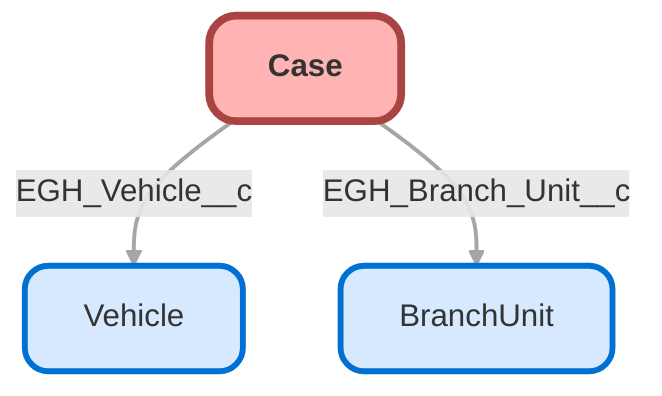

---
hide:
  - path
---

<!-- This file is auto-generated. if you do not want it to be overwritten, set TRUE in the line below -->
<!-- DO_NOT_OVERWRITE_DOC=FALSE -->

## Schema

<!-- Object description -->

## Fields

| Name      | Label | Type | Description |
| :-------- | :---- | :--: | :---------- | 
| AccountId |  | Lookup | undefined |
| AssetId |  | Lookup | undefined |
| BusinessHoursId |  | Lookup | undefined |
| Case_Age_Hours__c | Case Age Hours | Number | undefined |
| Case_Record_Type_Name__c | Case Record Type Name | Text | undefined |
| ClosedDate |  |  | undefined |
| Comments |  |  | undefined |
| ContactEmail |  |  | undefined |
| ContactFax |  |  | undefined |
| ContactId |  | Lookup | undefined |
| ContactMobile |  |  | undefined |
| ContactPhone |  |  | undefined |
| Description |  |  | undefined |
| EGH_Branch_Unit__c | Branch Unit | Lookup | undefined |
| EGH_Brand__c | Brand | Picklist | undefined |
| EGH_Case_SLACategory__c | Case Category | Picklist | undefined |
| EGH_Category__c | Category | Picklist | undefined |
| EGH_Chassis__c | Chassis | Text | undefined |
| EGH_Compensation_Offered__c | Compensation Offered | Text | undefined |
| EGH_Department__c | Department | Picklist | undefined |
| EGH_Description__c | EGH Description | TextArea | undefined |
| EGH_Disciplinary_Action_Required__c | Disciplinary Action Required | Checkbox | undefined |
| EGH_Final_Resolution__c | Final Resolution | LongTextArea | undefined |
| EGH_Is_Reopened__c | Is Reopened | Checkbox | undefined |
| EGH_IsOwnerSameAsLoggedIn__c | EGH_IsOwnerSameAsLoggedIn | Checkbox | undefined |
| EGH_IsReportingManager__c | EGH IsReportingManager | Checkbox | undefined |
| EGH_L0_Name_Code__c | L0 Name Code | Text | Id for internal non-SF User |
| EGH_L1_Email__c | L1 Email | Email | undefined |
| EGH_L2_Email__c | L2 Email | Email | undefined |
| EGH_L3_Email__c | L3 Email | Email | undefined |
| EGH_Mileage__c | Mileage | Number | undefined |
| EGH_Model__c | Model | Text | undefined |
| EGH_Open_Int_Req_Count__c | Open Int Req Count | Number | undefined |
| EGH_Page_URL__c | Page URL | LongTextArea | undefined |
| EGH_Resolution_Details__c | Resolution Details | LongTextArea | undefined |
| EGH_Send_Case_Closure_Survey__c | Send Case Closure Survey | Checkbox | undefined |
| EGH_SendSurvey__c | Send Survey | Picklist | undefined |
| EGH_Source__c | Source | Picklist | undefined |
| EGH_Vehicle__c | Vehicle | Lookup | undefined |
| EGH_VIN__c | VIN | Text | undefined |
| EntitlementId |  | Lookup | undefined |
| IsClosedOnCreate |  |  | undefined |
| IsEscalated |  |  | undefined |
| IsStopped |  |  | undefined |
| Language |  |  | undefined |
| LaunchMilestoneWarning__c | Launch Milestone Warning | Checkbox | Internal use, flag to indicate a warning need to be sent for this case. |
| MilestoneStatus |  |  | undefined |
| MilestoneStatusIcon |  |  | undefined |
| MilestoneTimer |  |  | undefined |
| Origin |  | Picklist | undefined |
| OwnerId |  | Lookup | undefined |
| ParentId |  | Lookup | undefined |
| Priority |  | Picklist | undefined |
| ProductId |  | Lookup | undefined |
| Reason |  | Picklist | undefined |
| ServiceContractId |  | Lookup | undefined |
| SlaExitDate |  |  | undefined |
| SlaStartDate |  |  | undefined |
| SourceId |  | Lookup | undefined |
| Status |  | Picklist | undefined |
| StopStartDate |  |  | undefined |
| Subject |  |  | undefined |
| SuppliedCompany |  |  | undefined |
| SuppliedEmail |  |  | undefined |
| SuppliedName |  |  | undefined |
| SuppliedPhone |  |  | undefined |
| Survey_sent__c | Survey sent | Checkbox | undefined |
| Type |  | Picklist | undefined |

## Validation Rules

| Rule      | Active | Description | Formula |
| :-------- | :---- | :---------- | :------ |
| EGH_BlockBackwardCaseStatusChange | Yes | Prevents moving the Status backward by enforcing a forward-only progression.
If new Status values are added or reordered, this validation rule must be updated accordingly. | AND(     ISCHANGED(Status),     CASE(Status,          "New", 1,          "Investigation", 2,          "In Progress", 3,          "Closed", 4,          0     )      <      CASE(PRIORVALUE(Status),          "New", 1,          "Investigation", 2,          "In Progress", 3,          "Closed", 4,          0     ) ) |
| EGH_PreventCloseIfOpenChildCases | Yes | Prevents closing a Case unless all child cases are closed. | AND( ISCHANGED(Status), ISPICKVAL(Status, "Closed"), EGH_Open_Int_Req_Count__c > 0  ) |
| EGH_RestrictCaseClosureForOwners | Yes |  | AND( ISCHANGED(Status), ISPICKVAL(Status, "Closed"), $User.Id <> OwnerId, $User.Id <> Owner:User.ManagerId, OR( RecordType.DeveloperName = "EGH_Complaint", RecordType.DeveloperName = "EGH_Feedback" ) ) |

## Related Flows

| Object | Name      | Type | Description |
| :----  | :-------- | :--: | :---------- | 
| 💻 | [EGH_Auto_Complete_Milestonnes](../flows/EGH_Auto_Complete_Milestonnes.md) |  Auto Launched Flow | <!-- --> |
| 💻 | [EGH_Case_Action_Notification_After_4_Hour](../flows/EGH_Case_Action_Notification_After_4_Hour.md) |  Auto Launched Flow | <!-- --> |
| 💻 | [EGH_Case_Notification_After_5_Hour](../flows/EGH_Case_Notification_After_5_Hour.md) |  Auto Launched Flow | <!-- --> |
| 💻 | [EGH_Create_Internal_Escalation_Case](../flows/EGH_Create_Internal_Escalation_Case.md) |  Screen Flow | <!-- --> |
| 💻 | [Send_Email_Warning](../flows/Send_Email_Warning.md) |  Auto Launched Flow | Send Email Warning |
| 💻 | [dm_031f5a5b_98ab_4c69_8692_7628437bbb5b](../flows/dm_031f5a5b_98ab_4c69_8692_7628437bbb5b.md) |  Survey Enrich | <!-- --> |
| 💻 | [dm_266cd062_188e_478b_b6e1_00b3901d4b47](../flows/dm_266cd062_188e_478b_b6e1_00b3901d4b47.md) |  Survey Enrich | <!-- --> |
| 💻 | [dm_85a98cc6_9c17_438f_a935_95eaec532f08](../flows/dm_85a98cc6_9c17_438f_a935_95eaec532f08.md) |  Survey Enrich | <!-- --> |
| 💻 | [dm_e8fe1326_4176_4006_bebf_018153a1f0ac](../flows/dm_e8fe1326_4176_4006_bebf_018153a1f0ac.md) |  Survey Enrich | <!-- --> |
| AgentWork | [EGH_Update_Case_Status_to_In_Progress](../flows/EGH_Update_Case_Status_to_In_Progress.md) |  Record After Save | <!-- --> |
| Case | [EGH_Auto_Complete_Case_Milestones](../flows/EGH_Auto_Complete_Case_Milestones.md) |  Record After Save | <!-- --> |
| Case | [EGH_Close_Main_Case_When_All_Internal_Cases_Are_Closed](../flows/EGH_Close_Main_Case_When_All_Internal_Cases_Are_Closed.md) |  Record After Save | <!-- --> |
| Case | [EGH_Consumer_Body_Email_Case_Updates](../flows/EGH_Consumer_Body_Email_Case_Updates.md) |  Record Before Save | <!-- --> |
| Case | [EGH_Update_Case_Description_for_Knowledge_Article_Matching](../flows/EGH_Update_Case_Description_for_Knowledge_Article_Matching.md) |  Record Before Save | <!-- --> |
| Case | [egh_Auto_Assign_Entitlement_Flow](../flows/egh_Auto_Assign_Entitlement_Flow.md) |  Record After Save | <!-- --> |
| SurveyInvitation | [EGH_CaseCreateFeedbackCaseForPoorScoreSurveys](../flows/EGH_CaseCreateFeedbackCaseForPoorScoreSurveys.md) |  Record After Save | Create Feedback Case For Poor Score Surveys using Platform Event. Update Reason Code and Category. |

## Related Apex Classes

| Apex Class | Type |
| :----      | :--: | 
| [EGH_TestDriveSlotFinder](../apex/EGH_TestDriveSlotFinder.md) | Lightning Controller |
| [EGH_UpdateVisitStartEndTime](../apex/EGH_UpdateVisitStartEndTime.md) | Lightning Controller |
| [StatusSyncManager](../apex/StatusSyncManager.md) | Class |
| [ers_DatatableController](../apex/ers_DatatableController.md) | Lightning Controller |
| [ers_DatatableControllerTest](../apex/ers_DatatableControllerTest.md) | Test |

## Related Lightning Pages

| Lightning Page | Type |
| :----      | :--: | 
| [EGH_AppraisalLightningPage](../pages/EGH_AppraisalLightningPage.md) |  Record Page |
| [EGH_Case_Record_Page](../pages/EGH_Case_Record_Page.md) |  Record Page |
| [EGH_FleetAccountLightningPage](../pages/EGH_FleetAccountLightningPage.md) |  Record Page |
| [EGH_PersonAccountLightningPage](../pages/EGH_PersonAccountLightningPage.md) |  Record Page |
| [EGH_VehicleLightningRecordPage](../pages/EGH_VehicleLightningRecordPage.md) |  Record Page |
| [Interaction](../pages/Interaction.md) |  Record Page |

## Related Profiles

| Profile | User License |
| :----      | :--: | 
| [Admin](../profiles/Admin.md) |  Salesforce |
| [EGH Minimum Access Profile](../profiles/EGH%20Minimum%20Access%20Profile.md) |  Salesforce |
| [EGH Sales Profile](../profiles/EGH%20Sales%20Profile.md) |  Salesforce |
| [EGH Service Profile](../profiles/EGH%20Service%20Profile.md) |  Salesforce |

## Related Permission Sets

| Permission Set | User License |
| :----      | :--: | 
| [EGH_Apex_Classes](../permissionsets/EGH_Apex_Classes.md) | None |
| [EGH_Contact_Center_PS](../permissionsets/EGH_Contact_Center_PS.md) | None |
| [EGH_Core_Integration_Permission_Set](../permissionsets/EGH_Core_Integration_Permission_Set.md) | None |
| [EGH_Core_Permission](../permissionsets/EGH_Core_Permission.md) | None |
| [EGH_Digital_Sales_Consultant_Omni_Channel](../permissionsets/EGH_Digital_Sales_Consultant_Omni_Channel.md) | None |
| [EGH_F_I_OmniChannel](../permissionsets/EGH_F_I_OmniChannel.md) | None |
| [EGH_FeedbackManagementAdvancedPermissionSet](../permissionsets/EGH_FeedbackManagementAdvancedPermissionSet.md) | None |
| [EGH_Fleet_Consultant](../permissionsets/EGH_Fleet_Consultant.md) | None |
| [EGH_Knowledge_Admin](../permissionsets/EGH_Knowledge_Admin.md) | None |
| [EGH_Lease_Consultant](../permissionsets/EGH_Lease_Consultant.md) | None |
| [EGH_Meet_and_Greet_Application](../permissionsets/EGH_Meet_and_Greet_Application.md) | None |
| [EGH_ModifyServiceAppointmentsPermissionSet](../permissionsets/EGH_ModifyServiceAppointmentsPermissionSet.md) | None |
| [EGH_Product_Genius_Admin](../permissionsets/EGH_Product_Genius_Admin.md) | None |
| [EGH_Product_Genius](../permissionsets/EGH_Product_Genius.md) | None |
| [EGH_QA_and_Data_Analyst_PS](../permissionsets/EGH_QA_and_Data_Analyst_PS.md) | None |
| [EGH_Sales_Consultant_Omni_Channel](../permissionsets/EGH_Sales_Consultant_Omni_Channel.md) | None |
| [EGH_Sales_Team_Leader_PS](../permissionsets/EGH_Sales_Team_Leader_PS.md) | None |
| [EGH_Service_Consultants_PS](../permissionsets/EGH_Service_Consultants_PS.md) | None |
| [EGH_Service_Team_Leader_PS](../permissionsets/EGH_Service_Team_Leader_PS.md) | None |
| [EGH_SystemAdminPermissionSet](../permissionsets/EGH_SystemAdminPermissionSet.md) | None |
| [EGH_Test_Drive_Team](../permissionsets/EGH_Test_Drive_Team.md) | None |

_Documentation generated with [sfdx-hardis](https://sfdx-hardis.cloudity.com), by [Cloudity](https://www.cloudity.com/) & [friends](https://github.com/hardisgroupcom/sfdx-hardis/graphs/contributors)_
