---
hide:
  - path
---

<!-- This file is auto-generated. if you do not want it to be overwritten, set TRUE in the line below -->
<!-- DO_NOT_OVERWRITE_DOC=FALSE -->

## Schema

```mermaid
graph TD
CodeSetBundle["CodeSetBundle"]:::mainObject
click CodeSetBundle "/objects/CodeSetBundle/"


classDef object fill:#D6E9FF,stroke:#0070D2,stroke-width:3px,rx:12px,ry:12px,shadow:drop,color:#333;
classDef customObject fill:#FFF4C2,stroke:#CCAA00,stroke-width:3px,rx:12px,ry:12px,shadow:drop,color:#333;
classDef customObjectManaged fill:#FFD8B2,stroke:#CC5500,stroke-width:3px,rx:12px,ry:12px,shadow:drop,color:#333;
classDef mainObject fill:#FFB3B3,stroke:#A94442,stroke-width:4px,rx:14px,ry:14px,shadow:drop,color:#333,font-weight:bold;

```

<!-- Object description -->

## Fields

| Name      | Label | Type | Description |
| :-------- | :---- | :--: | :---------- | 
| CodeSet10Id |  | Lookup | undefined |
| CodeSet11Id |  | Lookup | undefined |
| CodeSet12Id |  | Lookup | undefined |
| CodeSet13Id |  | Lookup | undefined |
| CodeSet14Id |  | Lookup | undefined |
| CodeSet15Id |  | Lookup | undefined |
| CodeSet1Id |  | Lookup | undefined |
| CodeSet2Id |  | Lookup | undefined |
| CodeSet3Id |  | Lookup | undefined |
| CodeSet4Id |  | Lookup | undefined |
| CodeSet5Id |  | Lookup | undefined |
| CodeSet6Id |  | Lookup | undefined |
| CodeSet7Id |  | Lookup | undefined |
| CodeSet8Id |  | Lookup | undefined |
| CodeSet9Id |  | Lookup | undefined |
| CodeSetBundleKey |  |  | undefined |
| Name |  |  | undefined |
| OwnerId |  | Lookup | undefined |
| Type |  | Picklist | undefined |

## Related Permission Sets

| Permission Set | User License |
| :----      | :--: | 
| [EGH_SystemAdminPermissionSet](../permissionsets/EGH_SystemAdminPermissionSet.md) | None |

_Documentation generated with [sfdx-hardis](https://sfdx-hardis.cloudity.com), by [Cloudity](https://www.cloudity.com/) & [friends](https://github.com/hardisgroupcom/sfdx-hardis/graphs/contributors)_
