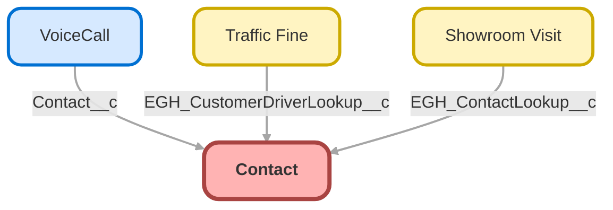

---
hide:
  - path
---

<!-- This file is auto-generated. if you do not want it to be overwritten, set TRUE in the line below -->
<!-- DO_NOT_OVERWRITE_DOC=FALSE -->

## Schema

<!-- Object description -->

## Fields

| Name      | Label | Type | Description |
| :-------- | :---- | :--: | :---------- | 
| AccountId |  | Lookup | undefined |
| AssistantName |  |  | undefined |
| AssistantPhone |  |  | undefined |
| Birthdate |  |  | undefined |
| BuyerAttributes |  | Picklist | undefined |
| ContactSource |  |  | undefined |
| Department |  |  | undefined |
| DepartmentGroup |  |  | undefined |
| Description |  |  | undefined |
| DoNotCall |  |  | undefined |
| EGH_ContactLanguagePicklist__c | Language | Picklist | Contact preferred language |
| EGH_ContactNationalityPicklist__c | Nationality | Picklist | Nationality of the Contact or Customer |
| EGH_ExternalIDText__c | External ID | Text | External ID for the Contact (Id in the external system) |
| Email |  |  | undefined |
| Fax |  |  | undefined |
| GenderIdentity |  | Picklist | undefined |
| HasOptedOutOfEmail |  |  | undefined |
| HasOptedOutOfFax |  |  | undefined |
| HomePhone |  |  | undefined |
| IndividualId |  | Lookup | undefined |
| Jigsaw |  |  | undefined |
| LastCURequestDate |  |  | undefined |
| LastCUUpdateDate |  |  | undefined |
| LeadSource |  | Picklist | undefined |
| MailingAddress |  |  | undefined |
| MobilePhone |  |  | undefined |
| Name |  |  | undefined |
| OtherAddress |  |  | undefined |
| OtherPhone |  |  | undefined |
| OwnerId |  | Lookup | undefined |
| Phone |  |  | undefined |
| Pronouns |  | Picklist | undefined |
| ReportsToId |  | Lookup | undefined |
| Title |  |  | undefined |
| TitleType |  |  | undefined |

## Validation Rules

| Rule      | Active | Description | Formula |
| :-------- | :---- | :---------- | :------ |
| EGH_Birthdate_Must_Be_In_Past | Yes | Prevents users from entering a birthdate that is in the future. | Birthdate > TODAY() |

## Related Flows

| Object | Name      | Type | Description |
| :----  | :-------- | :--: | :---------- | 
| Contact | [EGH_Contact_Mark_First_Contact_as_Primary](../flows/EGH_Contact_Mark_First_Contact_as_Primary.md) |  Record After Save | <!-- --> |
| genesysps__Experience__c | [get_related_record_experience](../flows/get_related_record_experience.md) |  Record After Save | Added the CurrentMenu to the Experience Layout and added a Formula To the flow to collect it from the MetaData |

## Related Apex Classes

| Apex Class | Type |
| :----      | :--: | 
| [EGH_LeadFindDuplicates](../apex/EGH_LeadFindDuplicates.md) | Invocable |
| [EGH_MeetGreetSearchControllerClass](../apex/EGH_MeetGreetSearchControllerClass.md) | Invocable |
| [MicrobatchSelfRegController](../apex/MicrobatchSelfRegController.md) | Visualforce Controller |
| [ers_DatatableControllerTest](../apex/ers_DatatableControllerTest.md) | Test |

## Related Lightning Pages

| Lightning Page | Type |
| :----      | :--: | 
| [Asset_Record_Page](../pages/Asset_Record_Page.md) |  Record Page |
| [EGH_AppraisalLightningPage](../pages/EGH_AppraisalLightningPage.md) |  Record Page |
| [EGH_Case_Record_Page](../pages/EGH_Case_Record_Page.md) |  Record Page |
| [EGH_FleetAccountLightningPage](../pages/EGH_FleetAccountLightningPage.md) |  Record Page |
| [EGH_LeadLightningPage](../pages/EGH_LeadLightningPage.md) |  Record Page |
| [EGH_PersonAccountLightningPage](../pages/EGH_PersonAccountLightningPage.md) |  Record Page |
| [EGH_Service_Appointment_Lightning_Page](../pages/EGH_Service_Appointment_Lightning_Page.md) |  Record Page |
| [EGH_Service_Appointment_SystemAdmin](../pages/EGH_Service_Appointment_SystemAdmin.md) |  Record Page |
| [EGH_Service_Console_UtilityBar](../pages/EGH_Service_Console_UtilityBar.md) |  Utility Bar |
| [EGH_VehicleLightningRecordPage](../pages/EGH_VehicleLightningRecordPage.md) |  Record Page |
| [Genesys_Experience_Layout](../pages/Genesys_Experience_Layout.md) |  Record Page |
| [LightningService_UtilityBar](../pages/LightningService_UtilityBar.md) |  Utility Bar |
| [Service_Appointment_Record_Page1](../pages/Service_Appointment_Record_Page1.md) |  Record Page |

## Related Profiles

| Profile | User License |
| :----      | :--: | 
| [Admin](../profiles/Admin.md) |  Salesforce |
| [EGH Minimum Access Profile](../profiles/EGH%20Minimum%20Access%20Profile.md) |  Salesforce |
| [EGH Sales Profile](../profiles/EGH%20Sales%20Profile.md) |  Salesforce |
| [EGH Service Profile](../profiles/EGH%20Service%20Profile.md) |  Salesforce |

## Related Permission Sets

| Permission Set | User License |
| :----      | :--: | 
| [EGH_Contact_Center_PS](../permissionsets/EGH_Contact_Center_PS.md) | None |
| [EGH_Core_Integration_Permission_Set](../permissionsets/EGH_Core_Integration_Permission_Set.md) | None |
| [EGH_Core_Permission](../permissionsets/EGH_Core_Permission.md) | None |
| [EGH_Digital_Sales_Consultant_Omni_Channel](../permissionsets/EGH_Digital_Sales_Consultant_Omni_Channel.md) | None |
| [EGH_Fleet_Consultant](../permissionsets/EGH_Fleet_Consultant.md) | None |
| [EGH_Lease_Consultant](../permissionsets/EGH_Lease_Consultant.md) | None |
| [EGH_Meet_and_Greet_Application](../permissionsets/EGH_Meet_and_Greet_Application.md) | None |
| [EGH_ModifyServiceAppointmentsPermissionSet](../permissionsets/EGH_ModifyServiceAppointmentsPermissionSet.md) | None |
| [EGH_Product_Genius_Admin](../permissionsets/EGH_Product_Genius_Admin.md) | None |
| [EGH_Product_Genius](../permissionsets/EGH_Product_Genius.md) | None |
| [EGH_QA_and_Data_Analyst_PS](../permissionsets/EGH_QA_and_Data_Analyst_PS.md) | None |
| [EGH_Sales_Consultant_Omni_Channel](../permissionsets/EGH_Sales_Consultant_Omni_Channel.md) | None |
| [EGH_SalesforceSchedulerResourcesPermissionSet](../permissionsets/EGH_SalesforceSchedulerResourcesPermissionSet.md) | None |
| [EGH_Service_Consultants_PS](../permissionsets/EGH_Service_Consultants_PS.md) | None |
| [EGH_SystemAdminPermissionSet](../permissionsets/EGH_SystemAdminPermissionSet.md) | None |
| [EGH_Test_Drive_Team](../permissionsets/EGH_Test_Drive_Team.md) | None |
| [PS_Genesys_Integration](../permissionsets/PS_Genesys_Integration.md) | None |
| [PS_Genesys_Permissions](../permissionsets/PS_Genesys_Permissions.md) | None |
| [Test](../permissionsets/Test.md) | None |

_Documentation generated with [sfdx-hardis](https://sfdx-hardis.cloudity.com), by [Cloudity](https://www.cloudity.com/) & [friends](https://github.com/hardisgroupcom/sfdx-hardis/graphs/contributors)_
