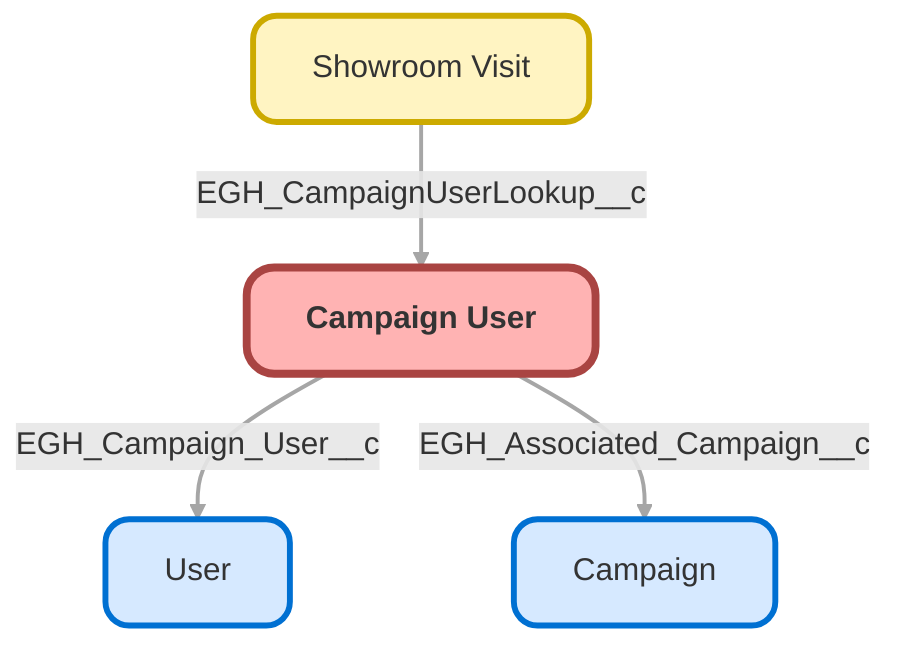

---
hide:
  - path
---

<!-- This file is auto-generated. if you do not want it to be overwritten, set TRUE in the line below -->
<!-- DO_NOT_OVERWRITE_DOC=FALSE -->

## Schema

<!-- Object description -->

## Fields

| Name      | Label | Type | Description |
| :-------- | :---- | :--: | :---------- | 
| Campaign_Start_Date_Time__c | Campaign Start Date Time | DateTime | undefined |
| EGH_Associated_Campaign__c | Associated Campaign | Lookup | undefined |
| EGH_Campaign_End_Date_Time__c | Campaign End Date Time | DateTime | undefined |
| EGH_Campaign_User__c | Campaign User | Lookup | undefined |

## Related Flows

| Object | Name      | Type | Description |
| :----  | :-------- | :--: | :---------- | 
| 💻 | [EGH_Product_Genius](../flows/EGH_Product_Genius.md) |  Screen Flow | Flow for Product Genius Application |
| EGH_Campaign_User__c | [EGH_Campaign_User_Entry_Check_Flow](../flows/EGH_Campaign_User_Entry_Check_Flow.md) |  Record Before Save | This flow checks if there ia already a User associated with the campaign then he should not be associated with another campaign |
| Lead | [EGH_Insert_Lead_as_Campaign_Member](../flows/EGH_Insert_Lead_as_Campaign_Member.md) |  Record After Save | <!-- --> |

## Related Lightning Pages

| Lightning Page | Type |
| :----      | :--: | 
| [EGH_Campaign_User](../pages/EGH_Campaign_User.md) |  Record Page |

## Related Profiles

| Profile | User License |
| :----      | :--: | 
| [Admin](../profiles/Admin.md) |  Salesforce |
| [EGH Minimum Access Profile](../profiles/EGH%20Minimum%20Access%20Profile.md) |  Salesforce |
| [EGH Sales Profile](../profiles/EGH%20Sales%20Profile.md) |  Salesforce |
| [EGH Service Profile](../profiles/EGH%20Service%20Profile.md) |  Salesforce |

## Related Permission Sets

| Permission Set | User License |
| :----      | :--: | 
| [EGH_Digital_Sales_Consultant_Omni_Channel](../permissionsets/EGH_Digital_Sales_Consultant_Omni_Channel.md) | None |
| [EGH_Fleet_Consultant](../permissionsets/EGH_Fleet_Consultant.md) | None |
| [EGH_Lease_Consultant](../permissionsets/EGH_Lease_Consultant.md) | None |
| [EGH_Meet_and_Greet_Application](../permissionsets/EGH_Meet_and_Greet_Application.md) | None |
| [EGH_Product_Genius_Admin](../permissionsets/EGH_Product_Genius_Admin.md) | None |
| [EGH_Product_Genius](../permissionsets/EGH_Product_Genius.md) | None |
| [EGH_QA_and_Data_Analyst_PS](../permissionsets/EGH_QA_and_Data_Analyst_PS.md) | None |
| [EGH_Sales_Consultant_Omni_Channel](../permissionsets/EGH_Sales_Consultant_Omni_Channel.md) | None |
| [EGH_SystemAdminPermissionSet](../permissionsets/EGH_SystemAdminPermissionSet.md) | None |

_Documentation generated with [sfdx-hardis](https://sfdx-hardis.cloudity.com), by [Cloudity](https://www.cloudity.com/) & [friends](https://github.com/hardisgroupcom/sfdx-hardis/graphs/contributors)_
