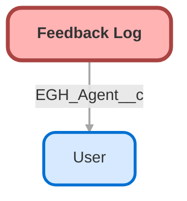

---
hide:
  - path
---

<!-- This file is auto-generated. if you do not want it to be overwritten, set TRUE in the line below -->
<!-- DO_NOT_OVERWRITE_DOC=FALSE -->

## Schema

<!-- Object description -->

## Fields

| Name      | Label | Type | Description |
| :-------- | :---- | :--: | :---------- | 
| EGH_Agent__c | Agent | Lookup | undefined |
| EGH_Bot_Handled__c | Bot Handled | Checkbox | undefined |
| EGH_Brand__c | Brand | Picklist | undefined |
| EGH_Channel__c | Channel | Text | undefined |
| EGH_Conversation_ID__c | Conversation ID | Text | undefined |
| EGH_CSAT_Scoring__c | CSAT Scoring | Picklist | undefined |
| EGH_Current_Menu__c | Current Menu | LongTextArea | undefined |
| EGH_Customer_Phone__c | Customer Phone | Phone | undefined |
| EGH_Language__c | Language | Picklist | undefined |

## Related Profiles

| Profile | User License |
| :----      | :--: | 
| [Admin](../profiles/Admin.md) |  Salesforce |
| [EGH Minimum Access Profile](../profiles/EGH%20Minimum%20Access%20Profile.md) |  Salesforce |
| [EGH Sales Profile](../profiles/EGH%20Sales%20Profile.md) |  Salesforce |
| [EGH Service Profile](../profiles/EGH%20Service%20Profile.md) |  Salesforce |

## Related Permission Sets

| Permission Set | User License |
| :----      | :--: | 
| [EGH_Contact_Center_PS](../permissionsets/EGH_Contact_Center_PS.md) | None |
| [EGH_Core_Integration_Permission_Set](../permissionsets/EGH_Core_Integration_Permission_Set.md) | None |
| [EGH_Core_Permission](../permissionsets/EGH_Core_Permission.md) | None |
| [EGH_Service_Consultants_PS](../permissionsets/EGH_Service_Consultants_PS.md) | None |
| [EGH_SystemAdminPermissionSet](../permissionsets/EGH_SystemAdminPermissionSet.md) | None |

_Documentation generated with [sfdx-hardis](https://sfdx-hardis.cloudity.com), by [Cloudity](https://www.cloudity.com/) & [friends](https://github.com/hardisgroupcom/sfdx-hardis/graphs/contributors)_
