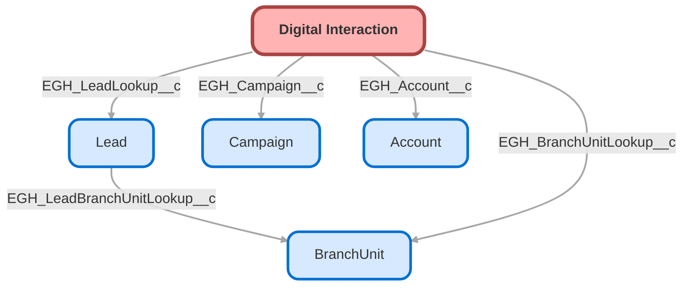

---
hide:
  - path
---

<!-- This file is auto-generated. if you do not want it to be overwritten, set TRUE in the line below -->
<!-- DO_NOT_OVERWRITE_DOC=FALSE -->

## Schema

<!-- Object description -->

## Fields

| Name      | Label | Type | Description |
| :-------- | :---- | :--: | :---------- | 
| EGH_Account__c | Account | Lookup | Connects this interaction to the related Account |
| EGH_BranchUnitLookup__c | Branch Unit | Lookup | Branch selected on the Digital channel |
| EGH_BrandPicklist__c | Brand | Picklist | Brand involved in the interaction |
| EGH_Campaign__c | Campaign | Lookup | Campaign the interaction is related to |
| EGH_ChannelPicklist__c | Channel | Picklist | Source channel, e.g., WhatsApp, Instagram |
| EGH_DirectionPicklist__c | Direction | Picklist | Inbound or Outbound message |
| EGH_ExternalID__c | External ID | Text | ID from external system |
| EGH_InteractionDateTime__c | Interaction Date | DateTime | When the interaction occurred |
| EGH_JourneyNameText__c | Journey Name | Text | Name of the marketing or sales journey |
| EGH_LeadLookup__c | Lead | Lookup | Relationship with the Lead that the Interaction is related to |
| EGH_MessageContextRichText__c | Message Context | Html | Body of the message |
| EGH_ModelOfInterestPicklist__c | Model Of Interest | Picklist | Car model the Lead is interested in |
| EGH_RequestTypePicklist__c | Request Type | Picklist | Request Type |
| EGH_StatusPicklist__c | Status | Picklist | Field to reflect if the interaction have been responded by some agent |
| EGH_UTMCampaignContentText__c | UTM Marketing Campaign Content | Text | UTM Parameter: Campaign Content |
| EGH_UTMCampaignMediumText__c | UTM Campaign Medium | Text | UTM Parameter: Campaign Medium |
| EGH_UTMCampaignSourcePicklist__c | UTM Marketing Campaign Source | Picklist | UTM Parameter: Campaign Source |
| EGH_UTMCaptureSourceLongText__c | UTM Capture Source | Text | UTM Parameter: Capture Source |
| EGH_UTMCreativeIdText__c | UTM Creative Id | Text | UTM Parameter: Creative Id |
| EGH_UTMDerivedLeadChannelFormula__c | UTM Derived Lead Channel | Text | Value calculated based on UTM parameters |
| EGH_UTMMarketingCampaignTermText__c | UTM Marketing Campaign Term | Text | UTM Parameter: Campaign Term |
| EGH_UTMMarketingCampaignTextArea__c | UTM Marketing Campaign | TextArea | Field to storage Marketing Campaign related with the interaction. Coming from integration. |
| EGH_UTMMarketingLeadChannelText__c | UTM Marketing Lead Channel | Text | UTM Parameter: Lead Channel |
| EGH_UTMOfferLinkURL__c | UTM Offer Link | Url | UTM Parameter: Offer Link URL |

## Related Flows

| Object | Name      | Type | Description |
| :----  | :-------- | :--: | :---------- | 
| EGH_Interaction__c | [EGH_Digital_Interaction_Link_Lead_With_Campaign](../flows/EGH_Digital_Interaction_Link_Lead_With_Campaign.md) |  Record After Save | <!-- --> |
| EGH_Interaction__c | [EGH_Digital_Interaction_Update_Lead_Latest_Interaction_Channel](../flows/EGH_Digital_Interaction_Update_Lead_Latest_Interaction_Channel.md) |  Record After Save | <!-- --> |
| Lead | [EGH_LeadFollowUpTaskCreation](../flows/EGH_LeadFollowUpTaskCreation.md) |  Record After Save | Creates Lead Follow up tasks after record ownership change from Queue. Add Attempt Number and Brand. |
| Lead | [EGH_Lead_Sales_Team_Account_Mapping](../flows/EGH_Lead_Sales_Team_Account_Mapping.md) |  Record After Save | <!-- --> |

## Related Lightning Pages

| Lightning Page | Type |
| :----      | :--: | 
| [Interaction](../pages/Interaction.md) |  Record Page |

## Related Profiles

| Profile | User License |
| :----      | :--: | 
| [Admin](../profiles/Admin.md) |  Salesforce |
| [EGH Minimum Access Profile](../profiles/EGH%20Minimum%20Access%20Profile.md) |  Salesforce |
| [EGH Sales Profile](../profiles/EGH%20Sales%20Profile.md) |  Salesforce |
| [EGH Service Profile](../profiles/EGH%20Service%20Profile.md) |  Salesforce |

## Related Permission Sets

| Permission Set | User License |
| :----      | :--: | 
| [EGH_Contact_Center_PS](../permissionsets/EGH_Contact_Center_PS.md) | None |
| [EGH_Core_Integration_Permission_Set](../permissionsets/EGH_Core_Integration_Permission_Set.md) | None |
| [EGH_Core_Permission](../permissionsets/EGH_Core_Permission.md) | None |
| [EGH_Digital_Sales_Consultant_Omni_Channel](../permissionsets/EGH_Digital_Sales_Consultant_Omni_Channel.md) | None |
| [EGH_Fleet_Consultant](../permissionsets/EGH_Fleet_Consultant.md) | None |
| [EGH_Lease_Consultant](../permissionsets/EGH_Lease_Consultant.md) | None |
| [EGH_Meet_and_Greet_Application](../permissionsets/EGH_Meet_and_Greet_Application.md) | None |
| [EGH_Product_Genius_Admin](../permissionsets/EGH_Product_Genius_Admin.md) | None |
| [EGH_Product_Genius](../permissionsets/EGH_Product_Genius.md) | None |
| [EGH_QA_and_Data_Analyst_PS](../permissionsets/EGH_QA_and_Data_Analyst_PS.md) | None |
| [EGH_Sales_Consultant_Omni_Channel](../permissionsets/EGH_Sales_Consultant_Omni_Channel.md) | None |
| [EGH_Service_Consultants_PS](../permissionsets/EGH_Service_Consultants_PS.md) | None |
| [EGH_SystemAdminPermissionSet](../permissionsets/EGH_SystemAdminPermissionSet.md) | None |

_Documentation generated with [sfdx-hardis](https://sfdx-hardis.cloudity.com), by [Cloudity](https://www.cloudity.com/) & [friends](https://github.com/hardisgroupcom/sfdx-hardis/graphs/contributors)_
