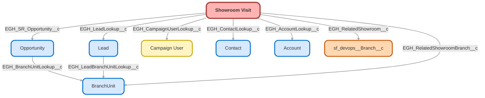

---
hide:
  - path
---

<!-- This file is auto-generated. if you do not want it to be overwritten, set TRUE in the line below -->
<!-- DO_NOT_OVERWRITE_DOC=FALSE -->

## Schema

<!-- Object description -->

## Fields

| Name      | Label | Type | Description |
| :-------- | :---- | :--: | :---------- | 
| EGH_AccountLookup__c | Account | Lookup | undefined |
| EGH_Brand__c | Brand | Picklist | undefined |
| EGH_CampaignUserLookup__c | Campaign User / Event | Lookup | Indicates the Campaign User that create this visit. This allows to track in what event the visit happened and who did it. |
| EGH_CommentsRichText__c | Comments | Html | undefined |
| EGH_ContactLookup__c | Contact | Lookup | undefined |
| EGH_EndDateTime__c | End Date | DateTime | undefined |
| EGH_Is_Assigned__c | Is Assigned | Checkbox | undefined |
| EGH_IsOwnerSameAsLoggedIn__c | EGH_IsOwnerSameAsLoggedIn | Checkbox | undefined |
| EGH_IsReportingManager__c | EGH IsReportingManager | Checkbox | undefined |
| EGH_LeadLookup__c | Lead | Lookup | Lead that is visiting the showroom |
| EGH_RelatedShowroom__c | Deprecated Related Showroom | Lookup | undefined |
| EGH_RelatedShowroomBranch__c | Related Showroom | Lookup | undefined |
| EGH_SR_Opportunity__c | Opportunity | Lookup | undefined |
| EGH_StartDateTime__c | Start Date | DateTime | This is the field used to stamp the date and time when the Sales consultant starts attending the customer. |
| EGH_Status__c | Status | Picklist | undefined |
| EGH_Vehicle_Of_Interest__c | Vehicle Of Interest | Picklist | undefined |
| EGH_Visit_Completed__c | Visit Completed | Checkbox | undefined |
| EGH_Visit_Started__c | Visit Started | Checkbox | undefined |
| Owner_Name__c | Owner Name | Text | undefined |
| PurposeVisit__c | Purpose Of The Visit | Picklist | undefined |
| Route_to_Sales__c | Route to Sales | Checkbox | This checkbox ensure that the leads are not routed to Sales Team if the lead is not interested in talking to the Sales Team |

## Related Flows

| Object | Name      | Type | Description |
| :----  | :-------- | :--: | :---------- | 
| 💻 | [EGH_Lead_Owner_information](../flows/EGH_Lead_Owner_information.md) |  Screen Flow | <!-- --> |
| 💻 | [EGH_Lead_Routing_SubFlow](../flows/EGH_Lead_Routing_SubFlow.md) |  Routing Flow | <!-- --> |
| 💻 | [EGH_MeetGreetTestFlow](../flows/EGH_MeetGreetTestFlow.md) |  Screen Flow | Test Flow for Meet&Greet Application. To use in discussion with Irshad |
| 💻 | [EGH_Product_Genius](../flows/EGH_Product_Genius.md) |  Screen Flow | Flow for Product Genius Application |
| AgentWork | [EGH_Create_Lead_Sales_Team](../flows/EGH_Create_Lead_Sales_Team.md) |  Record After Save | <!-- --> |
| EGH_ShowroomVisit__c | [EGH_LeadAndVisitShowroomAssignmentFlow](../flows/EGH_LeadAndVisitShowroomAssignmentFlow.md) |  Record After Save | Flow to assign a Lead to the appropriate Sales Consultant or the Team Leader based on Skills, Presence Status and previously assign Sales Consultant. Check if the purpose of the visit is Meet F&I Team. |
| EGH_ShowroomVisit__c | [EGH_Showroom_Visit_Populate_Contact](../flows/EGH_Showroom_Visit_Populate_Contact.md) |  Record Before Save | <!-- --> |
| EGH_ShowroomVisit__c | [EGH_Showroom_Visit_Reopen_Related_Lead](../flows/EGH_Showroom_Visit_Reopen_Related_Lead.md) |  Record After Save | This flow is reopening rejected leads when a new related visit is created |
| Lead | [EGH_Lead_Add_Sales_Consultant_to_Lead_Sales_Team](../flows/EGH_Lead_Add_Sales_Consultant_to_Lead_Sales_Team.md) |  Record After Save | <!-- --> |
| Lead | [EGH_Lead_Sales_Team_Account_Mapping](../flows/EGH_Lead_Sales_Team_Account_Mapping.md) |  Record After Save | <!-- --> |

## Related Apex Classes

| Apex Class | Type |
| :----      | :--: | 
| [EGHResourceTimelineController](../apex/EGHResourceTimelineController.md) | Lightning Controller |
| [EGHResourceTimelineControllerTest](../apex/EGHResourceTimelineControllerTest.md) | Test |
| [EGH_OpportunityScoringController](../apex/EGH_OpportunityScoringController.md) | Lightning Controller |
| [EGH_UpdateVisitStartEndTime](../apex/EGH_UpdateVisitStartEndTime.md) | Lightning Controller |
| [EGH_UpdateVisitStartEndTime_Test](../apex/EGH_UpdateVisitStartEndTime_Test.md) | Test |
| [EGH_UpdateVisitTimeAndStatus](../apex/EGH_UpdateVisitTimeAndStatus.md) | Lightning Controller |
| [EGH_getPresenceStatusIdClassTest](../apex/EGH_getPresenceStatusIdClassTest.md) | Test (See All Data) |

## Related Lightning Pages

| Lightning Page | Type |
| :----      | :--: | 
| [EGH_Showroom_Visit_Record_Page](../pages/EGH_Showroom_Visit_Record_Page.md) |  Record Page |

## Related Profiles

| Profile | User License |
| :----      | :--: | 
| [Admin](../profiles/Admin.md) |  Salesforce |
| [EGH Minimum Access Profile](../profiles/EGH%20Minimum%20Access%20Profile.md) |  Salesforce |
| [EGH Sales Profile](../profiles/EGH%20Sales%20Profile.md) |  Salesforce |
| [EGH Service Profile](../profiles/EGH%20Service%20Profile.md) |  Salesforce |

## Related Permission Sets

| Permission Set | User License |
| :----      | :--: | 
| [EGH_Apex_Classes](../permissionsets/EGH_Apex_Classes.md) | None |
| [EGH_Contact_Center_PS](../permissionsets/EGH_Contact_Center_PS.md) | None |
| [EGH_Core_Integration_Permission_Set](../permissionsets/EGH_Core_Integration_Permission_Set.md) | None |
| [EGH_Core_Permission](../permissionsets/EGH_Core_Permission.md) | None |
| [EGH_Digital_Sales_Consultant_Omni_Channel](../permissionsets/EGH_Digital_Sales_Consultant_Omni_Channel.md) | None |
| [EGH_F_I_OmniChannel](../permissionsets/EGH_F_I_OmniChannel.md) | None |
| [EGH_FeedbackManagementAdvancedPermissionSet](../permissionsets/EGH_FeedbackManagementAdvancedPermissionSet.md) | None |
| [EGH_Fleet_Consultant](../permissionsets/EGH_Fleet_Consultant.md) | None |
| [EGH_Knowledge_Admin](../permissionsets/EGH_Knowledge_Admin.md) | None |
| [EGH_Lease_Consultant](../permissionsets/EGH_Lease_Consultant.md) | None |
| [EGH_Meet_and_Greet_Application](../permissionsets/EGH_Meet_and_Greet_Application.md) | None |
| [EGH_ModifyServiceAppointmentsPermissionSet](../permissionsets/EGH_ModifyServiceAppointmentsPermissionSet.md) | None |
| [EGH_Product_Genius_Admin](../permissionsets/EGH_Product_Genius_Admin.md) | None |
| [EGH_Product_Genius](../permissionsets/EGH_Product_Genius.md) | None |
| [EGH_QA_and_Data_Analyst_PS](../permissionsets/EGH_QA_and_Data_Analyst_PS.md) | None |
| [EGH_Sales_Consultant_Omni_Channel](../permissionsets/EGH_Sales_Consultant_Omni_Channel.md) | None |
| [EGH_Sales_Team_Leader_PS](../permissionsets/EGH_Sales_Team_Leader_PS.md) | None |
| [EGH_Service_Consultants_PS](../permissionsets/EGH_Service_Consultants_PS.md) | None |
| [EGH_Service_Team_Leader_PS](../permissionsets/EGH_Service_Team_Leader_PS.md) | None |
| [EGH_SystemAdminPermissionSet](../permissionsets/EGH_SystemAdminPermissionSet.md) | None |
| [EGH_Test_Drive_Admin](../permissionsets/EGH_Test_Drive_Admin.md) | None |
| [EGH_Test_Drive_Team](../permissionsets/EGH_Test_Drive_Team.md) | None |

_Documentation generated with [sfdx-hardis](https://sfdx-hardis.cloudity.com), by [Cloudity](https://www.cloudity.com/) & [friends](https://github.com/hardisgroupcom/sfdx-hardis/graphs/contributors)_
