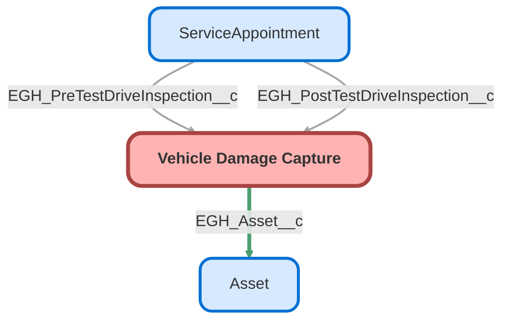

---
hide:
  - path
---

<!-- This file is auto-generated. if you do not want it to be overwritten, set TRUE in the line below -->
<!-- DO_NOT_OVERWRITE_DOC=FALSE -->

## Schema

<!-- Object description -->

## Fields

| Name      | Label | Type | Description |
| :-------- | :---- | :--: | :---------- | 
| EGH_Additional_Comments__c | Additional Comments | LongTextArea | undefined |
| EGH_Area_of_Damage_Defect__c | Area of Damage/Defect | Text | undefined |
| EGH_Asset__c | EGH Asset | MasterDetail | undefined |
| EGH_Booking_End_Datetime__c | Booking End Datetime | DateTime | undefined |
| EGH_Booking_End_Fuel_Level__c | Booking End Fuel Level | Picklist | undefined |
| EGH_Booking_End_Mileage__c | Booking End Mileage | Number | undefined |
| EGH_Booking_Start_Datetime__c | Booking Start Datetime | DateTime | undefined |
| EGH_Booking_Start_Fuel_Level__c | Booking Start Fuel Level | Picklist | undefined |
| EGH_Booking_Start_Mileage__c | Booking Start Mileage | Number | undefined |
| EGH_DateTime_Damage_Defect_Identified__c | Date & Time Damage/Defect Identified | DateTime | undefined |
| EGH_Description_of_Damage_Defect__c | Description of Damage/Defect | LongTextArea | undefined |
| EGH_Image_Annotations__c | Image Annotations | LongTextArea | Stores JSON data of annotated coordinates |
| EGH_License_End_Date__c | License End Date | Date | undefined |
| EGH_License_No__c | License No | Text | undefined |
| EGH_License_Start_Date__c | License Start Date | Date | undefined |
| EGH_Photos_of_Damage_Defect__c | Photo(s) of Damage/Defect | Checkbox | undefined |
| EGH_Quick_Scheduled__c | Quick Scheduled | Checkbox | undefined |
| EGH_Vehicle_Condition_Return__c | Vehicle Condition Return | TextArea | undefined |
| EGH_Vehicle_Condition_Start__c | Vehicle Condition Start | TextArea | undefined |

## Related Apex Classes

| Apex Class | Type |
| :----      | :--: | 
| [EGH_AssignedResourceInspectTriggerTest](../apex/EGH_AssignedResourceInspectTriggerTest.md) | Test |
| [EGH_AssignedResourceTriggerTest](../apex/EGH_AssignedResourceTriggerTest.md) | Test |
| [EGH_DamageCaptureController](../apex/EGH_DamageCaptureController.md) | Lightning Controller |
| [EGH_DamageCaptureController_Test](../apex/EGH_DamageCaptureController_Test.md) | Test |
| [EGH_ServiceAppointmentUpdateVDCTest](../apex/EGH_ServiceAppointmentUpdateVDCTest.md) | Test |
| [EGH_AssignedResourceInspectionTrigger](../apex/EGH_AssignedResourceInspectionTrigger.md) | Class |
| [EGH_ServiceAppointmentUpdateVDC](../apex/EGH_ServiceAppointmentUpdateVDC.md) | Class |

## Related Lightning Pages

| Lightning Page | Type |
| :----      | :--: | 
| [EGH_Vehicle_Damage_Capture_Record_Page](../pages/EGH_Vehicle_Damage_Capture_Record_Page.md) |  Record Page |

## Related Profiles

| Profile | User License |
| :----      | :--: | 
| [Admin](../profiles/Admin.md) |  Salesforce |
| [EGH Minimum Access Profile](../profiles/EGH%20Minimum%20Access%20Profile.md) |  Salesforce |
| [EGH Sales Profile](../profiles/EGH%20Sales%20Profile.md) |  Salesforce |
| [EGH Service Profile](../profiles/EGH%20Service%20Profile.md) |  Salesforce |

## Related Permission Sets

| Permission Set | User License |
| :----      | :--: | 
| [EGH_Core_Integration_Permission_Set](../permissionsets/EGH_Core_Integration_Permission_Set.md) | None |
| [EGH_Core_Permission](../permissionsets/EGH_Core_Permission.md) | None |
| [EGH_Fleet_Consultant](../permissionsets/EGH_Fleet_Consultant.md) | None |
| [EGH_Lease_Consultant](../permissionsets/EGH_Lease_Consultant.md) | None |
| [EGH_Meet_and_Greet_Application](../permissionsets/EGH_Meet_and_Greet_Application.md) | None |
| [EGH_Product_Genius](../permissionsets/EGH_Product_Genius.md) | None |
| [EGH_Sales_Consultant_Omni_Channel](../permissionsets/EGH_Sales_Consultant_Omni_Channel.md) | None |
| [EGH_SystemAdminPermissionSet](../permissionsets/EGH_SystemAdminPermissionSet.md) | None |
| [EGH_Test_Drive_Team](../permissionsets/EGH_Test_Drive_Team.md) | None |

_Documentation generated with [sfdx-hardis](https://sfdx-hardis.cloudity.com), by [Cloudity](https://www.cloudity.com/) & [friends](https://github.com/hardisgroupcom/sfdx-hardis/graphs/contributors)_
