---
hide:
  - path
---

<!-- This file is auto-generated. if you do not want it to be overwritten, set TRUE in the line below -->
<!-- DO_NOT_OVERWRITE_DOC=FALSE -->

## Schema

```mermaid
graph TD
Event["Event"]:::mainObject
click Event "/objects/Event/"


classDef object fill:#D6E9FF,stroke:#0070D2,stroke-width:3px,rx:12px,ry:12px,shadow:drop,color:#333;
classDef customObject fill:#FFF4C2,stroke:#CCAA00,stroke-width:3px,rx:12px,ry:12px,shadow:drop,color:#333;
classDef customObjectManaged fill:#FFD8B2,stroke:#CC5500,stroke-width:3px,rx:12px,ry:12px,shadow:drop,color:#333;
classDef mainObject fill:#FFB3B3,stroke:#A94442,stroke-width:4px,rx:14px,ry:14px,shadow:drop,color:#333,font-weight:bold;

```

<!-- Object description -->

## Fields

| Name      | Label | Type | Description |
| :-------- | :---- | :--: | :---------- | 
| ActivityDate |  |  | undefined |
| ActivityDateTime |  |  | undefined |
| Attendees |  |  | undefined |
| Description |  |  | undefined |
| DurationInMinutes |  |  | undefined |
| Email |  |  | undefined |
| EndDateTime |  |  | undefined |
| EventSubtype |  |  | undefined |
| IsAllDayEvent |  |  | undefined |
| IsPrivate |  |  | undefined |
| IsRecurrence2 |  |  | undefined |
| IsReminderSet |  |  | undefined |
| Location |  |  | undefined |
| OwnerId |  | Lookup | undefined |
| Phone |  |  | undefined |
| ServiceAppointmentId |  | Lookup | undefined |
| ShowAs |  |  | undefined |
| StartDateTime |  |  | undefined |
| Subject |  | Picklist | undefined |
| Type |  | Picklist | undefined |
| WhatId |  | Lookup | undefined |
| WhoId |  | Lookup | undefined |

## Related Flows

| Object | Name      | Type | Description |
| :----  | :-------- | :--: | :---------- | 
| 💻 | [EGH_MeetGreetTestFlow](../flows/EGH_MeetGreetTestFlow.md) |  Screen Flow | Test Flow for Meet&Greet Application. To use in discussion with Irshad |
| 💻 | [EGH_Product_Genius](../flows/EGH_Product_Genius.md) |  Screen Flow | Flow for Product Genius Application |
| EGH_ShowroomVisit__c | [EGH_LeadAndVisitShowroomAssignmentFlow](../flows/EGH_LeadAndVisitShowroomAssignmentFlow.md) |  Record After Save | Flow to assign a Lead to the appropriate Sales Consultant or the Team Leader based on Skills, Presence Status and previously assign Sales Consultant. Check if the purpose of the visit is Meet F&I Team. |
| Lead | [EGH_Lead_Creation_Set_Defaults_Flow](../flows/EGH_Lead_Creation_Set_Defaults_Flow.md) |  Record Before Save | Sets Default Fields on Lead When record is Created |

## Related Apex Classes

| Apex Class | Type |
| :----      | :--: | 
| [EGHResourceTimelineControllerTest](../apex/EGHResourceTimelineControllerTest.md) | Test |

## Related Lightning Pages

| Lightning Page | Type |
| :----      | :--: | 
| [EGH_AppraisalLightningPage](../pages/EGH_AppraisalLightningPage.md) |  Record Page |
| [EGH_FleetAccountLightningPage](../pages/EGH_FleetAccountLightningPage.md) |  Record Page |
| [EGH_VehicleLightningRecordPage](../pages/EGH_VehicleLightningRecordPage.md) |  Record Page |
| [Interaction](../pages/Interaction.md) |  Record Page |

## Related Profiles

| Profile | User License |
| :----      | :--: | 
| [Admin](../profiles/Admin.md) |  Salesforce |
| [EGH Minimum Access Profile](../profiles/EGH%20Minimum%20Access%20Profile.md) |  Salesforce |
| [EGH Sales Profile](../profiles/EGH%20Sales%20Profile.md) |  Salesforce |
| [EGH Service Profile](../profiles/EGH%20Service%20Profile.md) |  Salesforce |

## Related Permission Sets

| Permission Set | User License |
| :----      | :--: | 
| [EGH_Contact_Center_PS](../permissionsets/EGH_Contact_Center_PS.md) | None |
| [EGH_Core_Integration_Permission_Set](../permissionsets/EGH_Core_Integration_Permission_Set.md) | None |
| [EGH_Core_Permission](../permissionsets/EGH_Core_Permission.md) | None |
| [EGH_Digital_Sales_Consultant_Omni_Channel](../permissionsets/EGH_Digital_Sales_Consultant_Omni_Channel.md) | None |
| [EGH_Fleet_Consultant](../permissionsets/EGH_Fleet_Consultant.md) | None |
| [EGH_Lease_Consultant](../permissionsets/EGH_Lease_Consultant.md) | None |
| [EGH_Sales_Consultant_Omni_Channel](../permissionsets/EGH_Sales_Consultant_Omni_Channel.md) | None |
| [EGH_Service_Consultants_PS](../permissionsets/EGH_Service_Consultants_PS.md) | None |
| [EGH_SystemAdminPermissionSet](../permissionsets/EGH_SystemAdminPermissionSet.md) | None |
| [EGH_Test_Drive_Team](../permissionsets/EGH_Test_Drive_Team.md) | None |

_Documentation generated with [sfdx-hardis](https://sfdx-hardis.cloudity.com), by [Cloudity](https://www.cloudity.com/) & [friends](https://github.com/hardisgroupcom/sfdx-hardis/graphs/contributors)_
