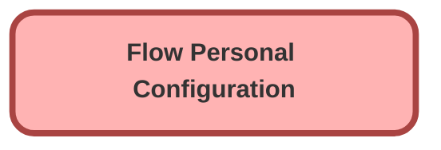

---
hide:
  - path
---

<!-- This file is auto-generated. if you do not want it to be overwritten, set TRUE in the line below -->
<!-- DO_NOT_OVERWRITE_DOC=FALSE -->

## Schema

<!-- Object description -->

## Fields

| Name      | Label | Type | Description |
| :-------- | :---- | :--: | :---------- | 
| ActorId__c | Actor Id | Text | undefined |
| Config1Name__c | Config1Name | Text | undefined |
| Config1Value__c | Config1Value | Text | undefined |
| Config2Name__c | Config2Name | Text | undefined |
| Config2Value__c | Config2Value | Text | undefined |
| Config3Name__c | Config3Name | Text | undefined |
| Config3Value__c | Config3Value | Text | undefined |
| Config4Name__c | Config4Name | Text | undefined |
| Config4Value__c | Config4Value | Text | undefined |
| Config5Name__c | Config5Name | Text | undefined |
| Config5Value__c | Config5Value | Text | undefined |
| Config6Name__c | Config6Name | Text | undefined |
| Config6Value__c | Config6Value | Text | undefined |
| Config7Name__c | Config7Name | Text | undefined |
| Config7Value__c | Config7Value | Text | undefined |
| Config8Name__c | Config8Name | Text | undefined |
| Config8Value__c | Config8Value | Text | undefined |
| Config9Name__c | Config9Name | Text | undefined |
| Config9Value__c | Config9Value | Text | undefined |
| LocationId__c | Location Id | Text | undefined |

## Related Permission Sets

| Permission Set | User License |
| :----      | :--: | 
| [EGH_SystemAdminPermissionSet](../permissionsets/EGH_SystemAdminPermissionSet.md) | None |
| [USF_Flow_Screen_Component_Custom_Objects](../permissionsets/USF_Flow_Screen_Component_Custom_Objects.md) | None |

_Documentation generated with [sfdx-hardis](https://sfdx-hardis.cloudity.com), by [Cloudity](https://www.cloudity.com/) & [friends](https://github.com/hardisgroupcom/sfdx-hardis/graphs/contributors)_
