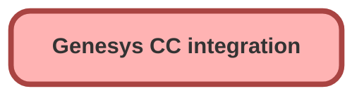

---
hide:
  - path
---

<!-- This file is auto-generated. if you do not want it to be overwritten, set TRUE in the line below -->
<!-- DO_NOT_OVERWRITE_DOC=FALSE -->

## Schema

<!-- Object description -->

## Fields

| Name      | Label | Type | Description |
| :-------- | :---- | :--: | :---------- | 
| Available__c | Available | Text | undefined |
| Available_Off_Queue__c | Available Off Queue | Text | undefined |
| Away__c | Away | Text | undefined |
| Break__c | Break | Text | undefined |
| Busy__c | Busy | Text | undefined |
| Busy_Lunch__c | Busy Lunch | Text | undefined |
| Lunch__c | Lunch | Text | undefined |
| Meal__c | Meal | Text | undefined |
| Meeting__c | Meeting | Text | undefined |
| Offline__c | Offline | Text | undefined |
| On_Queue__c | On Queue | Text | undefined |
| Training__c | Training | Text | undefined |

## Related Apex Classes

| Apex Class | Type |
| :----      | :--: | 
| [StatusSyncManager](../apex/StatusSyncManager.md) | Class |
| [StatusSyncManagerTest](../apex/StatusSyncManagerTest.md) | Test |

_Documentation generated with [sfdx-hardis](https://sfdx-hardis.cloudity.com), by [Cloudity](https://www.cloudity.com/) & [friends](https://github.com/hardisgroupcom/sfdx-hardis/graphs/contributors)_
