---
hide:
  - path
---

<!-- This file is auto-generated. if you do not want it to be overwritten, set TRUE in the line below -->
<!-- DO_NOT_OVERWRITE_DOC=FALSE -->

## Schema

```mermaid
graph TD
VoiceCall["VoiceCall"]:::object
click VoiceCall "/objects/VoiceCall/"
Lead["Lead"]:::mainObject
click Lead "/objects/Lead/"
EGH_TrafficFine__c["Traffic Fine"]:::customObject
click EGH_TrafficFine__c "/objects/EGH_TrafficFine__c/"
EGH_ShowroomVisit__c["Showroom Visit"]:::customObject
click EGH_ShowroomVisit__c "/objects/EGH_ShowroomVisit__c/"
EGH_PersonalDocumentsObject__c["Personal Document"]:::customObject
click EGH_PersonalDocumentsObject__c "/objects/EGH_PersonalDocumentsObject__c/"
EGH_LeadSalesTeam__c["Lead Sales Team"]:::customObject
click EGH_LeadSalesTeam__c "/objects/EGH_LeadSalesTeam__c/"
EGH_Interaction__c["Digital Interaction"]:::customObject
click EGH_Interaction__c "/objects/EGH_Interaction__c/"
BranchUnitRelatedRecord["BranchUnitRelatedRecord"]:::object
click BranchUnitRelatedRecord "/objects/BranchUnitRelatedRecord/"
BranchUnit["BranchUnit"]:::object
click BranchUnit "/objects/BranchUnit/"

VoiceCall -->|Lead1__c| Lead
Lead -->|EGH_LeadBranchUnitLookup__c| BranchUnit
EGH_TrafficFine__c -->|EGH_LeadDriver__c| Lead
EGH_ShowroomVisit__c -->|EGH_RelatedShowroomBranch__c| BranchUnit
EGH_ShowroomVisit__c -->|EGH_LeadLookup__c| Lead
EGH_PersonalDocumentsObject__c -->|Lead__c| Lead
EGH_LeadSalesTeam__c -->|EGH_ShowroomLookup__c| BranchUnit
EGH_LeadSalesTeam__c -->|EGH_LeadLookup__c| Lead
EGH_Interaction__c -->|EGH_LeadLookup__c| Lead
EGH_Interaction__c -->|EGH_BranchUnitLookup__c| BranchUnit
BranchUnitRelatedRecord -->|EGH_LeadLookup__c| Lead

classDef object fill:#D6E9FF,stroke:#0070D2,stroke-width:3px,rx:12px,ry:12px,shadow:drop,color:#333;
classDef customObject fill:#FFF4C2,stroke:#CCAA00,stroke-width:3px,rx:12px,ry:12px,shadow:drop,color:#333;
classDef customObjectManaged fill:#FFD8B2,stroke:#CC5500,stroke-width:3px,rx:12px,ry:12px,shadow:drop,color:#333;
classDef mainObject fill:#FFB3B3,stroke:#A94442,stroke-width:4px,rx:14px,ry:14px,shadow:drop,color:#333,font-weight:bold;
linkStyle 0,1,2,3,4,5,6,7,8,9,10 stroke:#A6A6A6,stroke-width:2px;

```

<!-- Object description -->

## Fields

| Name      | Label | Type | Description |
| :-------- | :---- | :--: | :---------- | 
| Address |  |  | undefined |
| AnnualRevenue |  |  | undefined |
| CampaignId |  | Lookup | undefined |
| Company |  |  | undefined |
| Description |  |  | undefined |
| DoNotCall |  |  | undefined |
| EarliestInterestDate |  |  | undefined |
| EGH_1YearOrMoreOfDrivingLicenseCheckbox__c | 1 Year Or More Of Driving License | Checkbox | The person has 1 year or more of driving license |
| EGH_25YearsOrOlderCheckbox__c | 25 Years Or Older | Checkbox | The person is 25 years or older |
| EGH_ArtLeasingEmailOptinCheckbox__c | ArtLeasing Email Optin | Checkbox | ArtLeasing consent field |
| EGH_ArtLeasingPhoneOptinCheckbox__c | ArtLeasing Phone Optin | Checkbox | ArtLeasing consent field |
| EGH_ArtLeasingSMSOptinCheckbox__c | ArtLeasing SMS Optin | Checkbox | ArtLeasing consent field |
| EGH_ArtLeasingWhatsAppOptinCheckbox__c | ArtLeasing WhatsApp Optin | Checkbox | ArtLeasing consent field |
| EGH_AssignToPG__c | Assign to PG | Checkbox | undefined |
| EGH_BirthdayDate__c | Birthday | Date | Day of birth |
| EGH_BotTimeToPrequalifiedFormula__c | Bot Time To Prequalified | Number | Formula Field to track the minutes that has passed since the Lead was set to Genesys Bot |
| EGH_BranchCode__c | Branch Code | Text | Stores the Branch Code, populated by automation before duplication rules are triggered. |
| EGH_BrandListPicklist__c | Brand List | Picklist | Brand |
| EGH_ConsentEmailCheckbox__c | Consent Email | Checkbox | Flag to indicate if the lead consent to receive Emails. |
| EGH_ConsentLastUpdateDate__c | Consent Last Update | Date | Date of the last Consent information update |
| EGH_ConsentPhoneCheckbox__c | Consent Phone | Checkbox | Flag to indicate if the lead accepts to receive phone calls. |
| EGH_ConsentSMSCheckbox__c | Consent SMS | Checkbox | Flag to indicate if the lead consent to receive SMS. |
| EGH_ConsentWhatsAppCheckbox__c | Consent WhatsApp | Checkbox | Flag to indicate if the lead accepts to receive WhatsApp messages. |
| EGH_CRMExternalId__c | Lead CRM External ID | Text | undefined |
| EGH_Current_Car_Model__c | Current Car Model | Text | undefined |
| EGH_Derived_Lead_Channel__c | Derived Lead Channel | Text | undefined |
| EGH_EIDText__c | EID | Text | EID identification |
| EGH_EmiratePicklist__c | Emirates | Picklist | Emirates where the customer belong ex, Dubai, Abu Dhabi, Sharjah, Ras Al Khaima, etc |
| EGH_ExtLeadIdText__c | External ID | Text | Source Lead ID. Id of the Lead in the original system/channel |
| EGH_First_Time_Buyer__c | First Time Buyer | Checkbox | undefined |
| EGH_Fleet_Size__c | Fleet Size | Number | undefined |
| EGH_GenesysCampaignText__c | Genesys Campaign | Text | Genesys Campaign for digital channels. Value taken from UTM. |
| EGH_How_did_Customer_know_about_us__c | How did Customer know about us? | Picklist | undefined |
| EGH_How_soon_is_planning_to_buy__c | How soon is planning to buy | Picklist | How soon customer is planning to buy |
| EGH_How_Soon_Score__c | How Soon Score | Number | undefined |
| EGH_InventoryTypePicklist__c | Inventory Type | Picklist | Field to capture if customer is interested in a new or preowned car for retail leads |
| EGH_IsOwnerSameAsLoggedIn__c | EGH_IsOwnerSameAsLoggedIn | Checkbox | System field used for lighting components to check if logged in user and owner id is same, return true if same otherwise false |
| EGH_IsReportingManager__c | EGH IsReportingManager | Checkbox | undefined |
| EGH_JetourEmailOptinCheckbox__c | Jetour Email Optin | Checkbox | Jetour consent field |
| EGH_JetourPhoneOptinCheckbox__c | Jetour Phone Optin | Checkbox | Jetour consent field |
| EGH_JetourSMSOptinCheckbox__c | Jetour SMS Optin | Checkbox | Consent field for Jetour |
| EGH_JetourWhatsAppOptinCheckbox__c | Jetour WhatsApp Optin | Checkbox | Jetour consent field |
| EGH_Kilometer_Allowance__c | Kilometer Allowance | Number | undefined |
| EGH_KmDrivenNumber__c | Km Driven | Number | Number of Kms of the Vehicle |
| EGH_LatestInteractionChannel__c | Latest Interaction Channel | Picklist | undefined |
| EGH_Lead_Age__c | Lead Age | Number | undefined |
| EGH_Lead_CRM_External_ID__c | Lead CRM External ID | Text | undefined |
| EGH_Lead_Lost_Reason__c | Lead Lost Reason | Picklist | This picklist allows the user to capture the reason for the lead  getting lost. |
| EGH_Lead_Owner__c | Lead Owner | Text | undefined |
| EGH_Lead_Source_Score__c | Lead Source Score | Number | undefined |
| EGH_LeadBranchUnitLookup__c | Lead Preferred Branch | Lookup | Relationship to the preferred branch unit |
| EGH_LeadBudgetText__c | Lead Budget | Currency | Lead budget amount |
| EGH_LeadLanguagePicklist__c | Language | Picklist | Lead preferred language |
| EGH_LeadNationalityPicklist__c | Nationality | Picklist | Lead Country - Nationality |
| EGH_LeadOriginatedInText__c | Lead Originated In | Text | Showroom or event where the lead was created. It's based on the user creating the Lead. |
| EGH_LeadOriginText__c | Lead Origin | Text | For Digital, This is filled from UTM.  For Product Genius event names. and Contact Centre and Meet & Greet should get list - (Dubizzle,Facebook, Instagram, Website, Referral , Radio, Etc.) |
| EGH_LeadRequestTypePicklist__c | Request Type | Picklist | Lead Request Type. Different values are shown based on the Lead origin |
| EGH_LeadSentToBotDateTime__c | Lead Sent To Bot DateTime | DateTime | Date and Time when the Lead is added to the WhatsApp Bot queue. If Genesys update when the Lead is really assigned to the Bot, this field will be used for that value. |
| EGH_LeadTypePicklist__c | Lead Type | Picklist | Internal field to identify Retail Sales, Service, Spares , Leasing and Fleet Sales as Lead Type |
| EGH_Leasing_period__c | Leasing period | Number | undefined |
| EGH_Marketing_Campaign__c | Marketing Campaign | TextArea | undefined |
| EGH_Model_of_Interest__c | Model of Interest | Picklist | undefined |
| EGH_Monthly_Amount__c | Monthly Amount | Currency | undefined |
| EGH_Offer_Link__c | Offer Link | Url | undefined |
| EGH_Parts_Details__c | Parts Details | TextArea | undefined |
| EGH_Payment_Score__c | Payment Score | Number | undefined |
| EGH_PickAndDropCheckbox__c | Pick&Drop | Checkbox | Pick And Drop |
| EGH_PotentialLeadInDifferentShowroom__c | Potential Lead in Different Showroom | Checkbox | undefined |
| EGH_PreferredContactDate__c | Preferred Contact Date | Date | Lead preferred contact date |
| EGH_PreferredContactTime__c | Preferred Contact Time | Time | Lead preferred contact time |
| EGH_PreffreredContactMethodPicklist__c | Preferred Contact Method | Picklist | Preffrered contact method for the lead |
| EGH_PreffrerredContactDate__c | Preferred Contact Date | Date | Lead preffrerred contact date |
| EGH_PreffrerredContactTime__c | Preferred Contact Time | Time | Lead preffrerred contact time |
| EGH_PrequalCurrentCarText__c | Current Car Models | Text | Genesys usage. Prequal Current Car |
| EGH_PreQualificationStatusPicklist__c | Pre-Qualification Status | Picklist | Field for Genesys usage. Pre-Qualification Status |
| EGH_PrequalLastCarBoughtText__c | Last Car bought (in years) | Text | Genesys usage. Prequal Last Car Bought |
| EGH_PrequalModeOfPaymentPicklist__c | Preferred Payment Method | Picklist | Mode of Payment. Field coming from Genesys WhatsApp Bot. |
| EGH_PrequalMonthlyBudgetText__c | Monthly Budget Amount | Currency | Genesys usage. Prequal Monthly Budget |
| EGH_PrequalTotalBudgetText__c | Total Budget Amount | Currency | Genesys usage. Prequal Total Budget |
| EGH_PrequalUrgencyText__c | Prequal Urgency | Text | Prequal Urgency. Field coming from Genesys WhatsApp Bot. |
| EGH_QueueAssignmentFormula__c | Queue Assignment Formula | Text | Formula to define to which queue to route the Lead based on the Lead Source |
| EGH_QueueAssignmentPicklist__c | Queue Assignment | Picklist | Dependent picklist field to decide if a Lead goes to the WhatsApp  Bot based on the Lead Source |
| EGH_RejectionReasonText__c | Rejection Reason | TextArea | The reason a lead was submitted for Rejection |
| EGH_ReOpen_Date__c | Reopen Date | Date | undefined |
| EGH_RepairDetailsLongText__c | Repair Details | LongTextArea | Repair Details |
| EGH_RetailFleetPicklist__c | Retail/Fleet | Picklist | Field to indicate if the lead is for a fleet of vehicles or just retail. |
| EGH_Service_Required__c | Service Required | Checkbox | undefined |
| EGH_SoueastEmailOptinCheckbox__c | Soueast Email Optin | Checkbox | Soueast consent field |
| EGH_SoueastPhoneOptinCheckbox__c | Soueast Phone Optin | Checkbox | Soueast consent field |
| EGH_SoueastSMSOptinCheckbox__c | Soueast SMS Optin | Checkbox | Soueast consent field |
| EGH_SoueastWhatsAppOptinCheckbox__c | Soueast WhatsApp Optin | Checkbox | Soueast consent field |
| EGH_TheEliteCarsEmailOptinCheckbox__c | EliteCars Email Optin | Checkbox | EliteCars consent field |
| EGH_TheEliteCarsPhoneOptinCheckbox__c | EliteCars Phone Optin | Checkbox | EliteCars consent field |
| EGH_TheEliteCarsSMSOptinCheckbox__c | EliteCars SMS Optin | Checkbox | EliteCars consent field |
| EGH_TheEliteCarsWhatsAppOptinCheckbox__c | EliteCars WhatsApp Optin | Checkbox | EliteCars consent field |
| EGH_Total_Lead_Score__c | EGH Total Lead Score | Number | undefined |
| EGH_UAEResidentCheckbox__c | UAE Resident | Checkbox | Marked if the person is an UAE resident |
| EGH_UTMCampaignContentText__c | Marketing Campaign Content | Text | UTM Parameter: Campaign Content |
| EGH_UTMCampaignMediumText__c | Marketing Campaign Medium | Text | UTM Parameter: Campaign Medium |
| EGH_UTMCampaignSourceText__c | Marketing Campaign Source | Picklist | UTM Parameter: Campaign Source |
| EGH_UTMCampaignTermText__c | Marketing Campaign Term | Text | UTM Parameter: Campaign Term |
| EGH_UTMCaptureSourceLongText__c | UTM Capture Source | Text | UTM Parameter: Capture Source |
| EGH_UTMCreativeIdText__c | UTM Creative Id | Text | UTM Parameter: Creative Id |
| EGH_UTMLeadChannelText__c | Marketing Lead Channel | Text | UTM Parameter: Lead Channel |
| EGH_Valid_Email_not_Available__c | Valid Email not Available | Checkbox | undefined |
| EGH_Vehicle_Make__c | Vehicle Make | TextArea | undefined |
| EGH_Vehicle_model__c | Vehicle model | TextArea | undefined |
| EGH_VehicleModelYear__c | Vehicle Model Year | Text | undefined |
| EGH_VehicleNewUsedPicklist__c | Vehicle New/Used | Picklist | Define if the Lead is interested in a a New or a Used vehicle |
| EGH_VINText__c | VIN | Text | VIN Number of the vehicle |
| Email |  |  | undefined |
| Fax |  |  | undefined |
| GenderIdentity |  | Picklist | undefined |
| HasOptedOutOfEmail |  |  | undefined |
| HasOptedOutOfFax |  |  | undefined |
| IndividualId |  | Lookup | undefined |
| Industry |  | Picklist | undefined |
| Jigsaw |  |  | undefined |
| LastTransferDate |  |  | undefined |
| LatestInterestDate |  |  | undefined |
| LeadSource |  | Picklist | Origin of Lead Data |
| MobilePhone |  |  | undefined |
| Name |  |  | undefined |
| NumberOfEmployees |  |  | undefined |
| OwnerId |  | Lookup | undefined |
| Phone |  |  | undefined |
| Pronouns |  | Picklist | undefined |
| Rating |  | Picklist | undefined |
| Route_to_Sales__c | Route to Sales | Checkbox | This checkbox ensure that the leads are not routed to Sales Team if the lead is not interested in talking to the Sales Team |
| Status |  | Picklist | undefined |
| Title |  |  | undefined |
| Website |  |  | undefined |

## Validation Rules

| Rule      | Active | Description | Formula |
| :-------- | :---- | :---------- | :------ |
| EGH_Birthdate_Must_Be_In_Past | Yes | Prevents users from entering a birthdate that is in the future. | EGH_BirthdayDate__c > TODAY() |
| EGH_BrandNoChange | Yes | You cannot change brand | AND(     ISCHANGED( EGH_BrandListPicklist__c ),      NOT( ISBLANK( PRIORVALUE( EGH_BrandListPicklist__c ) ) ) ) |
| EGH_MobilePhoneValidationRule | Yes | Phone validation: 
- phone numbers must start with +971 or 00971
- +971 format: +971 followed by 6-8 digits (total 10-12 characters)
- 00971 format: 00971 followed by 5-7 digits (total 10-12 characters) | AND( NOT(ISBLANK( MobilePhone )), NOT( REGEX( MobilePhone, "^(\\+971[0-9]{9}00971[0-9]{9})$" ) ) ) |
| EGH_PhoneValidationRule | Yes | Phone validation:
- phone numbers should be 10-12 digits in length
- only numbers are accepted
- "+" symbol in the beginning of the number is still acceptable
- phone can be empty | AND(   NOT(ISBLANK(Phone)),   NOT(     REGEX(       Phone,       "^\\+?[0-9]{10,12}$"     )   ),    $Setup.EGH_Automation_Bypass__c.EGH_Bypass_Validations__c = False ) |
| EGH_Prevent_Owner_Rejection | Yes | Prevents the lead owner from rejecting a lead directly. 
Owners must submit the lead to their manager for rejection. | AND(  $User.Id = OwnerId,  $Setup.EGH_Automation_Bypass__c.EGH_Bypass_Validations__c=False,  ISCHANGED( Status ),  ISPICKVAL(Status, 'Rejected')  ) |
| EGH_Prevent_Rejected_Lead_Edit | No ⚠️ | Prevents any edits to Leads once Status is Rejected. Blocks both editing rejected leads AND changing status away from Rejected. No changes allowed once rejected. | AND( ISPICKVAL(PRIORVALUE(Status),'Rejected'), $Setup.EGH_Automation_Bypass__c.EGH_Bypass_Validations__c =False ) |
| EGH_PreventLeadOwnerChangeForTestDrive | Yes | Prevents users with the roles Test Drive Admin/ Coordinator, and Manager from changing the Lead Owner. | AND(     OR(         CONTAINS($UserRole.DeveloperName,'EGH_TestDriveAdminRole'),  CONTAINS($UserRole.DeveloperName,'EGH_TestDriveCoordinatorRole')         ),          ISCHANGED(OwnerId)              ) |
| EGH_PreventLeadSourceEdit | Yes |  | AND(     NOT(ISNEW()),     ISCHANGED(LeadSource),     NOT(ISBLANK(PRIORVALUE(LeadSource))),     NOT( $Setup.EGH_Automation_Bypass__c.EGH_Bypass_Validations__c ) ) |
| EGH_PreventLeadStatusChangeForTestDrive | No ⚠️ | Prevents users with the roles Test Drive Admin/ Coordinator, and Manager from changing the Lead Status. | AND( OR( CONTAINS($UserRole.DeveloperName,'EGH_TestDriveAdminRole'), CONTAINS($UserRole.DeveloperName,'EGH_TestDriveCoordinatorRole') ),  ISCHANGED( Status )   ) |
| Vehicle_Model_Year_Length_4_Digits | Yes |  | AND(     NOT(ISBLANK(EGH_VehicleModelYear__c)),     NOT(REGEX(EGH_VehicleModelYear__c, "[0-9]{4}")),     NOT($Setup.EGH_Automation_Bypass__c.EGH_Bypass_Validations__c) ) |

## Related Flows

| Object | Name      | Type | Description |
| :----  | :-------- | :--: | :---------- | 
| 💻 | [CX_Cloud_Create_New_Lead_Screen_Pop](../flows/CX_Cloud_Create_New_Lead_Screen_Pop.md) |  Screen Flow | This screen pop flow is triggered through Genesys. If customer is calling from an unknown phone number, this will pop up. |
| 💻 | [EGH_LeadFollowUpTaskCreation2nd3rd](../flows/EGH_LeadFollowUpTaskCreation2nd3rd.md) |  Auto Launched Flow | Creates 2nd and 3rd Lead Task follow ups (Triggered by SchedulOmatic) |
| 💻 | [EGH_Lead_Lost_Reason_Capture](../flows/EGH_Lead_Lost_Reason_Capture.md) |  Screen Flow | <!-- --> |
| 💻 | [EGH_Lead_Owner_information](../flows/EGH_Lead_Owner_information.md) |  Screen Flow | <!-- --> |
| 💻 | [EGH_LeadsRejectionApprovalProcessScreenFlow](../flows/EGH_LeadsRejectionApprovalProcessScreenFlow.md) |  Screen Flow | Submits lead for Rejection via approval process (Added Lead Lost Reason) |
| 💻 | [EGH_MeetGreetTestFlow](../flows/EGH_MeetGreetTestFlow.md) |  Screen Flow | Test Flow for Meet&Greet Application. To use in discussion with Irshad |
| 💻 | [EGH_Product_Genius](../flows/EGH_Product_Genius.md) |  Screen Flow | Flow for Product Genius Application |
| AgentWork | [EGH_Create_Lead_Sales_Team](../flows/EGH_Create_Lead_Sales_Team.md) |  Record After Save | <!-- --> |
| AgentWork | [EGH_Lead_Create_Follow_Up_Task](../flows/EGH_Lead_Create_Follow_Up_Task.md) |  Record After Save | <!-- --> |
| EGH_Interaction__c | [EGH_Digital_Interaction_Update_Lead_Latest_Interaction_Channel](../flows/EGH_Digital_Interaction_Update_Lead_Latest_Interaction_Channel.md) |  Record After Save | <!-- --> |
| EGH_ShowroomVisit__c | [EGH_Showroom_Visit_Reopen_Related_Lead](../flows/EGH_Showroom_Visit_Reopen_Related_Lead.md) |  Record After Save | This flow is reopening rejected leads when a new related visit is created |
| Lead | [EGH_Insert_Lead_as_Campaign_Member](../flows/EGH_Insert_Lead_as_Campaign_Member.md) |  Record After Save | <!-- --> |
| Lead | [EGH_LeadFollowUpTaskCreation](../flows/EGH_LeadFollowUpTaskCreation.md) |  Record After Save | Creates Lead Follow up tasks after record ownership change from Queue. Add Attempt Number and Brand. |
| Lead | [EGH_LeadUpdateLeadSentToBotDateTimeFlow](../flows/EGH_LeadUpdateLeadSentToBotDateTimeFlow.md) |  Record After Save | Update Lead Sent To Bot DateTime field to indicate when the Lead was shared with Genesys (sent to WhatsApp Bot Queue). Assign the Lead to Digital Sales Queue if the Bot has not change the field Pre-qualification Status to "Yes" after 15 min and change Pre-qualification status to "No". |
| Lead | [EGH_Lead_Acknowledgement_Email](../flows/EGH_Lead_Acknowledgement_Email.md) |  Record After Save | <!-- --> |
| Lead | [EGH_Lead_Add_Leasing_Fleet_Consultant_to_Lead_Sales_Team](../flows/EGH_Lead_Add_Leasing_Fleet_Consultant_to_Lead_Sales_Team.md) |  Record After Save | <!-- --> |
| Lead | [EGH_Lead_Add_Sales_Consultant_to_Lead_Sales_Team](../flows/EGH_Lead_Add_Sales_Consultant_to_Lead_Sales_Team.md) |  Record After Save | <!-- --> |
| Lead | [EGH_Lead_Auto_Rejection_Scheduled_Flow](../flows/EGH_Lead_Auto_Rejection_Scheduled_Flow.md) |  Scheduled | If the lead is created within 3 months and been inactive for 20 days it is auto rejected. |
| Lead | [EGH_Lead_Creation_Set_Defaults_Flow](../flows/EGH_Lead_Creation_Set_Defaults_Flow.md) |  Record Before Save | Sets Default Fields on Lead When record is Created |
| Lead | [EGH_Lead_Sales_Team_Account_Mapping](../flows/EGH_Lead_Sales_Team_Account_Mapping.md) |  Record After Save | <!-- --> |
| Lead | [EGH_Lead_Update_External_ID](../flows/EGH_Lead_Update_External_ID.md) |  Record After Save | <!-- --> |
| Lead | [EGH_Set_Branch_Code](../flows/EGH_Set_Branch_Code.md) |  Record Before Save | <!-- --> |
| ServiceAppointment | [Set_Parent_Lead_as_Qualified](../flows/Set_Parent_Lead_as_Qualified.md) |  Record After Save | <!-- --> |
| genesysps__Experience__c | [get_related_record_experience](../flows/get_related_record_experience.md) |  Record After Save | Added the CurrentMenu to the Experience Layout and added a Formula To the flow to collect it from the MetaData |

## Related Apex Classes

| Apex Class | Type |
| :----      | :--: | 
| [EGHResourceTimelineController](../apex/EGHResourceTimelineController.md) | Lightning Controller |
| [EGHTestDriveTimelineControllerTest](../apex/EGHTestDriveTimelineControllerTest.md) | Test |
| [EGH_BookAppointmentRest](../apex/EGH_BookAppointmentRest.md) | REST |
| [EGH_GetDependentPicklistValues_Test](../apex/EGH_GetDependentPicklistValues_Test.md) | Test |
| [EGH_LeadFindDuplicates](../apex/EGH_LeadFindDuplicates.md) | Invocable |
| [EGH_LeadFindDuplicatesTest](../apex/EGH_LeadFindDuplicatesTest.md) | Test |
| [EGH_LeadRatingHelper](../apex/EGH_LeadRatingHelper.md) | Class |
| [EGH_MeetGreetSearchControllerClass](../apex/EGH_MeetGreetSearchControllerClass.md) | Invocable |
| [EGH_MeetGreetSearchControllerClass_Test](../apex/EGH_MeetGreetSearchControllerClass_Test.md) | Test |
| [EGH_RestTests](../apex/EGH_RestTests.md) | Test |
| [EGH_TeamLeaderControllerClass](../apex/EGH_TeamLeaderControllerClass.md) | Invocable |
| [EGH_TeamLeaderControllerClassTest](../apex/EGH_TeamLeaderControllerClassTest.md) | Test |
| [EGH_TestDriveSlotFinder](../apex/EGH_TestDriveSlotFinder.md) | Lightning Controller |
| [EGH_TestDriveSlotFinder_Test](../apex/EGH_TestDriveSlotFinder_Test.md) | Test |
| [EGH_LeadRatingTrigger](../apex/EGH_LeadRatingTrigger.md) | Class |

## Related Lightning Pages

| Lightning Page | Type |
| :----      | :--: | 
| [EGH_LeadLightningPage](../pages/EGH_LeadLightningPage.md) |  Record Page |
| [EGH_OpportunityLightningPage](../pages/EGH_OpportunityLightningPage.md) |  Record Page |
| [EGH_Traffic_Fine_Lightning_Page](../pages/EGH_Traffic_Fine_Lightning_Page.md) |  Record Page |
| [Genesys_Experience_Layout](../pages/Genesys_Experience_Layout.md) |  Record Page |
| [Interaction](../pages/Interaction.md) |  Record Page |
| [LeadSystemAdminPage](../pages/LeadSystemAdminPage.md) |  Record Page |
| [Lead_Sales_Team_Record_Page](../pages/Lead_Sales_Team_Record_Page.md) |  Record Page |
| [Voice_Call_Layout](../pages/Voice_Call_Layout.md) |  Record Page |

## Related Profiles

| Profile | User License |
| :----      | :--: | 
| [Admin](../profiles/Admin.md) |  Salesforce |
| [EGH Minimum Access Profile](../profiles/EGH%20Minimum%20Access%20Profile.md) |  Salesforce |
| [EGH Sales Profile](../profiles/EGH%20Sales%20Profile.md) |  Salesforce |
| [EGH Service Profile](../profiles/EGH%20Service%20Profile.md) |  Salesforce |

## Related Permission Sets

| Permission Set | User License |
| :----      | :--: | 
| [EGH_Apex_Classes](../permissionsets/EGH_Apex_Classes.md) | None |
| [EGH_Contact_Center_PS](../permissionsets/EGH_Contact_Center_PS.md) | None |
| [EGH_Core_Integration_Permission_Set](../permissionsets/EGH_Core_Integration_Permission_Set.md) | None |
| [EGH_Core_Permission](../permissionsets/EGH_Core_Permission.md) | None |
| [EGH_Digital_Sales_Consultant_Omni_Channel](../permissionsets/EGH_Digital_Sales_Consultant_Omni_Channel.md) | None |
| [EGH_F_I_OmniChannel](../permissionsets/EGH_F_I_OmniChannel.md) | None |
| [EGH_FeedbackManagementAdvancedPermissionSet](../permissionsets/EGH_FeedbackManagementAdvancedPermissionSet.md) | None |
| [EGH_Fleet_Consultant](../permissionsets/EGH_Fleet_Consultant.md) | None |
| [EGH_Knowledge_Admin](../permissionsets/EGH_Knowledge_Admin.md) | None |
| [EGH_Lease_Consultant](../permissionsets/EGH_Lease_Consultant.md) | None |
| [EGH_Meet_and_Greet_Application](../permissionsets/EGH_Meet_and_Greet_Application.md) | None |
| [EGH_ModifyServiceAppointmentsPermissionSet](../permissionsets/EGH_ModifyServiceAppointmentsPermissionSet.md) | None |
| [EGH_Product_Genius_Admin](../permissionsets/EGH_Product_Genius_Admin.md) | None |
| [EGH_Product_Genius](../permissionsets/EGH_Product_Genius.md) | None |
| [EGH_QA_and_Data_Analyst_PS](../permissionsets/EGH_QA_and_Data_Analyst_PS.md) | None |
| [EGH_Sales_Consultant_Omni_Channel](../permissionsets/EGH_Sales_Consultant_Omni_Channel.md) | None |
| [EGH_Sales_Team_Leader_PS](../permissionsets/EGH_Sales_Team_Leader_PS.md) | None |
| [EGH_Service_Consultants_PS](../permissionsets/EGH_Service_Consultants_PS.md) | None |
| [EGH_Service_Team_Leader_PS](../permissionsets/EGH_Service_Team_Leader_PS.md) | None |
| [EGH_SystemAdminPermissionSet](../permissionsets/EGH_SystemAdminPermissionSet.md) | None |
| [EGH_Test_Drive_Team](../permissionsets/EGH_Test_Drive_Team.md) | None |
| [PS_Genesys_Integration](../permissionsets/PS_Genesys_Integration.md) | None |
| [Test](../permissionsets/Test.md) | None |

_Documentation generated with [sfdx-hardis](https://sfdx-hardis.cloudity.com), by [Cloudity](https://www.cloudity.com/) & [friends](https://github.com/hardisgroupcom/sfdx-hardis/graphs/contributors)_
