---
hide:
  - path
---

<!-- This file is auto-generated. if you do not want it to be overwritten, set TRUE in the line below -->
<!-- DO_NOT_OVERWRITE_DOC=FALSE -->

## Schema

```mermaid
graph TD
Problem["Problem"]:::mainObject
click Problem "/objects/Problem/"


classDef object fill:#D6E9FF,stroke:#0070D2,stroke-width:3px,rx:12px,ry:12px,shadow:drop,color:#333;
classDef customObject fill:#FFF4C2,stroke:#CCAA00,stroke-width:3px,rx:12px,ry:12px,shadow:drop,color:#333;
classDef customObjectManaged fill:#FFD8B2,stroke:#CC5500,stroke-width:3px,rx:12px,ry:12px,shadow:drop,color:#333;
classDef mainObject fill:#FFB3B3,stroke:#A94442,stroke-width:4px,rx:14px,ry:14px,shadow:drop,color:#333,font-weight:bold;

```

<!-- Object description -->

## Fields

| Name      | Label | Type | Description |
| :-------- | :---- | :--: | :---------- | 
| Category |  | Picklist | undefined |
| Description |  |  | undefined |
| Impact |  | Picklist | undefined |
| OwnerId |  | Lookup | undefined |
| ParentProblemId |  | Hierarchy | undefined |
| Priority |  | Picklist | undefined |
| PriorityOverrideReason |  |  | undefined |
| ResolutionDateTime |  |  | undefined |
| ResolutionSummary |  |  | undefined |
| ResolvedById |  | Lookup | undefined |
| RootCauseSummary |  |  | undefined |
| Status |  | Picklist | undefined |
| StatusCode |  |  | undefined |
| SubCategory |  | Picklist | undefined |
| Subject |  |  | undefined |
| Urgency |  | Picklist | undefined |

## Related Flows

| Object | Name      | Type | Description |
| :----  | :-------- | :--: | :---------- | 
| 💻 | [dm_031f5a5b_98ab_4c69_8692_7628437bbb5b](../flows/dm_031f5a5b_98ab_4c69_8692_7628437bbb5b.md) |  Survey Enrich | <!-- --> |
| 💻 | [dm_266cd062_188e_478b_b6e1_00b3901d4b47](../flows/dm_266cd062_188e_478b_b6e1_00b3901d4b47.md) |  Survey Enrich | <!-- --> |
| 💻 | [dm_85a98cc6_9c17_438f_a935_95eaec532f08](../flows/dm_85a98cc6_9c17_438f_a935_95eaec532f08.md) |  Survey Enrich | <!-- --> |
| 💻 | [dm_e8fe1326_4176_4006_bebf_018153a1f0ac](../flows/dm_e8fe1326_4176_4006_bebf_018153a1f0ac.md) |  Survey Enrich | <!-- --> |

## Related Permission Sets

| Permission Set | User License |
| :----      | :--: | 
| [EGH_SystemAdminPermissionSet](../permissionsets/EGH_SystemAdminPermissionSet.md) | None |

_Documentation generated with [sfdx-hardis](https://sfdx-hardis.cloudity.com), by [Cloudity](https://www.cloudity.com/) & [friends](https://github.com/hardisgroupcom/sfdx-hardis/graphs/contributors)_
