---
hide:
  - path
---

<!-- This file is auto-generated. if you do not want it to be overwritten, set TRUE in the line below -->
<!-- DO_NOT_OVERWRITE_DOC=FALSE -->

## Schema

```mermaid
graph TD
Product2["Product2"]:::mainObject
click Product2 "/objects/Product2/"


classDef object fill:#D6E9FF,stroke:#0070D2,stroke-width:3px,rx:12px,ry:12px,shadow:drop,color:#333;
classDef customObject fill:#FFF4C2,stroke:#CCAA00,stroke-width:3px,rx:12px,ry:12px,shadow:drop,color:#333;
classDef customObjectManaged fill:#FFD8B2,stroke:#CC5500,stroke-width:3px,rx:12px,ry:12px,shadow:drop,color:#333;
classDef mainObject fill:#FFB3B3,stroke:#A94442,stroke-width:4px,rx:14px,ry:14px,shadow:drop,color:#333,font-weight:bold;

```

<!-- Object description -->

## Fields

| Name      | Label | Type | Description |
| :-------- | :---- | :--: | :---------- | 
| AvailabilityDate |  |  | undefined |
| BasedOnId |  | Lookup | undefined |
| BusinessBrandId |  | Lookup | undefined |
| ConfigureDuringSale |  |  | undefined |
| Description |  |  | undefined |
| DiscontinuedDate |  |  | undefined |
| DisplayUrl |  |  | undefined |
| EGH_CRMExternalId__c | CRM External ID | Text | undefined |
| EndOfLifeDate |  |  | undefined |
| ExternalDataSourceId |  | Lookup | undefined |
| ExternalId |  |  | undefined |
| Family |  | Picklist | undefined |
| HarmonizedSystemCode |  |  | undefined |
| HarmonizedTariffSchedCode |  |  | undefined |
| HelpText |  |  | undefined |
| IsActive |  |  | undefined |
| IsAssetizable |  |  | undefined |
| IsCertified |  |  | undefined |
| IsEnvrPrtcRegCompliant |  |  | undefined |
| IsSerialized |  |  | undefined |
| IsSoldOnlyWithOtherProds |  |  | undefined |
| MakeName |  |  | undefined |
| ManufacturerName |  |  | undefined |
| ManufacturerPartNumber |  |  | undefined |
| ModelName |  |  | undefined |
| ModelYear |  |  | undefined |
| ModelYearVersion |  |  | undefined |
| Name |  |  | undefined |
| ProductCategoryCode |  |  | undefined |
| ProductClass |  |  | undefined |
| ProductCode |  |  | undefined |
| ProductLineCode |  |  | undefined |
| QuantityUnitOfMeasure |  | Picklist | undefined |
| SpecificationType |  |  | undefined |
| StockKeepingUnit |  |  | undefined |
| TransferRecordMode |  |  | undefined |
| Type |  |  | undefined |
| UnitOfMeasureId |  | Lookup | undefined |
| UniversalProductCode |  |  | undefined |
| UsedFor |  |  | undefined |
| VehicleTrimLevel |  |  | undefined |
| VersionName |  |  | undefined |

## Related Flows

| Object | Name      | Type | Description |
| :----  | :-------- | :--: | :---------- | 
| Product2 | [EGH_Product_External_ID_Update](../flows/EGH_Product_External_ID_Update.md) |  Record After Save | <!-- --> |

## Related Apex Classes

| Apex Class | Type |
| :----      | :--: | 
| [EGH_RestTests](../apex/EGH_RestTests.md) | Test |

## Related Lightning Pages

| Lightning Page | Type |
| :----      | :--: | 
| [Asset_Record_Page](../pages/Asset_Record_Page.md) |  Record Page |
| [Product_Record_Page](../pages/Product_Record_Page.md) |  Record Page |

## Related Profiles

| Profile | User License |
| :----      | :--: | 
| [Admin](../profiles/Admin.md) |  Salesforce |
| [EGH Minimum Access Profile](../profiles/EGH%20Minimum%20Access%20Profile.md) |  Salesforce |
| [EGH Sales Profile](../profiles/EGH%20Sales%20Profile.md) |  Salesforce |
| [EGH Service Profile](../profiles/EGH%20Service%20Profile.md) |  Salesforce |

## Related Permission Sets

| Permission Set | User License |
| :----      | :--: | 
| [EGH_Contact_Center_PS](../permissionsets/EGH_Contact_Center_PS.md) | None |
| [EGH_Core_Integration_Permission_Set](../permissionsets/EGH_Core_Integration_Permission_Set.md) | None |
| [EGH_Core_Permission](../permissionsets/EGH_Core_Permission.md) | None |
| [EGH_Fleet_Consultant](../permissionsets/EGH_Fleet_Consultant.md) | None |
| [EGH_Lease_Consultant](../permissionsets/EGH_Lease_Consultant.md) | None |
| [EGH_Product_Genius](../permissionsets/EGH_Product_Genius.md) | None |
| [EGH_QA_and_Data_Analyst_PS](../permissionsets/EGH_QA_and_Data_Analyst_PS.md) | None |
| [EGH_Sales_Consultant_Omni_Channel](../permissionsets/EGH_Sales_Consultant_Omni_Channel.md) | None |
| [EGH_Service_Consultants_PS](../permissionsets/EGH_Service_Consultants_PS.md) | None |
| [EGH_SystemAdminPermissionSet](../permissionsets/EGH_SystemAdminPermissionSet.md) | None |

_Documentation generated with [sfdx-hardis](https://sfdx-hardis.cloudity.com), by [Cloudity](https://www.cloudity.com/) & [friends](https://github.com/hardisgroupcom/sfdx-hardis/graphs/contributors)_
