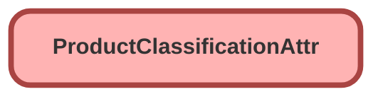

---
hide:
  - path
---

<!-- This file is auto-generated. if you do not want it to be overwritten, set TRUE in the line below -->
<!-- DO_NOT_OVERWRITE_DOC=FALSE -->

## Schema

<!-- Object description -->

## Fields

| Name      | Label | Type | Description |
| :-------- | :---- | :--: | :---------- | 
| AttributeCategoryId |  | Lookup | undefined |
| AttributeDefinitionId |  | Lookup | undefined |
| AttributeNameOverride |  |  | undefined |
| DefaultValue |  |  | undefined |
| Description |  |  | undefined |
| DisplayType |  |  | undefined |
| HelpText |  |  | undefined |
| IsHidden |  |  | undefined |
| IsPriceImpacting |  |  | undefined |
| IsReadOnly |  |  | undefined |
| IsRequired |  |  | undefined |
| MaximumCharacterCount |  |  | undefined |
| MaximumValue |  |  | undefined |
| MinimumCharacterCount |  |  | undefined |
| MinimumValue |  |  | undefined |
| Name |  |  | undefined |
| OverriddenInheritedAttributeId |  | Lookup | undefined |
| OwnerId |  | Lookup | undefined |
| ProductClassificationId |  | Lookup | undefined |
| Sequence |  |  | undefined |
| Status |  |  | undefined |
| StepValue |  |  | undefined |
| UnitOfMeasureId |  | Lookup | undefined |
| ValueDescription |  |  | undefined |

## Related Lightning Pages

| Lightning Page | Type |
| :----      | :--: | 
| [Product_Record_Page](../pages/Product_Record_Page.md) |  Record Page |

## Related Permission Sets

| Permission Set | User License |
| :----      | :--: | 
| [EGH_SystemAdminPermissionSet](../permissionsets/EGH_SystemAdminPermissionSet.md) | None |

_Documentation generated with [sfdx-hardis](https://sfdx-hardis.cloudity.com), by [Cloudity](https://www.cloudity.com/) & [friends](https://github.com/hardisgroupcom/sfdx-hardis/graphs/contributors)_
