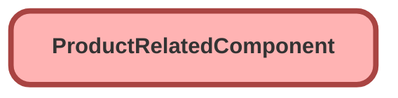

---
hide:
  - path
---

<!-- This file is auto-generated. if you do not want it to be overwritten, set TRUE in the line below -->
<!-- DO_NOT_OVERWRITE_DOC=FALSE -->

## Schema

<!-- Object description -->

## Fields

| Name      | Label | Type | Description |
| :-------- | :---- | :--: | :---------- | 
| ChildProductClassificationId |  | Lookup | undefined |
| ChildProductId |  | Lookup | undefined |
| ChildProductRole |  |  | undefined |
| ChildSellingModelId |  | Lookup | undefined |
| DoesBundlePriceIncludeChild |  |  | undefined |
| IsComponentRequired |  |  | undefined |
| IsDefaultComponent |  |  | undefined |
| IsQuantityEditable |  |  | undefined |
| MaxQuantity |  |  | undefined |
| MinQuantity |  |  | undefined |
| ParentProductId |  | Lookup | undefined |
| ParentProductRole |  |  | undefined |
| ParentSellingModelId |  | Lookup | undefined |
| ProductComponentGroupId |  | Lookup | undefined |
| ProductRelationshipTypeId |  | Lookup | undefined |
| Quantity |  |  | undefined |
| QuantityScaleMethod |  |  | undefined |
| Sequence |  |  | undefined |
| UnitOfMeasureId |  | Lookup | undefined |

## Related Lightning Pages

| Lightning Page | Type |
| :----      | :--: | 
| [EGH_VehicleLightningRecordPage](../pages/EGH_VehicleLightningRecordPage.md) |  Record Page |

_Documentation generated with [sfdx-hardis](https://sfdx-hardis.cloudity.com), by [Cloudity](https://www.cloudity.com/) & [friends](https://github.com/hardisgroupcom/sfdx-hardis/graphs/contributors)_
