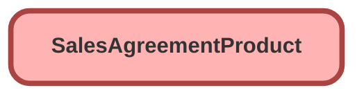

---
hide:
  - path
---

<!-- This file is auto-generated. if you do not want it to be overwritten, set TRUE in the line below -->
<!-- DO_NOT_OVERWRITE_DOC=FALSE -->

## Schema

<!-- Object description -->

## Fields

| Name      | Label | Type | Description |
| :-------- | :---- | :--: | :---------- | 
| ActualMarginPercentage |  |  | undefined |
| AreSchedulesCreatedManually |  |  | undefined |
| CostPrice |  |  | undefined |
| DiscountPercentage |  |  | undefined |
| DisplayName |  |  | undefined |
| InitialPlannedAmount |  |  | undefined |
| InitialPlannedQtyValue |  |  | undefined |
| InitialPlannedQuantity |  |  | undefined |
| IsActualsCalculationProduct |  |  | undefined |
| IsQuantityInDecimals |  |  | undefined |
| ListPrice |  |  | undefined |
| Name |  |  | undefined |
| PlannedMarginPercentage |  |  | undefined |
| PricebookEntryId |  | Lookup | undefined |
| ProductCategoryId |  | Lookup | undefined |
| ProductId |  | Lookup | undefined |
| SalesAgreementId |  | MasterDetail | undefined |
| SalesPrice |  |  | undefined |
| TotalActualAmount |  |  | undefined |
| TotalActualCostAmount |  |  | undefined |
| TotalActualMarginAmount |  |  | undefined |
| TotalActualQuantity |  |  | undefined |
| TotalActualQuantityValue |  |  | undefined |
| TotalActualShipmentQuantity |  |  | undefined |
| TotalClonedActualQuantity |  |  | undefined |
| TotalForecastedAmount |  |  | undefined |
| TotalForecastedQtyValue |  |  | undefined |
| TotalForecastedQuantity |  |  | undefined |
| TotalPlannedAmount |  |  | undefined |
| TotalPlannedCostAmount |  |  | undefined |
| TotalPlannedMarginAmount |  |  | undefined |
| TotalPlannedQuantity |  |  | undefined |
| TotalPlannedQuantityValue |  |  | undefined |
| TotalPlannedShipmentQuantity |  |  | undefined |
| TotalProposedPlannedAmount |  |  | undefined |
| TotalProposedPlannedQuantity |  |  | undefined |
| TotalProposedPlnQtyValue |  |  | undefined |
| TotalUnallocatedOrderQuantity |  |  | undefined |
| TotalUnallocatedOrderRevenue |  |  | undefined |
| TotalUnallocatedPlannedQty |  |  | undefined |
| UnitOfMeasureId |  | Lookup | undefined |

_Documentation generated with [sfdx-hardis](https://sfdx-hardis.cloudity.com), by [Cloudity](https://www.cloudity.com/) & [friends](https://github.com/hardisgroupcom/sfdx-hardis/graphs/contributors)_
