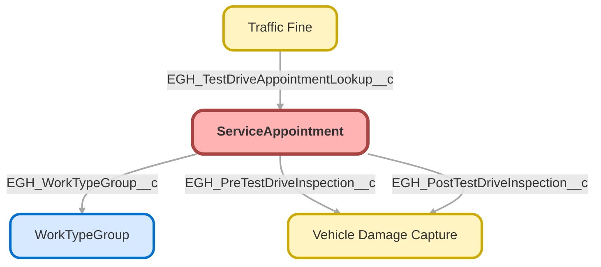

---
hide:
  - path
---

<!-- This file is auto-generated. if you do not want it to be overwritten, set TRUE in the line below -->
<!-- DO_NOT_OVERWRITE_DOC=FALSE -->

## Schema

<!-- Object description -->

## Fields

| Name      | Label | Type | Description |
| :-------- | :---- | :--: | :---------- | 
| AccountId |  | Lookup | undefined |
| ActualDuration |  |  | undefined |
| ActualEndTime |  |  | undefined |
| ActualStartTime |  |  | undefined |
| AdditionalInformation |  |  | undefined |
| Address |  |  | undefined |
| AppointmentCategoryId |  | Lookup | undefined |
| AppointmentInvitationId |  | Lookup | undefined |
| AppointmentMode |  |  | undefined |
| AppointmentType |  | Picklist | undefined |
| ApptBookingInfoUrl |  |  | undefined |
| ArrivalWindowEndTime |  |  | undefined |
| ArrivalWindowStartTime |  |  | undefined |
| AttendeeCount |  |  | undefined |
| AttendeeLimit |  |  | undefined |
| CancellationReason |  |  | undefined |
| CheckedInTime |  |  | undefined |
| Comments |  |  | undefined |
| ContactId |  | Lookup | undefined |
| Description |  |  | undefined |
| DueDate |  |  | undefined |
| Duration |  |  | undefined |
| DurationType |  |  | undefined |
| EarliestStartTime |  |  | undefined |
| EGH_AccountExternalID__c | Account External ID | Text | undefined |
| EGH_BookingEndFuelLevel__c | Booking End Fuel Level | Text | undefined |
| EGH_BookingEndMileage__c | Booking End Mileage | Number | undefined |
| EGH_BookingStartFuelLevel__c | Booking Start Fuel Level | Text | undefined |
| EGH_BookingStartMileage__c | Booking Start Mileage | Number | undefined |
| EGH_Brand__c | Brand | Picklist | undefined |
| EGH_CreatedByName__c | CreatedByName | Text | undefined |
| EGH_CustomerName__c | Customer Name | Text | undefined |
| EGH_DocumentTemplateID__c | Document Template ID | Text | undefined |
| EGH_IsOwnerSameAsLoggedIn__c | EGH_IsOwnerSameAsLoggedIn | Checkbox | undefined |
| EGH_IsReportingManager__c | EGH IsReportingManager | Checkbox | undefined |
| EGH_LicenseEndDate__c | License End Date | Date | undefined |
| EGH_LicenseNumber__c | License Number | Text | undefined |
| EGH_LicenseStartDate__c | License Start Date | Date | undefined |
| EGH_ParentExternalID__c | Parent External ID | Text | undefined |
| EGH_PostTestDriveInspection__c | Pre/Post-test Drive Inspection | Lookup | Link to the pre & post-test drive damage inspection record |
| EGH_PreTestDriveInspection__c | Pre-test Drive Inspection | Lookup | Link to the pre-test drive damage inspection record. |
| EGH_Quick_Scheduled__c | Quick Scheduled | Checkbox | undefined |
| EGH_VehicleConditionReturn__c | Vehicle Condition Return | Text | undefined |
| EGH_VehicleConditionStart__c | Vehicle Condition Start | Text | undefined |
| EGH_VehicleDescription__c | Vehicle Description | Text | undefined |
| EGH_VehicleRegistrationNumber__c | Vehicle Registration Number | Text | undefined |
| EGH_VINNumber__c | VIN Number | Text | undefined |
| EGH_WorkTypeGroup__c | EGH WorkTypeGroup | Lookup | undefined |
| Email |  |  | undefined |
| EngagementChannelTypeId |  | Lookup | undefined |
| GroupAppointmentAccessType |  |  | undefined |
| IsAnonymousBooking |  |  | undefined |
| IsOffsiteAppointment |  |  | undefined |
| OwnerId |  | Lookup | undefined |
| ParentRecordId |  | Lookup | undefined |
| ParentRecordStatusCategory |  |  | undefined |
| ParentRecordType |  |  | undefined |
| Phone |  |  | undefined |
| ReceiptOrderId |  | Lookup | undefined |
| SchedEndTime |  |  | undefined |
| SchedStartTime |  |  | undefined |
| Service_Territory_Name__c | Service Territory Name | Text | undefined |
| ServiceNote |  |  | undefined |
| ServiceTerritoryId |  | Lookup | undefined |
| Status |  | Picklist | undefined |
| StatusCategory |  |  | undefined |
| Subject |  |  | undefined |
| TimeZone |  |  | undefined |
| Transaction |  |  | undefined |
| Visit_Type_Name__c | Visit Type Name | Text | undefined |
| WorkTypeId |  | Lookup | undefined |

## Validation Rules

| Rule      | Active | Description | Formula |
| :-------- | :---- | :---------- | :------ |
| Showroom_Appointment_Cant_B_In_Past | Yes |  | AND (   OR(SchedStartTime<  NOW(),EarliestStartTime <  NOW()),  ISPICKVAL( AppointmentType ,'Showroom Visit'), NOT( $Setup.EGH_Automation_Bypass__c.EGH_Bypass_Validations__c )   ) |

## Related Flows

| Object | Name      | Type | Description |
| :----  | :-------- | :--: | :---------- | 
| 💻 | [EGH_MeetGreetTestFlow](../flows/EGH_MeetGreetTestFlow.md) |  Screen Flow | Test Flow for Meet&Greet Application. To use in discussion with Irshad |
| 💻 | [EGH_OutboundTestDriveAppointment](../flows/EGH_OutboundTestDriveAppointment.md) |  Appointments | <!-- --> |
| 💻 | [EGH_Product_Genius](../flows/EGH_Product_Genius.md) |  Screen Flow | Flow for Product Genius Application |
| 💻 | [EGH_StartTestDriveFlow](../flows/EGH_StartTestDriveFlow.md) |  Screen Flow | Start Test Drive Screen Flow |
| 💻 | [EGH_StopTestDriveFlow](../flows/EGH_StopTestDriveFlow.md) |  Screen Flow | Stop Test Drive Screen Flow |
| ServiceAppointment | [EGH_ServiceAppointmentUpdateStatusToCompletedFlow](../flows/EGH_ServiceAppointmentUpdateStatusToCompletedFlow.md) |  Record Before Save | Update the Appointment Status to Completed when the End Date is filled. |
| ServiceAppointment | [EGH_Update_Time_In_Description](../flows/EGH_Update_Time_In_Description.md) |  Record After Save | This flow is triggered when the Service Appointment’s Arrival Window Start or End time is changed. It uses an Apex action to format the date and time in the user’s timezone, then updates the Description field with the Date, Time, and Timezone in the correct format. |
| ServiceAppointment | [Set_Parent_Lead_as_Qualified](../flows/Set_Parent_Lead_as_Qualified.md) |  Record After Save | <!-- --> |

## Related Apex Classes

| Apex Class | Type |
| :----      | :--: | 
| [EGHTestDriveTimelineController](../apex/EGHTestDriveTimelineController.md) | Lightning Controller |
| [EGHTestDriveTimelineControllerTest](../apex/EGHTestDriveTimelineControllerTest.md) | Test |
| [EGH_AssignedResourceInspectTriggerTest](../apex/EGH_AssignedResourceInspectTriggerTest.md) | Test |
| [EGH_AssignedResourceTriggerTest](../apex/EGH_AssignedResourceTriggerTest.md) | Test |
| [EGH_DamageCaptureController](../apex/EGH_DamageCaptureController.md) | Lightning Controller |
| [EGH_FormatServiceAppointmentTime](../apex/EGH_FormatServiceAppointmentTime.md) | Invocable |
| [EGH_FormatServiceAppointmentTime_Test](../apex/EGH_FormatServiceAppointmentTime_Test.md) | Test |
| [EGH_OpportunityScoringController](../apex/EGH_OpportunityScoringController.md) | Lightning Controller |
| [EGH_RestTests](../apex/EGH_RestTests.md) | Test |
| [EGH_ServiceAppointmentTriggerHandler](../apex/EGH_ServiceAppointmentTriggerHandler.md) | Trigger Handler |
| [EGH_ServiceAppointmentUpdateVDCTest](../apex/EGH_ServiceAppointmentUpdateVDCTest.md) | Test |
| [EGH_TestDriveSlotFinder](../apex/EGH_TestDriveSlotFinder.md) | Lightning Controller |
| [EGH_TestDriveSlotFinder_Test](../apex/EGH_TestDriveSlotFinder_Test.md) | Test |
| [EGH_AssignedResourceInspectionTrigger](../apex/EGH_AssignedResourceInspectionTrigger.md) | Class |
| [EGH_ServiceAppointmentUpdateVDC](../apex/EGH_ServiceAppointmentUpdateVDC.md) | Class |

## Related Lightning Pages

| Lightning Page | Type |
| :----      | :--: | 
| [EGH_LeadLightningPage](../pages/EGH_LeadLightningPage.md) |  Record Page |
| [EGH_OpportunityLightningPage](../pages/EGH_OpportunityLightningPage.md) |  Record Page |
| [EGH_Service_Appointment_Lightning_Page](../pages/EGH_Service_Appointment_Lightning_Page.md) |  Record Page |
| [EGH_Service_Appointment_SystemAdmin](../pages/EGH_Service_Appointment_SystemAdmin.md) |  Record Page |
| [EGH_VehicleLightningRecordPage](../pages/EGH_VehicleLightningRecordPage.md) |  Record Page |
| [Service_Appointment_Record_Page](../pages/Service_Appointment_Record_Page.md) |  Record Page |
| [Service_Appointment_Record_Page1](../pages/Service_Appointment_Record_Page1.md) |  Record Page |
| [Service_Appointment_Record_Page2](../pages/Service_Appointment_Record_Page2.md) |  Record Page |

## Related Profiles

| Profile | User License |
| :----      | :--: | 
| [Admin](../profiles/Admin.md) |  Salesforce |
| [EGH Minimum Access Profile](../profiles/EGH%20Minimum%20Access%20Profile.md) |  Salesforce |
| [EGH Sales Profile](../profiles/EGH%20Sales%20Profile.md) |  Salesforce |
| [EGH Service Profile](../profiles/EGH%20Service%20Profile.md) |  Salesforce |

## Related Permission Sets

| Permission Set | User License |
| :----      | :--: | 
| [EGH_Apex_Classes](../permissionsets/EGH_Apex_Classes.md) | None |
| [EGH_Contact_Center_PS](../permissionsets/EGH_Contact_Center_PS.md) | None |
| [EGH_Core_Integration_Permission_Set](../permissionsets/EGH_Core_Integration_Permission_Set.md) | None |
| [EGH_Core_Permission](../permissionsets/EGH_Core_Permission.md) | None |
| [EGH_Digital_Sales_Consultant_Omni_Channel](../permissionsets/EGH_Digital_Sales_Consultant_Omni_Channel.md) | None |
| [EGH_F_I_OmniChannel](../permissionsets/EGH_F_I_OmniChannel.md) | None |
| [EGH_FeedbackManagementAdvancedPermissionSet](../permissionsets/EGH_FeedbackManagementAdvancedPermissionSet.md) | None |
| [EGH_Fleet_Consultant](../permissionsets/EGH_Fleet_Consultant.md) | None |
| [EGH_Knowledge_Admin](../permissionsets/EGH_Knowledge_Admin.md) | None |
| [EGH_Lease_Consultant](../permissionsets/EGH_Lease_Consultant.md) | None |
| [EGH_Meet_and_Greet_Application](../permissionsets/EGH_Meet_and_Greet_Application.md) | None |
| [EGH_ModifyServiceAppointmentsPermissionSet](../permissionsets/EGH_ModifyServiceAppointmentsPermissionSet.md) | None |
| [EGH_Product_Genius_Admin](../permissionsets/EGH_Product_Genius_Admin.md) | None |
| [EGH_Product_Genius](../permissionsets/EGH_Product_Genius.md) | None |
| [EGH_QA_and_Data_Analyst_PS](../permissionsets/EGH_QA_and_Data_Analyst_PS.md) | None |
| [EGH_Sales_Consultant_Omni_Channel](../permissionsets/EGH_Sales_Consultant_Omni_Channel.md) | None |
| [EGH_Sales_Team_Leader_PS](../permissionsets/EGH_Sales_Team_Leader_PS.md) | None |
| [EGH_SalesforceSchedulerResourcesPermissionSet](../permissionsets/EGH_SalesforceSchedulerResourcesPermissionSet.md) | None |
| [EGH_Service_Consultants_PS](../permissionsets/EGH_Service_Consultants_PS.md) | None |
| [EGH_Service_Team_Leader_PS](../permissionsets/EGH_Service_Team_Leader_PS.md) | None |
| [EGH_SystemAdminPermissionSet](../permissionsets/EGH_SystemAdminPermissionSet.md) | None |
| [EGH_Test_Drive_Admin](../permissionsets/EGH_Test_Drive_Admin.md) | None |
| [EGH_Test_Drive_Team](../permissionsets/EGH_Test_Drive_Team.md) | None |

_Documentation generated with [sfdx-hardis](https://sfdx-hardis.cloudity.com), by [Cloudity](https://www.cloudity.com/) & [friends](https://github.com/hardisgroupcom/sfdx-hardis/graphs/contributors)_
