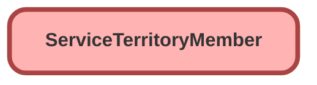

---
hide:
  - path
---

<!-- This file is auto-generated. if you do not want it to be overwritten, set TRUE in the line below -->
<!-- DO_NOT_OVERWRITE_DOC=FALSE -->

## Schema

<!-- Object description -->

## Fields

| Name      | Label | Type | Description |
| :-------- | :---- | :--: | :---------- | 
| Address |  |  | undefined |
| EffectiveEndDate |  |  | undefined |
| EffectiveStartDate |  |  | undefined |
| OperatingHoursId |  | Lookup | undefined |
| Role |  | Picklist | undefined |
| ServiceResourceId |  | Lookup | undefined |
| ServiceTerritoryId |  | MasterDetail | undefined |
| TerritoryType |  |  | undefined |

## Related Apex Classes

| Apex Class | Type |
| :----      | :--: | 
| [EGHTestDriveTimelineControllerTest](../apex/EGHTestDriveTimelineControllerTest.md) | Test |
| [EGH_AssignedResourceInspectTriggerTest](../apex/EGH_AssignedResourceInspectTriggerTest.md) | Test |
| [EGH_RestTests](../apex/EGH_RestTests.md) | Test |
| [EGH_TestDriveSlotFinder](../apex/EGH_TestDriveSlotFinder.md) | Lightning Controller |
| [EGH_TestDriveSlotFinder_Test](../apex/EGH_TestDriveSlotFinder_Test.md) | Test |

## Related Profiles

| Profile | User License |
| :----      | :--: | 
| [Admin](../profiles/Admin.md) |  Salesforce |
| [EGH Minimum Access Profile](../profiles/EGH%20Minimum%20Access%20Profile.md) |  Salesforce |
| [EGH Sales Profile](../profiles/EGH%20Sales%20Profile.md) |  Salesforce |
| [EGH Service Profile](../profiles/EGH%20Service%20Profile.md) |  Salesforce |

## Related Permission Sets

| Permission Set | User License |
| :----      | :--: | 
| [EGH_Digital_Sales_Consultant_Omni_Channel](../permissionsets/EGH_Digital_Sales_Consultant_Omni_Channel.md) | None |
| [EGH_Fleet_Consultant](../permissionsets/EGH_Fleet_Consultant.md) | None |
| [EGH_Lease_Consultant](../permissionsets/EGH_Lease_Consultant.md) | None |
| [EGH_ModifyServiceAppointmentsPermissionSet](../permissionsets/EGH_ModifyServiceAppointmentsPermissionSet.md) | None |
| [EGH_Sales_Consultant_Omni_Channel](../permissionsets/EGH_Sales_Consultant_Omni_Channel.md) | None |
| [EGH_Test_Drive_Admin](../permissionsets/EGH_Test_Drive_Admin.md) | None |
| [EGH_Test_Drive_Team](../permissionsets/EGH_Test_Drive_Team.md) | None |

_Documentation generated with [sfdx-hardis](https://sfdx-hardis.cloudity.com), by [Cloudity](https://www.cloudity.com/) & [friends](https://github.com/hardisgroupcom/sfdx-hardis/graphs/contributors)_
