---
hide:
  - path
---

<!-- This file is auto-generated. if you do not want it to be overwritten, set TRUE in the line below -->
<!-- DO_NOT_OVERWRITE_DOC=FALSE -->

## Schema

```mermaid
graph TD
Site["Site"]:::mainObject
click Site "/objects/Site/"


classDef object fill:#D6E9FF,stroke:#0070D2,stroke-width:3px,rx:12px,ry:12px,shadow:drop,color:#333;
classDef customObject fill:#FFF4C2,stroke:#CCAA00,stroke-width:3px,rx:12px,ry:12px,shadow:drop,color:#333;
classDef customObjectManaged fill:#FFD8B2,stroke:#CC5500,stroke-width:3px,rx:12px,ry:12px,shadow:drop,color:#333;
classDef mainObject fill:#FFB3B3,stroke:#A94442,stroke-width:4px,rx:14px,ry:14px,shadow:drop,color:#333,font-weight:bold;

```

<!-- Object description -->

## Related Apex Classes

| Apex Class | Type |
| :----      | :--: | 
| [ChangePasswordController](../apex/ChangePasswordController.md) | Visualforce Controller |
| [CommunitiesSelfRegController](../apex/CommunitiesSelfRegController.md) | Visualforce Controller |
| [ForgotPasswordController](../apex/ForgotPasswordController.md) | Visualforce Controller |
| [MicrobatchSelfRegController](../apex/MicrobatchSelfRegController.md) | Visualforce Controller |
| [SiteLoginController](../apex/SiteLoginController.md) | Visualforce Controller |
| [SiteLoginControllerTest](../apex/SiteLoginControllerTest.md) | Test (See All Data) |
| [SiteRegisterController](../apex/SiteRegisterController.md) | Visualforce Controller |
| [SiteRegisterControllerTest](../apex/SiteRegisterControllerTest.md) | Test (See All Data) |

## Related Profiles

| Profile | User License |
| :----      | :--: | 
| [Admin](../profiles/Admin.md) |  Salesforce |
| [EGH Minimum Access Profile](../profiles/EGH%20Minimum%20Access%20Profile.md) |  Salesforce |
| [EGH Sales Profile](../profiles/EGH%20Sales%20Profile.md) |  Salesforce |
| [EGH Service Profile](../profiles/EGH%20Service%20Profile.md) |  Salesforce |

## Related Permission Sets

| Permission Set | User License |
| :----      | :--: | 
| [EGH_Core_Integration_Permission_Set](../permissionsets/EGH_Core_Integration_Permission_Set.md) | None |
| [EGH_Core_Permission](../permissionsets/EGH_Core_Permission.md) | None |
| [EGH_Meet_and_Greet_Application](../permissionsets/EGH_Meet_and_Greet_Application.md) | None |
| [EGH_SystemAdminPermissionSet](../permissionsets/EGH_SystemAdminPermissionSet.md) | None |
| [PS_Genesys_Permissions](../permissionsets/PS_Genesys_Permissions.md) | None |

_Documentation generated with [sfdx-hardis](https://sfdx-hardis.cloudity.com), by [Cloudity](https://www.cloudity.com/) & [friends](https://github.com/hardisgroupcom/sfdx-hardis/graphs/contributors)_
